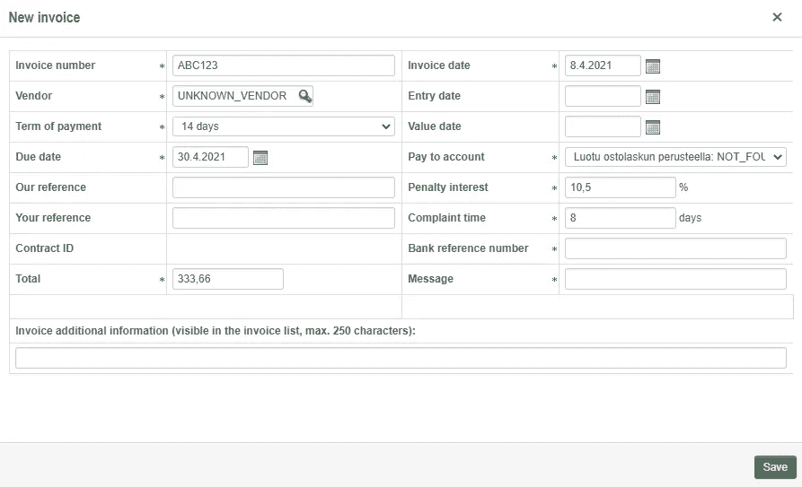
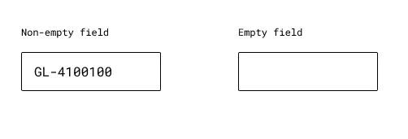
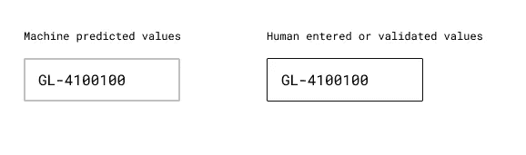
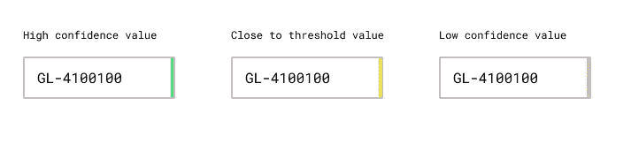
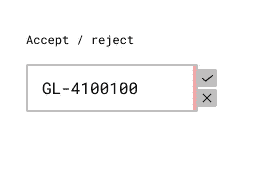
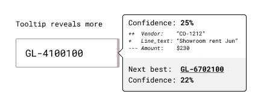

# 企业应用程序用户界面需要如何改变以适应机器学习的可能性

> 原文：<https://towardsdatascience.com/how-enterprise-app-user-interfaces-need-to-change-to-accommodate-machine-learning-probabilities-cbe35bbd9df4?source=collection_archive---------37----------------------->

## 我的计划是让人工智能变得简单，而不是复杂，让数百万商业软件用户学会与会思考的机器和软件机器人共存。

自从我 21 年前开始从事技术工作以来，商业软件看起来几乎没有什么变化。字段一个挨着一个，一些表格里有所有的数据。和按钮来做一些事情。

不可否认，从基于客户端的应用到网络已经有了转变——但是对用户体验的真正影响仍然主要是表面的。只要看看下面，我相信你知道我在说什么。这些大家都看了一遍又一遍。

我自己公司的会计系统 Netvisor 的新发票视图的截图看起来像所有其他的企业应用程序。(作者截图。)

我们经历了比我职业生涯中经历过的更剧烈的变化。甚至比诺基亚的灭亡还要严重，这在我的祖国显然是一件大事。

迄今为止，一个商业应用中的一个字段几乎只有两种状态:填充的**和空的**。看看下面的例子，这个字段有值或者没有值。****

****

**这是田地的样子。(作者插图)**

**没有介于两者之间的东西，也没有办法指出可能的东西，但不能 100%确定。不确定性。或者概率。你可能会问，为什么这很重要！**

****

**照片由 [Hitesh Choudhary](https://unsplash.com/@hiteshchoudhary?utm_source=unsplash&utm_medium=referral&utm_content=creditCopyText) 在 [Unsplash](https://unsplash.com/s/photos/artificial-intelligence?utm_source=unsplash&utm_medium=referral&utm_content=creditCopyText) 上拍摄**

**进入机器学习。**

**这不是一篇关于人工智能给企业带来的机会的文章，因为你肯定已经阅读了关于这个主题的文章。我说的是所有商业应用的用户界面的根本变化，不管是什么用例。它可以是 SAP、Salesforce、QuickBooks 或 Basware。**

**企业越来越多地采用技术，如 [RPA](https://en.wikipedia.org/wiki/Robotic_Process_Automation) 或智能自动化，以利用人工智能的力量实现流程自动化。这些过程通常表现为上述业务软件中的一系列动作。例如，读取来自供应商的发票，根据主数据映射其数据，决定一些会计参数(如我在前面的示例字段中的 GL 代码)，审查/批准内容，并将发票输入 ERP 系统。**

**我已经参与了多个这样的自动化项目，并且出现了一个共同的问题。当使用机器学习来预测过程中需要的一些值时，商业应用程序中没有“本机”方式来表明这些值带有不确定性。**

**自动化与人类用户一起工作，因为不可能有 100%的无接触自动化。关键概念是 [**信心**和**阈值**](/return-on-investment-for-machine-learning-1a0c431509e):ML 对自己的结果有多确定，以及组织设定的“足够确定”的界限是什么。**

**例如，软件机器人可能使用机器学习来预测发票最可能的总账代码，结果可能是"*该发票应计入总账代码 GL-4100100；置信度为 0.78。*“在这种情况下，如果公司将自动化进程的阈值设置为 0.8，而无需人工审查，那么这种特殊情况最终会被应付账款部门的人员查看。**

****

**股票摄影师显然没有认真对待他们的应付账款工作。Mikhail Nilov 摄于 [Pexels](https://www.pexels.com/photo/man-couple-people-woman-6964079/?utm_content=attributionCopyText&utm_medium=referral&utm_source=pexels) 。**

**现在，在大多数企业应用程序界面中，没有办法向用户传达预测值的置信度。次优的解决方案通常是 RPA 工程师最终将额外的机器学习输出数据写入一些注释或评论字段，用户需要在那里寻找它们。**

****如果我们真的构建用户界面来适应一些字段由用户填写，一些由 ML 填写的事实，并创建一种方法来表明字段中的置信度，会怎么样？****

**让我通过一些例子来阐述这一点。请记住，我不是一个用户界面设计师，所以下面的插图仅仅是概念。我希望它们能引发设计师的兴趣，让它们有一天成为现实！**

## **人类填充值与 ML 预测**

**无论是软件机器人还是 API 在预测后操纵值，今天，结果看起来就像有血有肉的用户会输入它一样。就像你在上面的例子中看到的那样。**

**人类操作员将受益于字段中值的来源的即时视觉提示。在我下面的例子中，机器预测的字段显示为蓬松的灰色粗笔画，而人类输入的“事实”保留标准的实心黑色笔画。**

****

**机器 vs 人类填充的领域。(作者插图)**

## **置信度和阈值的指示**

**在自动化工作流中，置信度阈值决定了哪些值是自动使用的，哪些值是由用户检查的。**

**我发现信心和门槛一般不太好理解。所以我们的工作就是让它们变得容易理解。**

**问题来自于这样一个事实，即各个领域的正确阈值可能大相径庭。总帐代码与利润中心不同。因此，显示任意的置信度值，如 *0.9221434* 或 *0.732123，*对用户来说并没有太大的意义，但这是你在评论栏中最常看到的。**

**如果我们用简单的交通灯来表示自信会怎么样？**

****

**信心和门槛的红绿灯。(作者插图)**

**所提出的方法故意省略了实际值；它只显示颜色:绿色表示置信度大于所选阈值，黄色表示接近阈值，红色表示远低于阈值。**

**通过将阈值配置移动到由自动化专业人员控制的设置，他们能够调整过程值，而最终用户不会看到任何变化。**

## **接受和拒绝预测值**

**让我们假设进行了上述 GL 代码预测，并且置信度低于阈值。所以我们的案子需要重审。在当前的模型中，机器和人输入的字段是相等的，没有直接和简单的指示已经做了什么。也许用户需要手动编写审计跟踪，这很容易扼杀自动化的整个想法！**

****

**查看接受/拒绝按钮。(作者插图)**

**我建议应该有一种简单的方法，只需点击一下鼠标就可以接受或拒绝该值，并将其更改为“已审核”状态。这种方法没什么用处。首先，现在可以安全地将低置信度值写入字段来帮助我们人类。辅助自动化带来了好处，因为通常即使是较低置信度的预测也可能是正确的。第二，评论“点击”可以作为新的训练数据点立即反馈给机器学习。**

## **可解释的人工智能—已解释。**

**这一特定 GL 代码预测背后的因素是什么？为什么总是出错？下一个最佳选择是什么？有时候，比字段值更多的信息是有意义的。**

**对于那些时刻，我们需要一个工具提示(到现在为止，我已经用尽了我所有的设计技巧😬).**

****

**可解释性的工具提示。(作者插图)**

**像 [Aito.ai](https://aito.ai/) 这样的机器学习平台为预测背后的主要因素提供了一个简单的视图——哪些特征具有积极的升力和消极的升力。**

**然而，我们不应该陷入这样一个陷阱，即认为应付账款部门的用户重视科学方法。我们需要一些可以理解的东西，如上图所示，加号和减号来表示预测的主要贡献者。**

**类似地，工具提示可以容纳下一个最佳预测，可以很容易地将该值转换到字段中。可能性是无限的！**

**我在上面提议的不仅仅是 UI 上的小改动。我认为可用性和可理解性是更广泛使用人工智能的基本因素。**

**作为这些系统的设计者和创造者，我们有责任确保我们不会增加更多的复杂性，而是利用这个机会来简化工作，让每天使用这些系统的数百万人更加愉快。**

**我希望在这一点上你和我是一致的！**

**自从 1999 年以来，我一直从事企业软件工作。目前，我是位于芬兰赫尔辛基的一家名为 [*Aito.ai*](https://aito.ai/) *的智能自动化公司的执行董事长兼 CPO。***