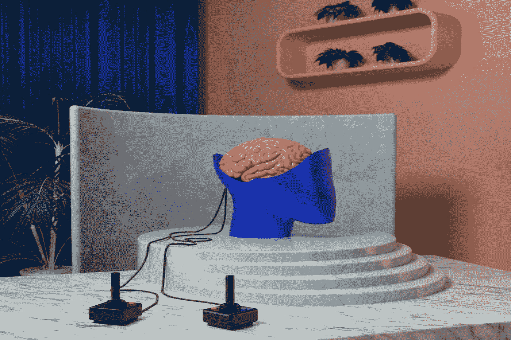

# 我们离开发真正的智能还有多远？

> 原文：<https://towardsdatascience.com/how-far-are-we-from-developing-real-intelligence-c087071603cc?source=collection_archive---------21----------------------->

## 关于人工智能进展的发人深省的信息

[Mo](https://unsplash.com/@meid88?utm_source=unsplash&utm_medium=referral&utm_content=creditCopyText) 在 [Unsplash](https://unsplash.com/@meid88?utm_source=unsplash&utm_medium=referral&utm_content=creditCopyText) 上的照片

人工智能的发明理念是机器将模仿人类大脑的认知功能，即大脑学习和解决问题的能力。图灵测试被用来确定计算机是否能像人类一样思考。经过几十年的人工智能发明(20 世纪 50 年代)，我们已经做到了吗？人工智能的当前状态是什么？为了实现这个目标，我们还需要做什么？继续阅读，找到这些问题的答案。

# 人工智能进化

我们可以认为纽厄尔和西蒙在 1955 年开发的程序是第一个人工智能程序。第一个人工神经网络，称为感知器，是由心理学家弗兰克·罗森布拉特于 1958 年发明的。为什么这么多年来我们没有看到人工智能惊人的进步？这主要是因为缺乏人工智能程序所需的处理能力和内存。

当我们有足够的处理能力和内存时，我们看到了 IBM 的深蓝在 1977 年压倒国际象棋冠军的演变。这主要归功于记忆和计算能力，当然不是因为学习。此后，在 2011 年，我们看到 IBM Watson 战胜了人类世界冠军 Jeopardy。这也减少了对学习的依赖。2017 年，阿尔法戈人工智能赢得了一个三场比赛的系列赛，对手是世界上最好的围棋手。在 AlphaGo 中，创作者将深度学习的直觉力量与 GOFAI(传统人工智能)的逻辑力量结合在一起。)所以，你可能会说，有了深度学习，人工智能至少有了一些学习过程。

所以，现在让我们试着理解我们所说的*学习*是什么意思。

# 什么是学习？

你有没有想过一个孩子是如何学会接住抛向空中的球的？如果我要求你为这种活动开发一个人工智能模型，你的方法大多是数学方法，即计算抛射体的轨迹路径。你认为孩子的大脑会做所有这些数学运算吗？事实上，这个孩子从来没有学过抛射体方程。关于孩子如何学习的问题，我们有答案吗？

现在，让我们考虑一下人工智能模型，它们已经向我们展示了在现实世界中做一些好的预测的辉煌成功，并且理解它们的局限性。

 [## 每当 Poornachandra Sarang 发表文章时，收到一封电子邮件。

### 每当 Poornachandra Sarang 发表文章时，收到一封电子邮件。通过注册，您将创建一个中型帐户，如果您不…

medium.com](https://medium.com/subscribe/@profsarang) 

# 少数人工智能成功案例

我们已经在经典的人工智能和人工神经网络/DNN 细分市场中看到了许多人工智能的成功案例。我现在将引用一些故事来衡量人工智能发展的当前水平。

## 估计房价

这是一个在机器学习教学中广泛使用的例子。我们将这个模型建立在回归的基础上——一个被充分研究过的统计问题。这个模型所做的推论并不比人类的能力更好，只是它做预测的速度比人类快得多。

## 计算机视觉

人工智能在计算机视觉中最公认的成功是对象检测，我们使用预先训练的 DNN 模型来检测各种对象。然而，这种模型可以检测的对象列表仍然非常有限。作为一个人，你注意到了电脑桌上的车钥匙和餐桌上的可乐罐。我们的物体探测人工智能模型不具备这些能力。他们不能探测到任何任意的物体，而人脑却能轻易做到。

考虑人脸检测。今天的人工智能模型可以将一个以前认识的人(该模型是为其训练的)识别到新的集体照片中。一个人每天看到很多人，还记得他们——“嘿，我以前见过你。”这些人工智能模型可以将一个只看过一次的人的图像与面前的人联系起来吗？

# 语音识别

这是我们看到人工智能技术取得巨大成功的另一个领域。我们在日常生活中使用 Alexa 和 Siri，在与外国人交谈时使用谷歌翻译应用程序。语音合成和文本到语音转换现在已经不是问题了。一个人在听了一次一个人的声音后，会把这个声音和这个人联系起来，即使他离得很远，过了很多很多天也是如此。我们的语音识别模型有这种能力吗？

因此，今天的人工智能模型还不够通用。因此，我们引入一般智能。

# 人工通用智能(AGI)

我们今天实践中的人工智能模型被训练来解决一个特殊的问题。打败 AlphaGo 棋手的模型不知道棋局是怎么下的。我们称这个 AI *弱 AI* 或者*狭义 AI* 。弱人工智能是指任何只能解决一个问题的程序。这没有一般的认知能力，也不体验人类心灵的意识。现在，新名词来了——AGI。这个术语仍然是假设性的。这是创造一个*智能代理*的概念，它可以理解和学习任何人类可以执行的智力任务。我们也称 AGI 为*强 AI* 或者*全 AI* 。那么，我们离发展 AGI 还有多远？

# 人脑模拟器

蓝色大脑是 2005 年 5 月启动的一个项目，该项目使用基于 IBM 蓝色基因设计的超级计算机来理解对人类认知的见解，并根据神经元的突触连接来模拟神经元的行为。

到 2013 年，日本和德国的研究人员使用当时第四快的超级计算机模拟了 1%的人脑。该模拟模型包括由 10.4 个突触连接的 17.3 亿个神经细胞。该程序使用了 82，944 个处理器，花了 40 分钟在真实的生物时间内完成了 1 秒钟的神经活动模拟。

2013 年，欧盟资助了人类大脑项目(HBP)，这是一项为期 10 年的研究计划，在欧洲各地雇用了 500 名科学家，从事神经信息学、大脑模拟、HPAC(高性能分析和计算)、医学信息学、神经形态(大脑启发)计算和神经机器人学方面的工作。

# 总结想法

考虑到以上所有事实，我们可以得出结论，我们离开发真正的智能还很远。问题是，我们是否完全理解了“智力”这个词的含义？根据 Gartner 2021 年对人工智能*的炒作周期*显示 AGI 处于*创新触发*水平。所以，AGI 仍然领先很多很多年。在开发出具有完全人类智能的机器人之前，我们只能拭目以待。因此，让我们不要害怕机器人接管人类，至少在不久的将来。

 [## 通过我的推荐链接加入 Medium

### 作为一个媒体会员，你的会员费的一部分会给你阅读的作家，你可以完全接触到每一个故事…

medium.com](https://medium.com/@profsarang/membership)