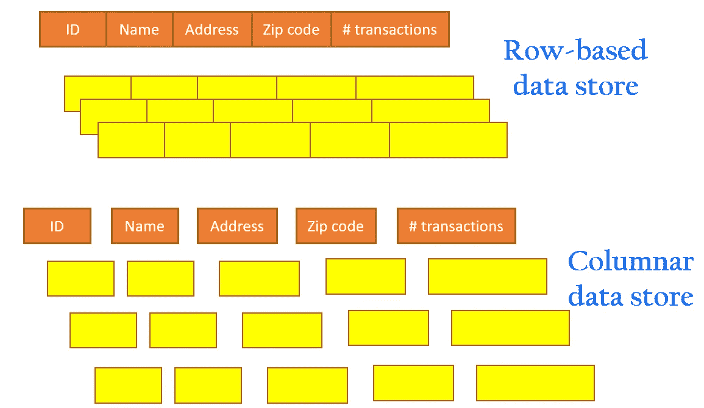
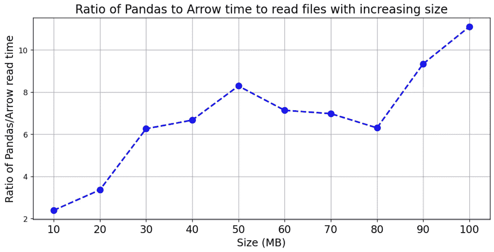
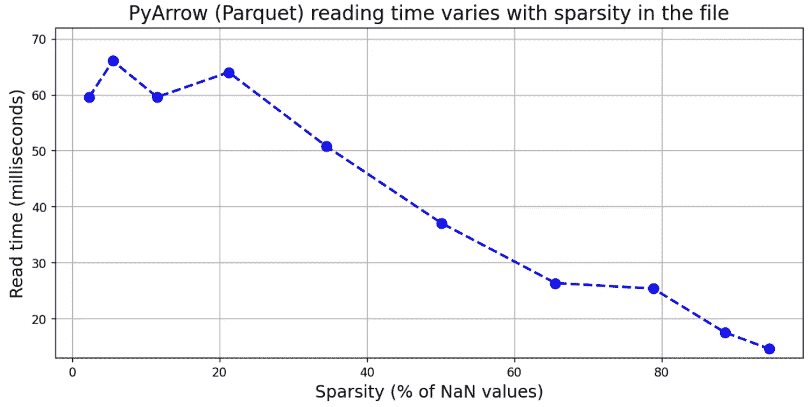

# 熊猫读拼花文件(带箭头)vs. CSV 多快？

> 原文：<https://towardsdatascience.com/how-fast-is-reading-parquet-file-with-arrow-vs-csv-with-pandas-2f8095722e94?source=collection_archive---------4----------------------->

## [理解大数据](https://towardsdatascience.com/tagged/making-sense-of-big-data)

## 重点研究使用 PyArrow 读取拼花文件与使用 Pandas 读取相同 CSV 文件的速度比较

图片来源: [Pixabay](https://pixabay.com/illustrations/motorcycle-speed-helmet-1690452/)

# 为什么用拼花地板代替 CSV？

> **因为你可能希望读取大数据文件的速度比熊猫的内置函数快 50 倍！**

逗号分隔值(CSV)是一种广泛用于数据分析的平面文件格式。它操作简单，在中小型数据环境中运行良好。然而，当您处理较大文件的数据时(也许还要为基于云的存储付费)，有一些很好的理由转向使用 [**列数据存储原则**](https://www.stitchdata.com/columnardatabase/) 的文件格式。

[阿帕奇拼花地板](https://parquet.apache.org/)是这些类型中最受欢迎的一种。下面的文章讨论了其中的一些优势(相对于使用传统的基于行的格式，例如平面 CSV 文件)。

 [## Apache Parquet:如何成为开源列数据格式的英雄

### Google BigQuery、Azure Data Lakes、Amazon Athena 和 Redshift Spectrum 的 Apache Parquet 文件格式。

blog.openbridge.com](https://blog.openbridge.com/how-to-be-a-hero-with-powerful-parquet-google-and-amazon-f2ae0f35ee04) 

简言之，

*   由于是面向列的，Parquet 将所有高效的存储特性(例如，块、行组、列块)都带到了表中
*   Apache Parquet 是使用 Google 的分解和组装算法从头开始构建的
*   Parquet 文件的设计考虑到了复杂的嵌套数据结构。
*   Apache Parquet 支持非常高效的压缩和编码方案。可以使用各种巧妙的方法来压缩一个 parquet 文件，例如(a)字典编码，(b)位打包，(c)游程编码。

**图片来源**:作者出品(自有版权)

当您必须从磁盘或云存储中存储和读取大型数据文件时，Parquet 文件是一个很好的选择。对于用 Python 进行数据分析，我们都广泛使用熊猫。在本文中，我们将展示在读取大文件的内容时，与使用 CSV 文件和 Pandas 相比，**使用 Parquet 文件和 Apache Arrow 会给您带来令人印象深刻的速度优势。特别是，我们将讨论，**

*   文件大小
*   正在读取的列数
*   文件的稀疏性(缺少值)

# 阅读用箭头

PyArrow 是 Apache Arrow 框架的 Python 绑定(API)。[根据他们的网站](https://arrow.apache.org/)——*Apache Arrow 是* ***内存分析*** *的开发平台。它包含一系列技术，使大数据系统能够快速处理和移动数据。它为平面和分层数据指定了一种标准化的* ***语言无关的列内存格式*** *，为现代硬件上的高效分析操作进行了组织*

这些特性使得 Apache arrow 成为增长最快的分布式内存数据分析框架之一。首先，它是一个理想的内存传输层，用于读取或写入 Parquet 文件中的数据。

对 Parquet 文件使用 PyArrow 可以在读取大型数据文件的速度方面带来令人印象深刻的速度优势，并且一旦读取，内存中的对象可以很容易地转换为常规的 Pandas 数据帧。

要了解更多关于 PyArrow 的完整特性，请参考 Apache 文档[。](https://arrow.apache.org/docs/python/)

# py arrow/拼花组合有多快？

这篇文章的代码是 [**在我的 Github repo**](https://github.com/tirthajyoti/Machine-Learning-with-Python/blob/master/Pandas%20and%20Numpy/Read_data_various_sources/Pandas%20CSV%20vs.%20PyArrow%20parquet%20reading%20speed.ipynb) 这里。

## 各种尺寸的 CSV 和拼花文件

首先，我们创建各种填充了随机生成的浮点数的 CSV 文件。我们还将它们转换成压缩的拼花文件。所有文件都有 100 列，但行数不同，因此文件大小也不同。

完成此过程后，目录可能看起来像这样。

> 在大型数据文件的读取速度方面，对 Parquet 文件使用 PyArrow 可以带来令人印象深刻的速度优势

## 熊猫 CSV vs. Arrow 拼花阅读速度

现在，我们可以编写两小段代码来使用 Pandas `read_csv`和 PyArrow 的`read_table`函数读取这些文件。我们还监控读取文件所需的时间，并以比率的形式对它们进行比较。结果如下所示，

尽管趋势有所起伏，但很明显，PyArrow/Parquet 组合在较大的文件中表现出色，即随着文件大小的增长，以 Parquet 格式存储数据并使用 PyArrow 读取会更有利/更快。

对于一个 100 MB 的文件，该比率增长到大于 10，即**读取速度比**快 10 倍！对于 GB 大小的文件，优势可能更大。

## 使用 Arrow 读取少量列要快得多

接下来，我们展示更酷的东西。通常，我们可能不需要从列存储文件中读取所有的列。例如，我们可以对数据应用一些过滤器，并只选择选定的数据进行实际的内存处理。

现在，对于 CSV 文件或常规 SQL 数据库，这意味着我们从所有数据中选择特定的行。然而，对于列数据库，这实际上意味着选择特定的列。

让我们看看，当我们只从 Parquet 文件中读取一小部分列时，我们是否在读取速度方面增加了优势。这是我们分析的结果，

当我们读取很小一部分列时，比如说< 10 out of 100, the reading speed ratio becomes as large as > 50，即**，与常规的 Pandas CSV 文件读取**相比，我们获得了 50 倍的加速。对于大部分列，加速逐渐减弱，并稳定在一个稳定的值。

> 当我们只从 Parquet 文件中读取一小部分列时，我们在读取速度方面增加了优势

## PyArrow(拼花)读取速度随文件的稀疏性而变化

接下来，我们看看稀疏性对 Parquet 文件读取速度的影响。在许多情况下，数据可能非常稀疏，即没有记录任何值。这在传感器驱动的数据分析中很常见，例如，各种传感器以不同的频率和间隔记录数据，并且数据矩阵的大部分被 NaN 值填充。

在我们的分析中，我们人为地将 Numpy NaN 值注入到一个固定大小的文件中，以 Parquet 格式保存它们，并使用 PyArrow 读取它们。结果如下所示。显然，**稀疏文件被 PyArrow 读取的速度要比密集数据文件**快得多。根据我们可能遇到的数据类型，这种行为可以为我们所用。

# 摘要

在本文中，我们重点分析了 Pandas/CSV 和 Apache Arrow/Parquet 组合的阅读速度。

我们展示了 Apache Arrow 如何在读取速度上比 Pandas CSV 有显著优势，以及这如何随着数据集的大小而变化。

我们还展示了对于这种类型的面向列的文件格式，读取一小部分列本来就更快。

最后，我们还通过 Apache 箭头展示了稀疏性对读取速度的影响。越稀疏的文件读取速度越快。

*喜欢这篇文章吗？成为* [***中等会员***](https://medium.com/@tirthajyoti/membership) *继续* ***无限制学习*** *。如果你使用下面的链接，* ***，我会收到你的一部分会员费，而不会对你产生额外的费用*** *。*

 [## 通过我的推荐链接加入 Medium—Tirthajyoti Sarkar

### 作为一个媒体会员，你的会员费的一部分会给你阅读的作家，你可以完全接触到每一个故事…

medium.com](https://medium.com/@tirthajyoti/membership)