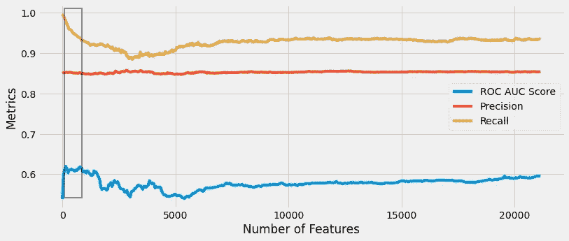

# 特征选择如何提升高维数据的性能

> 原文：<https://towardsdatascience.com/how-feature-selection-can-boost-the-performance-of-high-dimensional-data-720f617bb2f7?source=collection_archive---------31----------------------->

## 选择最佳性能特征的降维基本指南

图片由[格尔德·奥特曼](https://pixabay.com/users/geralt-9301/?utm_source=link-attribution&amp;utm_medium=referral&amp;utm_campaign=image&amp;utm_content=2692575)来自[皮克斯拜](https://pixabay.com/?utm_source=link-attribution&amp;utm_medium=referral&amp;utm_campaign=image&amp;utm_content=2692575)

特征选择是端到端数据科学模型开发管道的重要组成部分。数据科学家需要特别关注用于训练健壮的数据科学模型的功能集。数据越多，模型越健壮，但这适用于实例的数量，而不适用于特征的数量。

原始数据集包含许多需要从训练数据集中排除的冗余要素。对文本特征进行矢量化后，模型的维数增加了很多。处理高维数据集会导致维数灾难的问题。有多种技术可以降低数据集的维度，或者只选择对给定问题陈述表现最佳的最佳特征集。

> 在我之前的一篇文章中，我讨论了 7 种选择最佳性能特性的技巧。

</top-7-feature-selection-techniques-in-machine-learning-94e08730cd09>  

在本文中，我们将讨论如何在一行 Python 代码中使用统计技术来选择性能最佳的特性。

# 想法:

Scikit-learn 带有一个`**feature_selection**`模块，提供各种功能来执行特性选择。一些特征选择功能是:

*   [***【SelectFromModel】***](https://scikit-learn.org/stable/modules/generated/sklearn.feature_selection.SelectFromModel.html#sklearn.feature_selection.SelectFromModel):基于权重重要性选择特征的元变换器。
*   [***Select kbest***](https://scikit-learn.org/stable/modules/generated/sklearn.feature_selection.SelectKBest.html#sklearn.feature_selection.SelectKBest):根据评分函数的 k 个最高分选择特征。
*   [***Select percentile***](https://scikit-learn.org/stable/modules/generated/sklearn.feature_selection.SelectPercentile.html):根据得分函数中最高分的百分位数选择特征。

还有很多。

`**SelectKBest**`和`**SelectPercentile**` 选择重要特征的原理是一样的，但是`**SelectKBest**` 取输入参数，如顶部特征的数量来选择，而`**SelectPercentile**`取特征的百分位数来保留。

# 用法:

`**SelectKBest**`和`**SelectPercentile**` 根据要保留的特征的数量或百分比选择性能最佳的特征。使用诸如卡方或任何其他统计测试的评分函数来计算表现最佳的特征。

卡方函数是一种统计技术，用于计算具有非负特征值的独立要素与目标类之间的卡方得分。现在可以使用`**SelectKBest**`和`**SelectPercentile**` 功能使用卡方得分来选择顶级特征。

我将使用一个带有二进制目标类的样本文本数据集。使用 [Tf-Idf 矢量器](https://scikit-learn.org/stable/modules/generated/sklearn.feature_extraction.text.TfidfVectorizer.html)将文本特征矢量化成具有 21，156 个特征的稀疏矩阵。

我们可以使用`**SelectKBest**`和`**SelectPercentile**` 函数降低稀疏矩阵的维数，使用`**chi2**`作为评分函数。

(作者代码)

使用百分位参数为 10 的`**SelectPercentile**` 函数拟合具有 21，156 个特征的 Tf-Idf 矢量化数据后，特征的数量减少到 2，115 个特征。

现在的问题是，如果我们使用上面讨论的技术降低数据的维度，我们是否必须对模型的性能做出妥协。我们来比较一下同一个机器学习模型在不同百分位值(特征选择后的特征数)下的性能。

(图片由作者提供)，在具有不同数量的特征的特征选择管道之后，数据集的模型性能图。

从上面的图中，我们可以观察到，对于 7，500 个特征之后的数量，我们得到了几乎相似的性能指标(AUC-ROC 得分、精确度和召回率)。对于近 5 到 10 个减少的特征，我们获得了高精度和 AUC-ROC 分数(在图中的黑框中突出显示)。

# 使用管道自动选择特征:

人们可以在端到端的模型开发管道中实现特征选择组件，以自动化特征选择工作流。

(作者代码)

# 结论:

特性选择是 scikit-learn 包中的一个方便的函数，它可以在一行 Python 代码中执行特性选择。也可以改变评分函数(chi2 测试)作为`**SelectKBest**`和`**SelectPercentile**` 函数的参数。

可以对 scikit-learn 管道实现特性选择功能，以自动化特性选择工作流程。

# 参考资料:

[1] Scikit-learn 文档:[https://sci kit-learn . org/stable/modules/feature _ selection . html](https://scikit-learn.org/stable/modules/feature_selection.html)

*喜欢这篇文章吗？成为* [*中等会员*](https://satyam-kumar.medium.com/membership) *继续无限制学习。如果你使用下面的链接，我会收到你的一小部分会员费，不需要你额外付费。*

<https://satyam-kumar.medium.com/membership>  

> 感谢您的阅读