# 傅立叶变换如何加速 CNN 的训练

> 原文：<https://towardsdatascience.com/how-fourier-transform-speeds-up-training-cnns-30bedfdf70f6?source=collection_archive---------15----------------------->

## 深度学习实践者如何受益于 200 年前的一项发现

# 介绍

如果你学过泰勒级数，你就会明白用一个有限的简单项级数来逼近一个复杂函数是多么有用。傅立叶级数是将一般函数分解为正弦波叠加(振幅/时间→安培/频率)的另一个例子，这使其特别适合物理时间序列、信号处理和其他波形数据。

尽管图像看起来不完全像“波形”，但傅立叶变换仍然在深度学习最有价值的创造之一——卷积神经网络中找到了重要的应用。

# 定义

考虑一个复杂的 2π周期函数 f(x ),其中 f(x+2π)=f(x ),我们的目标是将其分解为周期正弦曲线的总和，同时保持 f 的周期性，这是信号数据的一个关键特征。我们知道 cos x 的周期为 2π，但类似于所有功率的单项式如何以不同的位移和幅度组合在一起，我们可以对不同周期和幅度的正弦项进行同样的处理。具体来说，我们将对以下形式进行加权求和

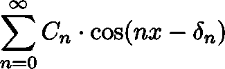

其中每个正弦波的周期为 2π/n，失调为δn，傅里叶分析的目标是发现这些系数。要深入探究为什么它会收敛，请点击这里查看我的完整报告([https://michaelsuntech.files.wordpress.com/2020/11/wim.pdf](https://michaelsuntech.files.wordpress.com/2020/11/wim.pdf))。

# 探测

给定一个在有限区间[t1，T2]上的复杂周期函数 g，它可以表示一个(周期)噪声信号，傅立叶级数理论允许我们把它分解成有限 N 项的和，其形式为

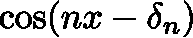

然而，每个“纯”信号都有固定的幅度、偏移和频率，分别由 a_n、δ_n 和 n 得出，n 越高，频率越高。

g 在[-π，π]上的傅里叶变换，定义为

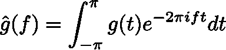

其中 f 代表频率，在分解产生高振幅的频率处产生强有力的尖峰。使我们能够将其应用于现实生活问题的结果是 g 和 hat(g)之间的双射，这使我们能够对 hat(g)进行手术，并仍然恢复原始 g，这在上下文中可能是从歌曲中编辑出单个频道。这个的时间复杂度是多少？

实际上，g 将以固定的采样率产生，并产生一个矢量

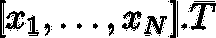

离散傅立叶变换是

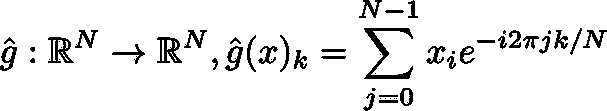

这可以通过矩阵乘法 hat(g)(x)=Wx 来简洁地概括，使得

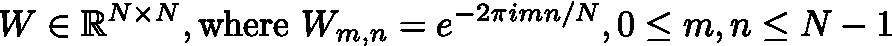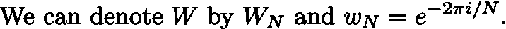

在实践中，执行矩阵乘法具有复杂性 **O(N )** ，这是一个昂贵的过程，但它可以通过快速傅立叶变换极大地简化为 **O(N log N)** (传说它首先由高斯发现用于心算，但直到一百年后才发表)。我来演示一下！设 N = 2N’。假设我们想计算

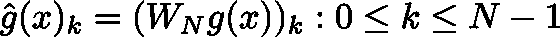

观察

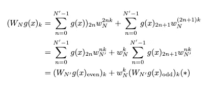

我们分开的地方

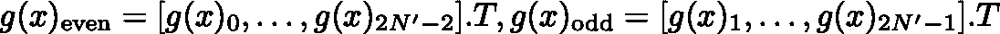

事实上，在所有 k 上的这个操作可以以矩阵块的形式计算，

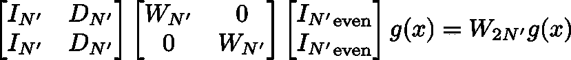

在哪里

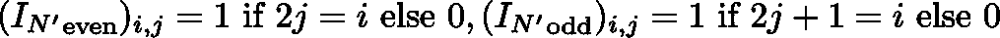

因此

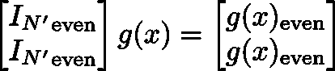

让上面写为

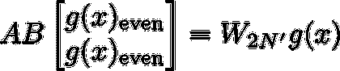

我们确实可以证明，WLOG 0≤ i ≤N'-1

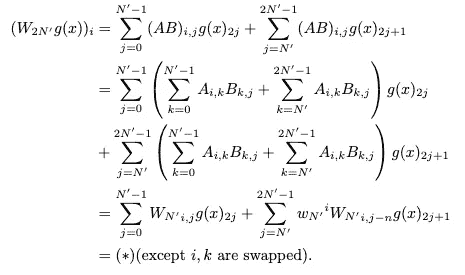

回想一下对角矩阵——向量乘法只取 O(N)，所以将 T(N)表示为计算 W_N g(x)所需的计算量，我们可以建立递归关系 T(N)= O(N)+2T(N’)+O(N)= O(N)+2T(N’)，通过主定理，这足以得出 **T(N)=O(N log N)** 。FFT 运算的一个惊人特征是它的几乎同义的逆运算，

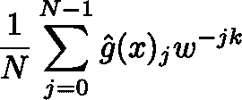

我们可以展示

凭借事实 w^{n}=1，因此

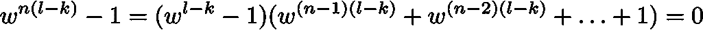

w^{l-k}=1 当且仅当 l=k，所有其他 l 的和为 0，这是傅立叶级数中的一个常见技巧。表示这种相反

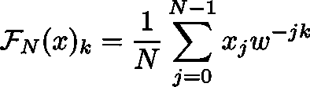

作为“傅立叶算子”,我们有

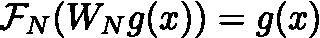

这里还有一些我们可以用傅立叶算子做的技巧。

等同于

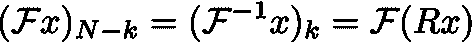

其中(Rx)_k=x_{N-k}。现在，我们将看到 FFT 在机器学习中的应用。如果我们让∙，*表示卷积

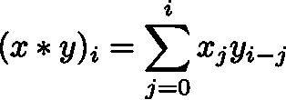

当表示 a=F_N(x)，b=F_N(y)时，我们有

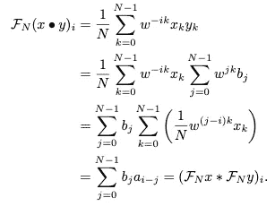

这个操作，看起来只是一个噱头，显示了 x 和 y 在傅立叶域内的点积是 x 和 y 的傅立叶域的卷积。毫不奇怪，当 x，y∈ℝ^{N× N}表示样本图像和滤波器以执行卷积步骤 x*y 时，这一属性在 2D 中也成立，这是训练 CNN 的重要计算步骤，CNN 是深度学习最新进展背后的模型架构。

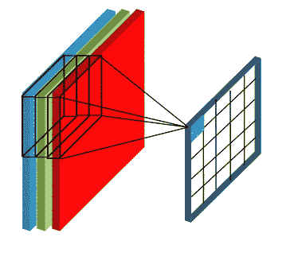

图 1:花费 O(N K)，一个昂贵的操作([来源](https://predictiveprogrammer.com/famous-convolutional-neural-network-architectures-1/))

在 2D，傅立叶运算的开销为 O(N log N )=O(N log N)。通常，滤波器 w∈ℝ^K× K 是图像上的一个*滑动窗口*，总共 N (K，k)个卷积，花费 O(N K)。然而，通过将 w 填充为大小 N× N 并计算

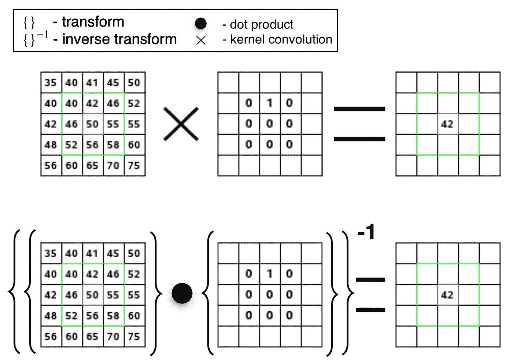

图 2:前后(编辑自[来源](https://docs.gimp.org/2.8/en/plug-in-convmatrix.html)

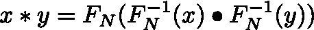

其中∙的成本为 O(N)，**整个操作现在只需要 O(N log N)！**

# 结论

得益于此，机器学习研究人员报告了训练时间的显著减少( [55s→ 0.4s？？？](https://stackoverflow.com/questions/50453981/implement-2d-convolution-using-fft/50506681))具有改进的 O(N K )→ O(N log N)卷积步骤，我们要感谢大约 200 年前的傅立叶发现。

流行的疯狂动物城迷因

# 参考

https://michaelsuntech.files.wordpress.com/2020/11/wim.pdf

【https://sites.math.washington.edu/~morrow/464_12/fft.pdf 

[https://arxiv.org/pdf/2003.12621.pdf](https://arxiv.org/pdf/2003.12621.pdf)

[https://predictive programmer . com/namespace-convolatile-neural-network-architectures-1/](https://predictiveprogrammer.com/famous-convolutional-neural-network-architectures-1/)(图 1)

[https://docs.gimp.org/2.8/en/plug-in-convmatrix.html](https://docs.gimp.org/2.8/en/plug-in-convmatrix.html)(图二)