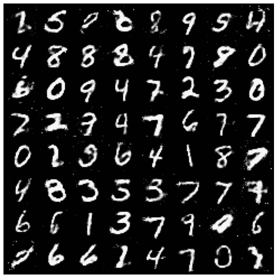
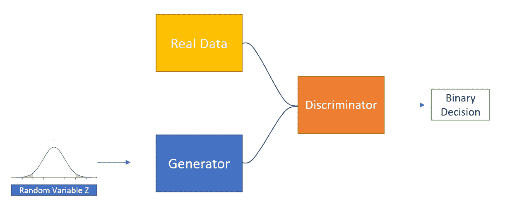
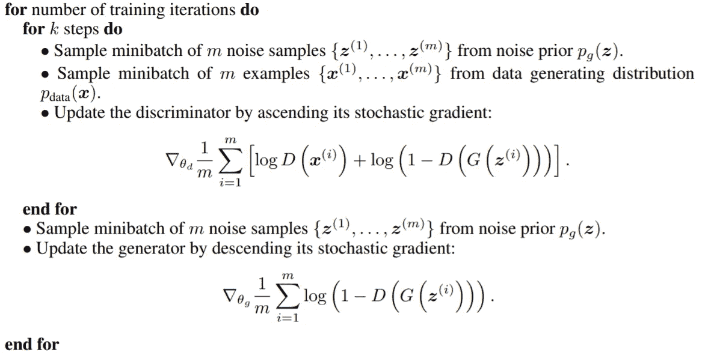
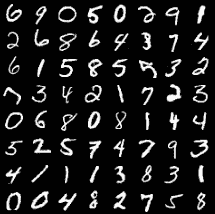
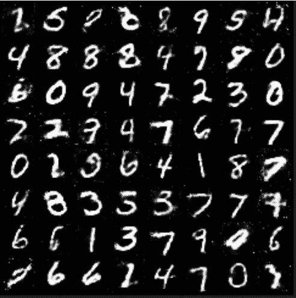
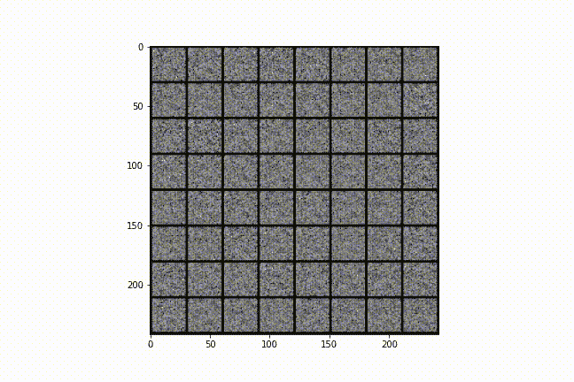
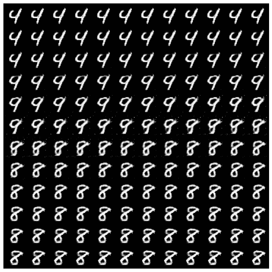
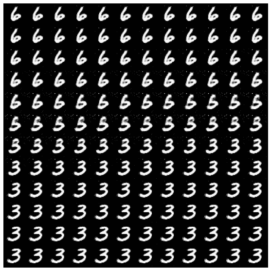
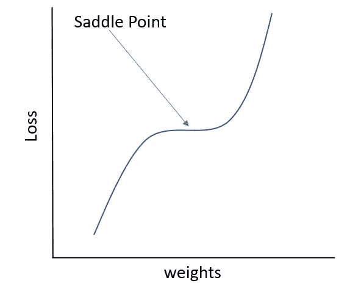
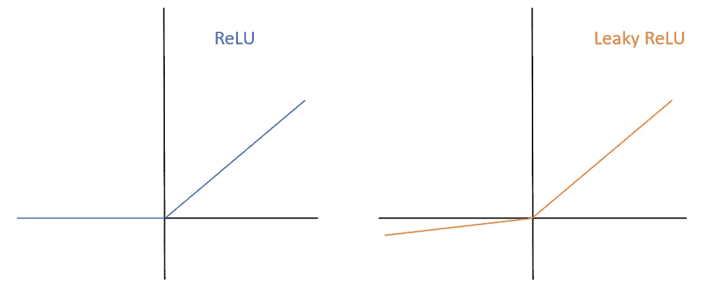

# 甘如何学习:一个简单的介绍

> 原文：<https://towardsdatascience.com/how-gans-learn-a-simple-introduction-6d21081773bd?source=collection_archive---------35----------------------->

## 深度学习基础

## 生成对抗网络的学习、理论和应用

作者图片

# **简介**

在我以前的文章中，我谈到了一般的生成方法，以及是什么让生成器网络如此强大。在这篇文章中，我想更深入地研究生成性对抗网络(GANs)的内部运作。为了确保您完全理解它们，我将浏览 GANs 论文的原始伪代码并解释 GANs 的损失函数，然后我将向您展示我自己实现的结果。最后，我将解释如何通过 DCGANs 论文的建议来改进 GANs，这是该研究领域的一篇关键论文。

# **甘斯人如何学习**

生成方法是一个非常强大的工具，可以用来解决许多问题。他们的目标是生成可能属于训练数据集的新数据样本。生成方法可以通过两种方式做到这一点，通过学习数据空间的近似分布，然后从中采样，或者通过学习生成可能属于该数据空间的样本(避免近似数据分布的步骤)。

作者图片

上面你可以看到 GANs 的架构图。GANs 由两个网络(生成器和鉴别器)组成，这两个网络本质上是相互竞争的；这两个网络有对立的目标。

生成器试图最大化欺骗鉴别器的概率，使其认为生成的图像是真实的。鉴别器的目标是正确地将真实数据分类为真实的，将生成的数据分类为假的。这些目标用网络的损失函数来表示，这些损失函数将在训练期间被优化。

在 GANs 中，发电机的损失函数最小化，而鉴别器的损失函数最大化。生成器试图最大化鉴别器的误报样本数，鉴别器试图最大化其分类精度。

伪代码由**伊恩·j·古德菲勒等人编写，** [**生成对抗网络**](https://arxiv.org/abs/1406.2661)**【1】**

在上面的伪代码中，对于每个时期，对于每个批次，计算鉴别器和发生器的梯度。鉴别器的损失由真实数据集的正确分类样本数的对数和虚假数据集的正确分类样本数组成。我们希望最大化这一点。生成器的损失函数由鉴别器正确分类假图像的次数组成，我们希望最小化这一点。

目标自然是相反的，因此用于训练网络的梯度也是如此。这可能会成为一个问题，我将在后面讨论这个问题。

一旦训练结束，发电机就是我们唯一关心的了。生成器能够接收随机噪声向量，然后它将输出最可能属于训练数据空间的图像。请记住，即使这有效地学习了随机变量(z)和图像数据空间之间的映射，也不能保证两个空间之间的映射是平滑的。gan 不学习数据的分布，他们学习如何生成类似于属于训练数据的样本。

# **应用**

让我们来看一个简单 GAN 的应用。训练数据由来自 MNIST 数据集的手写数字组成。假设我需要更多的手写数字来训练其他机器学习/统计模型，那么可以使用 GANs 来尝试生成更多的数据。

作者图片

看看这个训练数据。正如你所看到的，有些数字对人类来说甚至很难读懂。机器真的很难处理非结构化数据(典型的例子:图像和文本)。计算机只看到像素值，很难教会它一个手写数字是什么排列顺序组成的。

## 生成随机样本

作者图片

如您所见，生成的数据看起来像手写的数字。该模型已经学习了手写数字图像中的一些模式，并由此能够生成新的数据。

我们可以在模型学习时查看生成的样本的 GIF(GIF 可能不会在 medium 应用程序上显示，所以我建议使用浏览器来查看)。

作者 GIF

生成器模型从随机权重开始，生成的图像看起来像随机噪声。随着损失函数的优化，生成器在欺骗鉴别器方面变得越来越好，最终产生的图像看起来更像手写数字，而不是随机噪声。

## 图像间采样

可以做的一件有趣的事情是拍摄两张生成的图像，并对它们之间的空间进行采样。这两个生成的图像具有两个相应的随机向量，这两个随机向量已经被馈送到生成器。我可以将这两个向量之间的空间离散化，本质上通过这两个向量之间的分布画一条线。然后我可以对这条线进行采样，并将这些点输入到我的生成器中。

作者图片

在这里，我看到了一个生成的“4”和一个生成的“8”之间的空间。开始的数字是左上角的“4 ”,这个数字实质上会转化为右下角的“8”。

尽管生成器不能保证在输入空间和数据空间之间产生平滑的映射(我们生成的样本不逼近密度函数)，但您可以看到两幅图像之间的过渡仍然非常平滑。有趣的是，在“4”变成“8”之前，它首先转变为“9”，这意味着在数据空间中，数字“9”位于“4”和“8”之间。

作者图片

这是另一个例子，这次数字“6”变成了“3”。您可以简单地看到生成的样本看起来像一个“5”。

# **甘斯的弊端**

作者图片

GANs 的一个主要缺点是，如前所述，鉴别器和发生器具有相反的目标，因此具有相反的符号梯度。可以看出，当优化 GAN 时，将不会达到最小值。相反，优化算法将在鞍点结束。

GANs 的另一个常见问题是，在训练这些模型时，鉴别器很容易压倒生成器。鉴别器只是变得太好太快，生成器无法学习如何生成欺骗鉴别器的图像。直觉上这是有意义的，分类任务总是比生成器学习如何生成新样本的任务更容易。

# **DCGANs 和消失渐变**

深度卷积 gan 是解决这一问题的一种方法。第一个主要建议是使用 LeakyReLU 作为鉴别器的激活函数。这有助于解决渐变消失的问题。当训练任何种类的神经网络时，都会出现消失梯度问题，如果梯度太小，它们可能会“陷入”这种消失状态，并且由于它们接近于零，因此很难在训练中使用它们。LeakyReLU 通过始终更新模型的权重来减少这种情况的发生，即使激活很小。

作者图片

DCGANs 论文中的其他技巧已经成为训练神经网络时的常见做法，例如在卷积层之后使用批量归一化层，以及避免使用过多的密集层，而使用卷积层。

# 结论

在这篇文章中，我介绍了 GANs 如何工作以及他们如何学习的理论。然后，我展示了用 python 实现 GANs 的简单结果。最后，我强调了 GANs 的一些缺点，以及如何解决这些缺点。

## 支持我

希望这对你有所帮助，如果你喜欢它，你可以[跟随我！](https://medium.com/@diegounzuetaruedas)

您也可以成为 [**中级会员**](https://diegounzuetaruedas.medium.com/membership) 使用我的推荐链接，访问我的所有文章以及更多:[https://diegounzuetaruedas.medium.com/membership](https://diegounzuetaruedas.medium.com/membership)

# 你可能喜欢的其他文章

[可微发电机网络:简介](/differentiable-generator-networks-an-introduction-5a9650a24823)

[傅立叶变换:直观的可视化](/fourier-transforms-an-intuitive-visualisation-ba186c7380ee)

# 参考

[1] Goodfellow，I .、Pouget-Abadie，j .、Mirza，m .、Xu，b .、Warde-Farley，d .、Ozair，s .、a .和 Bengio，y .，2014 年。生成性对抗网络。*康乃尔大学*https://arxiv.org/abs/1406.2661 T2。