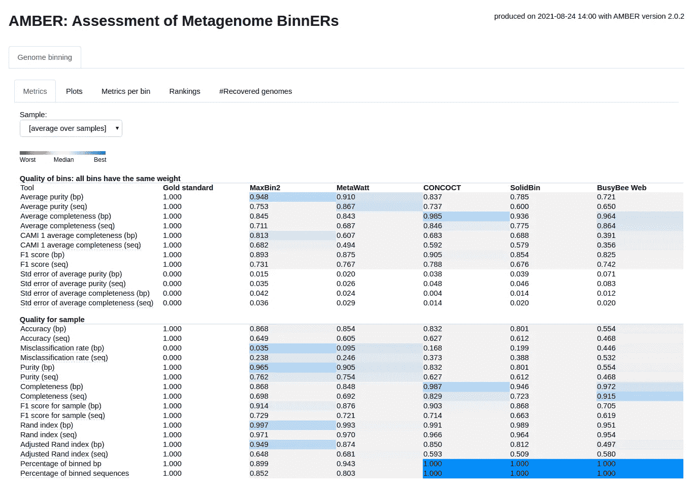
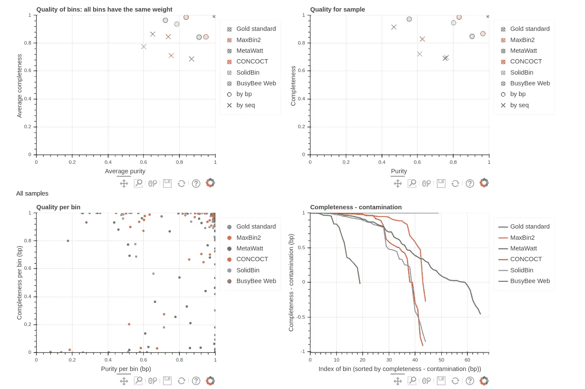
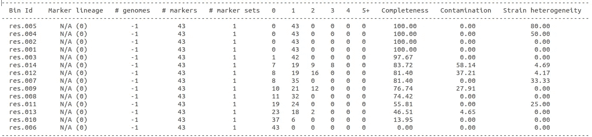

# 你的宏基因组宁滨结果有多好？

> 原文：<https://towardsdatascience.com/how-good-are-your-metagenomic-binning-results-1ebb229db5f2?source=collection_archive---------22----------------------->

## [实践教程](https://towardsdatascience.com/tagged/hands-on-tutorials)

## 评估宏基因组宁滨结果的策略和工具

自然环境，如湖水、土壤和人体的生态位(肠道、皮肤等)。)是数万亿微生物的家园。这些微观社区是复杂多样的，我们可以通过研究它们的组成和相互作用来了解它们的影响。如果你看过我的关于[软件工具用于宏基因组](https://medium.com/computational-biology/software-tools-for-reference-free-binning-of-metagenomes-f2d26b27eef2)的无参考宁滨的文章，你可能知道在过去的几十年中有不同的方法被开发来执行宏基因组宁滨，其中你将序列放入对应于不同分类组(种、属等)的箱中。).

> 我们如何评价宏基因组宁滨工具产生的结果？

在这篇文章中，我将介绍一些工具和技术来评估从无参考宁滨工具获得的宁滨结果。这些工具很受欢迎，因为它们提供了识别尚未在可用参考数据库中发表的新物种的优势。

# 聚类分析

宏基因组宁滨工具使用不同的聚类方法，您可以使用以下流行的评估指标来评估最终的宁滨结果。

1.  精确
2.  回忆
3.  f1-分数
4.  调整后的兰德指数

你可以从我的[评估聚类结果](/evaluating-clustering-results-f13552ee7603)中阅读更多关于如何计算这些标准的细节。

</evaluating-clustering-results-f13552ee7603>  

与其自己想出评估脚本，还不如用已经发布的流行软件工具和软件包来评估宏基因组宁滨的结果。让我们浏览其中的几个，并详细了解如何安装和运行它们。

# 琥珀

宏基因组分箱评估(AMBER)[【1】](https://doi.org/10.1093/gigascience/giy069)是一个用来评估和比较从宏基因组基准数据集重建的基因组的软件包。AMBER 要求用户提供与宁滨结果一起入库的序列的基本事实注释。AMBER 可以接收来自不同工具的多个宁滨结果，并提供各种评估指标的可视化，包括完整性、纯度、F1 值、ARI、污染(可视为与纯度相反)、准确度和分级分数。

## 琥珀怎么安装？

琥珀可以在 https://github.com/CAMI-challenge/AMBER 的[GitHub 上免费获得。您可以使用以下命令下载代码。](https://github.com/CAMI-challenge/AMBER)

```
git clone [https://github.com/CAMI-challenge/AMBER.git](https://github.com/CAMI-challenge/AMBER.git)
```

你也可以按照[https://github.com/CAMI-challenge/AMBER#steps](https://github.com/CAMI-challenge/AMBER#steps)提供的步骤安装 AMBER。

## 如何经营琥珀？

在运行 amber 之前，你必须根据 [CAMI 宁滨生物箱格式](https://github.com/bioboxes/rfc/tree/master/data-format)格式化地面实况注释和宁滨结果。你可以按照[https://github.com/CAMI-challenge/AMBER#input](https://github.com/CAMI-challenge/AMBER#input)的指示格式化你的结果。

例如，如果您在 FASTA 文件中有每个箱的宁滨结果，那么您可以运行以下命令来根据 CAMI 宁滨生物箱格式进行格式化。

```
AMBER/src/utils/convert_fasta_bins_to_biobox_format.py *.fa -o my_bins.tsv
```

准备好文件后，您可以运行 AMBER。

```
amber.py -g amber_ground_truth_1000_bins.tsv maxbin2_bins.tsv metawatt_bins.tsv concoct_bins.tsv solidbin_bins.tsv busybee_bins.tsv -l "MaxBin2, MetaWatt, CONCOCT, SolidBin, BusyBee Web" -o AMBER_Result
```

注意:您可以在普通的台式机上运行 AMBER，内存为 8–16 GB，没有任何问题。

## 琥珀色输出

在您的输出文件夹`AMBER_Result`中，您可以找到评估结果的最终报告(`index.html`)，如图 1 所示，对应于我们之前使用的示例命令。



图 1:琥珀色结果示例(作者截图)

如果你点击`Plots`标签，你可以看到不同的图，如图 2 所示。



图 axample 琥珀色结果的不同图(作者截图)

# CheckM

CheckM [ [2](https://doi.org/10.1101/gr.186072.114) ]是一种用于评估从宏基因组学分析中回收的基因组质量的工具。与 AMBER 不同，CheckM 不需要任何基础事实注释作为输入，因此可以用于分析真实世界的宏基因组数据，其中实际的分类组成未知。CheckM 使用[单拷贝标记基因](https://medium.com/computational-biology/marker-genes-and-gene-prediction-of-bacteria-5fa4cb7802f3)来评估宁滨结果的完整性、污染性和异质性。

## 如何安装 CheckM？

您可以遵循 CheckM wiki([https://github.com/Ecogenomics/CheckM/wiki](https://github.com/Ecogenomics/CheckM/wiki))上为[安装](https://github.com/Ecogenomics/CheckM/wiki/Installation#how-to-install-checkm)提供的步骤。

你还必须从 https://data.ace.uq.edu.au/public/CheckM_databases/[下载 **CheckM 数据库**。](https://data.ace.uq.edu.au/public/CheckM_databases/)

成功安装 CheckM 后，您可以在宁滨结果中提供 bin 的 FASTA 文件，并按如下方式运行 CheckM。

```
checkm lineage_wf -t 56 -x fasta path/to/bins path/to/outputcheckm analyze -t 56 -x fasta checkm_data_2015_01_16/hmms/phylo.hmm path/to/bins path/to/outputcheckm qa -t 56 --out_format 1 -f path/to/output/result.txt checkm_data_2015_01_16/hmms/phylo.hmm path/to/output
```

## CheckM 输出

在您的输出文件夹中，可以在文件`result.txt`中找到 CheckM 输出。这个文件将如图 3 所示。



图 3:示例 CheckM 输出(作者截图)

注意:根据我在大型宏基因组数据集上运行 CheckM 的经验，我发现在一台 16 GB 内存的普通桌面计算机上运行 CheckM 是一个挑战。所以我建议把它安装在至少有 64 GB 内存的机器上。

# GTDB-Tk

基因组分类数据库工具包(GTDB-Tk) [ [3](https://doi.org/10.1093/bioinformatics/btz848) ]允许用户获得细菌和古细菌基因组的分类任务。GTDB-Tk 可用于获得基于每个箱中最丰富的分类组(达到物种水平)的宁滨结果的分类注释。与 CheckM 类似，您只需要向 GTDB-Tk 提供 bin。

## 如何安装 GTDB-Tk？

https://github.com/Ecogenomics/GTDBTk[的 GitHub 上免费提供 GTDB-Tk。你可以遵循](https://github.com/Ecogenomics/GTDBTk)[https://ecogenomics.github.io/GTDBTk/](https://ecogenomics.github.io/GTDBTk/installing/index.html)的维基中提供的安装步骤。

## 如何经营 GTDB-Tk？

我将使用`classify_wf`命令将每个 bin 分类到一个分类组。您可以从[https://eco genomics . github . io/GTDBTk/commands/classify _ wf . html](https://ecogenomics.github.io/GTDBTk/commands/classify_wf.html)中了解有关该命令的更多信息。

```
gtdbtk classify_wf --genome_dir path/to/bins --extension fasta --cpus 56 --out_dir path/to/output
```

注意:安装和构建 GTDB 数据库需要大量内存。根据我安装 GTDB-Tk 并在大型宏基因组数据集上运行它的经验，我建议将其安装在至少有 256 GB 内存的服务器上。

## GTDB-传统知识产出

成功运行`classify_wf`命令后，您将获得一个`.tsv`文件，其中包含每个 bin 的分类注释。

# 最后的想法

AMBER、CheckM 和 GTDB-Tk 是宏基因组学分析中用来评估宁滨结果有多好的一些流行工具。AMBER 需要基础事实注释来进行评估，而 CheckM 和 GTDB-Tk 不需要这样的基础事实注释。琥珀更适合模拟或模仿数据集，其中地面真相是可用的。然而，CheckM 和 GTDB-Tk 可以用来评估模拟和真实数据集。

希望这篇文章对你有用，尤其是对那些刚接触宏基因组学的生物信息学领域的人。您可以试用这些工具并观察它们的输出。

感谢您的阅读！

干杯！

# 参考

[1]迈耶等人。铝，琥珀:评估宏基因组 BinnERs([https://doi.org/10.1093/gigascience/giy069](https://doi.org/10.1093/gigascience/giy069))

[2]帕克斯等人阿尔·切克姆:评估从分离物、单细胞和宏基因组中回收的微生物基因组的质量(【https://doi.org/10.1101/gr.186072.114】T2

[3]肖梅尔等人。阿尔，GTDB-Tk:用基因组分类数据库对基因组进行分类的工具包(【https://doi.org/10.1093/bioinformatics/btz848】T4)

你可能也会发现这些文章很有趣。

<https://medium.com/computational-biology/software-tools-for-reference-free-binning-of-metagenomes-f2d26b27eef2>  <https://medium.com/computational-biology/metagenomics-who-is-there-and-what-are-they-doing-9ea71f03eeee>  </evaluating-clustering-results-f13552ee7603>  <https://medium.com/computational-biology/marker-genes-and-gene-prediction-of-bacteria-5fa4cb7802f3> 