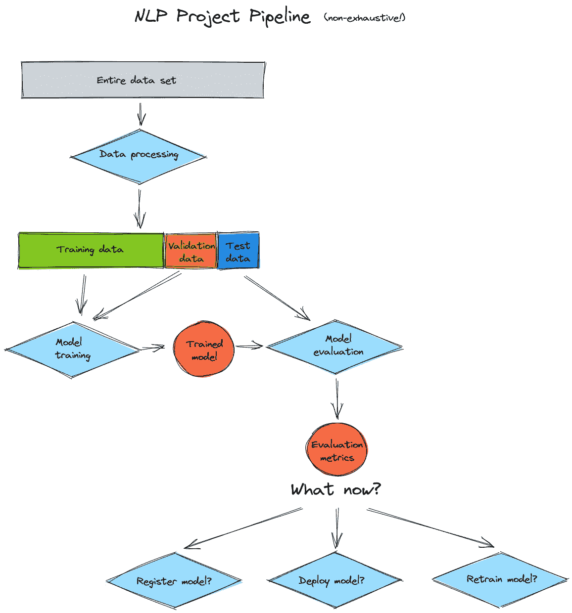
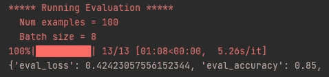
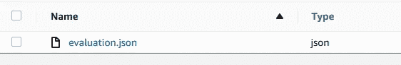
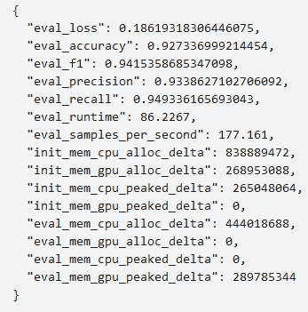
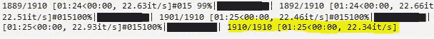

# 你的 NLP 模型到底有多好？

> 原文：<https://towardsdatascience.com/how-good-is-your-nlp-model-really-b5ef2c0857ed?source=collection_archive---------36----------------------->

## 如何评价亚马逊 SageMaker 为拥抱脸的变形金刚模型处理工作的 NLP 模型

安托万·道特里在 [Unsplash](https://unsplash.com?utm_source=medium&utm_medium=referral) 上拍摄的照片

# 这是怎么回事？

NLP 项目(或任何 ML 项目，就此而言)的管道由几个步骤组成，包括数据处理、模型训练和部署。在模型培训和部署之间应该涉及的另一个步骤是*模型评估*。只有在评估了新训练的模型之后，我们才应该考虑下一步，这可能涉及注册和/或部署模型，或者，如果模型性能很差，则使用不同的/更多的数据对其进行重新训练:

NLP 项目管道(图片由作者提供)

亚马逊 SageMaker [最近推出了拥抱脸处理作业](/huggingface-processing-jobs-on-amazon-sagemaker-b1f5af97b663)，这是专门为拥抱脸的变形金刚模型设计和优化的。[加工作业可用于各种任务](https://docs.aws.amazon.com/sagemaker/latest/dg/processing-job.html):数据预处理或后处理、特征工程、数据验证和模型评估。

在这篇博文中，我们将深入探讨列表中的最后一项任务——模型评估。我们将了解模型评估的挑战，以及我们如何利用 SageMaker 处理作业来克服这些挑战。

# 为什么这很重要？

NLP 模型评估可能是资源密集型的，尤其是对于从 GPU 加速中受益匪浅的 Transformer 模型。因此，如果我们在没有 GPU 的机器上运行，评估可能需要几个小时，尤其是在测试数据集很大的情况下。事实上，我们将确切地看到在我的笔记本电脑(没有 GPU)上进行模型评估需要多长时间。相比之下，我们将看到，我们可以加快这一进程高达 267(！)次通过使用 SageMaker 的拥抱脸处理作业。

这些处理作业不仅通过使用按需计算资源实现了更快的模型评估，而且 SageMaker 生态系统中的紧密集成也允许将这一步骤无缝集成到端到端的 NLP 管道中。

# 先决条件

本教程的 Github repo 可以在[这里](https://github.com/marshmellow77/sm-hf-model-evaluation)找到。它包含一个用于与 SageMaker 处理作业交互的笔记本，以及两个评估脚本—一个用于评估本地机器(如个人笔记本电脑)上的模型，另一个用于 SageMaker 处理作业。

我们还需要一个经过训练的 Transformer 模型和一个相应的测试数据集。理想情况下，您可以使用自己的模型和测试数据，但是如果您没有现成的模型和测试数据，您也可以在 Github repo 中找到模型和测试数据。

*(回购中的模型是一个基于 DistilBERT 的二元分类模型，已经过微调，可以检测电影评论中的正面和负面情绪。数据集格式为* [*HuggingFace 的数据集*](https://huggingface.co/docs/datasets/) *。)*

# 如何使用培训师 API 评估变压器模型

拥抱脸的教练 API 通常用于训练模型，但它也使评估一个已经训练好的模型变得非常简单和直接。我们只需要用我们想要评估的模型调用训练器 API，指定测试数据，以及我们想要计算的度量的定义来评估模型:

# 局部评估模型

通过使用 Github repo 中的脚本[*evaluate-local-HF . py*](https://github.com/marshmellow77/sm-hf-model-evaluation/blob/main/scripts/evaluate-local-hf.py)，我们现在可以在任何我们想要的地方评估模型。事实上，我在我的笔记本电脑(没有 GPU)上运行了这个脚本，看看需要多长时间。**但是**:测试数据由大约 15K 条记录组成，在 NLP 项目中的记录数量很容易达到数百万条的今天，这实际上并不算多。然而，它仍然足以让我的笔记本电脑忙碌几个小时。因此，我没有使用整个测试数据集，而是将其精简到只有 100 条记录:

100 条记录的运行时间(图片由作者提供)

结果表明，处理 100 条记录大约需要 68 秒，每批 8 条记录大约需要 5.3 秒(或每条记录 0.66 秒)。将此推断到 15K 记录的整个数据集意味着模型评估将在我的笔记本电脑上花费大约 3 小时。

# Sagemaker 为拥抱脸处理作业

SageMaker 处理允许我们按需配置 GPU 机器，并且只在评估模型所需的时间内配置。为此，我们使用稍微修改的评估脚本[,它可以与处理作业交互。这一次，我们将对整个测试数据集进行评估，即大约 15K 条记录。](https://github.com/marshmellow77/sm-hf-model-evaluation/blob/main/scripts/evaluate-sm-hf.py)

为了设置模型评估，我们使用 [SageMaker Python SDK](https://sagemaker.readthedocs.io/en/stable/amazon_sagemaker_processing.html) 来设置处理作业:

我们还需要告诉处理器在哪里可以找到模型和测试数据:

然后我们可以开始模型评估:

一旦运行完成，我们可以在 S3 的指定输出文件夹中的 JSON 文件中找到评估结果(在我们的例子中，该文件将被称为 *evaluation.json* ):

对 S3 的评价结果(图片由作者提供)

打开这个文件为我们提供了我们在 *compute_metrics()* 方法中指定的评估指标，以及来自处理作业的一些其他指标:

评估指标(图片由作者提供)

事实上，评估结果告诉我们，处理作业每秒运行 177 个样本。如果您还记得，我的笔记本电脑每秒运行 0.66 个样本，这意味着处理工作比我的笔记本电脑快 267 倍！我们还可以通过查看处理作业的日志来确认这一点:

SageMaker 上的运行时间(图片由作者提供)

正如我们所看到的，在一个大约有 15K 记录的数据集上评估该模型只需要 85 秒的处理工作。

# 结论

在这篇博文中，我们学习了如何使用 Amazon SageMaker 处理作业来评估基于 Hugging Face 的 Transformer 模型的 NLP 模型。我们看到，在 SageMaker 上按需使用 GPU 计算基础设施非常简单，并且显著加快了模型评估的速度。

下一步可能是捕获整个 NLP 项目生命周期，包括端到端管道中的模型评估，并将其自动化，从而为 NLP 任务构建可扩展的 CI/CD 管道。