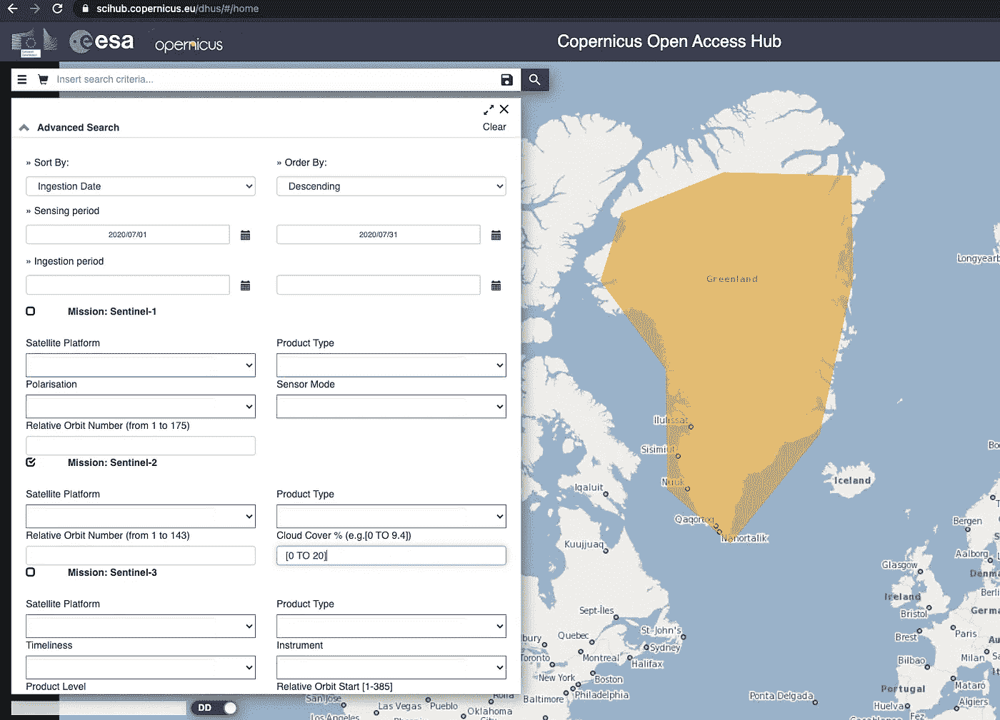

# 格陵兰有多绿？

> 原文：<https://towardsdatascience.com/how-green-is-greenland-cabbe516de04?source=collection_archive---------56----------------------->

## 我花了一天时间学习使用 Python 进行卫星图像分析的基础知识

我想在一天内完成的事情:

> 1.了解如何从免费资源下载数据
> 
> 2.哪些 python 库可用于卫星影像分析
> 
> 3.熟悉词汇
> 
> 4.对下载的数据运行真实场景。在这种情况下，我们将使用 NDVI 检查格陵兰岛的绿色植被。

我一直在与一个潜在的油气能源客户互动，我为他开发了一个关于在石油钻井现场使用声音数据的概念验证。下周我还有一次会议，会上将讨论卫星图像数据的使用案例。因此，我决定今天花点时间快速学习 GIS 数据分析的基础知识，这样我就不会在下周的会议中触及皮毛。


[美国地质勘探局](https://unsplash.com/@usgs?utm_source=medium&utm_medium=referral)在 [Unsplash](https://unsplash.com?utm_source=medium&utm_medium=referral) 上拍摄的照片

当我想到卫星图像分析时，一系列复杂的预建软件浮现在我的脑海中，需要一些培训研讨会才能掌握，但我只想投资一天，不想花任何不必要的钱。于是，我调用了我的两个朋友——**鸭鸭 Go + Python。**

## 下载数据

有许多免费资源，人们可以很容易地从那里下载数据。我试过 https://scihub.copernicus.eu/dhus/的[和 https://earthexplorer.usgs.gov/的](https://scihub.copernicus.eu/dhus/#/home)。

在这两个网站中创建您的帐户，并准备好下载数据。这两种工具的基本原理是相同的:

1.  在您想要分析的地理区域上创建您选择的多边形。
2.  选择需要感测数据的日期间隔。
3.  根据云量进一步过滤(低于 10%是理想的)
4.  选择卫星——我用的是 Sentinel2

与其让我喋喋不休地谈论如何下载数据，不如看看这个 [YouTube 视频](https://www.youtube.com/watch?v=uQvlTQoUWuQ&t=486s&ab_channel=MakingSenseRemotely)，她在引导你开始方面做得很好。



作者提供的图片(哥白尼中心，我只选择了 Sentinel 2 作为数据并过滤了日期)

在我看来，Copernicus Open Access Hub 在下载数据方面要快得多，因为地球探测器即使下载一个 1GB 的小文件也要花很长时间(肯定与他们的 FTP 设置有关)。

> 一旦你下载了数据并解压后，你会看到。蒂芙还是。JP2 的文件在你的文件夹里。这些是您将使用的主要文件。


作者图片

上面是下载数据的文件夹树，R10m、R20m、R60m 是文件夹，其中. jp2 和。tif/。tiff 文件将被定位。(请注意，我已经在这里将文件夹重命名为 Nuuk，将被下载的文件夹将有一些长的字母数字名称，指示卫星、观看周期等)

***稍微讲一下哨兵-2***

Sentinel 2 由欧洲航天局于 2015 年发射，主要关注植被、土地覆盖和环境监测。

Sentinel-2 的数据是多光谱的，有可见光、近红外(NIR)和短波红外光谱(SWIR)的 13 个波段。Sentinel-2 数据是免费的，刷新频率很高，每 5 天刷新一次，这使它成为环境相关学术工作的理想和最新资源。

*   10 米处的 4 个波段:蓝、绿、红和近红外。
*   20 米处的 6 个波段:4 个窄带用于植被表征(705 纳米、740 纳米、783 纳米和 865 纳米)，2 个较大的 SWIR 波段(1，610 纳米和 2，190 纳米)用于雪/冰/云检测或植被水分胁迫评估等应用。
*   60 米处的 3 个波段:主要用于云筛选和大气校正(443 纳米用于气溶胶，945 纳米用于水蒸气，1375 纳米用于卷云探测)。


来源-美国地质勘探局([https://custom-scripts . sentinel-hub . com/custom-scripts/sentinel-2/bands/](https://custom-scripts.sentinel-hub.com/custom-scripts/sentinel-2/bands/))

## 问题陈述

> 丹麦的自治领土格陵兰岛大部分时间都被冰覆盖着；大多数人口居住在首都努克附近。在夏季，一些植物以绿色覆盖物的形式出现。在这项工作中， ***我们将选取整个努克地区，分析夏季的绿色植被。***

## 写入

一旦我们有了数据，我们需要一些可以帮助我们阅读它们的库。Python 提供了一些不错的库来帮助完成这项工作: *Earthpy、Rasterio、ArcGIS、Satpy、Fiona、GDAL 等等*

在本案例研究中，我们将使用 rasterio 和 earthpy。

```
#Importsimport rasterio
from rasterio import plot
%matplotlib inline
import matplotlib.pyplot as plt
from glob import glob
import numpy as np
import earthpy.plot as ep
import earthpy.spatial as es
```

给出 IMG 数据/R60m 文件夹的路径，并使用 glob 读取文件。

```
path = "Nuuk/Granule/Nuuk/IMG_DATA/R60m/"
bands = glob(path+"/*B?*.jp2")
bands.sort()
bands
len(bands) # This will yeild 11 in this case.
```


按作者分类的图片(Sentinel 数据中所有 jp2 文件的列表)

Earthpy 提供了一些快速技巧，可以帮助我们可视化数据中的所有波段。

```
array_stack, meta_data = es.stack(bands, nodata=-9999)titles = ['Aerosol', 'Blue', 'Green', 'Red', 'Vegetation Red Edge_0.70', 'Vegetation Red Edge_0.74','Vegetation Red Edge_0.78', 'Water Vapour', 'SWIR_1.6', 'SWIR_2.1', 'NIR']
```

上面的“标题”列表与波段在我们的波段对象中出现的顺序一致。

让我们画出所有的哨兵波段

```
ep.plot_bands(array_stack, cmap = "terrain", title = titles)
```


按作者分类的图像(数据中出现的所有 11 个波段)

这里不同的图像肯定是有区别的，有几个比较亮，有几个比较暗。

条带包含红色、蓝色、绿色数据；我们可以创建一个 RGB 图像来看看它是什么样子的。

```
ep.plot_rgb(array_stack, rgb=(3, 2, 1), stretch=True, str_clip=0.2, figsize=(10, 16))
```


Nuuk 的 RGB(图片由作者提供)

```
band2, band3, band4 = array_stack[1:4]def plot_mult_axis():
    fig, (ax1, ax2, ax3) = plt.subplots(1, 3, figsize=(12, 4))
    plot.show(band2, ax=ax1, cmap='Blues')
    plot.show(band3, ax=ax2, cmap='Greens')
    plot.show(band4, ax=ax3, cmap='Reds')
    fig.tight_layout()plot_mult_axis()
```


b、G 和 R 绘制在单个轴上。(R 看起来像橙色)图片作者

## **NDVI (** 归一化差异植被指数)

NDVI 是一种基于植物如何反射不同光波的植物健康指标。这是通过测量植物强烈反射的近红外线和吸收的红光之间的差异来实现的。NDVI 的范围总是从-1 到+1。

由于植物的表面反射特性，NDVI 度量可以用于识别地形中的绿色斑块。


NDVI 接近 1 可能意味着密集的植被，而-1 可能意味着水，冰或一些噪音。

我们数据中的波段 4 对应于红色，波段 8 对应于 NIR。

```
band4 = rasterio.open(path+"T22WDS_20200831T150809_B04_60m.jp2")
band8 = rasterio.open(path+"T22WDS_20200831T150809_B8A_60m.jp2")red = band4.read(1).astype('float64')
nir = band8.read(1).astype('float64')
ndvi=np.where(
    (nir+red)==0.,
    0,
    (nir-red)/(nir+red))
```

让我们创建一个空的 tiff 图像，并将 NDVI 数据保存在其中。

```
ndviImage = rasterio.open('ndvi.tiff','w',driver='Gtiff',
                          width=band4.width,
                          height = band4.height,
                          count=1, crs=band4.crs,
                          transform=band4.transform,
                          dtype='float64')
ndviImage.write(ndvi,1)
ndviImage.close()
```

是时候分析 NDVI 的形象了

```
ndvi = rasterio.open('ndvi.tiff')
fig = plt.figure(figsize=(15,10))
plot.show(ndvi, cmap="RdYlGn")
```


作者图片(NDVI 为格陵兰首都努克创作)

> 这看起来不错。这些照片是在 7 月拍摄的，当时努克周围的冰正在融化，黄色的是海洋，红色的是内海或残留的冰——这是正确的描述。

同样，我们可以查看**修正的归一化差异水指数。**

```
 MNDWI = (SWIR - GREEN)/(SWIR + GREEN)
```

它可以像 NDVI 一样容易地计算出来。

```
band3 = rasterio.open(path+"T22WDS_20200831T150809_B03_60m.jp2")
band11 = rasterio.open(path+"T22WDS_20200831T150809_B11_60m.jp2")green = band3.read(1).astype('float64')
swir = band11.read(1).astype('float64')
mndwi=np.where(
    (green+swir)==0.,
    0,
    (swir-green)/(swir+green))#Create an empty TFF file and write the data of mndwi object to itmndwi_Image = rasterio.open('mndwi.tiff','w',driver='Gtiff',
                          width=band3.width,
                          height = band3.height,
                          count=1, crs=band3.crs,
                          transform=band3.transform,
                          dtype='float64')
mndwi_Image.write(mndwi,1)
mndwi_Image.close()# Open the filemndwi = rasterio.open('mndwi.tiff')
fig = plt.figure(figsize=(15,10))
plot.show(mndwi)
```


MNDWI for Nuuk(图片由作者提供)

图片左边的海水是绿色的，内陆的水颜色较深，用紫色表示。

许多其他指数可以计算，如粘土指数，亚铁指数，水分指数等；我没有计算它们，因为它们不会给这个博客增加任何价值。

这项工作的数据和代码可以在我的 [Github 这里](https://github.com/Prashantmdgl9/Remote-Sensing)获得。

# 格陵兰看起来很绿

我开始分析的所有问题都已经得到了回答。

> **1。了解如何从免费资源下载数据**
> 
> 有很多方法可以下载卫星图像数据，如哥白尼中心，地球探索，谷歌地球引擎等。
> 
> **2。卫星影像分析有哪些 python 库可用？**
> 
> 如果您想使用 python，有许多独立维护的库可以帮助您入门卫星影像分析领域。我会推荐使用 Rasterio，Earthpy，GDAL 作为开始。
> 
> **3。熟悉词汇**
> 
> 每个领域都有一个学习曲线，这个领域也是如此，还有一个密集的领域，但没有一个领域像火箭科学*双关语:D*一样
> 
> **4。对下载的数据运行真实场景。在这种情况下，我们将使用 NDVI 检查格陵兰岛的绿色植被。**
> 
> 在尝试了几个小时后，我找不到任何可以覆盖整个格陵兰岛的多边形，这是有意义的，因为格陵兰岛不是一个可以在一张照片中捕捉到的小岛。我发现一个多边形覆盖了整个努克和一些周边地区。这足以让我对数据分析有所了解。

我们能够进行端到端的分析，包括下载数据、读取数据、处理数据、使用数据生成我们想要的功能。

> 我认为上述工作的一个直接应用是测量几年来 NDVI 季节的差异，并了解冰川和冰的融化是如何为植被提供新的牧场的。在这一点上，我们已经意识到了气候变化和相关的问题，但是如果有人是一个不相信的人，并且想要自己检查一下，那么上面描述的道路将是一条合适的道路。

请让我知道任何意见和反馈。

## 参考资料:

<https://earthobservatory.nasa.gov/features/MeasuringVegetation>   