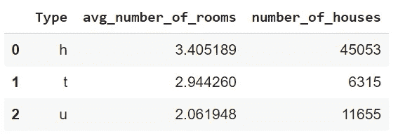

# Python Pandas 与 R 数据表的分组方式

> 原文：<https://towardsdatascience.com/how-grouping-works-with-python-pandas-vs-r-data-table-bc9990bc46e0?source=collection_archive---------25----------------------->

## 举例说明


在 [Unsplash](https://unsplash.com/s/photos/color-groups?utm_source=unsplash&utm_medium=referral&utm_content=creditCopyText) 上[特蒂亚娜·什希金娜](https://unsplash.com/@shyshkina?utm_source=unsplash&utm_medium=referral&utm_content=creditCopyText)的照片

美国不同城市的平均房价是多少？一家店不同产品组的总销售额是多少？不同公司的平均工资是多少？

只要我们有适当的数据，所有这些问题都可以通过分组操作来回答。大多数数据分析库和框架都实现了一个函数来执行这样的操作。

在本文中，我们将比较两个最流行的数据分析库在涉及分组的任务方面的差异。第一个是 Python 熊猫，第二个是 R 数据表。

我们将使用 Kaggle 上提供的墨尔本房屋[数据集](https://www.kaggle.com/anthonypino/melbourne-housing-market)作为示例。我们首先导入库并读取数据集。

```
# pandas
import pandas as pd
melb = pd.read_csv("/content/melb_data.csv")# data.table
library(data.table)
melb <- fread("datasets/melb_data.csv")
```


前 5 行数据(图片由作者提供)

让我们从找到每种房屋类型的平均房间数开始。Pandas 提供了`groupby`函数，用于对观察值(即行)进行分组。

```
# pandas
melb[["Type","Rooms"]].groupby("Type").mean() Rooms
Type
h    3.405189
t    2.944260
u    2.061948
```

我们选择“类型”和“房间”列，并根据“类型”列对房屋(即行)进行分组。因为在 type 列中有 3 个不同的值，所以我们最终有 3 个组。最后，我们对每组应用均值函数，得到房间的平均数。

如果我们不选择列并直接应用`groupby`函数，Pandas 会计算所有数字列的平均值。有一个更实际的方法来解决这个问题，我们将在下面的例子中讨论。

下面是我们如何对数据表进行同样的操作:

```
# data.table
melb[, .(mean(Rooms)), by=Type] Type       V1
1:    h 3.405189
2:    t 2.944260
3:    u 2.061948
```

直觉是一样的，但语法是不同的。`by`参数用于选择用于分组的列。数据表可以用逗号分隔不同类型的操作。例如，如果我们需要传递一个条件来过滤行，我们把它放在方括号内的第一个逗号之前。

对于第二个示例，我们计算每个地区的平均房价，并为聚合列指定一个名称。

```
# pandas
melb.groupby("Regionname", as_index=False).agg(
    avg_house_price = ("Price", "mean")
)
```


(图片由作者提供)

这次我们使用了命名聚合，因此我们不必选择任何列。聚合的类型和要聚合的列在`agg`函数中指定。我们还可以为聚合列指定一个定制的名称。

`as_index`参数用于为组创建一个列。否则，它们将被表示为数据帧的索引。

下面是数据表版本:

```
# data.table
melb[, .(avg_house_price = mean(Price, na.rm = TRUE)), by=Regionname]
```


(图片由作者提供)

数据表语法变化不大。我们刚刚添加了`na.rm`参数，因为 price 列中缺少值。我们需要在计算平均值之前去掉它们。否则，所有聚合值都变成 NA。

这两个库都允许嵌套分组，因此我们可以基于多个列对观察结果进行分组。让我们找出每个地区每种类型的平均房价。

```
# pandas
melb.groupby(["Regionname", "Type"], as_index=False).agg(
   avg_house_price = ("Price", "mean")
)[:5]
```


(图片由作者提供)

我们使用一个列表将多个列传递给`groupby`函数。代码末尾的 5 限制了要显示的行数。

```
# data.table
melb[, .(avg_house_price = mean(Price, na.rm = T)), .(Regionname, Type)][1:5]
```


(图片由作者提供)

您可能已经注意到，我们不一定要使用`by`关键字。数据表的标准结构语法允许它知道哪些列用于分组。

就像我们可以按多个列分组一样，我们可以为每个组计算多个聚合。此外，它们不必是相同类型的聚合。

例如，我们可以计算每种房屋类型的平均房间数量，并计算每组中的房屋数量。

```
# pandas
melb.groupby("Type", as_index=False).agg(
   avg_number_of_rooms = ("Rooms", "mean"),
   number_of_houses = ("Rooms", "count")
)
```



(图片由作者提供)

```
# data.table
melb[,
     .(avg_number_of_rooms = mean(Rooms), number_of_houses = .N)
     , Type]
```


(图片由作者提供)

让我们以一个稍微复杂一点的例子来结束。我们首先根据条件过滤观察值(即行),然后应用分组操作。最后，我们基于聚合列对结果进行排序。

```
# pandas
melb[melb.Price > 1000000].groupby("Type").agg(
   avg_distance = ("Distance", "mean"),
   number_of_houses = ("Distance", "count")
).sort_values(by="avg_distance")
```


(图片由作者提供)

```
# data.table
melb[Price > 1000000,
     .(avg_distance = mean(Distance),
       number_of_houses = .N)
     , Type][order(avg_distance)]
```


(图片由作者提供)

过滤是预期的第一个操作。`sort_values`和`order`函数分别对熊猫和数据表进行排序。默认情况下，它们都按升序排序。为了按降序排序，我们可以将熊猫的参数`ascending`设置为 false。如果我们在列名前添加一个减号，数据表将按降序排序。

## 结论

根据列中不同的值或类别对观察值进行分组，然后应用一些聚合，这对探索性数据分析至关重要。

因此，数据分析和操作库提供了灵活的功能来处理这些操作。我们已经做了几个例子来演示如何用 pandas 和数据表库进行分组。

感谢您的阅读。如果您有任何反馈，请告诉我。