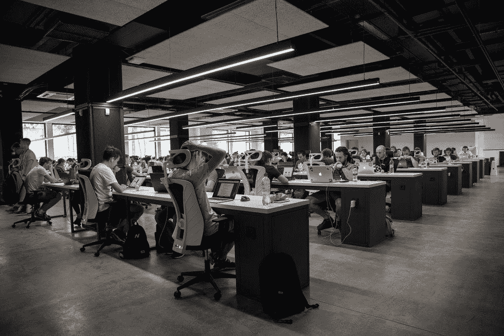
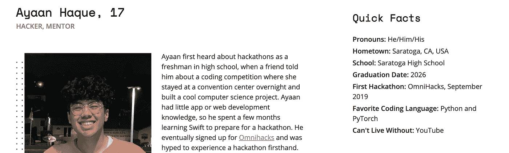
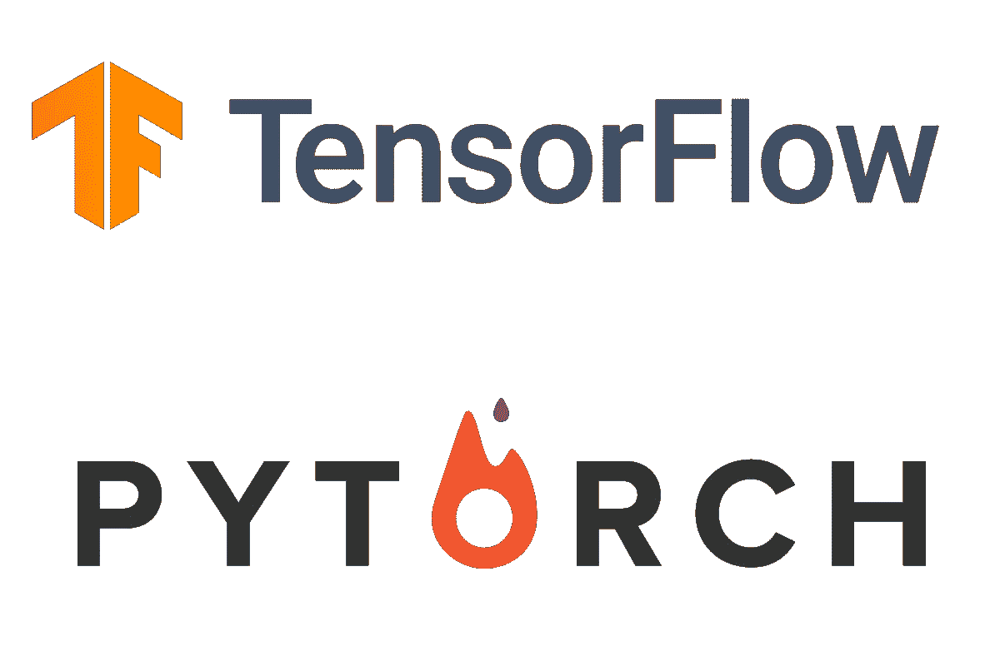
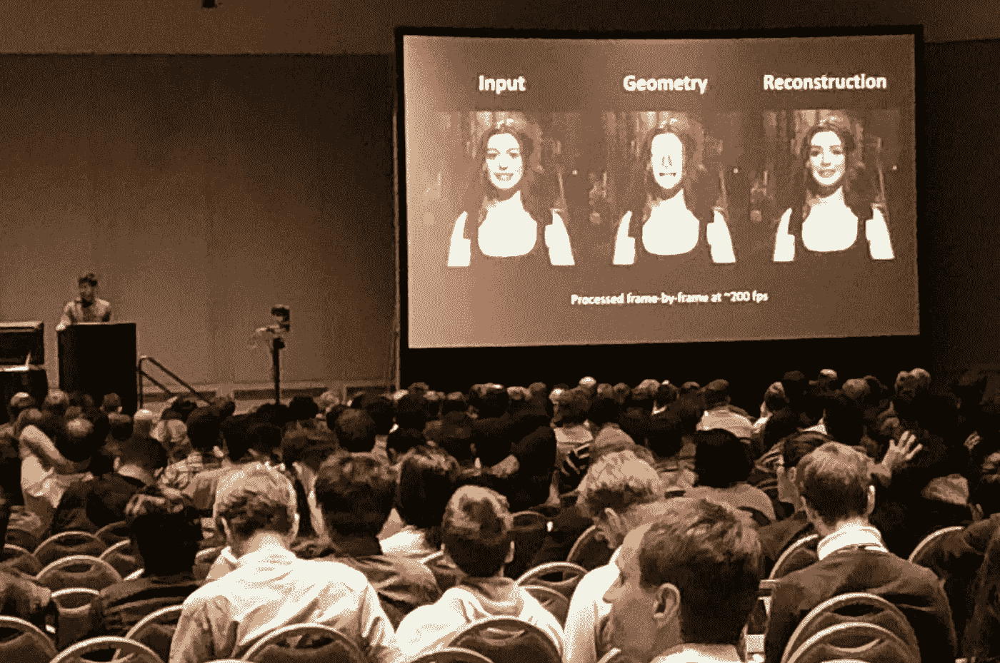
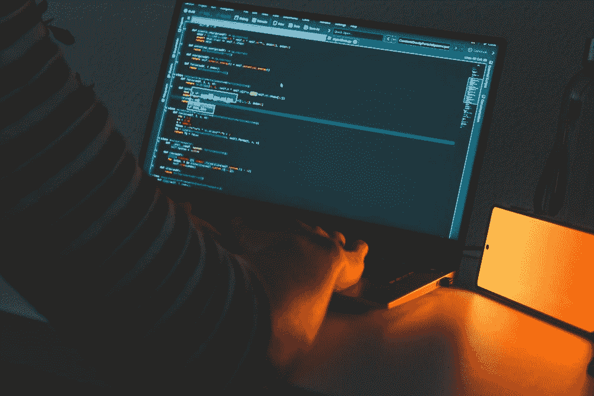
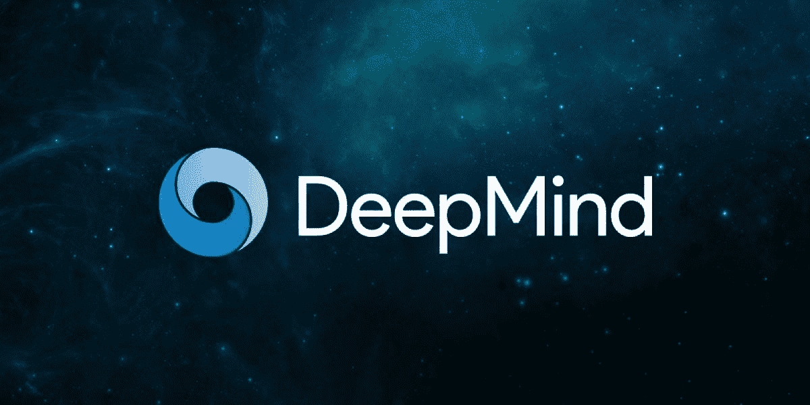

# 黑客和人工智能研究是如何联系在一起的

> 原文：<https://towardsdatascience.com/how-hacking-and-ai-research-are-related-55427bab6543?source=collection_archive---------32----------------------->

## *为什么成为一名优秀的黑客马拉松参赛者会有助于研究事业*

图片来自 Alex Kotliarskyi 在 [Unsplash](https://unsplash.com/photos/QBpZGqEMsKg)

起初，黑客马拉松和人工智能研究似乎没有什么相似之处，主要是它们都与 CS 和人工智能相关。然而，经过一年多的参与，我已经学会了使用黑客马拉松来提高我的研究技能，反之亦然(类似于多任务学习的工作方式)。虽然研究是一项真正的职业，而不是在黑客马拉松中竞争，但这两者之间有许多可移植的技能，值得强调。这两者现在基本上都成了我高中之外的生活，所以我一直在深入分析这两者是如何的相似，以及为什么我似乎如此享受这两者。

我写这篇文章的灵感来自最近的新闻。本周，宣布我入选了[大联盟黑客 2021 年 50 大黑客](https://top.mlh.io/2021)，这是黑客马拉松社区中最成功和最有影响力的黑客的荣誉。在我的[简介](https://top.mlh.io/2021/profiles/ayaan-haque)中，我被要求描述我未来想做什么，当我写关于研究的写作时，我意识到黑客马拉松教会了我多少可以转移到人工智能研究的技能。在这篇文章中，我将谈论两者之间共享的硬技能和软技能，以及为什么它们对成为一名成功的研究人员很重要。

我的黑客档案(图片由[作者](https://top.mlh.io/2021/profiles/ayaan-haque)提供)

# 硬技能

显然，从编程的角度来看，黑客马拉松和研究分享了很多硬技能。我的大部分黑客马拉松项目都是基于 AI 的，我在团队中的角色就是构建和训练 AI 模型。因此，对于使用 PyTorch 这样的框架来说，黑客马拉松是很好的实践。在黑客马拉松中，我也有更多的机会练习数据处理和其他对研究用人工智能模型编码至关重要的技能。

一个重要的区别是，对于黑客马拉松，我经常发现自己使用 Tensorflow，因为模型要简单得多，而且不一定是高性能的。在我看来，Tensorflow 对初学者更友好，当我不必编写复杂的训练循环时，Tensorflow 的工作效率更高。然而，对于研究，需要编写高级训练循环和构建复杂的模型，因此 PyTorch 提供的多功能性和技术优势使其成为我最喜欢的 ML 框架。然而，我无法给出哪个更好的最佳分类，所以请阅读[这篇文章](/pytorch-vs-tensorflow-spotting-the-difference-25c75777377b#:~:text=So%2C%20both%20TensorFlow%20and%20PyTorch,from%20which%20you%20may%20choose.)。

正在进行的关于 PyTorch 和 Tensorflow 的争论(图片来自[这里](https://www.aws.ps/pytorch-vs-tensorflow-machine-learning-frameworks-comparison/)

黑客马拉松教会我的另一项硬技能是演示和写作技能。关于黑客马拉松，一个经常被忽视的事实是，获胜的关键是写一份关于它的有效报告，并正确地展示它。该项目可以是活动中技术最先进的项目，但如果你没有恰当描绘它的演示技巧，你就不会获胜。同样，对于研究来说，你所进行的研究仅仅取决于你如何展示它。在论文中，你必须做一个适当的文献综述，解释方法和所有相关术语，并以一种可理解的方式呈现结果。由于我们必须完成的时间有限，我最近的论文实际上与其中的一些问题做了斗争。虽然评论者称赞我们方法的新颖性，但因为它不是非常清晰地呈现，所以它获得了负面的评论。黑客马拉松不仅帮助我发展了面向外行人的演示技巧，也帮助我发展了面向技术裁判的演示技巧，总体上让我成为了一名更强的研究人员。

展示你的研究是研究过程的基础(图片来自[此处](https://www.google.com/url?sa=i&url=https%3A%2F%2Fwww.computer.org%2Fpublications%2Ftech-news%2Fevents%2Fieee-cvpr-conference-on-computer-vision-and-pattern-recognition-2019-paper-presentations&psig=AOvVaw1-b_rA9mu81Kvtl6HkswkU&ust=1625549173704000&source=images&cd=vfe&ved=0CAsQjhxqFwoTCNjppumYy_ECFQAAAAAdAAAAABAD)

从硬技能的角度来看，黑客马拉松在研究方面教会我的最好的事情是人工智能如何在各种领域工作，如 NLP、机器人和音频。我第一次学习 NLP 是通过一个黑客马拉松项目，因为在一个低任务周末对代码和数据进行实验让我了解了 NLP 的基础知识，并探索了它的潜在应用。由于黑客马拉松只是一个周末，它们让你可以在一个新的领域里冒险，同时学到很多东西。上周末，我决定探索音频神经网络，在这个过程中，我阅读了许多关于人工智能音频处理的研究论文，使我能够确定这是否是我未来的潜在研究领域。黑客马拉松自由流动的特性极大地帮助了研究工作。

除了列出的这些，还有许多其他明显的硬技能是黑客马拉松和研究共享的，但这些是我认为值得注意的。然而，更重要的是黑客马拉松与研究共享的软技能。

# 软技能

我想讨论的第一个软技能是能够在压力下工作。黑客马拉松是为了产生压力而建立的。24-48 小时是非常少的，所以构建一个完整的原型应用程序需要惊人的效率和大量的快速思考。要成为一名伟大的黑客，你必须能够快速编码，构建 MVP，并快速从挫折中恢复。在研究中，也有必须满足的硬性期限。虽然会议提交可能需要 3-4 个月才能完成，但与完整的研究论文所需的工作量相比，这与黑客马拉松项目每周的工作量相当。因此，你还必须能够快速编码，如果你没有一个完全指定的深度学习装备，如何同时训练大量模型，并及时撰写论文。在我最初的几个研究项目中，进行黑客马拉松确实帮助了我进行时间管理，而且找到像黑客马拉松这样时间如此紧张的活动是罕见的，这意味着它对你的效率的影响是独特的。

黑客和研究都需要深夜编码来满足最后期限(图片来自 Unsplash 上的áRPád Czapp)

另一个重要的技能是能够从错误中恢复。不出所料，总会有失败和错误，但能够从这些错误中恢复是我从黑客马拉松中学到的一项巨大技能。因为某些参数设置不正确而能够重构错误编写的代码或重新训练模型是我学到的重要能力，它们在研究领域非常重要，因为运行适当的实验和创建可重复的代码需要很高的精度和注意力。它还教授团队合作和沟通，因为研究和黑客马拉松都需要你经常与他人合作。一个项目的工作总是由多人分担，为了成功，你必须是一个好的沟通者，并且知道你在团队中的角色。

然而，最重要的是，黑客马拉松帮助我培养了一个有创造力和创新精神的头脑。每周，黑客马拉松都迫使我制定一个对这个领域来说新颖的新项目，因为独特性是评判的一个重要标准。然而，这些想法通常不能是古怪的，但需要是对人们有帮助的真实解决方案，以及对当前解决方案的改进。同样，在人工智能研究中，每篇论文都提出了一种完成任务的新方法，通常是对以前工作的改进，对我来说幸运的是，黑客马拉松改变了我的思维方式，让我有望在未来的职业生涯中成为一名伟大的人工智能研究人员。

老实说，很多这些软技能可以在其他活动或工作中找到，但与黑客马拉松提供的硬 CS 和 AI 技能相结合，成为一名黑客肯定可以积极影响研究生涯。软技能是一个很好的补充。

# 最后的想法和我的职业规划

黑客马拉松给了我软件工程技能，一旦我进入大学，我有望在未来几年加入一个研究实验室。到目前为止，我从黑客马拉松中学到的硬技能和软技能都在我的研究生涯中帮助了我，我希望一旦我进入大学并更多地参与研究，它会继续帮助我。

我思考过的一个主要困境是，我是想去谷歌这样的研究所，去他们的人工智能或 DeepMind 实验室，还是去一所大学。看起来像谷歌或脸书这样的公司很难被雇佣，但是在计算机视觉领域，许多顶尖的突破都来自公司，我很乐意参与其中。但是，大学研究似乎与其他学科的联系更紧密，合作和影响更大，这也是需要考虑的重要因素。目前，我是斯坦福医学放射科学实验室的实习生，在那里我发表了多篇将计算机视觉技术应用于医学成像任务的论文。将我的知识应用于去噪或图像质量评估等特定任务，对其潜力和影响有了更清晰的看法，但一般计算机视觉研究所围绕的理论方法无疑吸引了我。虽然我有很多时间来决定，但我越早决定，我的职业生涯就越容易。

我梦想中的工作场所(图片来自[此处](https://www.google.com/url?sa=i&url=https%3A%2F%2Fventurebeat.com%2F2019%2F12%2F10%2Fdeepminds-dreamer-ai-uses-the-past-to-predict-the-future%2F&psig=AOvVaw01tsvR637a9WJ_zkRXxyig&ust=1625550472972000&source=images&cd=vfe&ved=0CAsQjhxqFwoTCLCFwtSdy_ECFQAAAAAdAAAAABAK)

在接下来的几年里，我想把研究范围缩小到一个领域。目前，我在两个主要领域进行研究:医学成像和普通计算机视觉。根据我在这些领域的成功以及未来的机会，我认为自己会更多地参与行业研究和通用计算机视觉，因为这更吸引我。我目前的背景和兴趣表明我更适合一般的计算机视觉领域，但医学成像仍然对我有吸引力，所以如果我了解更多关于我工作的生物学背景，我想我会比现在更感兴趣。尽管如此，我对明年的大学经历感到兴奋，并希望我继续参加黑客马拉松，同时参与研究，以便我在这两方面都继续提高。如果你们对此有任何想法或建议，请告诉我！感谢阅读。