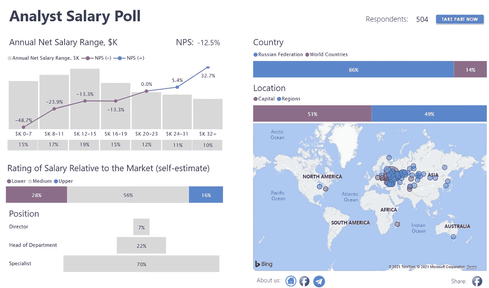
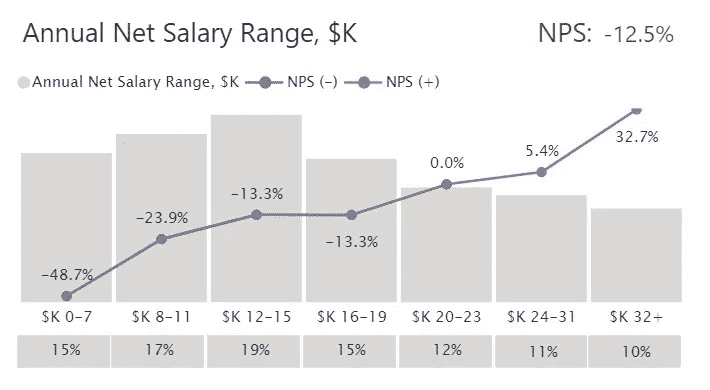
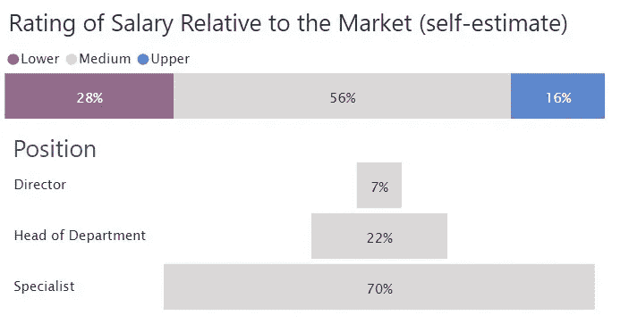
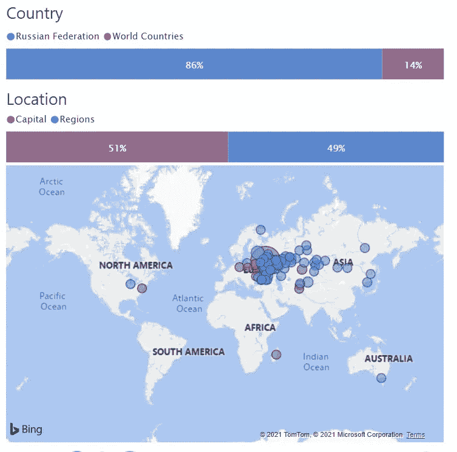
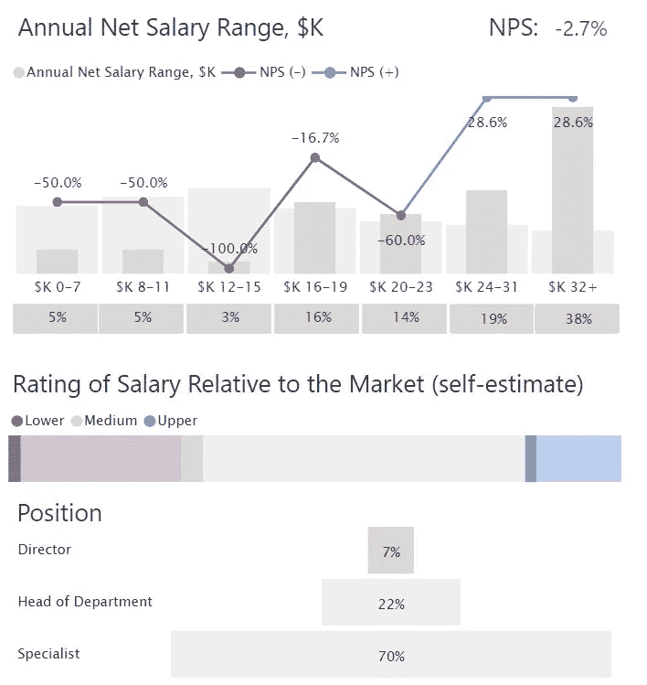
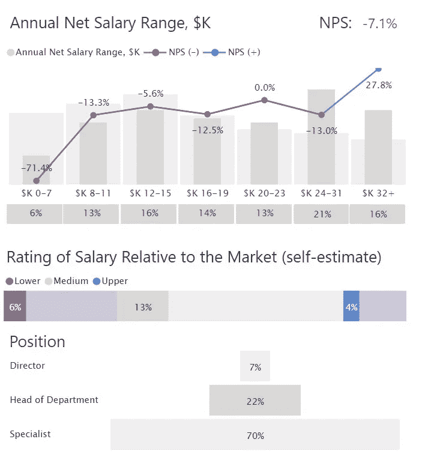
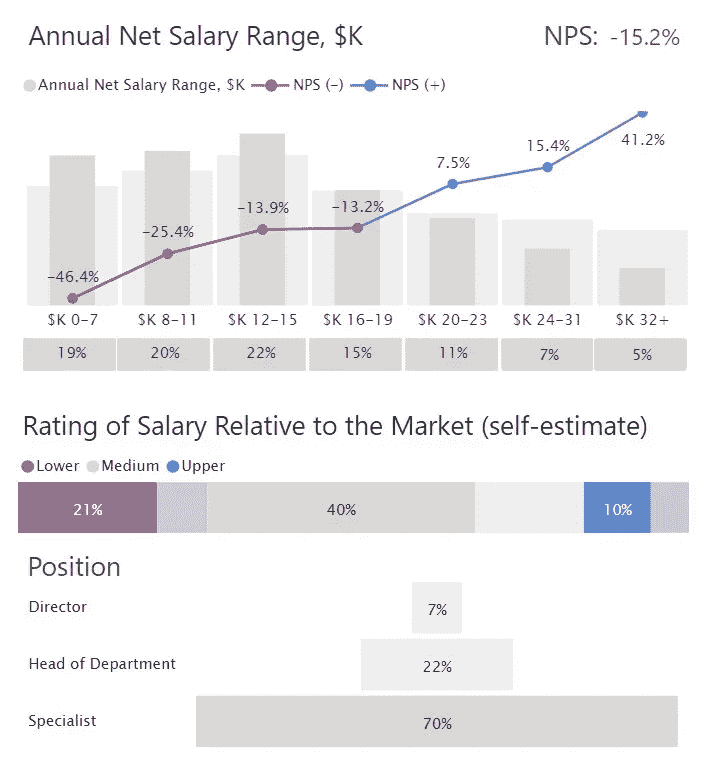
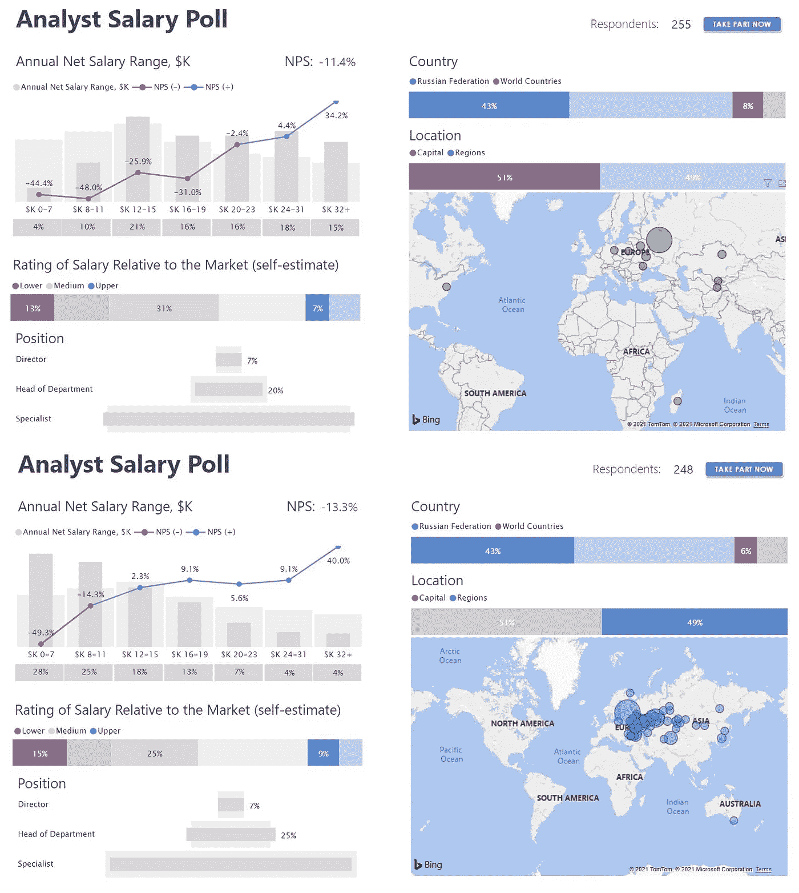

# 数据分析师有多幸福？分析师薪酬调查的可视化

> 原文：<https://towardsdatascience.com/how-happy-are-data-analysts-visualization-of-analyst-salary-poll-422c1c50a027?source=collection_archive---------43----------------------->

## 俄语分析如何估计他们的工资率

信息技术专家之间的工资差距很大。这可以用多种因素来解释:某个人的硬技能和软技能、他们在公司中的位置、所述公司的位置等等。我们使用社交网络质疑来自俄罗斯和其他国家的数据分析，然后可视化 Power BI 中获得的信息，这使我们能够发现相关数据并做出相应的结论。

在本文中，我们关注数据可视化和结果解释，而没有相关统计计算的细节。我们还演示了通过 Power BI 中的可视化工具接收数据的可能性。

**研究详情**

我们准备了一份谷歌形式的调查问卷，并提供给我们的受访者。问卷的 4 个要点包含了关于他们的年净工资范围、他们自己相对于市场的工资评估、他们在公司中的位置和公司位置的问题。大约 500 名分析师参加了投票，其中大多数来自俄罗斯和独联体国家，一些来自美国、澳大利亚和马达加斯加。结果没有预期的那么明显。

**可视化细节**

带有可视化答案的仪表板的最终版本如图 1 所示。

图一。可视化 Power BI 中接收的数据

首先，我们在堆积柱形图中展示了年净工资(图 2)。工资范围分为七组，从低于 7，000 美元到高于 32，000 美元不等。我们还计算了净推介值(NPS ),并将其添加到该图表中。

一般来说，NPS 表明消费者向他人推荐某个组织/服务的可能性有多大[1]。在这项研究中，我们使用 NPS 作为衡量薪酬水平满意度的指标。

图二。用 NPS 趋势线显示净薪金范围的堆积柱形图

以下是受访者对其相对于市场的薪资水平的估计，分为三个级别:较低、中等和较高。漏斗图说明了一个人在公司的职位(总监、部门主管、专家)。(漏斗是一个有用而简单的工具，只需点击它就可以改变每个仓位的信息)。

图 3 堆积条形图和漏斗图显示了受访者对薪资水平及其在公司中的职位的估计。

下面的地图和柱状图显示了俄罗斯联邦公民与其他国家公民之间的比例，以及居住在首都和各地区的公民之间的比例。点击这些条，我们可以看到净工资率的比较。

图 4。显示受访者位置的地图和堆积条形图

它还显示了受访者的总数和一个链接，该链接可作为参与我们调查的邀请(仪表板的上部)。

**讨论**

在当前的研究中，我们询问了大约 500 名数据分析专业人士。其中 86%在俄罗斯工作，其他人在独联体国家工作。居住在各地区和首都的人口比例几乎相等:49%对 51 %。7 %担任首席执行官，22%担任不同部门的主管，其余 70%是专家。超过一半的人(57%)认为他们的净工资在劳动力市场上处于平均水平。另外 43%的人分为认为自己净收入低于平均水平(27%)和高于平均水平(16%)的人。

在我们的研究中，三个净工资范围是被引用最多的。20%的受访者年收入在 1.3 万到 1.6 万美元之间，17 %的人年收入在 9000 到 1.2 万美元之间，16%的人年收入在 0 到 8000 美元之间。值得注意的是，只有 9%的受访者年收入超过 34，000 美元。

然而，工资在 26000-36000 美元范围内的分析人员有正的 NPS。这意味着只有 20%的受访者对自己的收入水平感到满意。

看看 CEO 们，我们发现，在我们的研究中，34%的高管年薪超过 32，000 美元。他们认为自己的薪酬与市场相关，或者高于平均水平，并且对自己的薪酬水平普遍感到满意。然而，不到 1%的人认为他们的收入低于平均水平。(据统计，收入低于 2.3 万美元的人对自己的收入不满意)。下图显示了 CEO 的薪酬水平和 NPS 系数。

图 5。首席执行官年薪净额指标

就部门主管而言，他们的工资范围比首席执行官的分布更均匀，如下图所示。其中 6 %的人年收入不到 7，000 美元，14%的人处于分布曲线的中间(16，000 美元/19，000 美元)，16 %的人年收入超过 34，000 美元。据 NPS 称，可以预见的是，只有最后一组人对自己的净收入感到满意。与此同时，13%的部门主管声称他们的净工资在市场上是足够的，6 %的人认为低于平均水平。

图 6。部门主管的年薪净额指标

专家组的结果与前两次的结果有很大不同。图 7 中的工资分布曲线显示，收入低于 7000 美元的分析师、收入在 9000-12000 美元的分析师和收入在 13000-16000 美元的分析师人数几乎相等。大概是 20%。12%的人年收入超过 24，000 美元。40%的人认为他们的净收入在平均水平之内，而 21%的人认为低于平均水平，10%的人认为高于平均水平。

NPS 的数据显示，年薪超过 2 万美元的专家中，有 23%对自己的薪酬水平感到满意。

图 7。专家年净工资指标。

比较在地区和首都工作的受访者，我们可以看到 34%的专家、25%的部门主管和 7%的首席执行官居住在地区。图 8 显示，净工资低于 7，000 美元的仅限于来自各地区的专家(占所有受访者的 28%)。有趣的是，NPS 指数显示，居住在地区的专家比居住在首都的专家对自己的薪酬更满意。地区分析师对高于 1.2 万美元的薪酬感到满意，而来自首都的同行对超过 2.4 万美元的收入感到满意。

图 8。首都和地区年净工资比较。

**结论**

我们研究的目的是发现俄罗斯联邦和独联体国家的数据分析如何估计他们的工资率。在这方面，考虑了三种不同的职位——首席执行官、部门主管和专家。一般来说，56%的受访者认为他们的工资与市场平均水平一致，28%的受访者对自己的工资不满意，因此希望赚更多的钱，而 16%的受访者认为他们的收入高于平均水平。

另一个重要的发现是，2%的首席执行官对他们的薪酬不满意，年薪不到 7，000 美元，而一些专家(4%)的年薪超过 32，000 美元，他们认为自己的收入高于平均水平。这反映了劳动力市场上 IT 专家的现状:好的 IT 专家有更高的工资，有时会超过市场上的平均水平。虽然通常会考虑多种因素，但有一些专家(不是首席执行官或部门主管)的工资可能会远远高于平均水平。

另一个普遍趋势是俄罗斯和独联体国家的资源集中化。首都和地区之间的生活水平差异很大，这项研究进一步证实了这一点。尽管地区平均净工资较低，但人们对这一比率比大都市的同行更满意，即使后者的收入更高。

所有结果都使用 Power BI 可视化。地图、条形图和漏斗图等基本的交互式工具使数据处理变得更加容易和快速。

**参考文献**

1.Reichheld，F. F. (2003 年)。你需要增加的一个数字。哈佛商业评论，81 年，46-54 页。