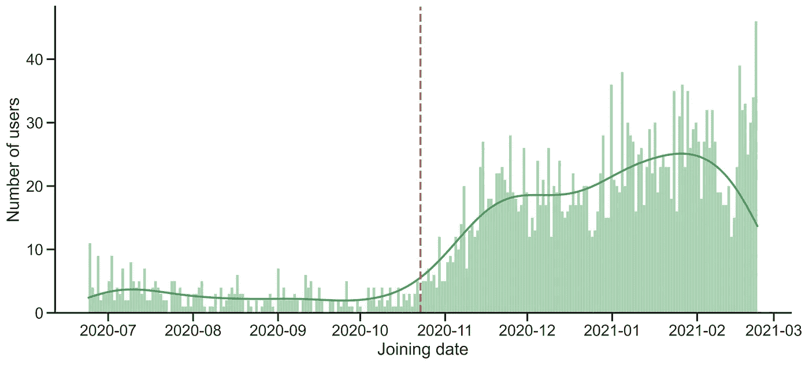
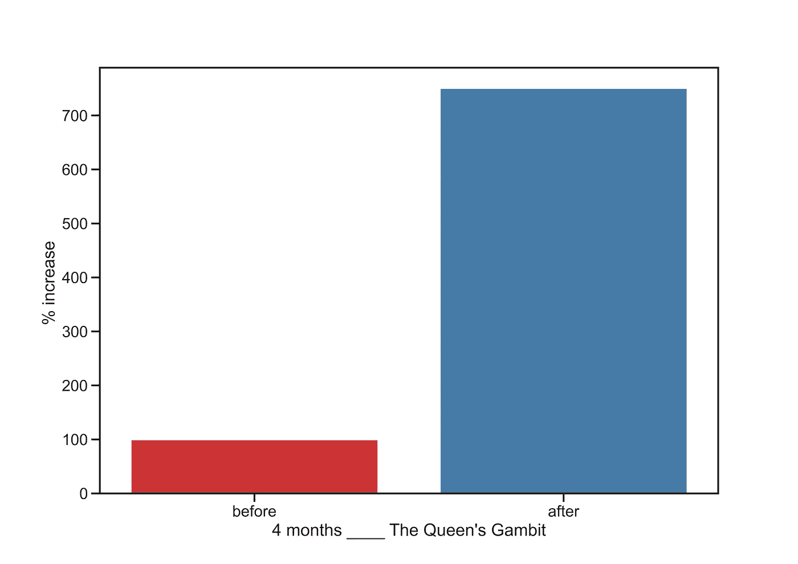
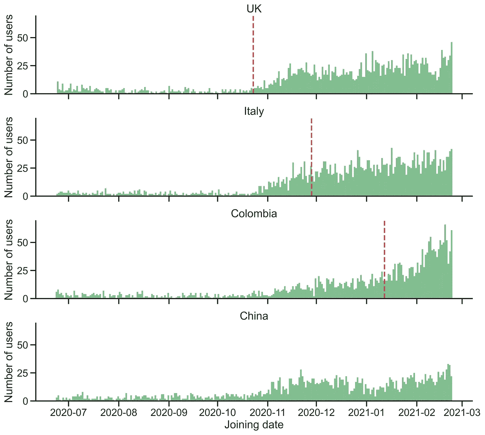
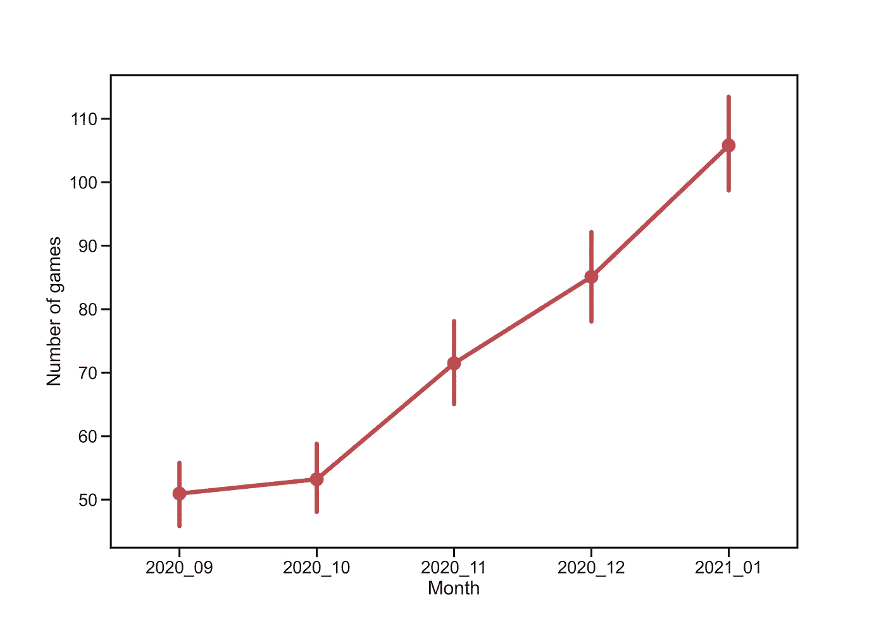
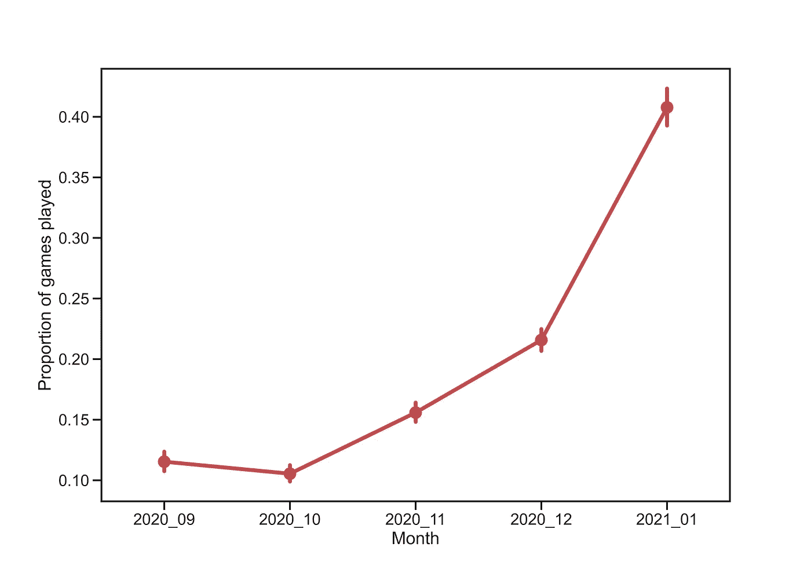
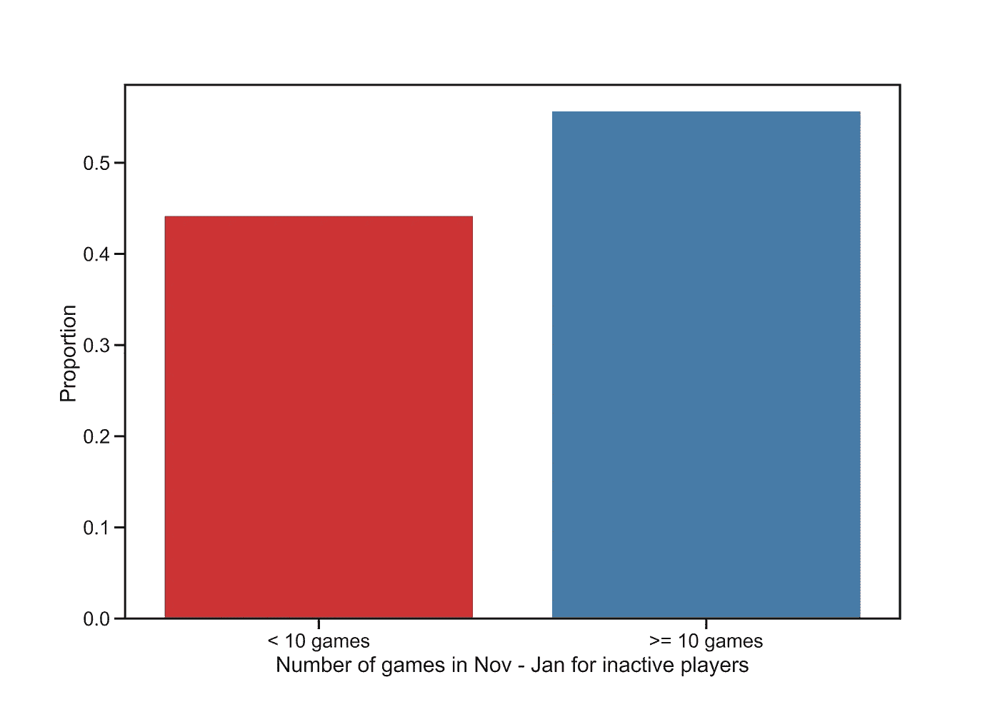

# 女王的策略如何影响了在线象棋的流行？

> 原文：<https://towardsdatascience.com/how-has-the-queens-gambit-impacted-the-popularity-of-online-chess-43594efe5a98?source=collection_archive---------17----------------------->

## [实践教程](https://towardsdatascience.com/tagged/hands-on-tutorials)

## chess.com 新老玩家分析

由[阿列克斯·福维特](https://unsplash.com/@childeye?utm_source=medium&utm_medium=referral)在 [Unsplash](https://unsplash.com?utm_source=medium&utm_medium=referral) 上拍摄的照片

**源代码:** [GitHub](https://github.com/dzhang32/chess)

# 介绍

[*女王的棋*](https://en.wikipedia.org/wiki/The_Queen%27s_Gambit_(miniseries)) 网飞秀描绘了国际象棋神童贝丝·哈蒙(Beth Harmon)与毒瘾抗争，征服了男性主导的国际象棋世界。众所周知,《女王的策略》在全球的成功引起了人们对国际象棋的兴趣。我自己也是受害者之一，重新受到启发，开始玩网上象棋。不可避免地，这已经滚雪球般变成了一种困扰，我在过去的一个月里在 T21 玩了 375 场快速游戏，并在我最近的生日收到了 4 本国际象棋书。这种国际象棋热的影响也蔓延到了我的社交圈，关于国际象棋的对话从独白变成了对话，几个朋友打开了他们有史以来第一次在线国际象棋游戏的大门。

这让我想知道还有多少人被女王的策略所感染，尤其是在线象棋的流行会如何反映这一点。我希望这可以通过下面的指标来识别。加入在线象棋网站的新玩家数量增加。
2。现有用户玩的游戏数量增加。

在这里，我试图用来自[chess.com](https://www.chess.com/)的数据来检验这些假设，这个[互联网最大的象棋社区](https://www.chessstrategyonline.com/play-chess-online)拥有超过 2800 万会员。

# 新玩家数量

《女王的策略》于 2020 年 10 月 23 日**在英国上映。为了了解这对加入在线象棋的用户数量的影响，我将使用 chess.com 的[API](https://www.chess.com/news/view/published-data-api)下载 10 月 23 日前后 4 个月内加入的英国玩家。为了节省时间(这里有> 200，000 名英国玩家，查询每个档案需要大约 0.5s)，我已经**随机选择了 5000 名英国玩家**。值得注意的是，这种方法受到在女王的策略发布后的一段时间内，用户的旗帜如何准确地反映用户的居住国的限制。**

在*女王的策略*英国发布后(用红色虚线标出)，加入 chess.com 的用户数量急剧增加。需要进一步观察才能确定，但看起来注册用户的爆炸式增长至今仍在继续。

因此，与之前相比，在《女王的策略》发布后的 4 个月内，总共有**~ 7 倍**的人加入了 chess.com！

网飞节目的上映日期因国家而异。这让我们能够探索加入 chess.com 的用户的增加是否与《女王的策略》在该特定国家的发布日期相关。基于[非官方的网飞在线全球搜索](http://unogs.com/title/80234304)，我选择了 3 个不同发布日期的国家和 1 个网飞不可用的国家:

1.  英国:2020 年 10 月 23 日
2.  意大利:2020 年 11 月 28 日
3.  哥伦比亚:2021 年 1 月 12 日
4.  中国:网飞不在

似乎还不清楚*女王的策略*的确切发布日期是否标志着每个国家加入的用户数量分别开始增加。也就是说，我们可以观察到，在哥伦比亚这个发布日期最近的国家，用户加入的峰值向更晚的日期转移。有趣的是，从 2020 年 10 月 23 日起**，所有 4 个国家加入 chess.com 的玩家数量都有所增加**。这可能是由于虚拟专用网和其他非官方方法的可用性，这些方法允许人们在居住国之外访问网飞的节目。中国在线国际象棋的增长率要低得多，而且似乎比其他国家更早达到稳定，这可能是因为那里存在更大的在线限制。

# 现有用户玩的游戏数量

尽管《女王的策略》作为一个娱乐性的电视节目受到了公众的欢迎，但它在现有的棋迷中更受欢迎。就连目前的世界冠军[芒努斯·卡尔森也为它的游戏](https://www.youtube.com/watch?v=_ZfPa-GMxMI)代言。

上面，我们探讨了加入在线象棋的新玩家的数量。在这里，我们转而关注现有用户如何通过*女王的策略*重新点燃他们对国际象棋的兴趣。为了解决这个问题，我将继续使用上面获得的 5000 名随机英国用户。为了确保这一分析不会被加入的新玩家数量的增加所混淆，我只评估了在 2020 年 9 月之前**加入的用户(即，他们在*女王的策略*发布之前已经成为 chess.com 的一部分至少一个月)。然后，在 2020 年 9 月至 2021 年 1 月的 5 个月时间里，我将获得每个用户每月玩的游戏数量。**

从 10 月份开始，每位玩家的平均游戏次数稳步上升。值得一提的是，由于这一分析没有按照时间控制(如子弹、闪电战、快速等)进行划分，这一结果有可能是因为用户转向了时间控制更快的游戏。

通过将每个用户在 5 个月内的游戏数量标准化，我调查了个人玩家是如何增加他们玩游戏的相对数量的。从 11 月到 1 月，玩家们逐渐增加了下棋的频率，这表明女王的策略已经激励现有用户玩更多的在线象棋。

甚至那些暂时离开国际象棋的人也被劝说回来。通过特别关注那些在九月或十月一场比赛都没有参加的玩家，我们可以锁定那些正在经历象棋干旱期的人群。这些玩家中超过 55%的人在 11 月到 1 月回来打了至少 10 场比赛！这表明，大多数不活跃的玩家在观看了女王的策略后，至少被赶回 chess.com 玩了几场游戏。

# 结论

《女王的策略》作为一部网飞电视节目已经在国际上取得了成功，现在已经在超过 25 个国家播出。在这里，我证明了该节目的发布导致了在线象棋受欢迎程度的飙升，其中既包括开始象棋之旅的新人，也包括受到激励重返在线象棋或更频繁地玩游戏的现有玩家。

尽管观察了《女王的策略》的发布和在线象棋统计数据之间的这些趋势，质疑这两者之间的因果关系还是很重要的。很可能仅仅看比赛并不能直接解释在线象棋受欢迎程度的整体提高；许多其他因素也可能在起作用。目前的 COVID 情况让许多人在家工作，有人认为[在线象棋已经作为一种出口获利](https://www.sportingnews.com/us/other-sports/news/how-online-chess-became-a-pandemic-coping-mechanism/5cf4mtnrrp1t1gfhq6sftghd9)。此外，国际象棋本质上是一种多人游戏，用户可以通过自己的社交网络将他们新发现的兴趣传播给其他人。最后，在所分析的时间范围内，还发生了其他国际象棋事件。例如，2020 年 5 月，chess.com 举办了第一届使用流行彩带的 [PogChamps](https://en.wikipedia.org/wiki/PogChamps) 锦标赛，这很可能扩大了人们的认识，并为在线象棋赢得了吸引力。

不管起源如何，我喜欢最近国际象棋受欢迎程度的上升。除了提醒我喜欢下棋之外，在我与下棋有关的漫步中，打哈欠的次数也明显减少了。我认为，在某种程度上，这要归功于女王的策略引发了一股国际象棋热潮，这股热潮已经蔓延到了全球，包括新老玩家。