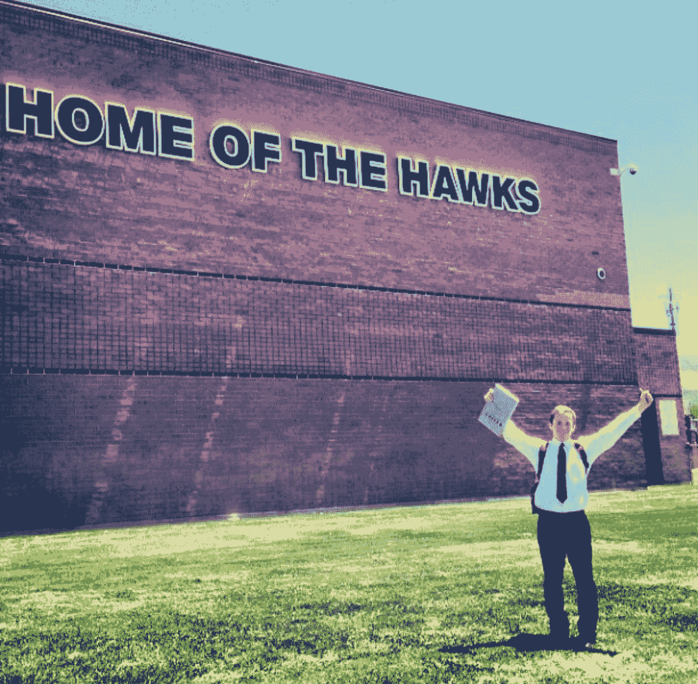
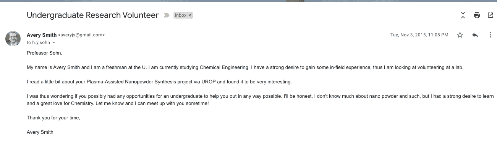
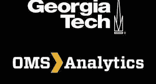
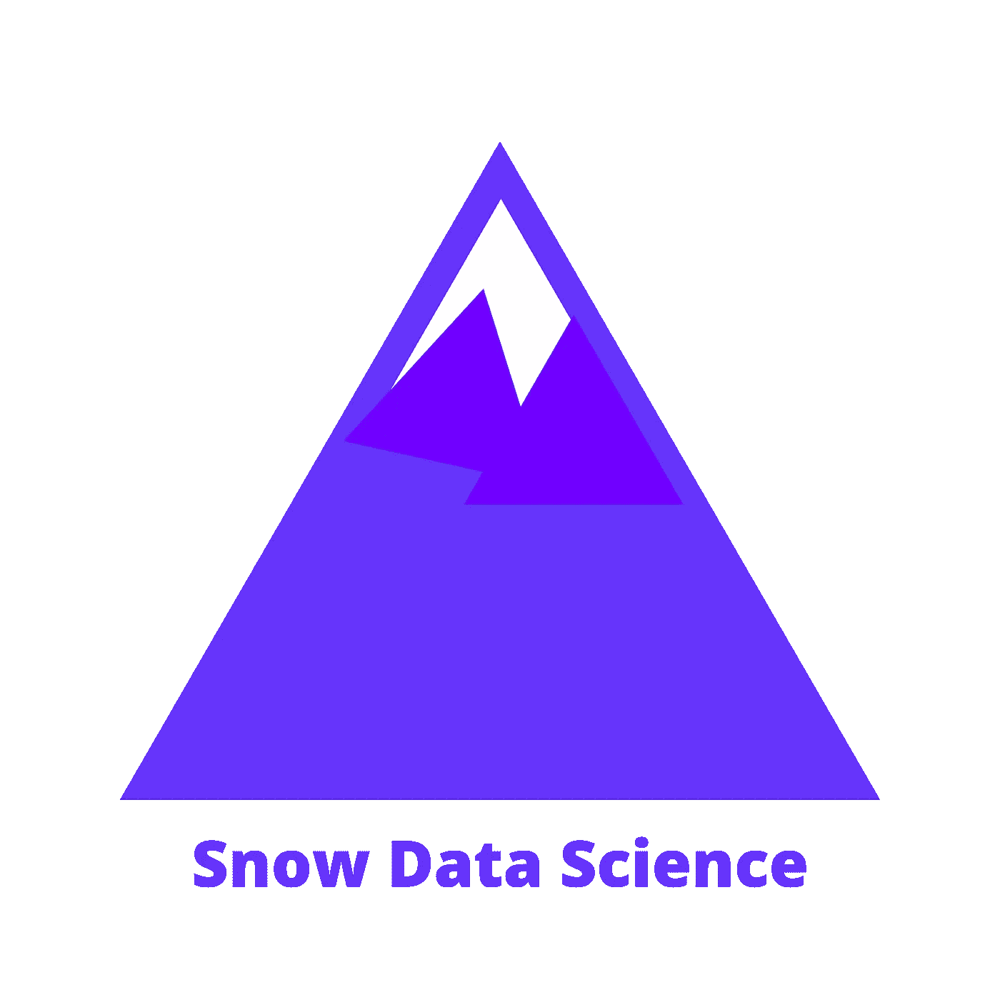

# 我是如何闯入数据科学的🚀

> 原文：<https://towardsdatascience.com/how-i-broke-into-data-science-d7dcbde912ed?source=collection_archive---------9----------------------->

## 闯入数据科学

## 👨‍🔬一名化学工程师的数据职业之旅👨‍💻

现在是 2013 年 6 月，我即将高中毕业。激动人心的时代；大四日落，毕业，毕业派对！我真的非常喜欢数学和化学；两科都拿了 AP，成绩不错。因此，我选择了化学工程作为我的专业。我对此感到兴奋，并于 2015 年在犹他大学大一开始上工程课。(*注意，我曾在耶稣基督后期圣徒教会担任了两年的传教士。*

高中最后一年的我(来自作者)

当我开始上大学的时候，我爸爸(一个炒股的家伙)曾经提到过我应该学习这个叫做“机器学习”的东西。他给我发了一个 YouTube 链接，让我观看(见下面的视频)。我不是很懂，所以我做了所有好儿子都会做的事，无视他们的爸爸！几乎忘了学过这方面的任何东西。

谷歌解释机器学习的视频

大学第一学期；如此美好的时光。我上大学课，认识新朋友，住宿舍；生活是美好的。但是，我想在“我的领域”找一份工作。我甚至不确定“我的领域”是什么，但我想在工程或科学或其他方面找份工作。

我了解到大学教授不仅教书，还做研究，并让学生在他们的实验室工作。我认为这已经足够接近“我的领域”，并决定进一步探索。我花了几个小时在网上筛选，寻找机会，找到了大约 20 位教授，他们从事某种类似工程的研究。然后，我发现了他们的邮件。我给他们发了一封冷冰冰的邮件，问他们的实验室是否有空缺。

这是我发的一封真实的邮件，这封是给孙博士的。

给职业的冷邮件(来自作者)

二十个人中只有三个人回答。一个说他们满了。一个是数据分析职位，但他们告诉我我没有足够的经验(现在非常讽刺)。第三个是冶金工程教授孙博士，他给我回了邮件，要我的高中成绩单。记住，这是我大学的第二个月，所以我还没有任何大学成绩。我回答说我找不到我的高中成绩单，但这里有一些成绩单和过去老师的推荐信。我猜这对他来说已经足够了，因为他奇怪地回答道，“*艾弗里，你的学习成绩很好，我有兴趣让你开始实习。*“不久后，我开始了《我的领域》的实习。

一个博士后在管理实验室，他是我的老板。他告诉我，我将有 3 个月没有工资，直到我接受培训，然后开始赚钱。我只是对获得经验感到兴奋。在接下来的 3 个月里，我每周花大约 5-10 个小时进行实验，采集样本，并免费打扫铁开发实验室。这项研究旨在开发一种更智能、更坚固的铁材料。

经过三个月的训练，我终于得到了第一份薪水，这让我兴奋不已。我给经理发了一封电子邮件，询问我如何才能把直接存款的事情都办好。他回复并建议我从夏天开始向大学申请研究基金。那是二月？我很困惑，我应该得到报酬。他基本上继续解释说，实验室不会支付我，如果我想得到报酬，我必须从普通大学获得资金，从现在开始 4 个月。

我感到沮丧和失望。

随机地，我遇到了我年轻时的一个老童子军领队，我们聊起了我正在做的事情。我解释了整个实验室的情况，他说:“你知道我在校园里经营一个实验室吧？”我很震惊。我不知道他是做什么的。原来他帮忙经营了一家生物工程系的子公司。我参加了这家公司的面试，最终得到了一份实验室技术员的工作，每小时 12 美元。我很兴奋。每小时 12 美元对我来说是世界上最大的一笔钱。我要继续做科学家！

这家公司叫做 Vaporsens，他们制造了令人难以置信的化学传感器，基本上是为了取代狗的鼻子。他们能嗅出毒品，能嗅出炸弹。他们太不可思议了。公司很小，包括我在内只有 12 名员工。但是他们有一个全职的数据科学家。这位数据科学家解释说，他的工作是创建算法，这些算法接收传感器信号，并将其转换为存在什么化学物质以及存在多少化学物质。听起来很酷也很难。

解释 Vaporsens 技术的视频

我大部分时间都呆在实验室里(想想试管和烧杯)。我制作了传感器，并用它们进行实验。我在帮助回答一些问题，比如，“这个传感器能找到这个炸弹吗？”或者，“这个传感器对这种化学物质有什么反应？”我生成了大量数据供数据科学家查看。这很有趣，也很新鲜，所以我很喜欢。

但是在我开始工作大约两个月后，这位数据科学家辞职了。他在东部找到了一份收入更高的工作。作为一家公司，我们花了接下来的六个月时间试图寻找一名新的数据科学家。它们价格昂贵，需求量大，而且很难找到。

与此同时，我继续进行实验并生成数据。数据越积越多。我们一直在说，“等不及让数据人员看看这个了”。我仍然在修我的核心化学工程课，比如过程、热力学和有机化学。你猜怎么着？我讨厌他们。我对它们没那么感兴趣。在我的脑海里，我一直在想我是否应该换专业，但不确定该换什么。

2016 年末的一天，我厌倦了等待这个新的数据人来拯救我们的数据灾难。我厌倦了生成数据，却得不到洞察力。在这一点上，我已经上过一些编程和数学课，我想，“我可能会想出一些程序来做一些分析。”

所以我打开电脑，在工作的“空闲”时间，在实验间隙，我开始编程。当时我在用 MATLAB，最后我做了一个工具，对数据进行一些自动化分析。我给我老板看了，他很喜欢。他鼓励我继续开发它。我很兴奋，因为这个工具每天为我节省了大约一个小时的工作量。

我花了几个小时阅读复杂的数学课本，看了一个又一个 YouTube 视频，读了我能找到的每一个数据博客。我把每一秒空闲时间都用来学习数据科学和机器学习。

我着迷了，上瘾了，坠入了爱河。

我再也没有回头。三个月后，我停止了实验室工作，专注于 Vaporsens 的数据。

但我仍然没有这个头衔。我是做数据科学的，不是数据科学家。

*我想在这里暂停一下，强调一下，学习如何做数据科学真的让我受益匪浅。在 Vaporsens 期间，我学到了大部分关于数据科学的知识。我边走边想。这就是目标，把你的脚放在门里，然后付钱去学习。* ***不付费学习，付费学习！***

我为 Vaporsens 的所有项目做了分析，其中包括一些相当大的组织和名称。大多数项目工作涉及数据自动化、数据清理、数据可视化，当然还有机器学习。我们运行了许多分类算法以及一些回归模型。

我最终在 Vaporsens 做了大约一年半的数据科学，然后停下来与化学工程系的一位教授一起做应用数据科学研究。我们设计了一种算法，帮助工厂知道什么时候出了问题，以及如何修复它。

此时，我的简历上已经有了 Vaporsens 和数据研究。我很幸运，在优化团队的研究部门获得了巨头埃克森美孚公司的实习机会。我在那里度过了 2018 年夏天，处理数据科学问题，并收到了超过六位数的全职报价。我甚至创建了一个算法的原型，最终得到了十亿，是的，十亿美元的评估。

我整个高三都在兴奋地回到埃克森美孚全职工作。但为了支付账单，我回到 Vaporsens 继续领导数据计划。毕业后，我回到埃克森美孚，在那里我花了两年时间为公司解决与数据相关的问题。我做了很多回归分析，研究了一些有趣的供应预测问题，甚至制作了一个仪表板来监控公司的差旅支出。

在全职工作的同时，我利用晚上和周末的时间兼职做数据项目，并获得了佐治亚理工学院在线数据分析的硕士学位。

乔治亚理工学院的在线分析硕士

在埃克森，我不喜欢公司文化，也不喜欢我被分配的项目。当我的客户名单增长到一定程度时，我意识到我可以经营自己的分析公司赚同样多的钱。于是 2021 年初一辞职，开始了[雪数据学](https://www.snowdatascience.org)。

Snow 数据科学徽标

那么，这个故事中的哪些原则帮助我走到了今天？

N **袅一:**编造自己的经历。我不是让你对你以前的经历撒谎。恰恰相反，我是在告诉你自己去创造。不要等待它发生在你身上。如果我不愿意免费工作三个月，我永远不会成为 Vaporsens 的实验室技术员。我没有资格，也没有经验。免费工作 3 个月创造了经验，也让我有了工作机会。我在 Vaporsens 做了同样的事情，我没有资格成为“数据人”，但我用自己的时间和主动性创造了第一个工具，向我的老板证明了我可以交付结果。如果你没有这方面的经验，那就用你自己的时间去做，并建立一些可以证明你的成果的东西。在我们建立投资组合时，这将是本课程的关键。

第二:人脉才是王道。老实说，Vaporsens 甚至没有实验室技术员的职位描述。我刚遇到一个老朋友，他看到了我的热情和技能，认为这可能是一个很好的搭配。我将永远感激他，感激我努力重新联系他。人际关系网将打开你甚至不知道存在的大门。

第三:承担可计算的风险:在我实习的三个月里没有挣到任何钱是有风险的。在 Vaporsens 开发一个我的老板没有要求我做的工具是有风险的。独自出去创业是有风险的。信不信由你，现在我不那么喜欢冒险了。然而，我一生中所冒的大多数风险都以这样或那样的方式解决了。我不认为我们中的许多人在临终前会后悔我们所冒的风险，而是那些我们没有冒的风险困扰着我们。

这就是我的故事，关于我如何成为一名数据科学家以及帮助我成功的三个原则。我知道这三个原则也会对你的数据职业生涯有所帮助。

如果您对您的数据职业或进入该领域有任何问题，您可以随时来我的免费开放办公时间，在那里您可以问我任何您想问的问题。我每周二东部时间晚上 8 点在 LinkedIn/YouTube 上主持他们。更新见[https://www.datacareerjumpstart.com/AskAveryRegister](https://www.datacareerjumpstart.com/AskAveryRegister)。

此外，如果你想要一个更结构化的途径和课程来进入数据科学，你可以看看我在 2021 年秋季推出的名为数据职业快速起步([https://www.datacareerjumpstart.com](https://www.datacareerjumpstart.com))的训练营。

另外，如果你想看视频，我制作了一个 [YouTube 视频](https://www.youtube.com/watch?v=IfYN51kDHJ4)来讲述这个故事。

祝你好运！希望你找到自己的路！