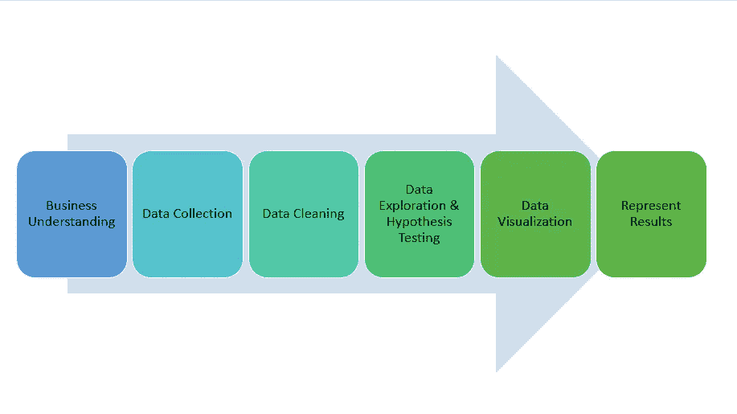
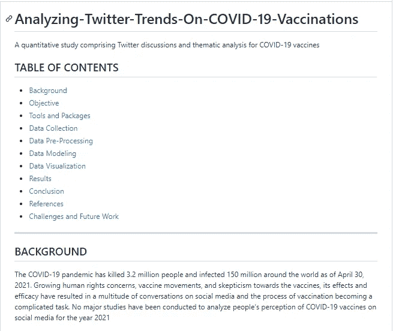

# 我如何在一周内构建端到端数据科学项目

> 原文：<https://towardsdatascience.com/how-i-build-end-to-end-data-science-projects-in-a-week-69c10ca145ee?source=collection_archive---------4----------------------->

## “让我们谈谈你迄今为止参与的项目”

来源: [Unsplash](https://unsplash.com/photos/jaHvDkELPKU)

在不断扩大的数据科学领域，领先和生存的竞争比以往任何时候都更加激烈。世界各地正在进行的尖端项目只会让数据科学家难以跟上。

无论你是在学校为一份出色的简历或个人资料而工作，还是在职业生涯中期或出于兴趣而重塑自我；不管项目的目的是什么，你选择的问题陈述会对项目及其进度产生影响。

在我读研期间，每上一堂新课，我都会兴奋地着手处理新的数据问题陈述，最大的挑战是完成这些项目。在我研究生项目的前两个学期，我会在一个月内确定 36 个项目，开始其中的 12 个，但一个也没完成。

但是，为什么从事数据科学项目如此重要？

如果你现在在学校，你可能正在为你上的每一堂课做一个项目。如果你是一名在职专业人士，你不会担心找工作的困难——为什么要关心数据科学项目呢？

*   **你在学校:**你的许多同学会提到你在班上做过的同一个项目，在你意识到这一点之前，已经有 38 份简历看起来像你的
*   **POV 你是一名在职的专业人士:**数据科学是不断发展的，因为企业面临的问题也在不断发展，这使得即使是专业人士也必须与数据科学的最新和最棒的技术保持同步(有什么比一个周末一个周末的项目来保持更新更好的呢)

为数据科学项目的重要性设定了前提后，下面是一种方法(经过尝试、测试和成功)来处理数据科学项目，而不会无法完成它们。

# 1.遵循 3 步流程

1.  **确定数据利基**
    数据科学项目可以包括一系列技能，如数据探索、数据可视化、时序预测、Tableau 仪表盘或聚类和分类
2.  如果你对一个商业领域充满热情，那么就为这个行业做问题陈述，或者为每个行业创建一个平衡的项目(这在求职时对你的简历特别有用。你可以根据你申请的职位和公司来切换你的项目。从金融、医疗保健、体育、媒体和通信、软件和 IT 服务或其他行业中进行选择
3.  **设定目标**
    你想从这个项目中实现什么？

# 2.确定项目的类型

对我来说，一旦我确定了数据科学生命周期中我想亲自学习的部分和业务领域，我就可以确定我的流程是什么样的:

1.  ***结果已知:*** 你知道预期的结果，应用什么数据模型
2.  ***分析决定接下来的步骤:*** 处理随机数据集，执行数据分析，并从数据中揭示隐含的洞察力

其他类型的项目:

1.  ***描述性分析*** ( *销售团队希望根据客户、性别、年龄、地域、地区、市场等人口统计数据来查看销售额)*
2.  ***预测分析*** ( *使用客户人口统计数据，销售团队希望预测店内与网上的购买行为)*
3.  ***规定性分析*** ( *确定最佳销售和营销策略——什么类型的产品搭配得好，定价和折扣策略，以促进销售*)
4.  ***情感分析*** ( *可包括客户支持分析或客户反馈分析，以确定客户对产品/品牌的亲和力*)
5.  ***检测项目*** ( *检测产品销售异常*)
6.  ***深度学习或神经网络(*** *预测下一年 x 种产品在每个不同商店的销售*
7.  ***聚类和分类*** ( *什么客户最有可能或不太可能购买某个产品 X* )

一年前，我将我的项目分为以上几类，并确定了其后的复杂程度。话虽如此，今天进行的项目应该反映你的思维过程，而不是局限于上述任何一种。

# 3.制定行动计划

现在你已经锁定了我想做的项目类型，我会为接下来的几天做这个项目制定一个行动计划。这让我的生活变得多么轻松，我怎么强调都不为过。

*完全披露:*下面的步骤看起来有点费力，但如果是时候为你的个人资料或 GitHub 记录你的项目，你会感谢我的。

1.  **收集需求** —哪种代码编辑器最适合(Python、R、Visual Studio)，确定您需要的数据源和/或数据集成(API、开发人员权限)
2.  **预测项目风险** —抛开范围蔓延的行话，预测技能&资源等挑战，业务案例变得过时、延迟或难以获得知识产权(研究供参考)
3.  **记录假设和约束** —我们生活在不完美的世界中。每个项目都有自己的一套假设、约束和依赖
4.  **所需工具** —在所需版本(Python 3.0 或以上等)中设置环境。)，更新并安装所需的软件包和库

随着时间的推移，我会从在纸上可视化项目开始，并建立一个包含我的目标、要求、预期结果的愿景板，我意识到-数据科学项目最好在工作时受到检查，就像你向高管提交项目提案并遵循既定路径一样。

# 4.以数据科学项目生命周期发誓

来源:作者

1.  **设定研究目标:**为需要解决的问题确定目标
2.  **提出假设:**提出相关问题，并通过分析数据，就你定义的问题提出假设
3.  **收集和准备数据:**收集和搜集项目所需的数据，修复数据中的不一致，如处理缺失值和高度多重共线性
4.  **测试假设** —选择重要的变量并构建更有意义的变量来证明你开始的假设(训练和测试机器学习模型)
5.  **分析您的结果** —评估模型的性能并使用它们进行预测
6.  完善假设(如果需要)
7.  **展示结果** —使用图表、交互式可视化和报告将调查结果传达给合适的渠道

# 5.记录每天的进展

在每一步之后，你都要回到愿景板上去验证，那里有你成功的时刻。

当你在做项目的时候，记录你的项目也使得在你的技术档案上展示更容易 GitHub 的 READ.me 页面或你的投资组合的项目描述，生活变得容易！

一段时间以前，我按照上面的所有步骤做了一个项目，这就是现在项目描述的样子！该项目链接如下:[https://github . com/rashidesai 24/Analyzing-Twitter-Trends-On-新冠肺炎-疫苗接种](https://github.com/rashidesai24/Analyzing-Twitter-Trends-On-COVID-19-Vaccinations)

你可以像我一样在你的目标计划中做笔记，或者使用项目管理工具，比如 JIRA、阿特拉斯、阿萨纳，或者简单的谷歌文档。

这就是我的博客的结尾。感谢您的阅读！请在评论中让我知道你目前正在从事什么数据科学项目，以及你是否也在遵循你的项目流程！

如果你喜欢阅读这样的故事，并想支持我成为一名作家，可以考虑使用[这个链接](https://rashidesai2424.medium.com/membership)注册成为一名媒体会员(我可以赚取一小笔佣金，不需要你额外付费！)

数据帐篷快乐！

Rashi 是一名来自芝加哥的数据奇才，他喜欢将数据可视化，并创造富有洞察力的故事来传达商业见解。她是一名全职的医疗保健数据分析师，在周末喝一杯热巧克力，写关于数据的博客……