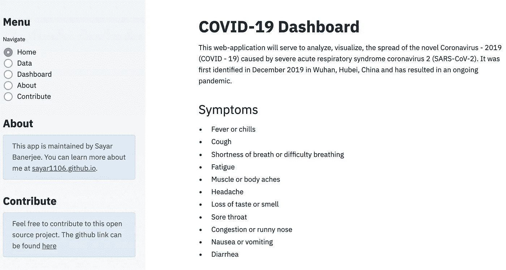
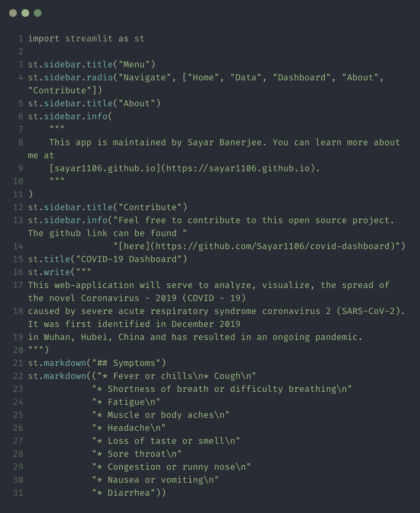
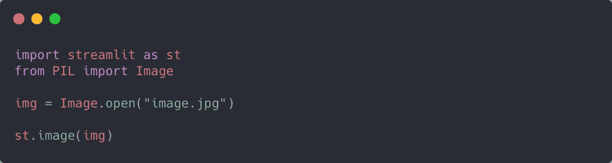
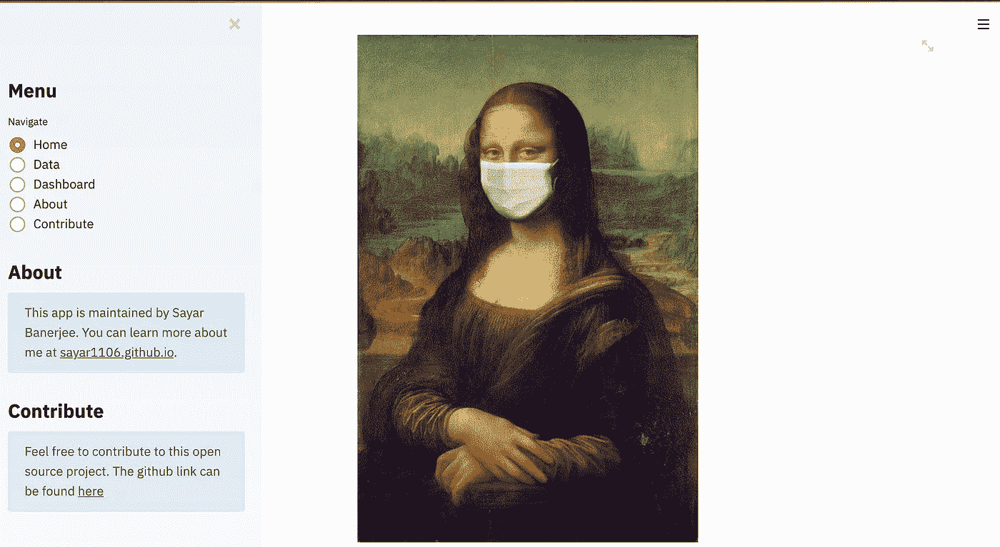
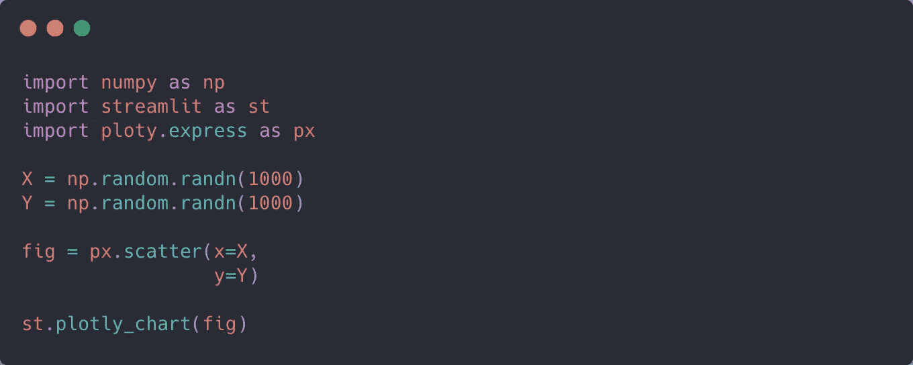
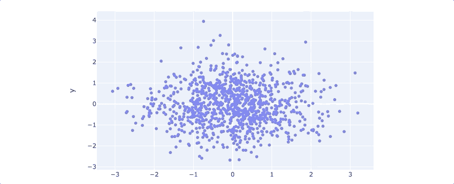

# 我如何用 Python 在两个周末构建了一个冠状病毒仪表板

> 原文：<https://towardsdatascience.com/how-i-built-a-coronavirus-dashboard-over-2-weekends-using-python-1e01339b4fa9?source=collection_archive---------19----------------------->

## 提示:我使用了 Streamlit

[粘土堤](https://unsplash.com/@claybanks?utm_source=medium&utm_medium=referral)在 [Unsplash](https://unsplash.com?utm_source=medium&utm_medium=referral) 上拍摄的照片

> 我们相信上帝；所有其他人必须带来数据——威廉·爱德华兹·德明

## 概观

在下面的文章中，我将演示如何使用 Streamlit 创建漂亮的数据 web 应用程序。

Streamlit 是一个 Python 库，用于在没有任何前端语言/框架知识的情况下构建快速 web 应用程序。该项目旨在帮助数据科学从业者轻松展示他们的数据科学项目。

## 数据

用于构建仪表板的数据来自约翰霍普金斯大学在 Github 上的新冠肺炎知识库。

## 结构

如上所述，Streamlit 为构建前端应用程序提供了极大的便利。例如，要创建这样的登录页面:

您需要做的就是编写下面这段代码:

所有 Streamlit 应用程序都可以使用本机 CLI 运行。假设您有一个使用 Streamlit 的名为`app.py`的脚本。您可以在终端上使用以下命令运行它:

我们可以看到 Streamlit 库有许多内置的方法，可以显示文本、解析标记语言样式和构建 UI 小部件。因此，它能够为您的 web 应用程序无缝地创建布局。

例如，`st.radio`方法允许我们创建用于与用户交互的单选按钮。您可以将可供选择的值列表作为参数传递给该方法。

与`st.radio`类似，可以使用多种方法在 Streamlit 上创建小部件。其中一些是:

*   `st.button`
*   `st.checkbox`
*   `st.slider`
*   `st.selectbox`

请注意，`st.sidebar`方法可以用来设计侧边栏，方法与应用程序主体相同。

## 上传图像

与所有其他功能一样，Streamlit 使用户能够轻松嵌入图像:

为了说明这一点，我在网上找到了一张蒙娜丽莎戴着面具的照片，我把它用在了我的网络应用程序的主页上:

Web 应用主页

## 显示数据帧

根据[文档](https://docs.streamlit.io/en/stable/api.html#display-text),`st.write`属性是 Streamlit 的“瑞士军刀”,因为它以不同的方式处理不同的对象。

在前面的代码片段中，我们使用了`st.write`方法来编写一些文本。这一次，我们将使用它来显示我们的数据。

在这种情况下，该方法为我们查看数据提供了以下漂亮的输出:

## 显示图表

Streamlit 与 Python 中大多数流行的数据可视化库的互操作性使得显示可视化信息变得非常容易。

例如，使用以下代码行，您可以在 Streamlit 上绘制 Plotly 图形:

和`st.plotly_chart`一样，Streamlit 也有通过其他图形库如`st.pyplot`、`st.altair_chart`、`st.vega_lite_chart`、`st.bokeh_chart`等创建图表的方法。

因此，您可以看到利用 Streamlit 强大的 API 和构建 web 应用程序来展示您的数据科学项目是多么容易。

在 2021 年，人们不需要知道复杂的前端库来创建 web 应用程序。我怀疑 Streamlit 和其他类似的应用程序在未来几年只会越来越受欢迎。

我希望你喜欢这篇文章！😃下次见。✋

## 链接:

 [## sayar 1106/covid-仪表板

### 一个冠状病毒仪表板，使用 Streamlit 作为主要 UI 引擎来实时更新信息。数据来源是…

github.com](https://github.com/Sayar1106/covid-dashboard) 

## 参考资料:

 [## API 参考- Streamlit 0.78.0 文档

### Streamlit 使您可以轻松地可视化、变异和共享数据。API 参考按活动类型组织…

docs.streamlit.io](https://docs.streamlit.io/en/stable/api.html)  [## plotly - 4.14.3 文档的 Python API 参考

### 这是 plotly 的 API 的参考。另请参见 plotly 的文档网站。

plotly.com](https://plotly.com/python-api-reference/)