# 我如何为 AWS 数据湖构建数据发现 API

> 原文：<https://towardsdatascience.com/how-i-built-a-data-discovery-api-for-aws-data-lake-5d2813f794bf?source=collection_archive---------15----------------------->

## 这个简单的 FastAPI 服务将帮助您在数据湖中找到数据


照片由 [nine koepfer](https://unsplash.com/@enka80?utm_source=medium&utm_medium=referral) 在 [Unsplash](https://unsplash.com?utm_source=medium&utm_medium=referral) | [品牌内容披露](https://www.annageller.com/disclosure)上拍摄

阿塔湖提供了无数的好处。它们是数据不可知的，不需要你预先定义一个模式。但是，如果没有合适的结构，找到您需要的数据可能会很困难。在本文中，我们将通过创建一个 FastAPI 抽象来解决这个问题，它允许我们查询 AWS Glue 元数据目录。

**目录**

[为什么 FastAPI 用于数据发现服务？](#0d4d)
[我们如何开始？](#f107)
[怎么才能把这个翻译成 Python 代码？](#1d89)
[实现:FastAPI MVP](#aac7)
[如何规模化服务这个 API？](#a8c9)
∘[AWS lambda](#f991)
∘[API 网关](#0715)
∘ [让 API 安全可追踪](#dacf)
[我们如何监控我们的数据发现服务？](#b746)
结论

# 为什么 FastAPI 用于数据发现服务？

如果我们将它实现为一个 Python 包，我们会假设每个人都知道足够多的 Python 来使用它。但是，您的公司可能有其他开发人员(Java、C#、JavaScript、Go 等)需要访问数据湖中的数据。通过为数据发现构建一个 REST-ful 服务，你为每个人提供了一个**与编程语言无关的**接口。这种 **API 优先**的方法还有进一步的**好处**:

*   如果您后来决定为业务用户构建一个 **UI** ，您的任务将变得容易得多，因为您已经有了一个以 JSON 形式提供数据的 REST API。
*   您可以在一个**单一服务**中组合用于此目的的所有功能。
*   如果您需要添加新的方法或更改现有的方法，您可以通过创建一个**新的 API 版本**(比如说，`api_url/v3`)来更容易地部署**更改**，而不会破坏任何依赖于当前版本的工作负载。
*   您可以**扩展功能**以包括实时数据流、非结构化数据，并允许查询访问日志以确定哪些数据最常被哪些用户使用。

# 我们如何开始？

我们可以从列出所有可能对数据发现有用的方法开始:

*   列出所有数据库或**模式**，
*   列出特定模式的所有**表**,
*   过滤带有特定**前缀**或**后缀**的表名，
*   对表名进行**全文搜索**(比如，与`orders`或`customers`有关的所有表)，
*   对表注释进行**全文搜索**(例如，如果我们想找到任何与*物流*相关的栏目，
*   显示一个**完整的表定义** ( *所有列、数据类型和列注释*)，
*   显示特定表的**分区**，
*   在特定分区下显示来自 S3 的所有文件，
*   显示带有特定**注释**的所有列，
*   显示包含特定**列名**的所有表格，
*   最后，数据发现的最佳方式是**查看整个表的前 X 行**。

# 我们如何将这些翻译成 Python 代码呢？

我们有三个选择:要么使用低级别的 AWS SDKs，在 Athena 的`information_schema`上进行查询，要么利用`awswrangler`。最后，我们可以将它们结合起来，以满足上一节的要求。

#1.要列出所有数据库(*即模式*)和表格，我们可以使用 **awswrangler** 包，尤其是模块`wr.catalog`。

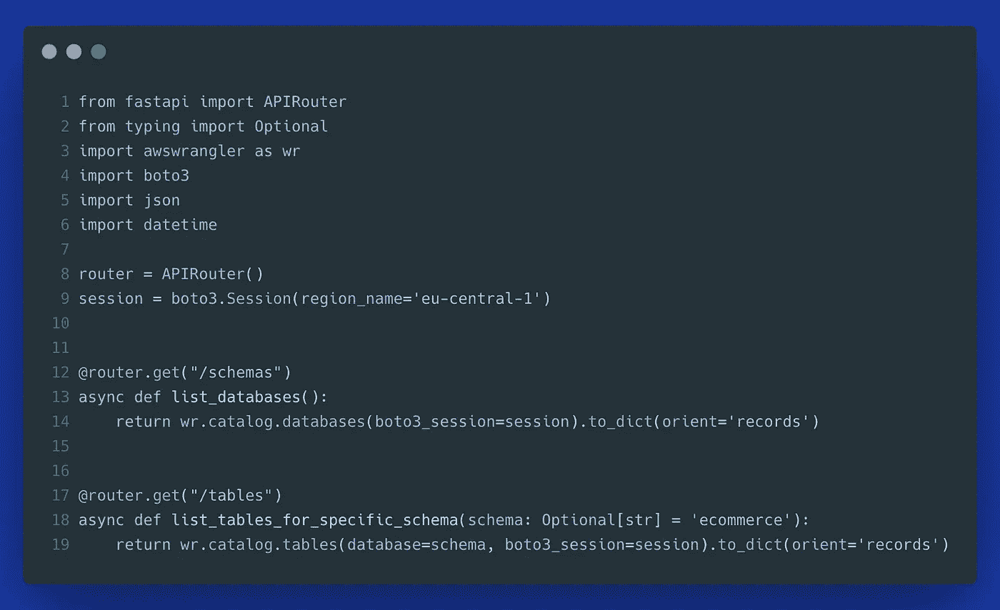

作者图片

#2.要过滤带有特定**前缀**或**后缀**的表名，我们也可以使用`wr.catalog.tables`。检索**表定义**并对这些定义进行**全文搜索**也是如此:

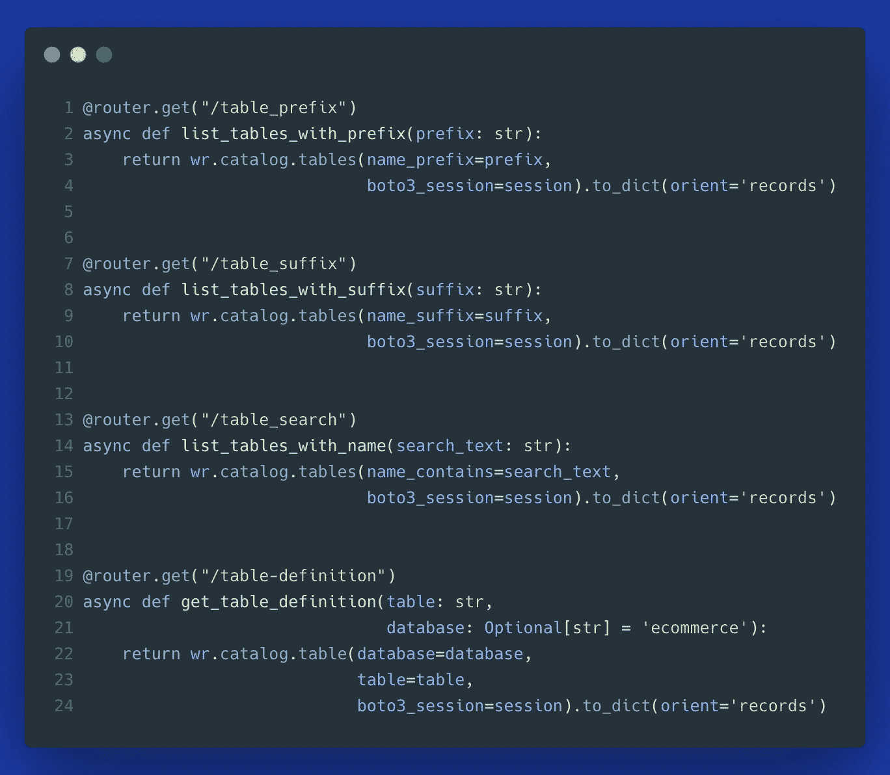

作者图片

#3.列出特定表的所有**分区**:

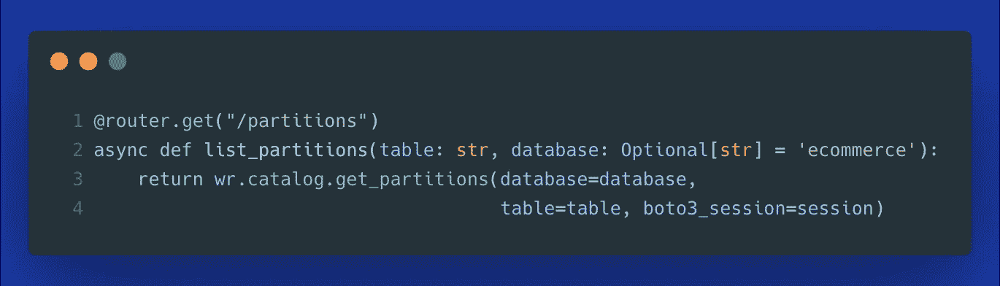

作者图片

#4.显示表格的 DDL:

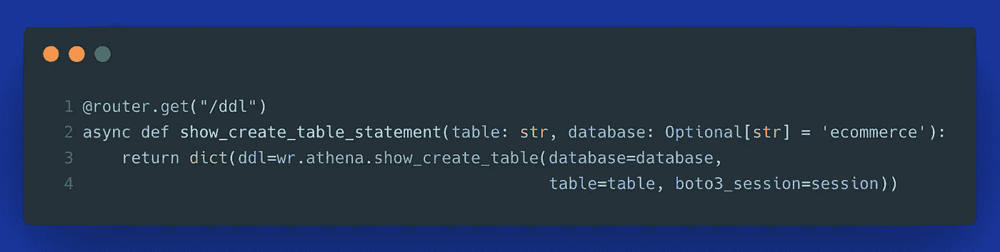

作者图片

#5.**列出 S3** 目录**路径**或者根据文件类型显示具体对象( *ex。拼花文件*)和最后修改日期:

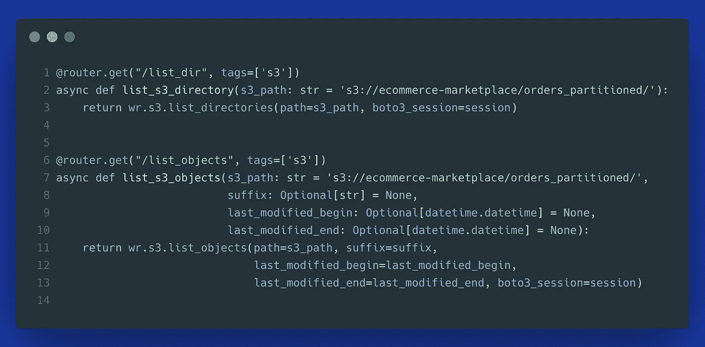

作者图片

#6.查询**列注释**找到你需要的数据集:


作者图片

#7.描述雅典娜**表定义**:

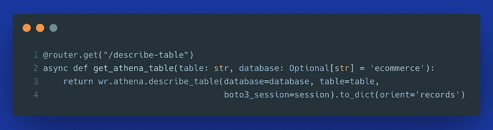

作者图片

#8.搜索特定的**列名**:

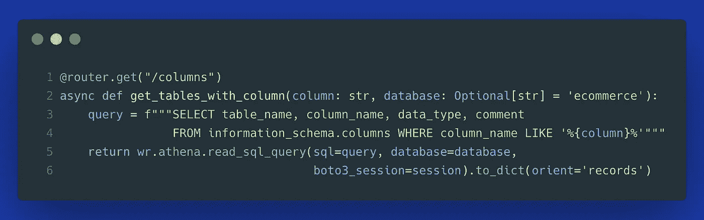

作者图片

上述方法构成了数据发现服务的基本 MVP。它允许查询模式、表、列、列注释(*又名数据字典*)，显示数据预览，以及探索底层文件、目录和分区。

通过利用 AWS X-Ray 和 Lake Formation 等服务，我们可以添加查询使用访问模式的方法，并确定使用最多和最少的数据集。

> **补充说明:**如果您不想在每个 API 方法中单独附加您的`boto3_session`，您可以使用:

```
boto3.setup_default_session(region_name="us-east-1")
```

# 实现:FastAPI MVP

这个 MVP 的完整代码可以在 Github 库中找到。我们简单讨论一下其中的一些细节。

在下面的演示中，我们可以看到 Kaggle 的巴西电子商务数据集上应用的所有端点。

上面的截屏演示了我们如何使用这个 API 来发现和查询存储在 S3 数据湖中的电子商务数据。最终用户可以确定他们需要的表或模式。通过深入底层文件，数据科学家和分析师可以在交互式笔记本或他们选择的其他工具中探索这些数据。使用`awswrangler`从 S3 读取特定的 parquet、CSV、Excel 或 JSON 文件非常简单:

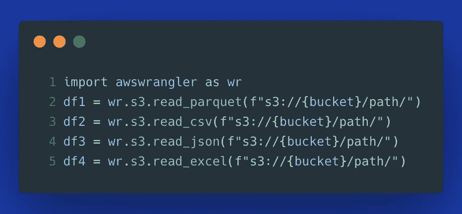

作者图片

# 我们如何大规模地提供这个 API？

部署 REST API 有几种选择。如果你已经使用了 AWS，你可能会发现利用专门为构建弹性和可伸缩 API 而构建的无服务器服务很有用: **AWS Lambda** 和 **API Gateway** 。

使用名为`mangum`的优秀包，将我们的 FastAPI 转换为 Lambda 处理程序就像导入这个包( *from mangum import Mangum* )并添加一行代码:`handler = Mangum(app=app)`一样简单。

将 API 部署到 AWS Lambda 的 docker 文件如下所示:

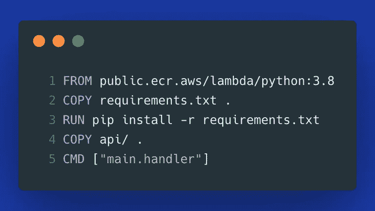

作者图片

我们在 Python 3.8 中使用官方 Python Lambda 镜像，并且**安装**所有需要的**包**。然后，我们复制剩余的 API 代码，并指定将用作容器入口点的 **Lambda 处理程序**。

最后，我们必须将容器推送到 ECR — AWS 容器注册中心。要复制此演示，请用您的 AWS 帐户 ID 替换`123456789`，并调整您的 AWS 地区名称。如果你想知道:`dda`是我对`data-discovery-api`的缩写。

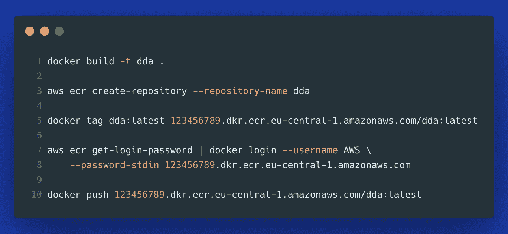

作者图片

## 自动气象站λ

容器映像被部署到 ECR。现在，我们需要**创建一个λ函数**。我们选择容器图像选项，并选择我们的 ECR 图像。

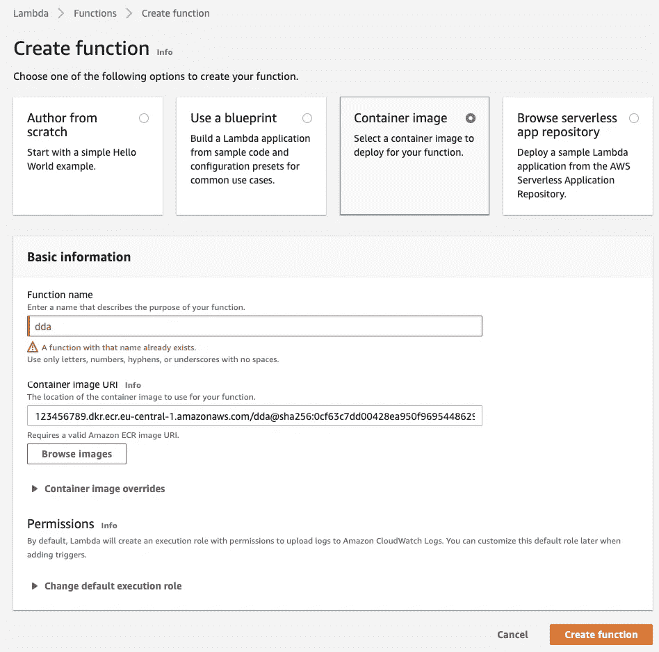

作者图片

由于查询一些表可能比 Lambda 的默认**超时**三秒更长，我们可以将其延长到三分钟。


作者图片

最后，我们需要附加 IAM 策略来授予我们的 Lambda 函数权限，以便从 AWS Glue、Athena 和 S3 中检索数据(*当然，我们应该对生产使用更细粒度的权限*)。

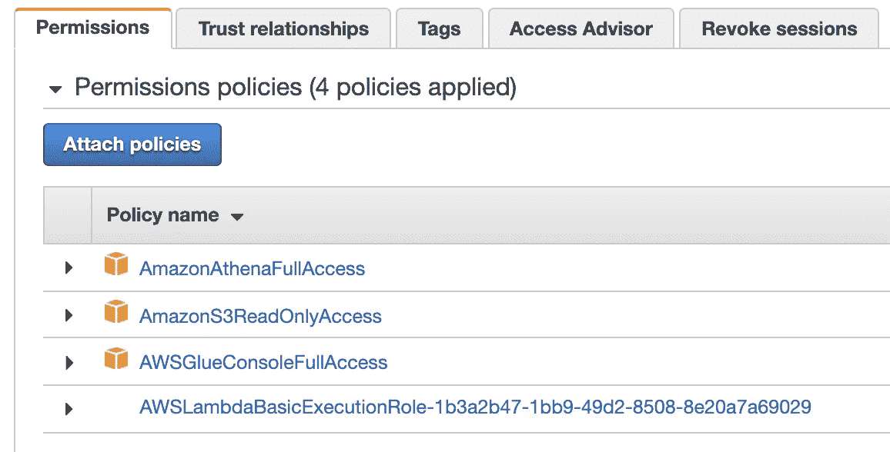

作者图片

## API 网关

在用我们的容器映像配置了 Lambda 函数之后，我们可以在 API 网关控制台中创建新的 API。我们需要选择 REST API 并指定一个名称。

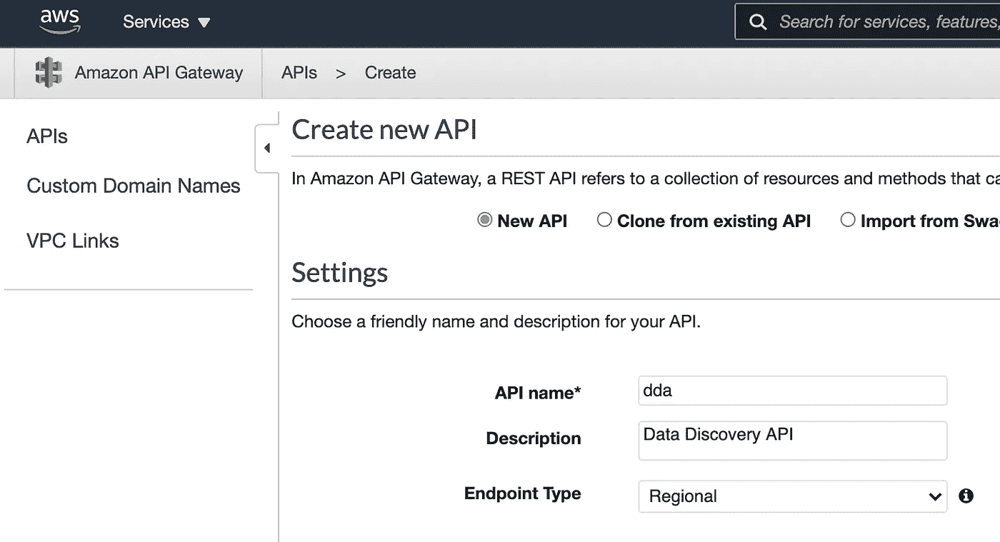

作者图片

然后，我们可以添加一个方法和资源来配置 Lambda 代理集成。

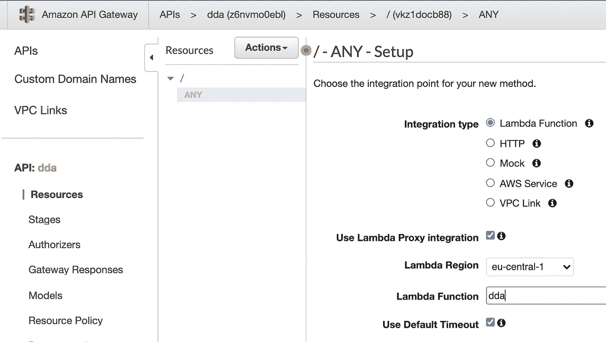

作者图片

一旦所有这些都设置好了，我们就可以部署 API 并开始服务它了。

为了一步一步地了解它，这里有一个演示 API 网关配置、部署和测试 API 的截屏:

## 确保 API 的安全性和可追踪性

要了解如何额外配置 **API 键**来确保 API 安全，请查看我以前的文章。它还展示了如何使用 AWS X-Ray 配置**分布式跟踪，以便更好地控制 AWS 上的 FastAPI 服务:**

[](/fastapi-aws-secure-api-part-2-1123bff28b55) [## FastAPI + AWS =安全 API(第 2 部分)

### 让我们用 FastAPI、AWS Lambda、API Gateway、CloudWatch 和 AWS X-Ray 构建一个安全且可观察的 Python REST API

towardsdatascience.com](/fastapi-aws-secure-api-part-2-1123bff28b55) 

# 我们如何监控我们的数据发现服务？

想象一下，您在自己的公司部署了一个类似的服务，并且获得了巨大的成功。现在你需要确保它保持**健康**，可以很容易**维护**，并且运行**没有错误**。此时，您可以:

1.  手动关注(*不推荐*)，
2.  通过使用 AWS CloudWatch 和相关服务，自己构建一个**可观察性仪表板**，
3.  使用观察工具，如 [Dashbird](https://dashbird.io/) 。

**每个选项的含义:**

*   对于选项 1，你可能会发疯。
*   对于选项#2，您将不得不花费额外的时间来构建 CloudWatch 仪表板，在几个 CloudWatch 日志和多个 AWS 控制台选项卡之间切换，以修复任何潜在的错误。
*   使用选项#3，您只需登录您的 [Dashbird](https://dashbird.io/) 帐户——它会自动扫描所有无服务器资源，并为您提供跟踪 API 和微服务健康状况所需的可视化功能。然后可以随意(*强烈推荐！*)结合 API Gateway 和 Lambda 资源构建**项目仪表盘**，失败**设置预警**。

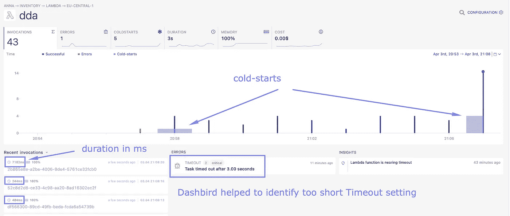

作者图片

在上图中，我们可以看到 Dashbird 是如何指出 3 秒后超时的任务的(*默认 Lambda 超时*)。它还揭示了 **Lambda** 函数何时经历了冷启动，并显示了每个 API 调用的持续时间。

对于 **API 网关**，我们可以看到平均延迟、API 请求的数量以及我们在 API 初始测试中遇到的不同类型的错误。

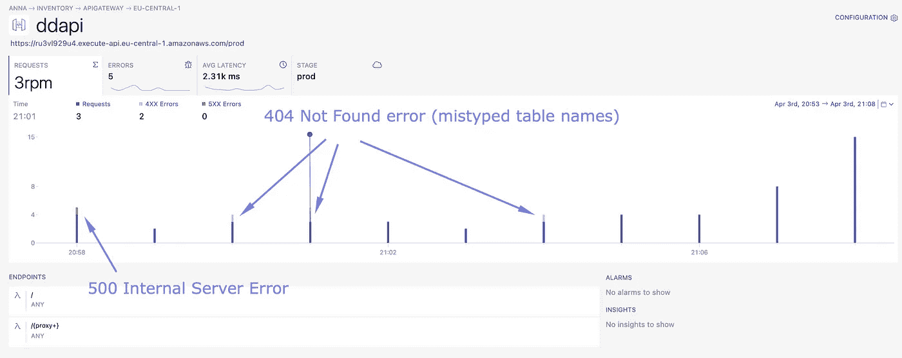

作者图片

# 结论

在本文中，我们研究了如何为数据发现构建 REST-ful 服务。通过利用 Python 库，如 FastAPI、awswrangler、boto3 和 Mangum，我们可以在几个小时而不是几周内构建有用的 API。此外，通过将该服务部署到 API Gateway 和 Lambda，我们可以大规模地提供该 API，而不会遇到运营难题。最后，通过利用 [Dashbird](https://dashbird.io/) ，您可以为您的无服务器资源添加可观察性，而无需安装任何 CloudWatch 代理、提取日志或构建任何仪表板。

**感谢您的阅读！如果这篇文章有用，** [**关注我**](https://medium.com/@anna.anisienia) **看我下一篇帖子。还有，看看相关文章:**

*   [FastAPI + AWS =健壮的 API(第一部分)](/fastapi-aws-robust-api-part-1-f67ae47390f9)
*   [用 Docker 容器部署 AWS Lambda:我尝试了一下，这是我的评论](https://levelup.gitconnected.com/deploying-aws-lambda-with-docker-containers-i-gave-it-a-try-and-heres-my-review-147327519ce9)
*   [您应该考虑数据湖(和事件驱动的 ETL)的 7 个理由](/7-reasons-why-you-should-consider-a-data-lake-and-event-driven-etl-7616b74fe484)