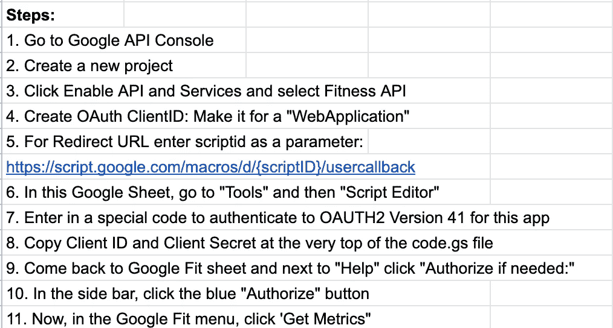
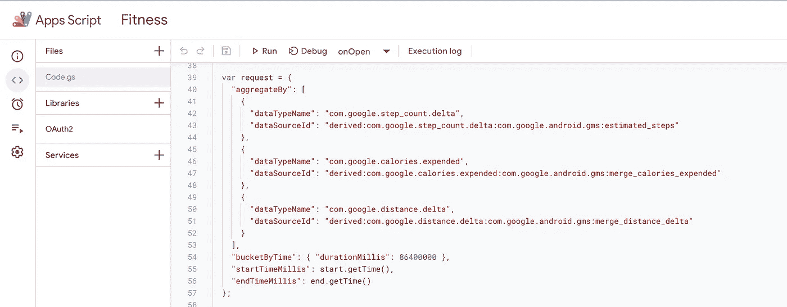
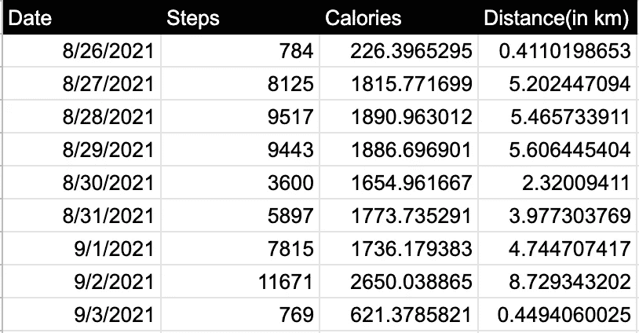

# 我如何使用谷歌健身数据建立自己的健身追踪器

> 原文：<https://towardsdatascience.com/how-i-built-a-google-spreadsheet-to-keep-track-of-google-fit-fitness-data-a0887a59f730?source=collection_archive---------17----------------------->

## 我如何快速构建了一个可以在电子表格中跟踪健身数据的应用程序

照片来自 Unsplash

最近，我在 [Fiverr](https://www.fiverr.com/basillatif?up_rollout=true) 上签约了一项自由职业任务，为一位瑞士客户从谷歌 Fit [API](https://developers.google.com/fit) 中提取数据。具体来说，我的任务是检索 3 个关键字段:每天行走的步数、每天消耗的卡路里和行走的距离(以公里为单位),在这篇文章中，我将通过这些步骤来交付这个项目。

# 关于 Google Fit:

[Google Fit](https://www.google.com/fit/) 是谷歌自己的服务，用于跟踪你的健康数据。它集成了许多不同类型的手表和健身追踪器，并将您的数据聚集在一个地方。它可以记录你走的步数、体重和心率。它有一个很好的界面，很容易使用。它只能作为移动应用程序使用。

当我浏览 Google Fit API 的文档时，我看到 Google 有关于这个 API 的大量文档和大量代码示例。

# API 设置:

以下是如何正确设置应用程序的说明:

启用 API 调用的步骤

此外，虽然 Google 的文档非常详细，但它没有具体说明如何用特定的编程语言调用 API。因为我是在 Google Sheets 中构建我的应用程序，所以我必须使用 JavaScript 来调用和显示数据。

当我在谷歌搜索时，我发现了一篇关于如何使用谷歌 Fit API 的精彩文章，我正在计划如何有效地完成这项任务。像这样详细的博客和教程是我喜欢互联网上的社区的原因。

这个博客叫做“我以为他和你一起来的”,是一个极好的资源——我鼓励你查看这里的链接。文章的作者给出了取回 3 个字段的代码。我需要 3 个不同的领域；具体来说，我需要

(1)每天的步数

(2)每天消耗的卡路里和

(3)以公里为单位的行走距离。代码是在 Google 脚本编辑器中编写的，如下所示:

Google API 的请求正文

需要进一步处理才能在 Google 表单中正确打印响应。最终产品看起来很漂亮:

哒哒！过去 9 天的 API 响应

# 除了简单的跟踪之外，这些数据的潜在用途:

正如我们所看到的，这是一个非常丰富和有趣的数据源。通过锻炼分析，可以绘制出各种与特定日期何时以及为何达到特定健身参数相关的洞察。

也有可能使用这些数据来创建一个关于健康水平的个人评分系统。一个跑步者可能想要记录每天、每周或每月跑的英里数，并使用这个方便的 API 自动调用 Google Fit。举重运动员可以记录每天锻炼的时间。骑自行车的人可以记录骑行的英里数。

此外，这些数据可以用来记录体重，作为减肥计划的一部分。最终，您需要一个非常具体的用例，希望在 Google sheet 中以表格格式保存这些数据，而不是在 Google Fit 应用程序中。

照片来自 Unsplash

# 结论:

今天，我们看到与锻炼相关的应用程序激增。然而，正如我在这里展示的那样，利用一点灵感和电子表格中的一些代码创建自己的锻炼数据应用程序是可能的——访问和使用锻炼数据可以帮助建立更健康的人，从而带来更健康的世界。