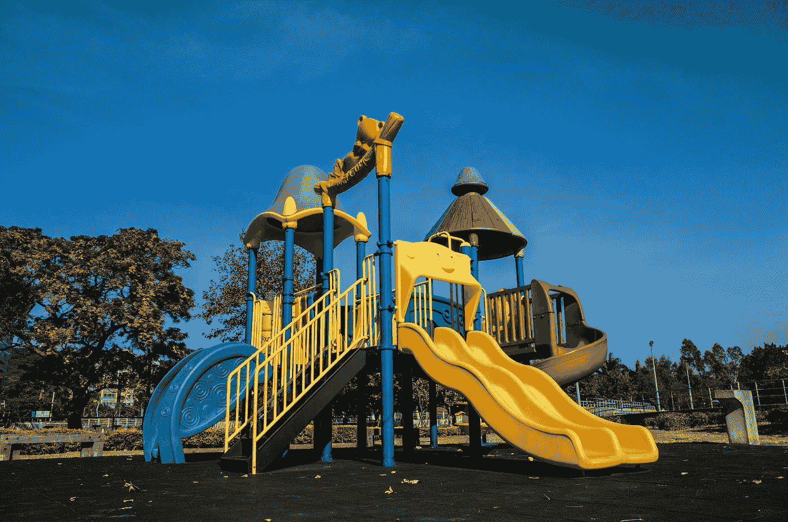
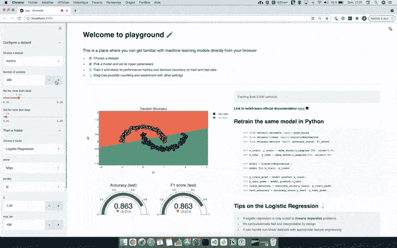
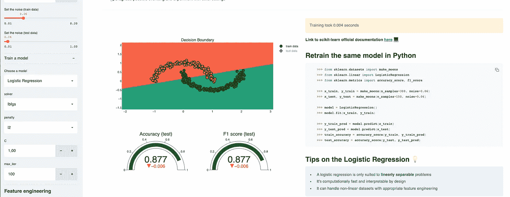
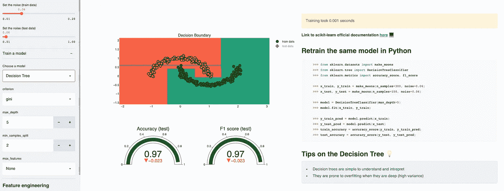
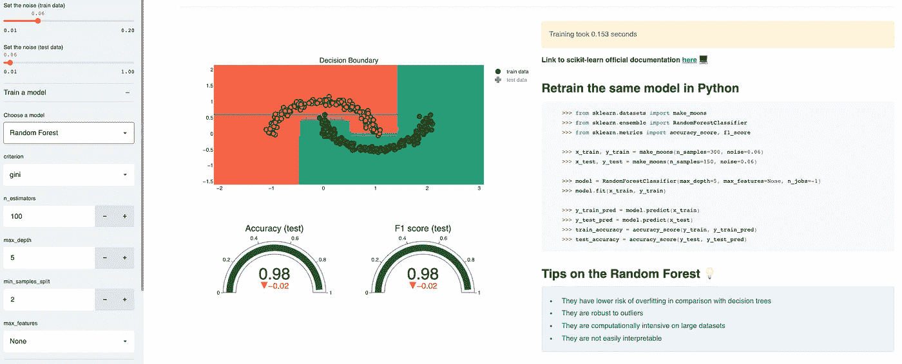
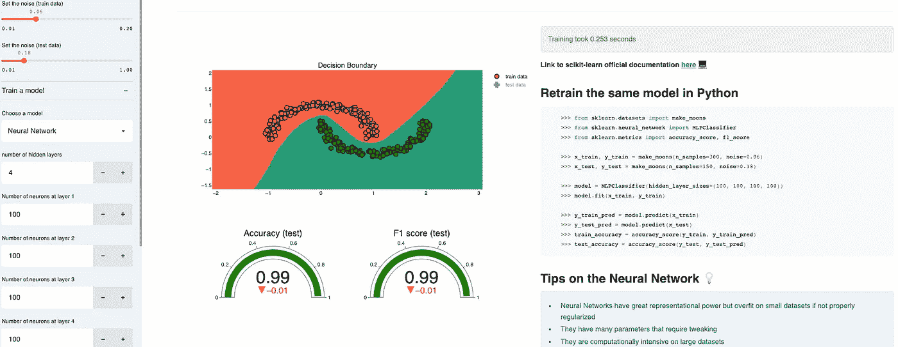

# 我如何用 Streamlit 建立一个机器学习平台

> 原文：<https://towardsdatascience.com/how-i-built-a-machine-learning-playground-with-streamlit-3cddb7368ba9?source=collection_archive---------31----------------------->

## 从浏览器中修改模型



[动力赖](https://unsplash.com/@welipower?utm_source=medium&utm_medium=referral)在 [Unsplash](https://unsplash.com?utm_source=medium&utm_medium=referral) 上拍照

我已经在工作中使用 [Streamlit](http://streamlit.io/) 几个星期了，我必须说这是一个**神奇的工具。将您的 ML 代码作为原型进行运输和部署从未如此简单。**

在对这个库进行实验时，我决定用它来创建一个附带项目，从浏览器上玩机器学习模型，这纯粹是出于教育目的，也是为了让机器学习经验较少的人熟悉模型。

在我的笔记本上构思设计的两个晚上后，**游乐场**诞生了。



作者 Gif

*PS*:由于我最近开始在 Youtube 上录制一些教程，你可以观看这个视频，了解更多关于我如何构建和部署这个应用的细节*

作者视频

*PS**:代码在*[*Github*](https://github.com/ahmedbesbes/playground)*上有。随意派生、克隆它，在本地运行它或者为你的任何项目重新利用它*

*PS * * *:app 直播。在这里检查一下*<https://share.streamlit.io/ahmedbesbes/playground/main/app.py>**并试用一下。**

*现在让我们看看这个应用程序是怎么回事😉*

# *什么是游乐场？*

*Playground 是一个 Streamlit 应用程序，允许您直接从浏览器中修改机器学习模型。*

*因此，如果你是数据科学从业者，你绝对应该尝试一下😉*

**这个 app 的灵感来源于伟大的张量流* [*游乐场*](https://playground.tensorflow.org/) *。这里唯一的区别是，它解决了经典的机器学习模型。**

# *它是如何工作的？*

*使用操场很简单*

***1 —** 🗂️从预定义的列表中选择并配置数据集。您可以设置:*

*   *样本数量*
*   *列车上的噪声和测试数据*

***2—** ⚙️您选择一个模型并设置其超参数。你可以从逻辑回归、决策树、随机森林、梯度推进、神经网络、朴素贝叶斯、KNNs 和 SVM 中选择一个模型*

***3 —** 📉该应用程序会自动显示以下结果:*

*   *训练和测试数据模型的决策边界*
*   *训练和测试数据的性能指标(准确性和 F1 分数)*
*   *模型的训练时间*
*   *基于数据集定义和模型超参数生成 python 脚本以再现模型训练*

***4 —** 对于每种型号，Playground 都提供了一个官方文档的链接以及一个技巧汇编列表*

***奖励点**:该应用还提供了通过添加多项式特征来执行特征工程的能力。**这被证明有助于线性模型，如非线性问题的逻辑回归。***

# *你能从游乐场学到什么？*

*如果你是机器学习的新手，玩这个应用可能会(并且希望😄)让你熟悉基本概念，帮助你建立第一直觉。它不会取代教科书:它只是为了补充你的知识。就这样吧。*

## *1.决策边界将(部分地)告诉你模型是如何运作的*

*通过检查决策边界，您将对每个模型的工作方式有更多的了解。出于教育目的，playground 将处理仅具有 2 个要素的数据集(但是在降维后，可以在多维数据集上获得相同的结果)*

*例如，您将看到逻辑回归用一条线(或一般情况下的超平面)分隔数据*

**

*线性回归—作者图片*

*而决策树根据特征值的连续条件对数据进行分类，其决策边界由水平线和垂直线组成。*

**

*决策树—作者图片*

*有趣的是，随机森林是多个决策树的集合，其决策边界看起来与决策树相似，但更平滑:这是随机森林使用的投票机制的结果。*

**

*随机森林——作者图片*

## *2.你会感受到每个型号的速度*

*给定相同的数据集，您可以比较每个模型的速度，并获得哪个更快的感觉。在前面的图中，逻辑回归和决策树分别花费了 **0.004** 和 **0.001** 秒进行训练，而随机森林花费了 **0.154** 秒。*

*尝试一个神经网络，它有 4 层，每层 100 个神经元:花费 **0.253 秒。***

**

*神经网络——作者图片*

## *3.特征工程可以有所帮助*

*在月球数据集上使用逻辑回归不会给你一个完美的 F1 分数，因为它是非线性的。*

*然而，通过添加多项式特征来增加维度会有所帮助:当使用逻辑回归时，尝试将多项式次数增加到 3，并注意决策边界是如何彻底改变的。*

**

*逻辑回归+特征工程—作者图片*

## *4.一些模型比其他模型对噪声更鲁棒*

*您可以通过在测试数据上设置更高的噪声来进行实验，**从而使其偏离列车分布。**针对此问题，梯度推进等一些模型比其他模型更稳定。*

## *5.尝试不同的超参数组合*

*学习和验证你的直觉的一个很好的方法是实验，这就是这个应用程序的目的:它允许你修改一系列超参数(树深度、估计器数量、层数等)，并立即看到决策边界、指标以及执行时间的结果。*

*去试试吧，希望你能从中有所收获！*

# *在本地运行应用程序*

*要在本地运行这个应用程序，你必须确保你已经用 Python 3 安装了 pip。*

*   *安装管道*

```
*pip install pipenv*
```

*   *进入项目的文件夹并安装依赖项*

```
*pipenv install*
```

*   *运行应用程序*

```
*streamlit run app.py*
```

*这将打开一个本地服务器，您可以通过 [http://localhost:8051](http://localhost:8051) 访问该服务器*

# *代码的结构*

*代码遵循以下结构:*

*   *`app.py`:启动 app 的主入口点*
*   *`ui.py`一组 UI 函数，用于显示应用程序的不同组件*
*   *`functions.py`:数据处理、模型训练和绘图功能列表*
*   *`models/`:定义每个模型的超参数选择器*

*请注意，`ui.py`和`functions.py`位于`utils`文件夹内。*

*如果你想了解代码，推荐看我上面的视频。*

# *感谢阅读！🙏*

*如果你已经做到了这一步，非常感谢你的阅读！*

*Playground 是开源的，我希望随着时间的推移它会变得更好。因此，如果你想贡献自己的一份力量，请随时打开一个拉取请求或一个问题，如果你想在应用程序中看到一个功能。*

*我现在能想到的是:*

*   *添加其他非线性数据集*
*   *添加更多型号*
*   *实施复杂的特征工程(正弦特征，交互项？)*
*   *实现一个具有降维功能的自定义数据集读取器，这样您就可以检查您的数据*
*   *添加要素重要性图和模型可解释性*

*但是如果你有其他的想法，我很乐意听听。*