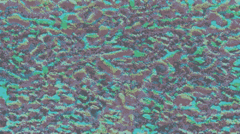

# 我如何建立一个人工智能文本到艺术的生成器

> 原文：<https://towardsdatascience.com/how-i-built-an-ai-text-to-art-generator-a0c0f6d6f59f?source=collection_archive---------0----------------------->

## 一篇关于我如何建设 Text2Art.com 的详细、循序渐进的文章


text 2 生成艺术画廊[图片由作者提供]

# 概观

这篇文章是关于我如何在一周内建造了 Text2Art.com 的。Text2Art 是一个基于 VQGAN+CLIP 的 AI 驱动的艺术生成器，可以仅从文本输入生成各种艺术，如像素艺术、绘图和绘画。文章跟随我的思维过程，从尝试 VQGAN+CLIP，用 Gradio 构建简单的 UI，切换到 FastAPI 为模型服务，最后使用 Firebase 作为队列系统。请随意跳到您感兴趣的部分。

> 你可以在 text2art.com[的](http://text2art.com)尝试一下，这里是[的源代码](https://github.com/mfrashad/text2art)(随意启动回购)

Text2Art 演示(更新:我们现在有 15k+用户)

# 概述

*   介绍
*   它是如何工作的
*   用 VQGAN+带代码的剪辑生成艺术
*   用 Gradio 制作用户界面
*   用 FastAPI 供应 ML
*   基于 Firebase 的排队系统

# **简介**

不久前，生成艺术和 NFT 风靡全球。这是在 OpenAI 在文本到图像生成方面取得重大进展后才成为可能的。今年早些时候，OpenAI 发布了一款功能强大的文本到图像生成器，效果非常好。为了说明 DALL-E 工作得有多好，这些是 DALL-E 生成的图像，带有文本提示“一个专业的高质量长颈鹿龙奇美拉插图”。模仿龙的长颈鹿。龙做的长颈鹿”。


DALL-E 制作的法师在得到文字提示“一个专业高质量的长颈鹿龙奇美拉插图”时。模仿龙的长颈鹿。龙做的长颈鹿。”[图片由拥有麻省理工学院许可证的 [OpenAI](https://en.wikipedia.org/wiki/DALL-E#/media/File:DALL-E_sample.png) 提供]

不幸的是，DALL-E 没有向公众发布。但幸运的是，DALL-E 魔术背后的模型 [CLIP](https://openai.com/blog/clip/) 反而出版了。剪辑或对比图像语言预训练是一个结合文本和图像的多模态网络。简而言之，CLIP 能够评估图片与标题的匹配程度，反之亦然。这对于引导生成器生成与文本输入完全匹配的图像非常有用。在 DALL-E 中，CLIP 用于对生成的图像进行排序，输出得分最高的图像(最类似于文本提示)。


片段评分图像和说明的示例[按作者分类的图像]

在 DALL-E 公布后的几个月，一个名为 [VQGAN](https://compvis.github.io/taming-transformers/) (矢量量化 GAN)的新变形金刚图像生成器发表了。将 VQGAN 与 CLIP 相结合，可获得与 DALL-E 相似的质量。自预先训练的 VQGAN 模型公开以来，社区已经创造了许多令人惊叹的艺术。


多船城市港口夜景画，战争中的难民画。[图片由作者生成]

我真的对结果感到惊讶，并想与我的朋友分享这一点。但由于没有多少人愿意钻研代码来生成艺术，我决定创建 Text2Art.com，一个任何人都可以简单地输入提示并快速生成他们想要的图像而不用看任何代码的网站。

# 它是如何工作的

那么 VQGAN+CLIP 是如何工作的呢？简而言之，生成器将生成图像，剪辑将测量图像与图像的匹配程度。然后，生成器使用来自剪辑模型的反馈来生成更“准确”的图像。这种迭代将进行多次，直到剪辑分数变得足够高，并且生成的图像与文本匹配。


*VQGAN 模型生成图像，而 CLIP 指导这个过程。这是通过多次迭代完成的，直到生成器学会产生更“精确”的图像。【来源:* [*T* 何插图 VQGAN 作者:LJ Miranda](https://ljvmiranda921.github.io/notebook/2021/08/08/clip-vqgan/)*】*

我不会在这里讨论 VQGAN 或 CLIP 的内部工作原理，因为这不是本文的重点。但是如果你想深入了解 VQGAN、CLIP 或 DALL-E，你可以参考我找到的这些令人惊叹的资源。

*   [LJ Miranda 的插图 VQGAN](https://ljvmiranda921.github.io/notebook/2021/08/08/clip-vqgan/):用很棒的插图解释 VQGAN。
*   [Charlie Snell 解释的 DALL-E](https://ml.berkeley.edu/blog/posts/vq-vae/):从基础开始的伟大 DALL-E 解释
*   [Yannic kil cher 的回形针讲解视频](https://youtu.be/T9XSU0pKX2E):回形针讲解

## X +剪辑

VQGAN+CLIP 是一个简单的例子，说明了将图像生成器与 CLIP 相结合可以实现的功能。然而，你可以用任何类型的生成器替换 VQGAN，它仍然可以很好地工作，这取决于生成器。X + CLIP 的许多变体已经出现，如 [StyleCLIP](https://github.com/orpatashnik/StyleCLIP) (StyleGAN + CLIP)、 [CLIPDraw](https://arxiv.org/abs/2106.14843) (使用矢量艺术生成器)、BigGAN + CLIP 等等。甚至有[音频剪辑](https://github.com/AndreyGuzhov/AudioCLIP)使用音频而不是图像。


使用 StyleCLIP 编辑图像[Source: [StyleCLIP Paper](https://github.com/orpatashnik/StyleCLIP)

# 用 VQGAN+带代码的剪辑生成艺术

我一直在使用 dribnet 的 [clipit](https://github.com/dribnet/clipit) 资源库中的代码，这使得使用 VQGAN+CLIP 生成艺术变成了简单的几行代码(更新: [clipit](https://github.com/dribnet/clipit) 已经迁移到了 [pixray](https://github.com/dribnet/pixray) )。

建议在 Google Colab 上运行，因为 VQGAN+CLIP 需要相当多的 GPU 内存。这里有一本 [Colab 笔记本](https://colab.research.google.com/github/mfrashad/text2art/blob/main/text2art.ipynb)你可以跟着看。

首先，如果你在 Colab 上运行，确保你把运行时类型改成使用 GPU。


将 Colab 运行时类型更改为 GPU 的步骤。[图片由作者提供]

接下来，我们需要首先设置代码库和依赖项。

```
**from** **IPython.utils** **import** io
**with** io.capture_output() **as** captured:
  !git clone https://github.com/openai/CLIP
  *# !pip install taming-transformers*
  !git clone https://github.com/CompVis/taming-transformers.git
  !rm -Rf clipit
  !git clone https://github.com/mfrashad/clipit.git
  !pip install ftfy regex tqdm omegaconf pytorch-lightning
  !pip install kornia
  !pip install imageio-ffmpeg   
  !pip install einops
  !pip install torch-optimizer
  !pip install easydict
  !pip install braceexpand
  !pip install git+https://github.com/pvigier/perlin-numpy

  *# ClipDraw deps*
  !pip install svgwrite
  !pip install svgpathtools
  !pip install cssutils
  !pip install numba
  !pip install torch-tools
  !pip install visdom

  !pip install gradio

  !git clone https://github.com/BachiLi/diffvg
  %cd diffvg
  *# !ls*
  !git submodule update --init --recursive
  !python setup.py install
  %cd ..

  !mkdir -p steps
  !mkdir -p models
```

(注:“！”是 google Colab 中的一个特殊命令，这意味着它将在 bash 而不是 python 中运行该命令”)

一旦我们安装了库，我们就可以导入`clipit`并运行这几行代码来用 VQGAN+CLIP 生成你的艺术作品。只需随意更改文本提示。此外，您还可以给`clipit`一些选项，如迭代次数、宽度、高度、生成器模型、是否要生成视频等等。您可以阅读[源代码](https://github.com/mfrashad/clipit/blob/master/clipit.py)以获得更多关于可用选项的信息。

使用 VQGAN+CLIP 生成艺术作品的代码

一旦你运行代码，它将生成一个图像。对于每次迭代，生成的图像将更接近文本提示。


基于“水下城市”较长迭代的结果改进。[图片由作者提供]

## 更长的迭代

如果您想生成一个更长的迭代，只需使用`iterations`选项，并将其设置为您想要的长度。例如，如果您希望它运行 500 次迭代。

```
clipit.add_settings(iterations=500)
```

## 生成视频

因为我们无论如何都需要为每次迭代生成图像，所以我们可以保存这些图像，并创建一个关于人工智能如何生成图像的动画。为此，您可以在应用设置之前简单地添加`make_video=True`。

```
clipit.add_settings(make_video=True)
```

它将生成以下视频。



生成的“水下城市”GIF[图片由作者提供]

## 自定义图像大小

您也可以通过添加`size=(width, height)`选项来修改图像。例如，我们将生成一个分辨率为 800x200 的横幅图像。请注意，更高的分辨率将需要更高的 GPU 内存。

```
clipit.add_settings(size=(800, 200))
```


生成 800x200 图片，提示“幻想王国# art station”[图片由作者提供]

## 生成像素艺术

还有一个在 clipit 中生成像素艺术的选项。它在场景后面使用 CLIPDraw 渲染器，通过一些工程来强制像素艺术风格，例如限制调色板颜色、像素化等。要使用像素艺术选项，只需启用`use_pixeldraw=True`选项。

```
clipit.add_settings(use_pixeldraw=True)
```


生成的图像带有提示“盔甲骑士#pixelart”(左)和“中国奇幻电子游戏世界#pixelart”(右)[图片由作者提供]

## VQGAN+剪辑关键字修改器

由于 CLIP 中的偏差，在提示中添加某些关键字可能会对生成的图像产生一定的效果。例如，在文本提示中添加“虚幻引擎”往往会生成逼真或高清的样式。添加某些网站名称，如“deviantart”、“artstation”或“flickr”，通常会使结果更加美观。我最喜欢的是使用“艺术站”关键字，因为我发现它产生最好的艺术。


关键词对比[ [图片由 kingdomakrillic](https://imgur.com/a/SALxbQm)

此外，您还可以使用关键字来调节艺术风格。例如，关键字“铅笔素描”，“低聚”，甚至艺术家的名字，如“托马思·金凯德”或“詹姆斯格尼”。


Artstyle 关键字比较。[ [图片由 kingdomakrillic](https://imgur.com/a/SALxbQm) 提供

要了解更多关于各种关键词的效果，您可以查看 kingdomakrillic 的[完整实验结果，它显示了使用相同 4 个主题的 200 多个关键词的结果。](https://imgur.com/a/SALxbQm)

# 用 Gradio 构建 UI

我部署 ML 模型的第一个计划是使用 [Gradio](https://gradio.app/) 。Gradio 是一个 python 库，它将 ML 演示的构建简化为几行代码。使用 Gradio，您可以在不到 10 分钟的时间内构建一个演示。此外，您可以在 Colab 中运行 Gradio，它将使用 Gradio 域生成一个可共享的链接。您可以立即与您的朋友或公众分享此链接，让他们试用您的演示。Gradio 仍然有一些限制，但我发现当你只想演示一个函数时，它是最合适的库。


gradio UI[图片由作者提供]

这是我为 Text2Art 应用程序编写的简单 UI 代码。我认为代码是不言自明的，但是如果你需要更多的解释，你可以阅读 [Gradio 文档](https://gradio.app/docs)。

构建 Gradio UI 的代码

一旦你在 Google Colab 或 local 中运行它，它将生成一个可共享的链接，使你的演示可以公开。我发现这非常有用，因为我自己不需要像 Ngrok 一样使用 SSH 隧道来分享我的演示。此外，Gradio 还提供托管服务，您可以永久托管您的演示，每月仅需 7 美元。


Gradio 演示的可共享链接。[图片由作者提供]

然而，Gradio 仅适用于演示单一功能。创建一个带有额外功能的自定义站点，比如图库、登录，甚至只是自定义 CSS，都是相当有限的，或者根本不可能。

我能想到的一个快速解决方案是创建一个独立于 Gradio UI 的演示站点。然后，我可以使用 iframe 元素在站点上嵌入 Gradio UI。我最初尝试了这种方法，但后来意识到一个重要的缺点，我不能个性化任何需要与 ML 应用程序本身交互的部分。例如，输入验证、自定义进度条等功能在 iframe 中是不可能实现的。这是我决定建立一个 API 的时候。

# 用 FastAPI 服务 ML 模型

我一直使用 FastAPI 而不是 Flask 来快速构建我的 API。主要原因是我发现 FastAPI 写起来更快(代码更少),而且它还自动生成文档(使用 Swagger UI ),允许我用基本 UI 测试 API。另外，FastAPI 支持异步函数，据说比 Flask 更快[。](https://fastapi.tiangolo.com/benchmarks/)


通过在 URL 中添加/docs/来访问 Swagger UI


在 Swagger UI 中测试 API 图片由作者提供]

下面是我编写的代码，它将我的 ML 函数作为 FastAPI 服务器。

API 服务器的代码

一旦我们定义了服务器，我们就可以使用 uvicorn 运行它。此外，因为 Google Colab 只允许通过 Colab 接口访问他们的服务器，所以我们必须使用 Ngrok 向公众公开 FastAPI 服务器。

运行和公开服务器的代码

一旦我们运行了服务器，我们就可以进入 Swagger UI(通过在生成的 ngrok URL 上添加`/docs`)并测试 API。


使用 FastAPI Swagger UI 生成“水下城堡”

在测试 API 时，我意识到根据质量和迭代次数的不同，推断可能需要大约 3-20 分钟。对于 HTTP 请求来说，3 分钟本身已经被认为很长了，用户可能不想在站点上等待那么长时间。由于推理时间较长，我认为将推理设置为后台任务并在结果出来后给用户发电子邮件可能更适合这个任务。

既然我们决定了计划，我们首先将编写发送电子邮件的函数。我最初使用 SendGrid 电子邮件 API 来完成这项工作，但在用完免费使用配额(100 封电子邮件/天)后，我改用 Mailgun API，因为它们是 GitHub 学生开发包的一部分，允许学生每月发送 20，000 封电子邮件。

下面是使用 Mailgun API 发送带有图像附件的电子邮件的代码。

使用 Mailgun API 发送电子邮件的代码

接下来，我们将修改我们的服务器代码以使用 FastAPI 中的后台任务，并在后台通过电子邮件发送结果。

有了上面的代码，服务器将很快用“任务在后台处理”消息来回复请求，而不是等待生成过程完成，然后用图像来回复。

一旦该过程完成，服务器将通过电子邮件向用户发送结果。


图像和视频结果通过电子邮件发送给用户。[图片由作者提供]

现在一切似乎都正常了，我建立了[前端](http://text2art.com)，并与我的朋友们分享了这个网站。然而，我发现在对多个用户进行测试时存在并发问题。

当第二个用户在第一个任务仍在处理时向服务器发出请求，第二个任务会以某种方式终止当前进程，而不是创建一个并行进程或队列。我不确定这是什么原因造成的，可能是在 clipit 代码中使用了全局变量，也可能不是。我没有花太多时间调试它，因为我意识到我需要实现一个消息队列系统。

在消息队列系统上谷歌搜索了几下后，大多数都推荐 RabbitMQ 或者 Redis。然而，我不确定 RabbitMQ 或 Redis 是否可以安装在 Google Colab 上，因为它似乎需要`sudo`的许可。最后，我决定使用 Google Firebase 作为队列系统，因为我想尽快完成这个项目，而 Firebase 是我最熟悉的一个。

基本上，当用户试图在前端生成一个艺术时，它会在一个名为`queue`的集合中添加一个条目来描述任务(提示、图像类型、大小等)。另一方面，我们将在 Google Colab 上运行一个脚本，该脚本持续监听`queue`集合中的新条目，并逐个处理任务。

处理任务并持续监听队列的后端代码

在前端，我们只需在队列中添加一个新任务。但是确保你已经在你的前端做了一个合适的 [Firebase 设置](https://firebase.google.com/docs/web/setup)。

```
db.collection("queue").add({
        prompt: prompt,
        email: email,
        quality: quality,
        type: type,
        aspect: aspect,
        created_at: firebase.firestore.FieldValue.serverTimestamp(),
})
```

完成了！现在，当用户试图在前端生成 art 时，它会在队列中添加一个新任务。Colab 服务器中的 worker 脚本将逐个处理队列中的任务。

> 你可以查看 [GitHub 回购](https://github.com/mfrashad/text2art)来查看完整的代码(随意开始回购)。


在前端队列中添加新任务[图片由作者提供]


Firebase 中的队列内容[图片由作者提供]

如果你喜欢我的文章，看看我的其他文章！

</animating-yourself-as-a-disney-character-with-ai-78af337d4081>  </generating-anime-characters-with-stylegan2-6f8ae59e237b>  

也可以在 Linkedin 上和我联系。

<https://www.linkedin.com/in/mfathyrashad/>  

# 参考

[1][https://openai.com/blog/dall-e/](https://openai.com/blog/dall-e/)

[https://openai.com/blog/clip/](https://openai.com/blog/clip/)

[3][https://ljvmiranda 921 . github . io/notebook/2021/08/08/clip-vqgan/](https://ljvmiranda921.github.io/notebook/2021/08/08/clip-vqgan/)

[https://github.com/orpatashnik/StyleCLIP](https://github.com/orpatashnik/StyleCLIP)

[5][https://towards data science . com/understanding-flask-vs-fastapi-we b-framework-Fe 12 bb 58 ee 75](/understanding-flask-vs-fastapi-web-framework-fe12bb58ee75)