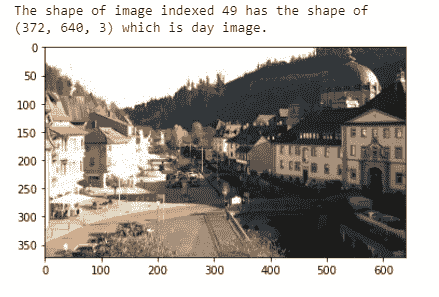

# 我如何在完全没有机器学习的情况下构建一个图像分类器

> 原文：<https://towardsdatascience.com/how-i-built-an-image-classifier-with-absolutely-no-machine-learning-1480d77d9d3f?source=collection_archive---------19----------------------->

## [实践教程](https://towardsdatascience.com/tagged/hands-on-tutorials)

## 你并不总是需要先进的 ML/DL 算法来达到 93.75%的准确率


来自 [Pexels](https://www.pexels.com/photo/couple-under-hut-beside-sea-and-infinity-pool-1024967/?utm_content=attributionCopyText&utm_medium=referral&utm_source=pexels) 的照片

“这个解决方案看起来很有希望，但是让我们回到您的问题上来。部署此解决方案的投资可能有点太高了。”

我很失望。我们都知道那最终意味着什么。

我们怎么会没想到呢？我们过分关注解决方案的准确性和性能，忽略了基础设施成本。

那时，我意识到我需要学习和应用传统的图像处理技术，这些技术不像高级机器学习方法那样需要大量的计算和基础设施成本，但仍能提供可接受的性能水平。

那么我们如何使用传统的图像处理来解决问题呢？我不是计算机视觉专家，但我学到了一些东西，我将与你分享。

# 作品集项目:昼夜图像分类器

出于显而易见的原因，这与我之前谈到的问题不同，但我们可以说它有些相似。

我们建立了一个简单的分类器，给定一幅图像，它可以正确地识别这是白天还是夜晚的图像。大多数基于现实世界视觉的系统都需要区分白天和黑夜。

将此作为我的项目组合之一后，我不断收到面试官对基本思维过程的积极回应。我相信你会从你的投资组合中受益。

这个项目的数据是从 [AMOS 数据集](http://cs.uky.edu/~jacobs/datasets/amos/)(许多室外场景的存档)中提取的 400 张图像。这些是 RGB 颜色的，包含 200 个白天和晚上的课程——感谢 Udacity 在他们的计算机视觉纳米学位中整合了这个项目。


白天还是晚上？我们来问一下分类器。(像素上的图像像素)

接下来的代码，包括数据集，可以在 GitHub 库中找到[。](https://github.com/arunnthevapalan/day-night-classifier)分支存储库将会给你所需要的一切。

我采取了 5 个步骤的方法，对每一步都有清晰的解释。到本文结束时，您将对这个项目所采用的计算机视觉管道有一个深入的了解。

我们开始吧？

# 步骤 1:加载并可视化数据。

我们在目录中有一组图像。我们的任务是以常规方式加载它和它们的标签，以便它可以用于可视化并在以后构建分类器。

在 Python 中，glob 模块用于检索与指定模式匹配的文件/路径名。使用 matplotlib 的图像模块，我们可以将图像读入内存。

我们需要可视化来更好地理解数据。将相关目录传递给上面的函数将加载数据，使用 matplotlib 的`imshow()`函数，我们可以将图像可视化。对数据有一个正确的理解只会对你有所帮助。

```
# Load training data
IMAGE_LIST = load_dataset(image_dir_training)# Select an image and its label by list index
image_index = 49
selected_image = IMAGE_LIST[image_index][0]plt.imshow(selected_image);
```



作者图片

*   注意到这些图像之间的任何可测量的差异了吗？这有助于以后分离图像类别。
*   注意到不同的图片有不同的大小了吗？当您想要应用任何图像处理(或深度学习)时，这并不理想。

# 第二步:数据预处理。

对于各种视觉问题，预处理至关重要。由于拍摄图像时光线水平和其他因素的变化，图像通常不均匀，难以提取特征。

让我们开始基本的预处理工作，比如标准化图像大小和编码图像标签。

代码是不言自明的。我们将所有图像的尺寸调整为标准尺寸(1100，600)。不一定要选择这个形状，但是无论选择哪个形状，都需要在整个项目中保持不变。

大多数分类问题要求我们用数字格式表示目标类。我们可以使用编码来实现这一点——一个简单的一键编码，其中 1 用于白天图像，0 用于夜晚图像。

我们将`encode()`和`standardize_input()`函数包装成`preprocess()`函数，并用它来标准化我们的图像。既然我们已经加载并预处理了我们的图像，我们就可以从图像中提取特征了(管道中有趣的部分！).

# 第三步:提取特征。

为了从图像中提取特征，我们需要了解图像的一些基本属性。

我们需要提取能够区分白天图像和夜晚图像的特征。当你面临分类挑战时，你可能会问自己:我如何区分这些图像？

我想到的一个特点是，大多数白天的照片都有明亮的蓝天，而且通常更加明亮。在夜间图像中，唯一的光源是一些人造光，背景相对较暗。

我们可以利用这个特性，看看我们是否可以测量它，使它成为一个可以区分阶级的特征。

## 平均亮度作为一个特征

为了量化图像的平均亮度，我们首先需要了解**色彩空间。**第一次听说这个概念的时候，我很迷茫，所以请慢一点，更用心的看完这个。

将**图像视为数字网格**是许多图像处理技术的基础。图像中的每个像素只是一个数值，我们也可以改变这些像素值。这些像素只有一种颜色，由颜色空间表示。

最常见的色彩空间是 **RGB** ，代表红色、绿色和蓝色三个通道。因此，图像中的每个像素都可以用 RGB 颜色空间中的这 3 个数字来表示。但是也有其他有用的颜色空间。

例如，另一个颜色空间是**HSV**——代表**色调、饱和度和值**。这三个分量随着图像各种事物而变化:

*   **色调**在阴影下甚至高亮度下保持一致。
*   **值**在不同的光照条件下变化最大。
*   **饱和度**描述特定颜色的灰色量。

有了这些信息，我们现在可以回去推导平均亮度。怎么会？以下是我们将遵循的步骤。

1.  将图像转换到 HSV 颜色空间(正如我们上面解释的，值通道是亮度的近似值)
2.  将值通道中所有像素的值相加
3.  将亮度总和除以图像面积，图像面积就是宽度乘以高度。

这给了我们一个值:图像的平均亮度。这是一个可测量的值，可以用作手头分类问题的一个特征。让我们在一个函数中实现这些步骤。

我们可以创建更多的特性，但是对于这个例子，让我们保持简单。现在我们有了一个特性，我迫不及待地想和你一起构建分类器。

# 步骤 4:构建分类器。

我们已经如此习惯于先进的机器学习算法；我们忘记了分类器的主要功能。就是把两个班分开。我们定义了一个特征，我们需要一种基于该特征来分离图像的方法。

分类器可以像条件语句一样简单，它检查平均亮度是否高于某个阈值(T17)，然后将该图像标记为 1(白天)，如果不是，则标记为 0(夜晚)。

让我们实现这个功能，好吗？

不过，有一个问题，什么是可接受的阈值？通常我们寻求领域专家的建议来理解这些值，但是这里因为我们有足够的训练图像，我们可以用它们来估计一个。

我们的下一个任务是调整阈值，理想情况下在 0–255 的中间。我尝试了不同的值，并用各种训练图像进行检查，看看我是否正确地对图像进行了分类。最终，我勉强接受了 99。

现在我们已经建立了一个分类器，让我们看看如何评估模型？

# 步骤 5:评估分类器。

每个模型都需要根据看不见的数据进行评估。还记得我们为测试保留的数据吗？我们需要通过分类运行测试图像，并评估模型的准确性。

为了找到模型的准确性，我们需要找到错误分类图像的数量。这样做相当简单。我们编写了一个函数，它获取带有真实标签和阈值的图像，使用分类器预测标签，并将其与实际标签进行比较。

既然我们已经编写了函数，我们需要确保测试图像的预处理方式与训练图像相同。

你知道我得到的最终精度值吗？**惊人的 93.75%！**根据您之前选择的阈值，该值可能会波动，因此可以随意调整参数并进行试验。

对此的改进是从图像中创建更多的特征，并将它们添加到分类器中，以进行更鲁棒的分类。

现在我知道这是一个小得多的数据集的简单问题；然而，这表明我们仍然可以在不使用昂贵的高级机器学习算法的情况下解决计算机视觉问题。有时传统的图像处理是你所需要的。

# 最后的想法

我们在计算机视觉管道中寻找日夜分类器的投资组合项目。我们在整个流程中使用了一步一步的方法来构建这个分类器。

*   加载和可视化数据
*   数据预处理
*   提取特征
*   构建分类器
*   评估分类器

我们在整篇文章中实现了代码，编译后的版本可以在 GitHub 库中的[获得。](https://github.com/arunnthevapalan/day-night-classifier)

感谢您一直关注这篇文章；如果你有任何问题或反馈，欢迎[在 LinkedIn 上打招呼。](https://www.linkedin.com/in/arunn-thevapalan/)

该项目的重点是展示传统方法的价值，并认识到先进的机器学习并不总是可行的。

这是对我们自己的现实检查，我们倾向于采用高级机器学习方法，因为它通常会带来更高的性能，但往往是以昂贵的计算能力为代价的。

现在，我探索各种方法，并在开发产品之前评估可解释性、基础设施、性能和成本之间的权衡。

从那以后我再也没有听到过客户说不。

*想了解更多关于进入数据科学、有趣的合作和指导的有用见解，请考虑* [***加入我的电子邮件好友私人列表*** *。*](https://friends.arunnthevapalan.com/)