# 我如何在 AWS 上为 Apache Airflow 中的数据管道构建 CI/CD

> 原文：<https://towardsdatascience.com/how-i-built-ci-cd-for-data-pipelines-in-apache-airflow-on-aws-aae029fe557e?source=collection_archive---------11----------------------->

## 现代数据工程需要自动化部署流程

来自 [Pexels](https://www.pexels.com/photo/photo-of-skyline-at-night-3075993/?utm_content=attributionCopyText&utm_medium=referral&utm_source=pexels) | [品牌内容披露](https://www.annageller.com/disclosure)

A pache Airflow 是构建数据工程工作负载的常用平台。部署气流的方式如此之多，以至于很难提供一个简单的答案来说明如何建立一个持续的部署过程。在本文中，我们将重点关注作为“DAG 存储”的 S3，并演示一种实现健壮的 CI/CD 管道的简单方法。

**目录**

[在 AWS 上创建 Apache Airflow 环境](#bb6a)
[Git 存储库](#f490)
[为数据管道构建简单的 CI/CD](#dd3a)
[在 Airflow 中测试数据管道的 CI/CD 流程](#25f1)
[我们如何让 CI/CD 管道在生产中更加健壮？](#1669)
[Buddy 如何处理代码的变更？](#eb8d)
[数据管道自动化部署流程的优势](#0d3d)
[如果您使用不同于 Apache Airflow 的工作流编排解决方案会怎样？](#bc15)
结论

# 演示:在 AWS 上创建 Apache 气流环境

自 2020 年 12 月起，AWS 为阿帕奇气流提供名为 MWAA 的全面托管服务。在本演示中，我们将构建一个 MWAA 环境和一个持续交付流程来部署数据管道。如果您想了解更多关于 AWS 上的托管 Apache 气流的信息，请阅读下面的文章:

</managed-apache-airflow-on-aws-new-aws-service-for-data-pipelines-91908ee9e5fc>  

我们从**在 AWS 管理控制台中创建一个气流环境**开始。整个过程是自动化的，你只需要点击一个按钮来部署一个 CloudFormation 堆栈，它将**创建一个 VPC** 和所有相关的组件，然后填充一些关于**你想要构建的实际环境**的细节。环境类，工人节点的最大数量)。

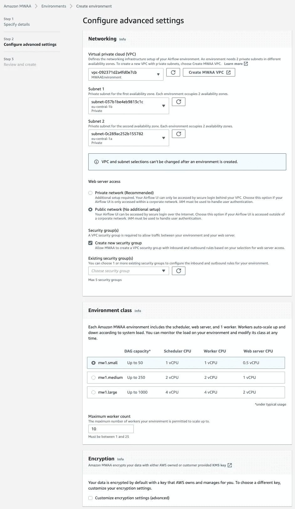

在自动气象站上配置 MWAA 气流环境—图片由作者提供

一旦创建了环境，我们就可以通过构建一个连续的交付流程来开始部署我们的数据管道，该流程会自动将 Dag 推送到适当的 S3 位置。

# Git 储存库

对于这个演示，我们将使用一个简单的设置，它将只包括开发和主分支。这样，在推送到`dev`分支时，我们可以自动部署到我们的 AWS 开发环境。

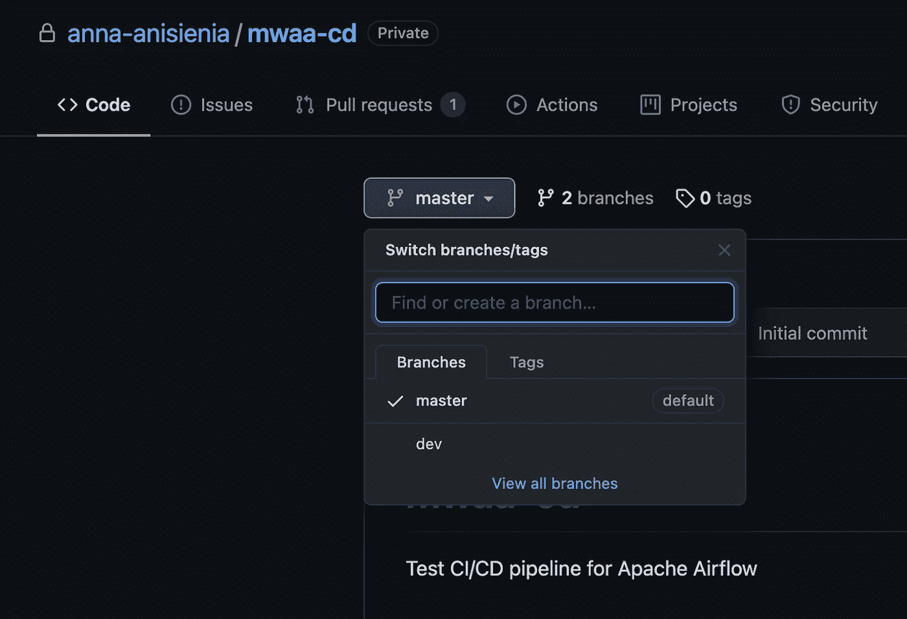

演示 Git 存储库—作者图片

# 为数据管道构建简单的 CI/CD

要在短短五分钟内构建一个 CD 进程，我们将使用 [Buddy](https://buddy.works/) 。如果你想试试，自由层允许[最多五个项目](https://buddy.works/pricing)。

#1.创建一个**新项目**并选择您的 Git 托管提供商。对我们来说，是 Github:

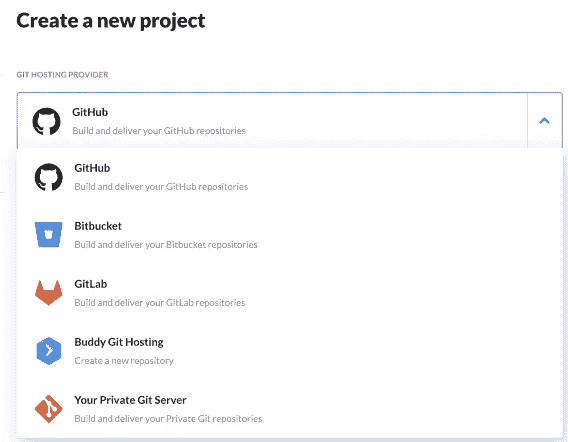

在 Buddy 中构建 CI/CD 管道—作者图片

#2.添加一条**新管道**。这表明在同一个项目中可以有几个管道。例如，您可以有一个部署到**开发(dev)** 的管道，一个部署到**用户验收测试(uat)** 的管道，以及一个部署到**生产(prod)** 环境的管道。

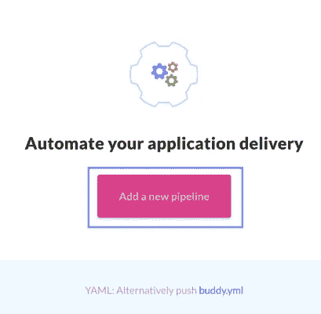

在 [Buddy](https://buddy.works/) 中建立 CI/CD 管道—图片由作者提供

#3.配置**时**管道应**触发**。对于这个演示，我们希望代码在每个**推**到`dev`分支时被部署到 S3。

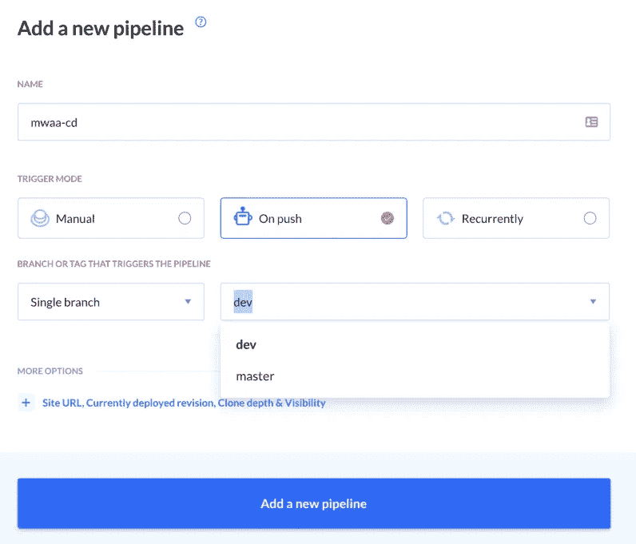

在[好友](https://buddy.works/)中构建 CI/CD 管道—图片由作者提供

#4.新增一个**动作**。在这里，我们可以为部署流程添加所有构建阶段。对于这个演示，我们只需要一个将代码**上传到 S3 桶**的过程，但是你可以从各种动作[中选择](https://buddy.works/actions)来包含额外的单元和集成测试等等。现在，我们选择动作*“将文件传输到 Amazon S3 bucket”*，并配置从 Git 文件夹`dags`对 Python 文件的任何更改都应该触发到我们选择的 S3 bucket 的部署。

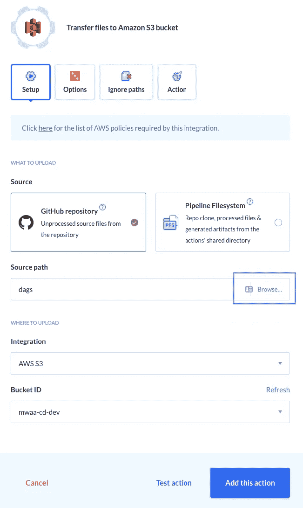

配置“操作”将代码上传到 S3 —图片由作者提供

#5.配置附加的**“选项”**以确保正确的文件类型将被上传到正确的 S3 子文件夹。对于此演示，我们希望我们的 DAG 文件将部署到文件夹`dags`中，如下所示:

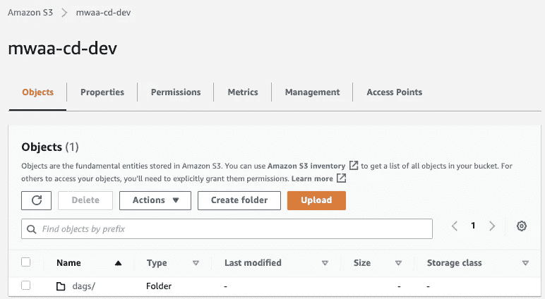

S3 位置—作者图片

通过使用相同的*动作*，转到右侧的**“选项”**选项卡，在 S3 上配置远程路径:

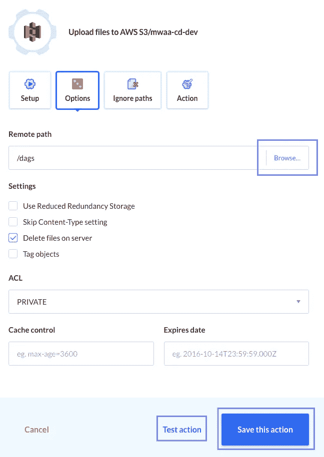

在 [Buddy](https://buddy.works/) 中构建 CI/CD 管道—图片由作者提供

选择适当的 S3 路径后，我们可以测试并保存动作。

可选地，我们可以指定**忽略特定的文件类型**。例如，我们可能想要排除单元测试( *test** )和文档降价文件( **)。md* ):

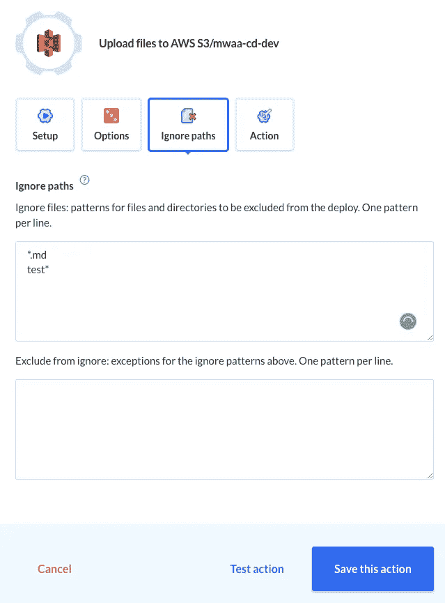

在 [Buddy](https://buddy.works/) 中建立 CI/CD 管道—图片由作者提供

#6.这一步是可选的，但是如果在部署过程中出现问题，通知**是很有用的。我们可以配置几个动作，如果 CI/CD 管道出现问题，就会触发这些动作。**

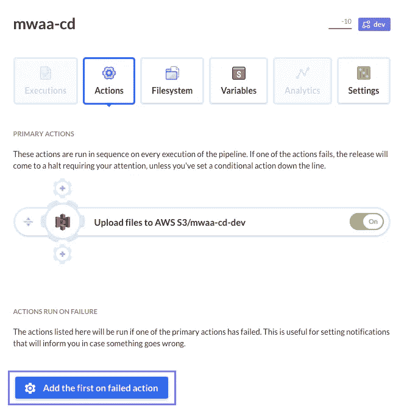

在[好友](https://buddy.works/)中建立 CI/CD 管道—图片由作者提供

我们选择在行动失败时通过电子邮件获得通知:

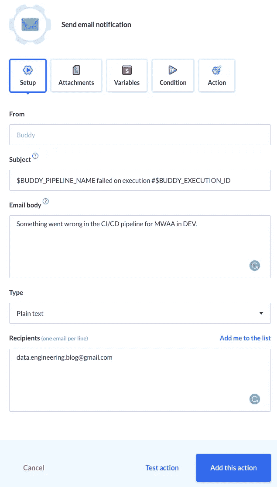

在[好友](https://buddy.works/)中发送失败通知——图片由作者提供

# 在气流中测试数据管道的 CI/CD 过程

我们现在准备将一个示例数据管道推到我们的环境中。我们可以看到，最初，我们没有 Dag。

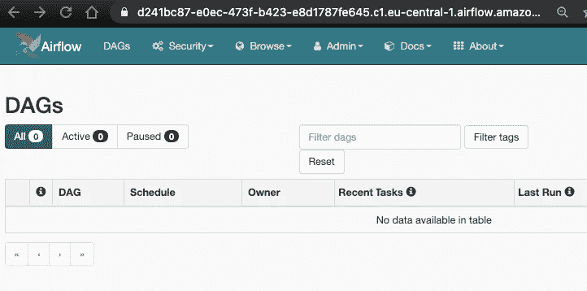

气流 image 图片作者

我们现在将两个新文件推送到`dev`分支——其中一个是 **DAG 文件**，另一个是应当排除的 **markdown 文件**。

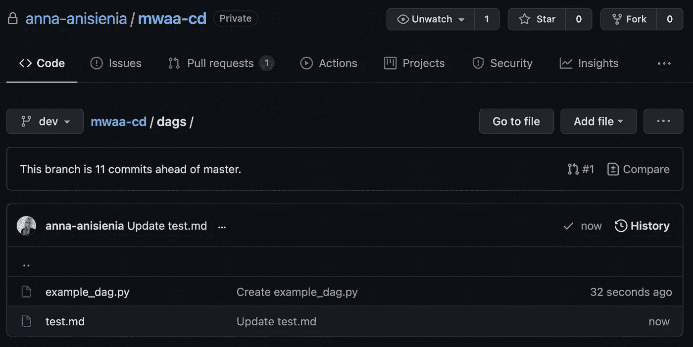

测试 CI/CD 管道的初始推送—图片由作者提供

因为我们是分别提交和推送的，所以我们可以看到，每次 Git 推送都会触发一次管道:

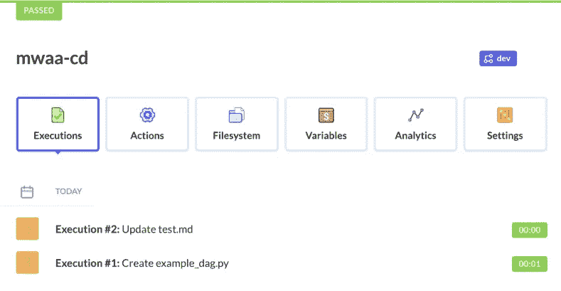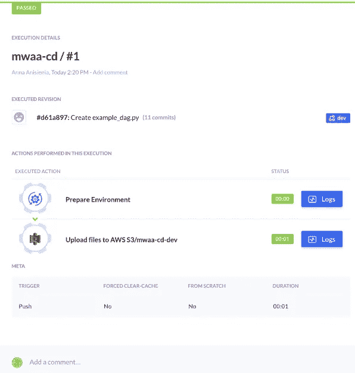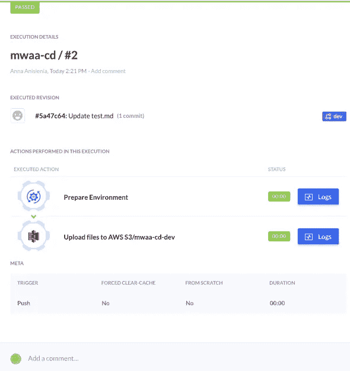

在[好友](https://buddy.works/)中触发的 CI/CD 管道—图片由作者提供

我们可以确认只有 Python 文件被推送到 S3:

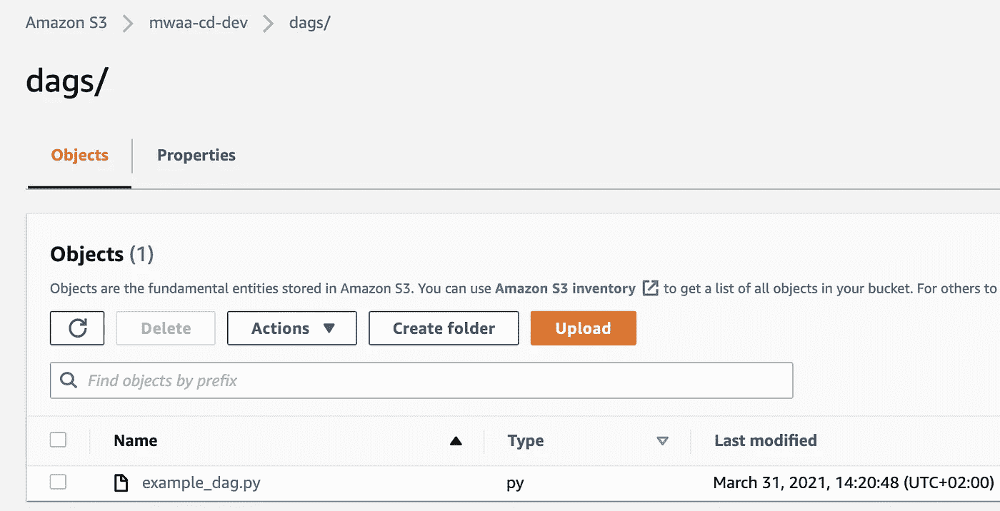

AWS 上气流数据管道的 CI/CD 管道—图片由作者提供

AWS 上的 MWAA 气流环境自动选择了来自 S3 的 DAG:

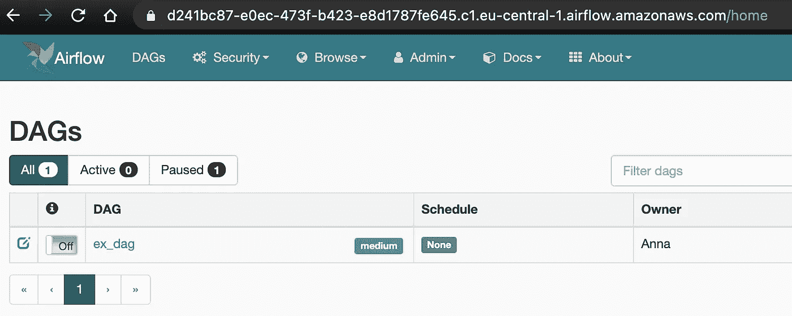

AWS 上气流数据管道的 CI/CD 管道—图片由作者提供

我们的演示到此结束。

# 我们如何让 CI/CD 渠道在生产中变得更加强大？

如果您想在您的管道中包含一个额外的批准步骤，您可以在代码被推送到 S3 之前，在 Buddy 中添加一个相应的**“等待批准”**动作。为了更方便，我们还可以添加一个动作给负责生产环境的高级开发人员发送一封关于构建过程的电子邮件。然后，代码只有在事先批准后才能部署。

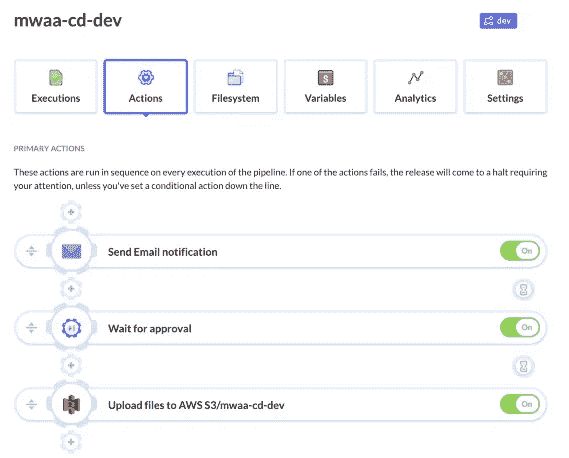

添加两个附加操作来通知构建过程，并添加手动批准步骤—按作者分类的图像

# Buddy 如何处理代码的更改？

你可能会问:Buddy 是如何处理代码变更的？每次我们对存储库进行任何更改时，它会重新上传您的所有 Dag 吗？答案是否定的。**初始** CI/CD 管道的执行将从指定的存储库路径上传所有文件。然而，每个后续的执行都使用**“git diff”**来创建变更集。基于`diff`，在 S3 中只有被添加、修改或删除的文件才会被更改。

删除是一个特例，Buddy 允许我们配置在 Git 中删除一个文件是否也应该删除远程服务器(S3)上的代码。对于这个演示，我们选择删除文件，以确保所有东西(*包括 Dag*的删除)都通过 Git。但是您可以根据自己的意愿自由配置它。

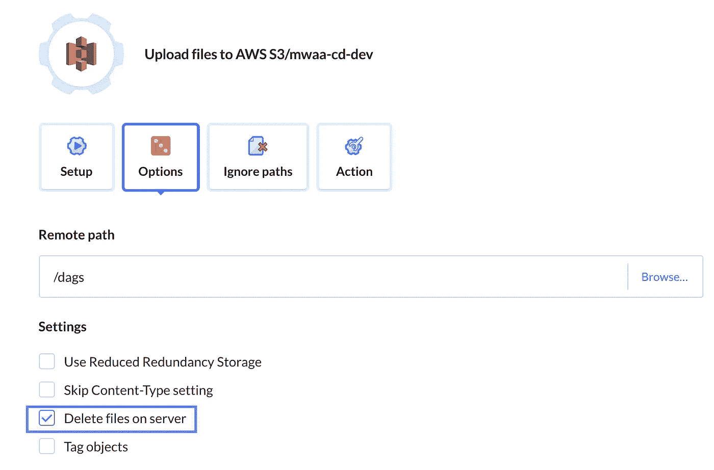

如何处理 Git 存储库中删除的文件——作者图片

# 数据管道自动化部署流程的优势

由于 Apache Airflow 在撰写本文时不提供 DAG **版本控制**,这种 CI/CD 管道方法允许您通过 Git 提交历史记录跟踪对 DAG 所做的任何更改。此外，您还获得了一个标准化的、**可重复的流程**，该流程消除了手动部署中的**人为错误**，并确保除非在您的 Git 存储库中进行了版本控制，否则不会部署任何东西。

# 如果您使用不同于 Apache Airflow 的工作流编排解决方案会怎样？

如果您喜欢使用开源工作流编排工具而不是 Airflow，您也可以使用 [Buddy](https://buddy.works/) 来管理这些数据管道的构建过程。例如，Prefect 或 Dagster 都利用 GraphQL 并支持容器化环境，这使得自动化数据工程工作负载的部署变得简单。

# 结论

本文研究了如何在 Apache Airflow 中为数据管道构建 CI/CD 流程。现代数据工程需要自动化部署流程。始终使用版本控制系统来管理您的代码并基于您的 Git 工作流自动化构建过程是一个很好的实践。

**感谢您的阅读！如果这篇文章有用，** [**关注我**](https://medium.com/@anna.anisienia) **看我下一篇帖子。**