# 我如何构建我的 ML 工作站🔬

> 原文：<https://towardsdatascience.com/how-i-built-my-ml-workstation-f799c1de0341?source=collection_archive---------5----------------------->

## 关于构建定制 ML 工作站的完整故事。从零件挑选到软件安装和使用。

我试图打开工作站部件

Kaggle 内核和 Google Colab 都很棒。

如果这篇文章不是关于构建一个定制的 ML 工作站，我会在这里放下话筒。

总有一些“但是”让我们的生活更加艰难。当你开始处理接近现实生活的问题时，你会看到数百亿字节的大型数据集，你的直觉开始告诉你，你的 CPU 或 AMD GPU 设备不足以做有意义的事情。我就是这样来到这里的。

我正在参加 Kaggle 上的[人类蛋白质图谱(HPA)——单细胞分类](https://www.kaggle.com/c/hpa-single-cell-image-classification)比赛。HPA 数据集包含近 150Gb 的 8 位 4 通道蛋白质图像。数据集的 16 位变体可容纳 350Gb。

以下是我手头的资料:

*   MacBook Pro 2019(英特尔酷睿 i9 和英特尔 UHD 显卡 630 1536MB 和 16GB DDR4)
*   Kaggle 内核每周约 30 小时 GPU 和/或约 30 小时 TPU 时间

听起来不错。我认为我将能够在本地制作原型，然后在云 GPU 上执行笔记本。什么会出错？

# 没有 GPU 的生活

事实证明，在提到的工作流程中有很多摩擦。

首先，我的解决方案源代码很快就变成了一个拥有大量源代码和依赖项的完整项目。我使用[诗歌](https://python-poetry.org/)作为包管理器，并决定每当我对项目进行有意义的更改时生成一个可安装的包，以便在云中测试它们。我把这些可安装的包上传到一个私有的 Kaggle 数据集，这个数据集又被安装到一个笔记本上。笔记本正在调用包中的类和函数。

这种方法原来有水下石头。Kaggle 笔记本安装项目包后随机抛出怪异错误。我认为这与依赖版本不匹配有关，我发现了类似“在包 Y 中找不到方法 X”等错误。自动加载没有帮助。连续几个早晨，我开始了一天的工作，处理新的和新的突然出现的神秘问题。

在比赛期间，我从 Keras 转到 PyTorch。PyTorch 在 CPU 上比 TensorFlow 或者 Keras 慢很多。甚至对我最近的更改进行开发运行都非常耗时。然而，PyTorch 在学术和其他 ML 相关的社区中有突出的支持，这意味着一堆(**几乎**)最新技术的阅读使用范例。

此外，当你在云中运行你的代码时，你不能轻易试验。你必须计划好你要试验的东西，并事先让这些地方变得可配置。

总而言之，这次经历令人沮丧。我清楚地意识到，如果我想做更复杂的深度学习实验和项目，那么我只需要全天候访问任何类型的 GPU。

# 调查

我从未对定制 PC、硬件或游戏感兴趣。所以我花了一段时间才明白我做一台定制机花了多少钱。

有很多关于构建游戏电脑的资源。虽然构建深度学习工作站听起来像是一项类似的任务，但为了构建一台具有成本效益和 ML 兼容性的机器，应该考虑一些细微差别。

我发现了一些有用的博客帖子，它们帮助我迅速掌握了这个话题。特别是，我可以强调来自 [Tim Dettmers](https://twitter.com/Tim_Dettmers) 的两个帖子:

*   [深度学习全硬件指南](https://timdettmers.com/2018/12/16/deep-learning-hardware-guide/)
*   [深度学习用哪个(哪些)GPU:我在深度学习中使用 GPU 的经验和建议](https://timdettmers.com/2020/09/07/which-gpu-for-deep-learning/)

在他的博客中，Tim 详细解释了 ML 工作站的每个 PC 部件的重要性，并提供了选择它们的一般建议。在这里，我将提到对我有帮助的信息以及 Tim 没有关注的细节。

此外， [PCPartsPicker 的 Builder](https://pcpartpicker.com/) 在规划 PC 期间非常有用。它建议了可能的组件兼容性以及在订购列表之前需要检查的内容。这有助于克服我一直以来的恐惧，我可能会买一些不能一起工作的东西。

# ML 构建的零件

在构建深度学习机器(或任何定制 PC)时，有 8 个部分应该考虑:

*   [GPU](https://www.romaglushko.com/blog/how-i-built-my-ml-workstation/#gpu)
*   [主板(又名 MoBo)](https://www.romaglushko.com/blog/how-i-built-my-ml-workstation/#motherboard)
*   [CPU](https://www.romaglushko.com/blog/how-i-built-my-ml-workstation/#cpu)
*   [闸板](https://www.romaglushko.com/blog/how-i-built-my-ml-workstation/#ram)
*   [存储](https://www.romaglushko.com/blog/how-i-built-my-ml-workstation/#storage)
*   [电力系统单元(PSU)](https://www.romaglushko.com/blog/how-i-built-my-ml-workstation/#power-system-unit)
*   [冷却](https://www.romaglushko.com/blog/how-i-built-my-ml-workstation/#cooling)
*   [电脑案](https://www.romaglushko.com/blog/how-i-built-my-ml-workstation/#pc-case)

以下是一个概述:

# 国家政治保卫局。参见 OGPU

GPU 是**任何 ML 工作站的关键组件**。它被设计成并行地对**大块数据**(吞吐量优化)**执行计算，这使得它非常适合真正需要的模型训练或推理([细节在此](https://www.quora.com/Why-are-GPUs-well-suited-to-deep-learning/answer/Tim-Dettmers-1))。**

**首先要考虑的是，我们只需要 **NVIDIA 显卡**用于深度学习。不幸的是，ML 框架世界存在垄断。大多数流行的和生产就绪的框架(TensorFlow、PyTorch、Keras)都是为支持 CUDA 的设备设计和优化的。CUDA 是 NVIDIA 拥有的用于并行计算的专有平台和 API 集。这就是我们在 ML 环境中谈论 GPU 时使用“CUDA 卡”的原因。**

**稍微深入一点简化的 CUDA 架构是有意义的。现代 GPU 基于**张量核**，能够在一次运算中乘以 **4x4 矩阵，速度极快。尽管如此，张量核需要数据来进行计算。为了有效地加载数据，数据通过以下方式传递:****

*   ****从 RAM 到全局 GPU 内存**。CPU 线程将预处理批处理加载到完全独立的 GPU 设备内存中(不要与 PC RAM 混淆)。设备内存是 GPU 中最慢的一种内存。**
*   ****从全局 GPU 内存到共享内存**。共享内存比全局 GPU 内存快**10-50 倍**，但它也小得多(通常是数百 kb)。这种内存完全可用于流多处理器(SM ),它是 GPU 架构中 CPU 内核的模拟。数据存储在所谓的瓦片中。**
*   ****从共享内存到张量核心注册表**。流式多处理器并行操作其张量核，并将部分切片上传到张量核注册表中。**

**因此，数据加载流程中的任何瓶颈都将导致张量核的次优利用，无论您的 GPU 中有多少个张量核。**

**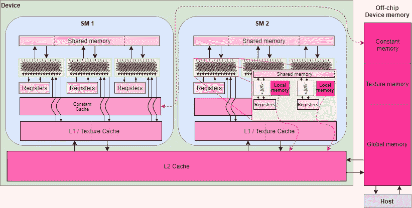**

**CUDA 硬件架构([来源](https://dadaiscrazy.github.io/usuba/2020/03/28/CUDA-basics.html)，附图片作者权限)**

**也就是说，这些大致是对 ML 任务重要的主要 GPU 特性:**

*   ****全局 GPU 内存** —定义在训练期间可以使用的批量大小，或者在计算机视觉方面可以使用的样本质量**
*   ****内存带宽** —设备内部传输数据的速率**
*   ****建筑** —越新的建筑越好。较新的架构在共享内存大小、功能集(如混合精度计算)方面可能更好，在每有效计算瓦特数指标方面可能更高效。**

**此外，您应该考虑这些因素:**

*   ****单位成本性能****
*   ****GPU 散热****
*   ****GPU 瓦数****

**谢天谢地，你可以在 Tim 的文章中找到更多的信息。**

# **母板**

**主板集成了大多数组件，还提供:**

*   **大多数 I/O 端口(如 USB、以太网等)**
*   **带 BIOS 的芯片组**
*   **WiFi、蓝牙适配器**

**主板提供其他接口为你的东西供电。其中，最重要的一个是 CPU 插座。主板分为不可互换的 AMD 和 Intel 兼容插座。因此，你需要确保你选择的 CPU 与你的主板兼容。**

****PCI 端口的数量**是另一个需要考虑的事情。由于 PCI 端口用于连接 GPU，因此您需要提前规划您的构建和升级空间(例如，为了能够在将来添加更多的卡)。另外，请注意，图形卡实际上占用了不止一个插槽的空间。我们希望**卡之间有尽可能多的空间**，以便**更好的空气冷却**。**

**此外，我很肯定你会很高兴有内置的 WiFi 适配器。否则，连接 PC 的唯一方法是通过以太网电缆，这并不总是很方便(或者只需购买外部适配器)。**

# **中央处理器**

**CPU 是 GPU 的“左右手”。在 ML 版本中，CPU 用于:**

*   ****预处理数据集****
*   ****将批次载入 RAM****
*   ****将批处理从 RAM 传输到 GPU 全局内存****
*   ****运行 GPU 设备中的功能****

**所以 CPU 频率高其实没什么帮助。尽管如此，能够有效地并行执行小任务还是很重要的。换句话说，**线程和**内核的数量是 ML 机器的重要属性。**

# **随机存取存储**

**说到 RAM，**内存容量**才是最重要的。如果有足够的内存来运行模型训练而不退回到**交换**，那就完美了。更大的容量将允许运行更大批量的数据和执行更多的数据加载器，以减少 GPU 的等待时间。**

**RAM 在**数据处理和特征工程**中也很有帮助。因此，内存越大，对你越好。**

# **储存；储备**

**在深度学习中，存储用于**持久化数据集**。因为现在数据集是以千兆字节来衡量的，所以至少有几兆字节的空闲磁盘空间是很好的。一般来说，人们安装 SSD 是为了满足操作系统的需求和当前正在使用的数据集。硬盘仍然很有帮助，因为它比固态硬盘便宜，而且更容易负担存储其他数据集的 TB 空间。**

**在固态硬盘中，你可以在市场上找到使用更快连接协议的 [NVMe 固态硬盘](https://www.microcontrollertips.com/why-nvme-ssds-are-faster-than-sata-ssds/)。如果你买得起的话，我更喜欢这种固态硬盘。**

# **电力系统单元**

**PSU 让你的电脑充满活力。为了选择你的 PSU，你需要计算你的产品的瓦数消耗。通常有两个最耗电的组件: **CPU 和 GPU**。如果您将它们的功耗相加，并在此基础上再加上 10–15%的功耗(对于其他组件、超频等)，您将大致估算出您的功耗需求。我还使用 [PCPartpicker Builder](https://pcpartpicker.com/) 来估算我的电脑功率。**

**除此之外，您应该考虑 PSU 提供的**插槽和连接器**的数量。**

**这是你可以提前计划的地方。考虑到功耗和连接器，只需包括您将来想要购买的潜在 GPU。**

# **冷却**

**随着巨大的能量而来的是巨大的冷却责任需求。**

**通常，你需要一个空气冷却系统。确保 GPU 之间有足够的空间是一个很好的冷却系统的无开销方法。它在 1–2 个 GPU 设置中特别好。**水冷**是 3+GPU 设置的好选择。**

**CPU 可能会很快变热。所以它们通常和基本的冷却器一起出售。如果你能在热凝胶安装过程中避免大量气泡，这就足够了。如果你想换一个更好的冷却器，确保新的冷却器支持你的 CPU 插座。**

# **电脑机箱**

**计算机机箱保护所有组件免受外部环境的影响。此外，它还可以提供:**

*   ****附加系统冷却器****
*   ****附加 I/O 端口** (USB、C 型等)**
*   ****电缆管理****
*   ****GPU 垂直插槽****
*   **【SATA 磁盘插槽**
*   ****很酷的设计和外观**(嗯，这可能很重要)**

**最重要的考虑之一是**容纳**所有冷却系统和 GPU 的能力。如果你的案子太小，可能会有问题。**

# **我的零件清单**

**创建多 GPU 集群不在我的列表中。然而，我仍然希望有改进的空间。因此，我从 Tim 的模板中选择了[2-GPU 准系统作为我的工作站的基础，并对其进行了一些调整，以匹配我在当地市场上可以找到的东西。这是我最后的组件列表:](https://pcpartpicker.com/user/tim_dettmers/saved/#view=mZ2rD3)**

*   **GPU: [千兆 GeForce RTX 3070 8Gb Aorus Master](https://www.newegg.com/gigabyte-geforce-rtx-3070-gv-n3070aorus-m-8gd/p/N82E16814932359)**
*   **数学板: [MSI x470 游戏升级版](https://www.newegg.com/msi-performance-gaming-x470-gaming-plus-max/p/N82E16813144266)**
*   **CPU: [AMD 锐龙 5 3600](https://www.newegg.com/amd-ryzen-5-3600/p/N82E16819113569)**
*   **RAM: [G.Skill Ripjaws V 系列 32Gb (2 x 16Gb)](https://www.newegg.com/g-skill-32gb-288-pin-ddr4-sdram/p/N82E16820232091)**
*   **存储:[三星 970 Evo 500 GB m . 2–2280 NVME](https://www.newegg.com/samsung-970-evo-plus-500gb/p/N82E16820147742)**
*   **散热:[酷派大师 Hyper 212 黑色版](https://www.newegg.com/cooler-master-hyper-212-black-edition-rr-212s-20pk-r1/p/N82E16835103278)**
*   **PSU: [EVGA G2 750W 80+金](https://pcpartpicker.com/product/MfJwrH/evga-power-supply-220g20750xr)**
*   **电脑机箱: [NZXT H510](https://www.newegg.com/matte-black-nzxt-h-series-h510-atx-mid-tower/p/N82E16811146315)**
*   **无线适配器: [TP-Link 阿彻 T2U Plus](https://www.newegg.com/tp-link-archer-t2u-plus-usb-2-0/p/N82E16833704471)**

**相同的列表可以在 [PCPartsPicker](https://pcpartpicker.com/user/roman-glushko/saved/8gZHGX) 上找到。**

**关于我的列表与原始准系统相比的一些不同之处。根据 Reddit 用户的建议，我更换了准系统的 PSU 和冷却器，他们说改变的部分更现代。**

**还有，我只能买到 750W 版本的 EVGA G2。我估计的瓦数是 420W，所以 650W 的版本应该够用了。然而，更强大的 PSU 在进一步的部件更新方面提供了更大的灵活性。**

**GPU 的情况要复杂得多。这是 GPU 短缺的开始(2020 年底-2021 年初)，GPU 价格飙升了两倍甚至三倍。在这段时间里，比特币跃升至近 6 万美元，以及影响供应链和增加 GPU 需求的其他因素(主要是全球新冠肺炎锁定)。**

**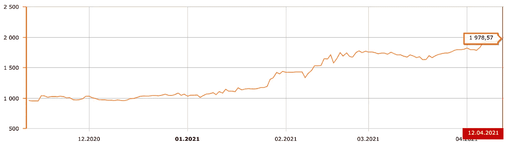**

**GPU 价格动态:2020 年底-2021 年初。狂野时光(*图片作者***

**我已经密切关注价格更新 3 个月了。情况并没有真正改变。我在等的时候情况变得更糟了。**

**考虑到蒂姆的建议和疯狂的 GPU 价格，我拍摄 RTX 3070。RTX 2080 Ti 也非常适合，但市场很快就卖完了。**

**原来有很多厂商生产 RTX 3070 卡。**

**基本上，主要区别在于:**

*   ****马克斯·鲍威尔极限** —影响 GPU 性能。**
*   ****卡冷却系统的质量** —冷却卡并长时间保持性能的能力。**
*   **风扇噪音(Fan Noise)——运行有噪音的卡很烦人(尤其是当你在一个有其他人工作或生活的地方工作时)。**

# **硬件安装**

**我花了几周时间收集所有零件。**

**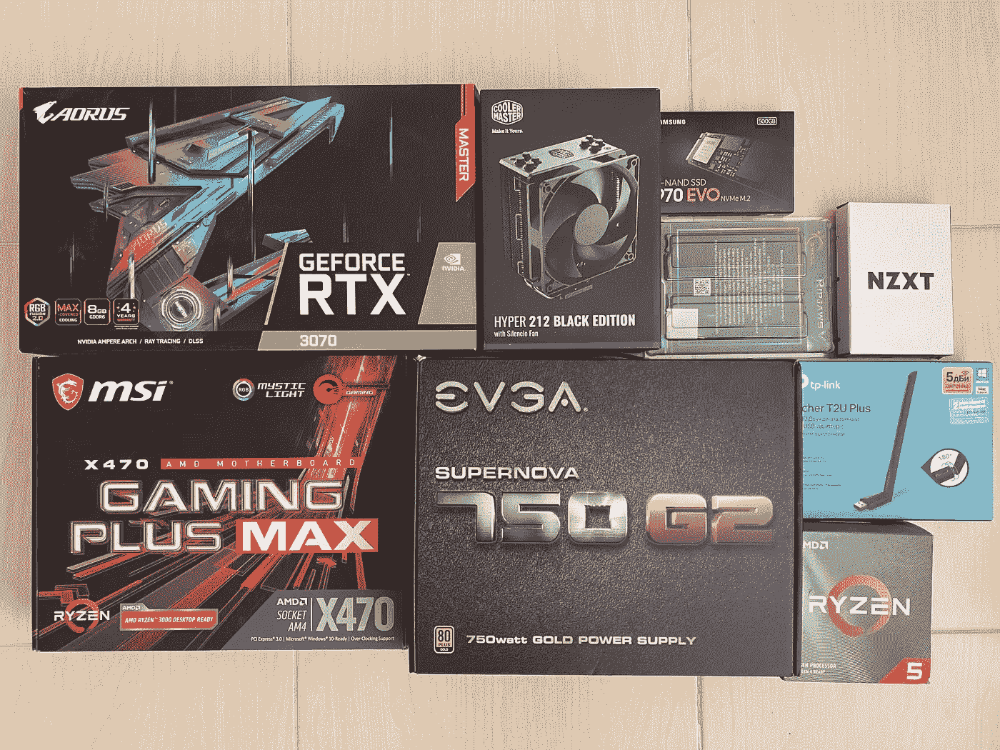**

**电脑零件到了。我想我可以用这些盒子建一座新房子。请继续关注更多更新(作者的*图片)***

**在拆箱之前，请记住以下几点:**

*   **您需要**释放手上的静电**。静电会损坏您的组件，尤其是您的主板。幸运的是，这很容易做到。你需要定期触摸任何金属物体，如电脑机箱、加热器或文件柜。如果你觉得偏执，有[专用腕带](https://www.newegg.com/rosewill-rtk-001/p/N82E16899261001)给你。**
*   **安装或连接组件时要小心。零件和电缆设计为易于连接。如果你发现自己**按得太多**，这很可能是一个信号，让你重新审视你试图连接的东西以及如何连接。例外发生了，因为你可能会买一些从来没有联系过的新东西。**

**现在是我们动手的时候了！**

# **母板**

**主板是一个核心组件。于是我开始从中拆箱。**

**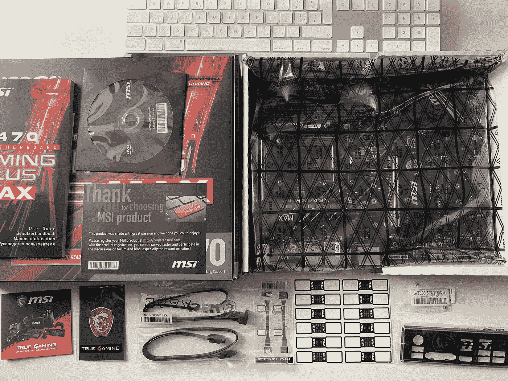**

**主板拆箱(*作者图片*)**

**它有许多端口，我们将在本节中进一步使用。**

**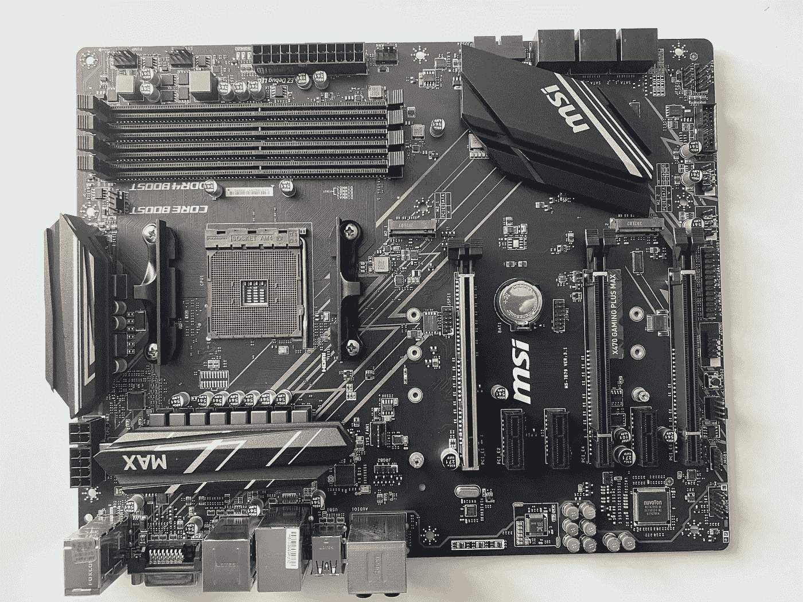**

**主板。详细视图(*作者图片*)**

**安装组件时，MoBo 指令很有用。一定要看一看！**

# **中央处理器**

**现在让我们打开 CPU。CPU 盒包含一个 CPU 芯片本身和一个基本的 CPU 冷却器，它实际上占据了盒子中的大部分空间。**

**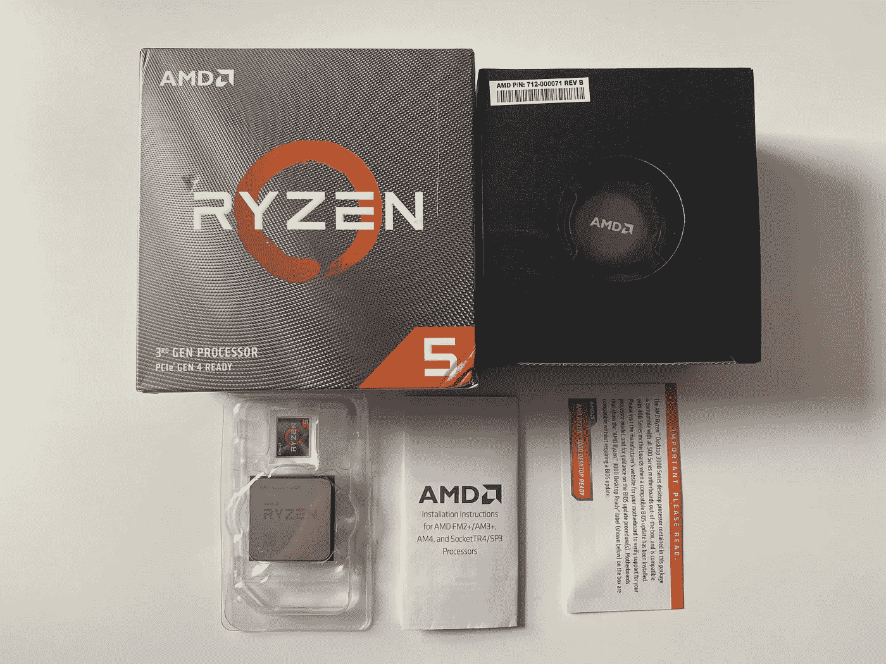**

**CPU 拆箱(*作者图片***

**我们将把中央处理器安装到移动电话上的专用中央处理器插座上。它在我的设置中有 AM4 格式。**

**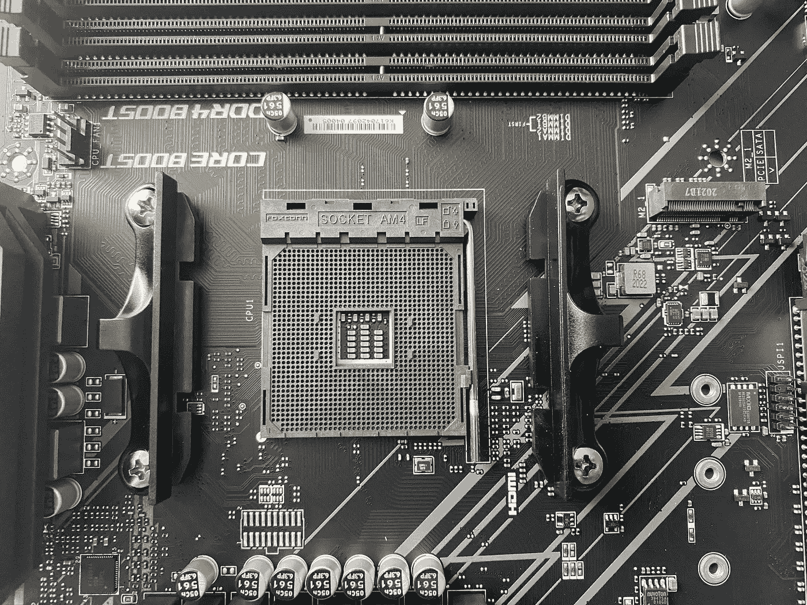**

**CPU 插座(*图片作者***

**对 CPU 管脚要超级小心。它们非常有形。请注意，其中一个边上还有一个金色的小箭头。**

**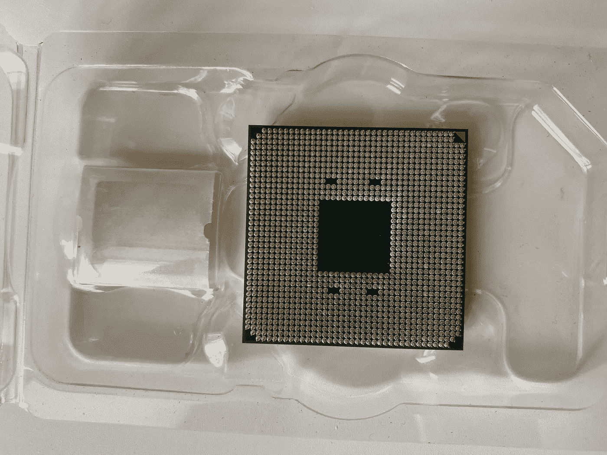**

**CPU 引脚(*图片作者***

**它可以指导你如何连接你的 CPU。只有一种方法可以将**引脚安装到插座中。当金色箭头带状边缘位于 CPU 固定板的左下角时。****

**向下向外推动固定拉杆，松开 CPU 固定板，并按上述方式放置 CPU。**

**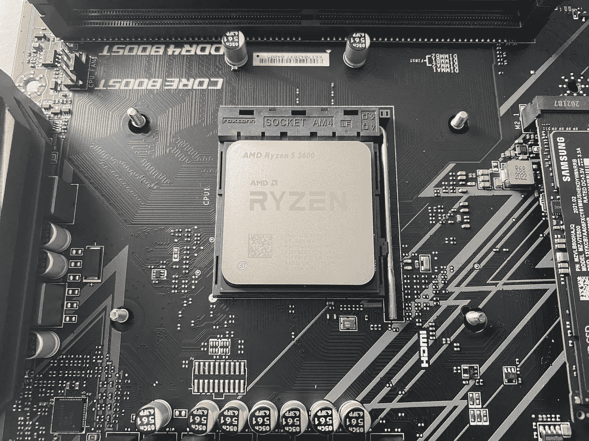**

**已安装的 CPU ( *图片作者*)**

**将固定拉杆推回，牢固安装 CPU 芯片。**

# **（同 solid-statedisk）固态（磁）盘**

**NVMe 固态硬盘比它们的 SATA 朋友小得多。它只是一个放在盒子里的小飞机。**

****

**M.2 SSD 拆箱(*图片作者*)**

**要连接这种固态硬盘，需要使用 M.2 插座。我的 MoBo 有两个。每个都配有一对螺钉和一个安装螺钉。MoBo 有几个不同长度的固态硬盘安装柱。**

**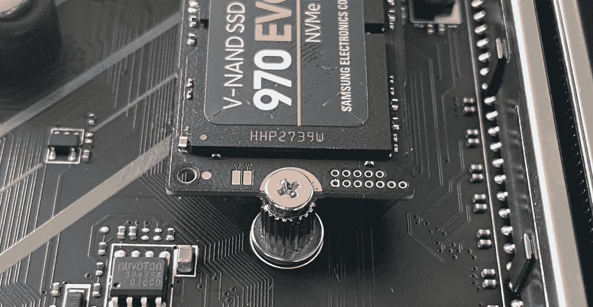**

**NVMe 固态硬盘安装。M.2 螺丝(*图片由作者*提供)**

**只需选择一个与您的 SSD 大小相对应的安装柱，在那里安装一个安装螺钉，并用剩余的螺钉固定 SSD。**

# **随机存取存储**

**RAM 板也很容易安装。**

**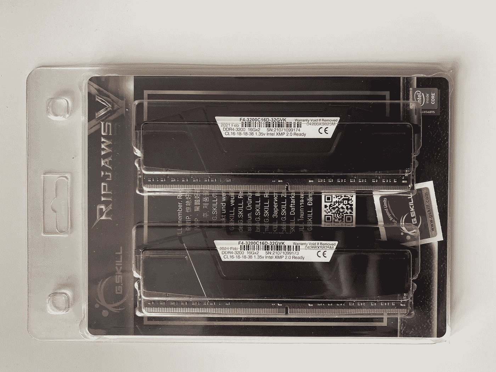**

**RAM 拆箱(*作者图片*)**

**解锁你的 RAM 插槽，并对齐你的 RAM 板与插槽。有**也只有一种方法**可以牢固地安装木板。**

**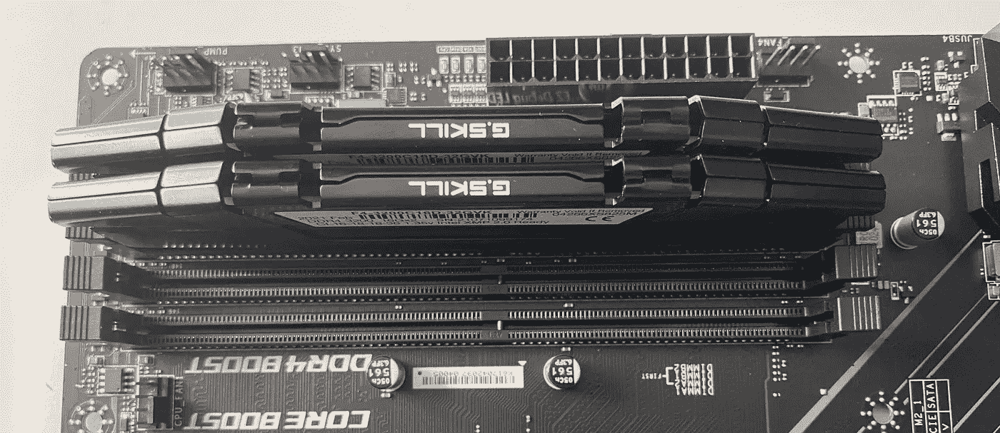**

**RAM 安装(*图片作者***

**请注意，您的 MoBo 指令可能会为不同数量的 ram 指定推荐位置。遵循这些建议！**

# **冷却器**

**人们建议**在安装冷却系统之前，避免给 CPU 通电**。CPU 可能会过热或变弱。**

**我的冷却器设计用于英特尔和 AMD 处理器。因此，冷却器盒实际上包含更多的螺钉和其他细节，比我在这个特定的建设需要。这就是为什么它的背板有如此怪异的形状。**

**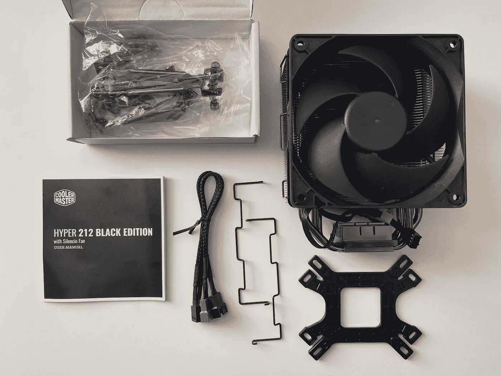**

**冷却器拆箱(*作者图片***

**安装冷却器的第一步是卸载库存背板。**

**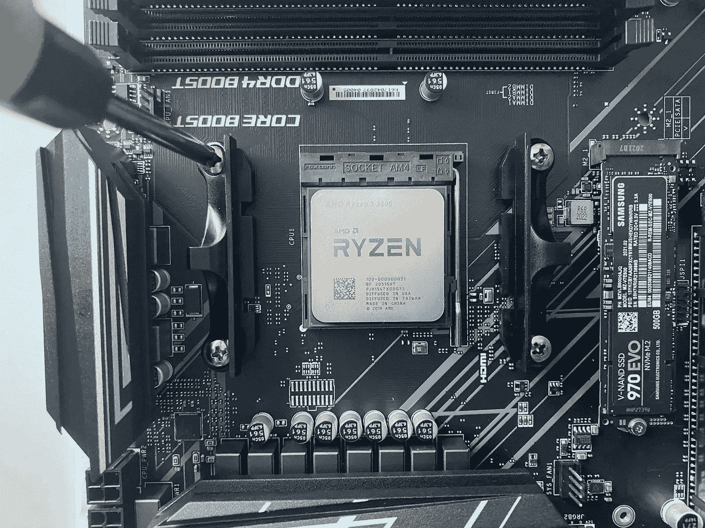**

**卸载库存 CPU 背板(*图片作者***

**这个背板将被另一个随您定制的冷却器一起提供的背板所取代。在我的情况下，我必须以 AMD 兼容的方式组装背板。**

**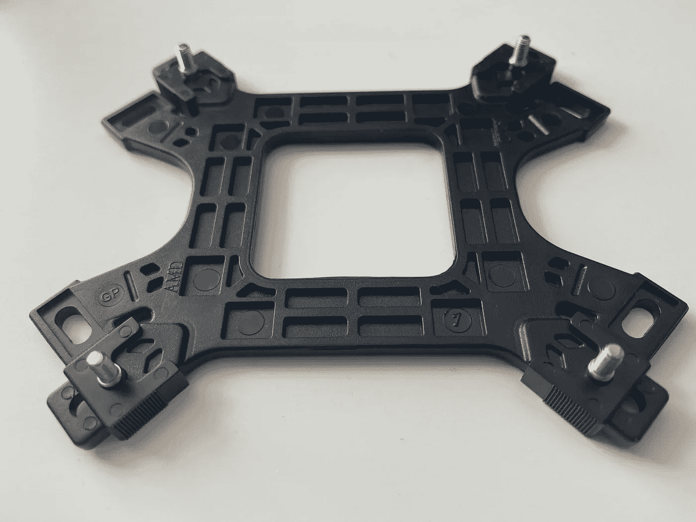**

**冷却器背板(*图片作者*)**

**翻转主板，将新背板上的螺钉与主板匹配。**

****

**安装冷却器背板(*图片由作者*提供)**

**为了最终完成背板安装，您需要安装安装螺钉，实际的冷却系统将连接在这些螺钉上。**

**接下来，你可以组装冷却系统。它通常需要连接较冷的腿，并将其拧紧到背板上。组装后，尝试匹配您的安装螺钉，以确保您的冷却器腿安装正确。**

**在安装冷却器之前，最后一步是安装散热膏。我使用了下面视频中解释的“撒尿”方法。**

**当使用热凝胶时，您需要尽可能地覆盖 CPU 芯片区域，以便更好地去除 CPU 热量。在这个过程中可能出现的气泡会造成伤害。**

**最后，你可以把你的冷却器安装在 CPU 的顶部。按下 CPU 一点，以分配你的热凝胶在表面上。**

**此外，请确保凝胶停留在 CPU 上，因为它可能会损坏您的 MoBo。**

**最后，您可以将冷却器电源线连接到 MoBo 上标记为 CPU_FAN 的最近端口。**

# **PSU 和电脑机箱**

**PSU 盒包括电源单元模块和各种电缆。**

**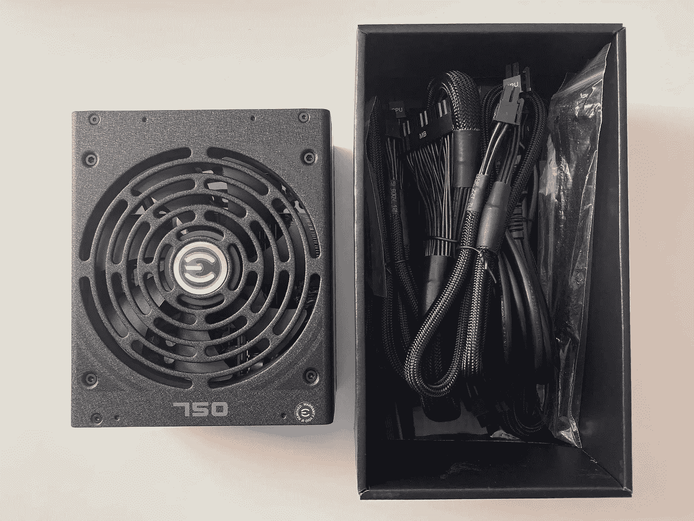**

**电源拆箱(*图片作者***

**电脑机箱只是一个金属盒子，在盒子的相对两侧有两个可移动的面板。**

**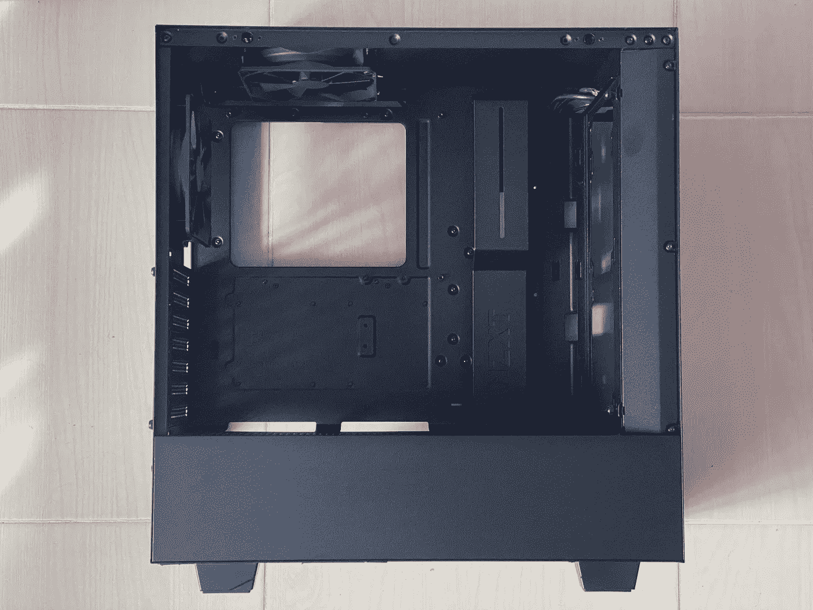**

**没有玻璃面板的电脑机箱(*图片作者***

**在盒子的顶部，您可以看到盒子的前面板。你可以有更多的端口和电源按钮。**

****

**电脑机箱前面板(*图片作者***

**首先，将主板附带的主 I/O 端口盖安装到电脑机箱中。令人惊讶的是，重要的是要确保盖子侧面的所有小插销都完全安装好，并在翻盖上可见。否则，他们可能会阻止你拧紧你的主板。**

**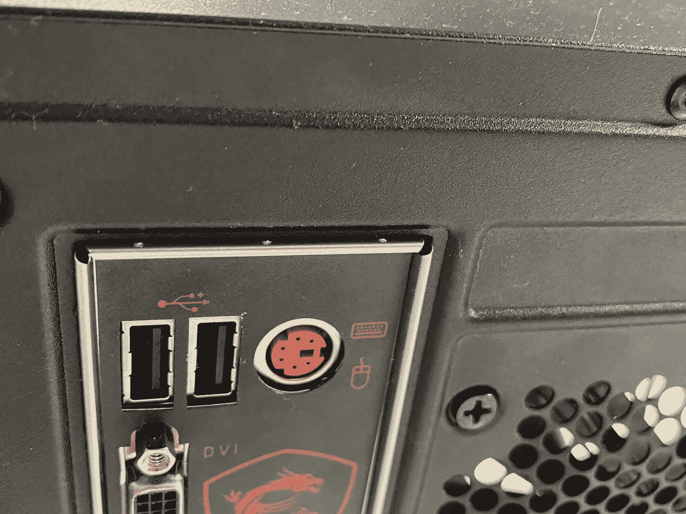**

**I/O 端口盖顶部的三个小金属闩锁。你应该在所有的边上都可以看到它们(作者的*图片)***

**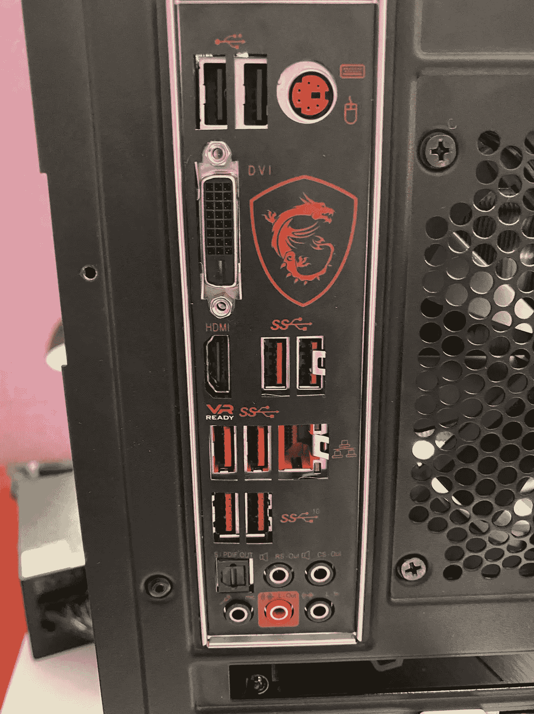**

**主 I/O 端口(*图片由作者*提供)**

**然后，您可以尝试将主板拧紧到机箱安装位置。**

**接下来，您需要连接三根电缆来为系统供电:**

*   **主板电源线**
*   **CPU 电源线**
*   **前面板电源线**

**如何连接 CPU 和主板电源线非常简单。但是，第一次连接前面板电缆可能会有挑战性。下面的视频对我很有帮助:**

**如何将前面板电源接入 JFP 端口？**

**可能还有一些剩余的电缆可以连接到 MoBo。在我的情况下，我有 USB，音频和 C 型电源线。前两个我可以连接，而最后一个需要一个适配器，因为我的 MoBo 没有 C 型端口。所以我把它断开了。对了，PCPartsPicker 可以提前警告你这样的问题。**

**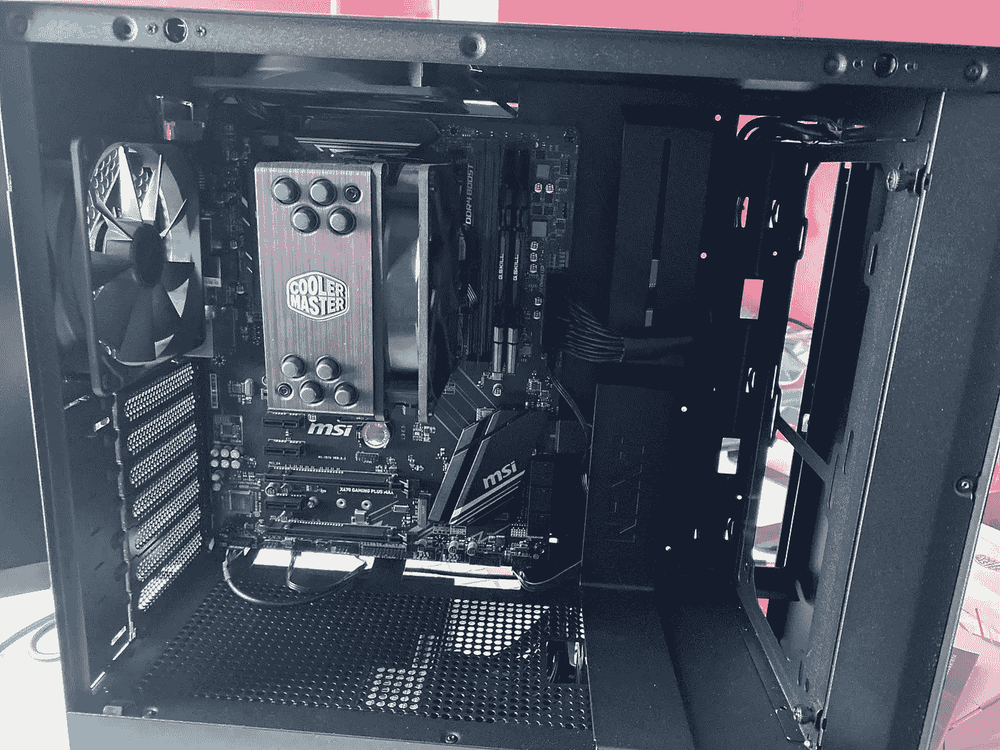**

**主板安装到电脑机箱中(*图片由作者*)**

**此外，您可能需要连接电脑机箱附带的冷却器。**

**此时，你可以试着给你的电脑加电，但是在你安装显卡之前，你将得不到视频信号。**

# **国家政治保卫局。参见 OGPU**

**GPU 盒子包括一个卡本身和一个指令。**

**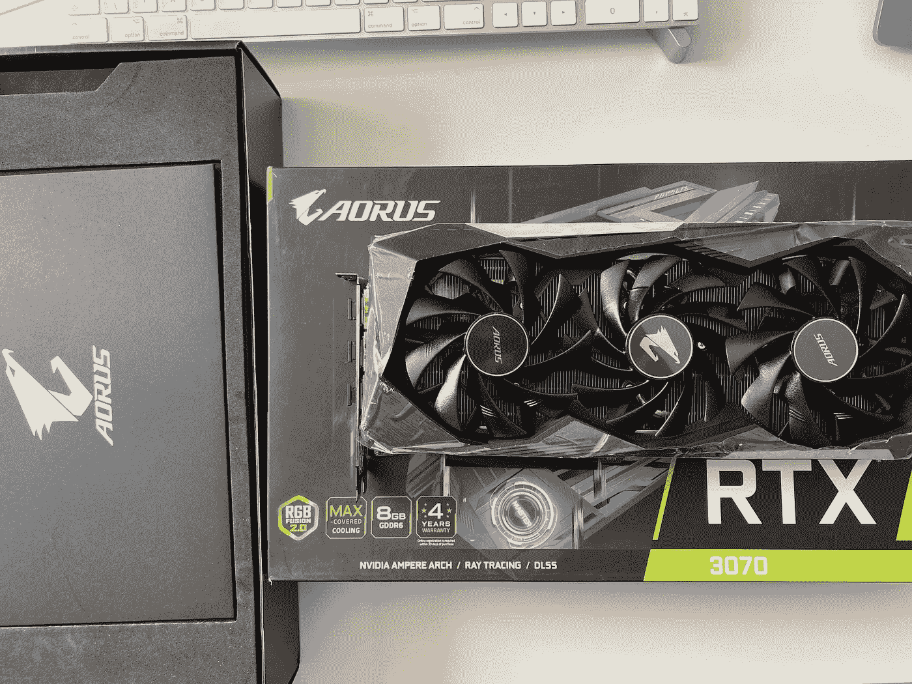**

**RTX 3070 显卡(*图片作者*)**

**我的 GPU 有两个插槽，所以我需要匹配输出盖，用实际的 GPU I/O 端口替换它们。**

**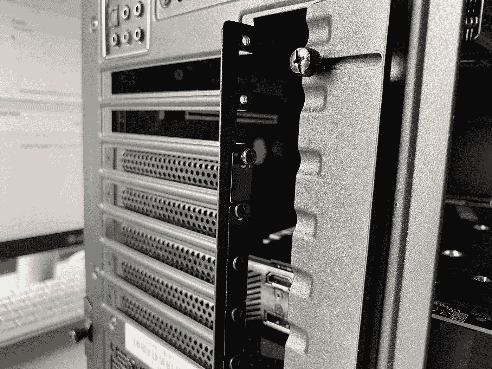**

**电脑机箱上的显卡盖(*图片作者*)**

**GPU 端口是 HDMIs 和 DPs，带有 mocks 以保护它们免受灰尘的影响。在 I/O 钢板的左侧，您可以看到两个有助于安装显卡的齿。**

**确保**使用其中一个端口连接您的显示器**。主板上的 HDMI 端口可能无法正常工作。**

**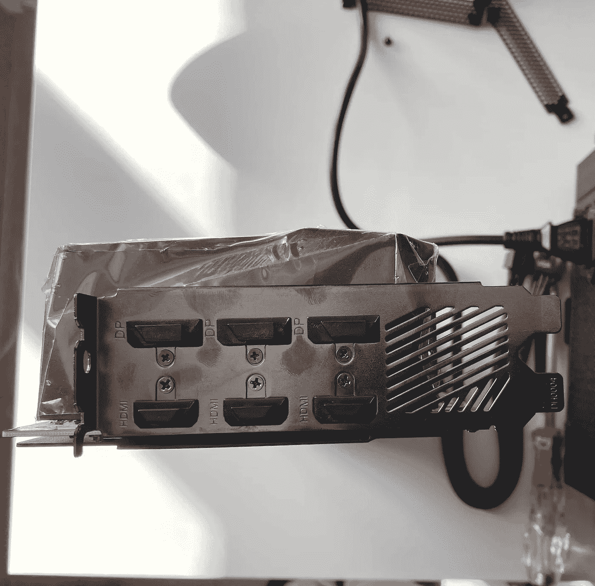**

**显卡上的端口(*作者图片*)**

**电脑机箱有专门的插槽来安装这些牙齿。如果您发现**您的 GPU 齿无法安装**，您很可能遇到了主板安装的一些问题。尝试重新安装主板以匹配插槽。**

**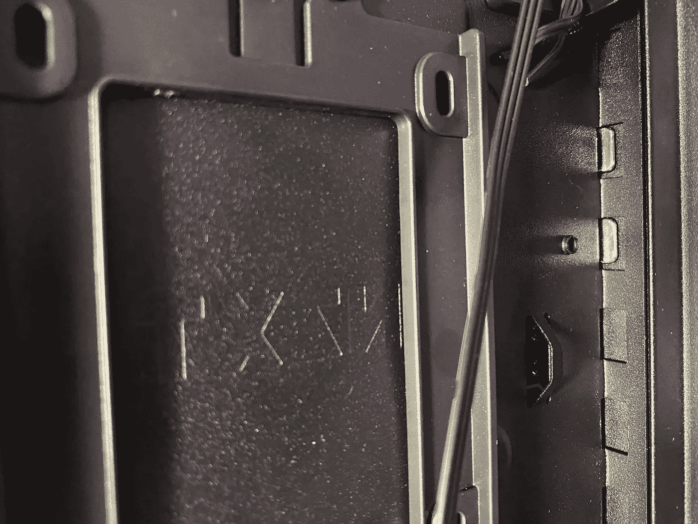**

**图形卡齿已安装(*图片由作者*提供)**

**技嘉 Aorus Master RTX 3070 需要两根 VGA 电缆来供电。确保电缆末端牢固地安装在 GPU 和 PSU 中。否则主板可能找不到 GPU。**

****

**显卡通电(*图片作者*)**

# **硬件故障排除**

**如果你把你的第一台定制电脑组装起来，很有可能第一次尝试就不成功。在我的情况下，工作站根本就没有打开。在将零件退回给供应商之前，您需要仔细检查几件事情:**

*   ****前面板电源连接正确**。回到[前面板电源线安装](https://www.romaglushko.com/blog/how-i-built-my-ml-workstation/#how-to-install-front-panel-power-cables)并再次检查是否安装正确。例如，这就是为什么我的电脑不能工作的原因。**
*   **闸板杆安全就位。尝试重新安装您的内存棒。RAM 端口机制应该锁定它们。**
*   ****电源电缆连接牢固**。确保您的电源线两端完全连接。我对此也有一些问题。每个连接器都有一个塑料锁定装置，可以将电缆固定在端口内。检查是否所有的锁都被激活。**
*   ****主板安装在支架**上。有些情况下会提供一个特殊的支座螺钉，主板应安装在其上。支架抬高主板，保护它不接触金属托盘，这可能会导致短路。**

**我想回顾的另一个症状是**您的电脑开机，但在启动过程中过一会儿就关机了**。在这种情况下，可能存在阻止您的 PC 版本运行的故障组件。我发现了一个诊断这类问题的好策略:**

*   **尝试拔下所有“不必要”的组件，如第二块硬盘或机箱冷却器，并在问题仍然存在时仔细检查。**
*   **保持不相关的事情，直到你的问题不再存在。**
*   **最后一个未连接的部件可能是问题的原因。试着再连接一次来证明假设。**

**以下视频展示了实际故障排除过程:**

**如何诊断有故障的 PC 组件？**

**此外，您的主板可能有调试指示灯，指示系统中哪些组件未找到。在这种情况下，您需要再次检查发出信号的组件是否通电并正确安装。**

**最后，一段时间后，您将能够在屏幕上看到视频信号，系统正在寻找可引导设备。**

**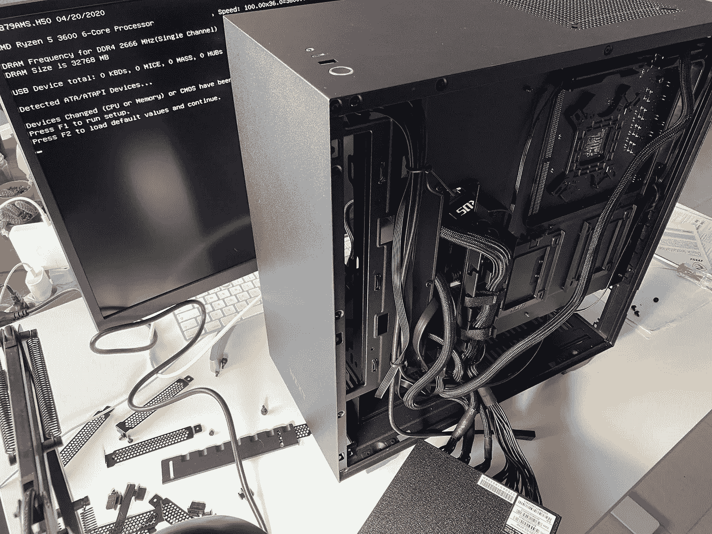**

**电脑开机和背面的情况下，电缆管理部分(*图片由作者***

**这是安装 PSU 并利用电脑机箱提供的电缆管理系统的好时机。**

**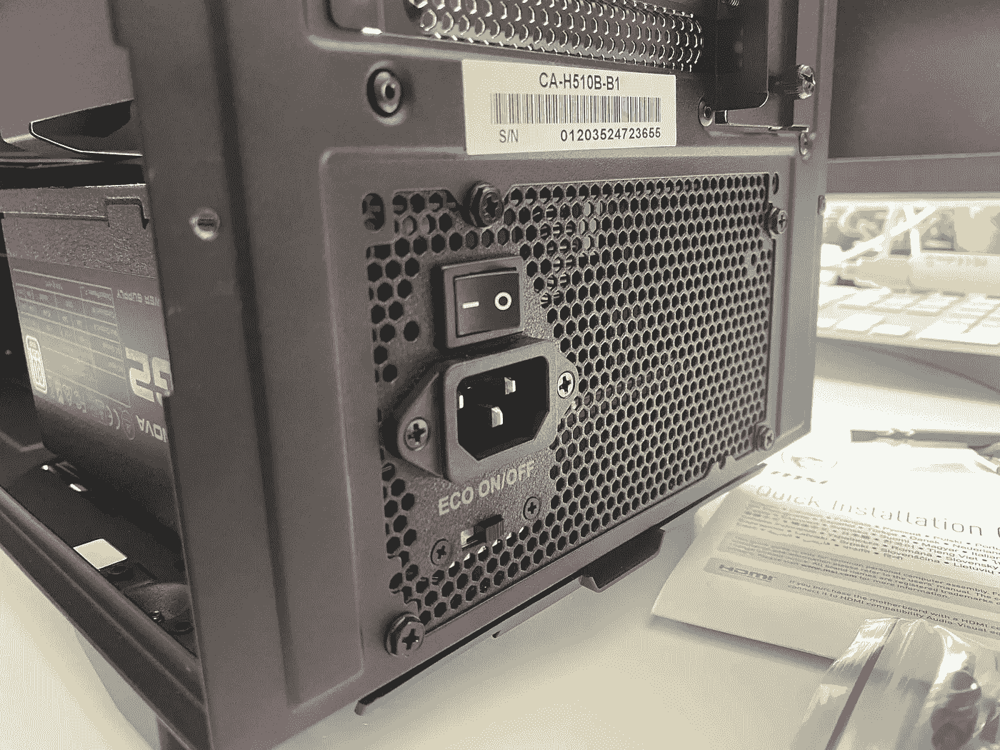**

**登上 PSU ( *图片作者*)**

# **软件安装**

**我考虑了 Ubuntu 20.10 和 Windows10 + WSL2 设置。Linux 安装现在更加稳定和简单。然而，WSL2 听起来也是一个非常可行的方法。下次再告诉你更多。**

**我手头只有 macOS，所以用[UNetBootIn 应用](https://unetbootin.github.io/)烧了一个 Linux 可引导 USB。我更喜欢用 BitTorrent 下载 Ubuntu 20.10 镜像。**

**注意，一些 Linux 发行版(比如 Kali)抱怨说 UNetBootIn **不是编写可引导 USB 的最可靠方式**。幸运的是，我似乎对此没有异议。然而，我不得不买一个新的 u 盘，因为我的旧 u 盘似乎有问题。每次我试图安装操作系统时，由于文件损坏，从旧 u 盘安装都失败了。**

**有了新的 u 盘后，我可以毫无问题地安装 Ubuntu 了。**

# **WiFi 适配器驱动程序**

**遗憾的是，微星 X470 MAX Gaming Plus 主板不支持 WiFi 开箱即用。我不想乱用以太网电缆，所以我买了一个 TP-Link 阿彻 T2U WiFi 适配器。问题是 Ubuntu 不支持它，需要额外的驱动程序。**

**好消息是 TP-Link 设备在 Linux 社区有很好的支持，所以我很快就找到了需要的驱动程序。也就是我安装了[RTL 8812 au 驱动](https://github.com/aircrack-ng/rtl8812au)。要安装这些驱动程序，你需要有互联网连接，因为它们依赖于 DKMS 软件包，令人惊讶的是，这个软件包并没有安装在普通的 Ubuntu 中。按照驱动程序存储库中提供的说明进行安装。确保`sudo make dkms_install`命令没有错误。**

**此外，您可能想要重新启动您的机器，以便仔细检查驱动程序在这种情况下的工作情况。如果没有，请跟随 stack overflow 上的[这个答案。此外，我不得不第二次运行`sudo make dkms_install`命令，最终在重启后让驱动程序工作。](https://askubuntu.com/questions/1184993/driver-for-rtl8812au-unplugs-after-reboot)**

# **CUDA 设置**

**利用我的新 GPU 资源需要配置 CUDA。**

**CUDA 是 NVIDIA 的并行计算平台，允许充分利用支持 CUDA 的显卡的优势。一般来说，安装过程可以分为 3 个部分:**

*   ****安装显卡驱动**。在 Ubuntu 中安装 NVIDIA 驱动的推荐方式是通过软件&更新应用。**

**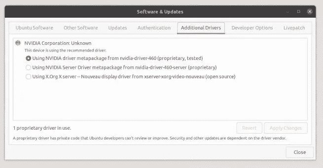**

**Ubuntu 中的 NVIDIA 驱动安装(*图片作者*)**

*   ****安装 CUDA 工具包**。NVIDIA 有一个可爱的向导可以为你的系统生成安装命令。执行它提示你的所有命令。**
*   ****安装 cuDNN** 。cuDNN 是一个 GPU 加速的库，具有用于深度学习的原语。您需要在 [NVIDIA 开发者计划](https://developer.nvidia.com/cudnn-download-survey)中注册才能访问该库。最后，你会进入一个页面，在那里你可以下载 **cuDNN 运行时和开发者库**以及**代码样本和用户指南**。我把这三个都下载成 deb 包并安装了。**

**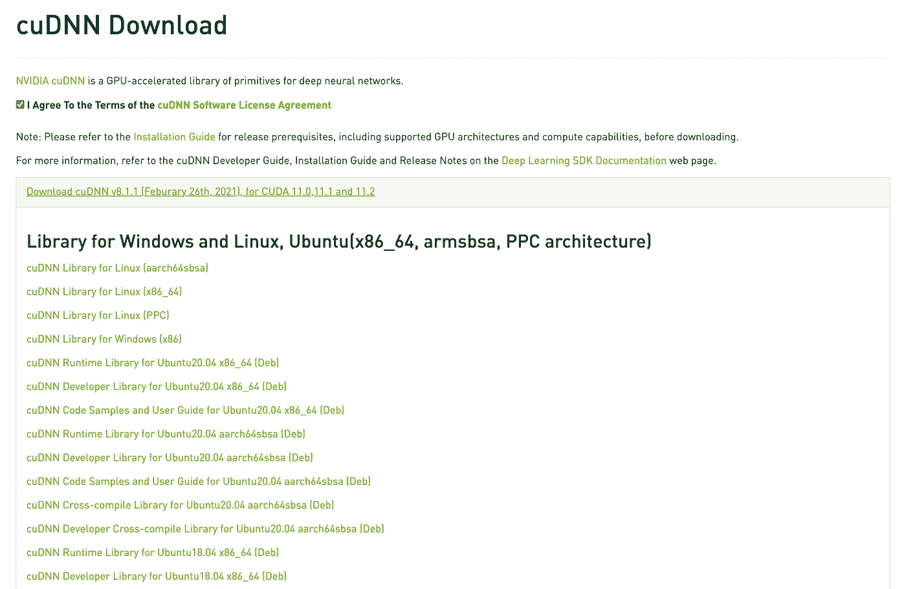**

**下载 cuDNN 页面([访问在此](https://developer.nvidia.com/cudnn-download-survey) ) ( *图片作者*)**

**这里是来自 NVIDIA 的官方安装指南。**

**到目前为止，我已经在 PyTorch 项目中测试了我的设置。可能还有另一件事会困扰你。为了利用我的 GPU 设备，我不得不重新安装我的 PyTorch 库。这一次 PyTorch 有[一个平稳安装向导](https://pytorch.org/get-started/locally/)可以帮助你。**

**最后，如果你使用 [PyTorch Lightning](https://www.pytorchlightning.ai/) ，这是一个为你的训练器实例改变[GPU 配置](https://pytorch-lightning.readthedocs.io/en/stable/advanced/multi_gpu.html#select-gpu-devices)的问题，它将在训练或推断期间使用你所有的 GPU 资源。**

# **工作流程**

**目前，我正在使用基于 sFTP 连接到我的机器的最简单的工作流，并且[改变了 PyCharm Professional](https://www.jetbrains.com/help/pycharm/deployment-in-PyCharm.html#automatic-upload) 的自动上传特性。**

**为了连接我的深度学习工作站，我在那里安装了 [OpenSSH 服务器](https://www.cyberciti.biz/faq/how-to-install-ssh-on-ubuntu-linux-using-apt-get/)。我喜欢禁用密码验证，而使用 SSH 密钥。此外，将默认的 22 端口更改为其他端口也是一个好主意。**

**一旦 SSH 连接就绪，就可以在 PyCharm 实例中设置部署主机，并在 ML 工作站上安装项目。这是项目第一次设置时需要的，通过运行`git clone`加`poetry install`命令可以很方便地完成。`Rsync`是一种将数据集上传到机器的快捷方式。**

**你在 PyCharm 里做的大部分改动都会自动同步到深度学习机器上。当您准备好测试您的更改时，您可以在 ML 工作站中通过 SSH 运行一个命令来执行您的项目。**

**通过这种工作流程，您仍然可以在 MacBook 上工作，同时在 GPU 加速的计算机上运行代码。**

# **摘要**

**看到我手上有一些 GPU 资源的小想法是如何在整个项目中成长的，真是太棒了！**

**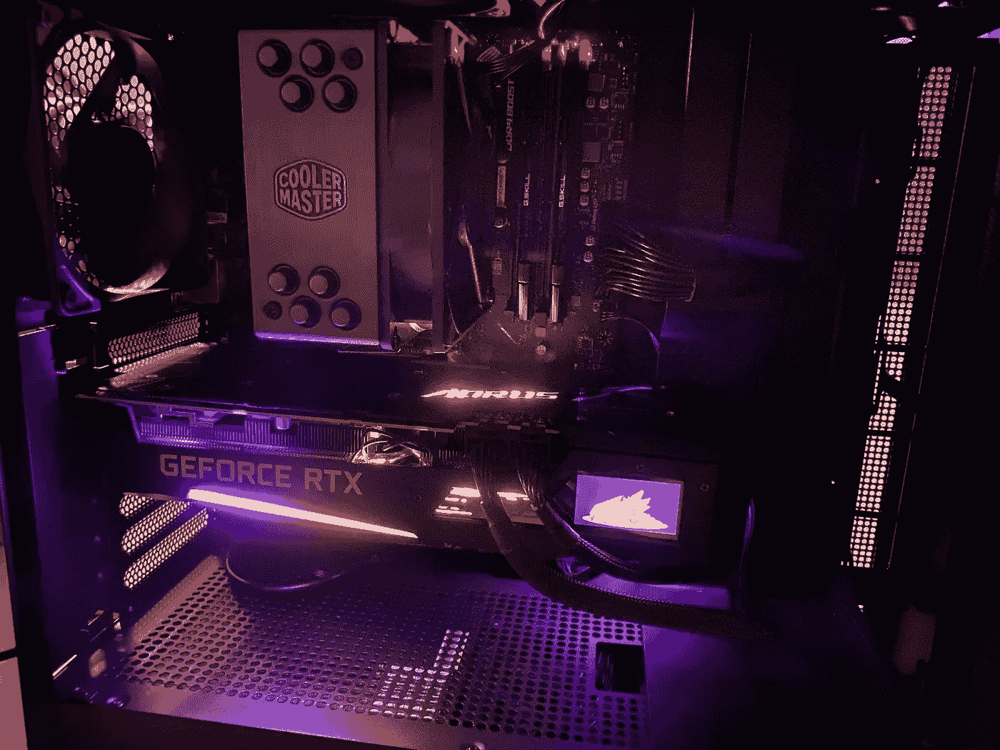**

**我的深度学习工作站 1.0 ( *图片作者*)**

**希望这篇文章对你搭建自己的深度学习工作站有所帮助。一定要在下面的评论里让我知道这是不是真的！**

**在接下来的几周里，我很可能会尝试其他的工作流程和当前的设置，看看它们如何为我工作，所以请保持关注，祝你好运，建造你自己的 ML beasts。**

**本帖原载于[我的网站](https://www.romaglushko.com/blog/how-i-built-my-ml-workstation/)。**

# **参考**

*   **[深度学习的全硬件指南](https://timdettmers.com/2018/12/16/deep-learning-hardware-guide/)**
*   **[深度学习用哪个(哪些)GPU:我在深度学习中使用 GPU 的经验和建议](https://timdettmers.com/2020/09/07/which-gpu-for-deep-learning/)**
*   **[PCPartPicker 上的深度学习准系统](https://pcpartpicker.com/user/tim_dettmers/saved/#view=mZ2rD3)**