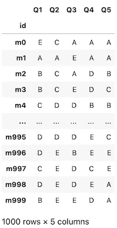
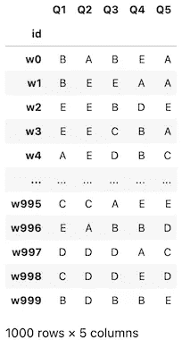
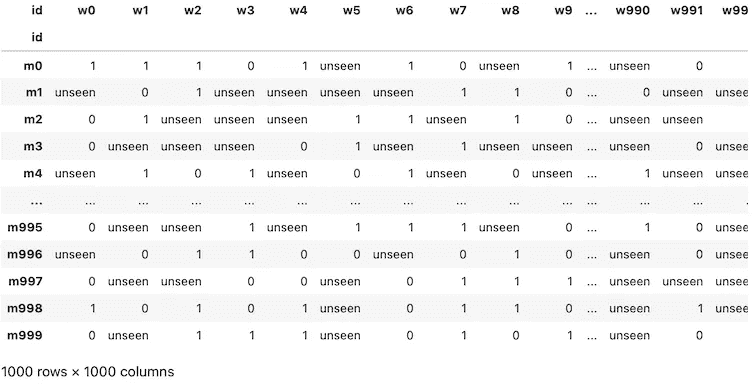
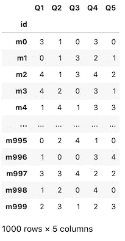
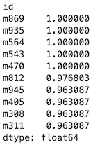
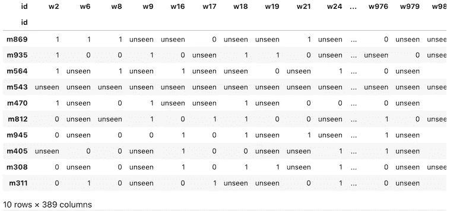
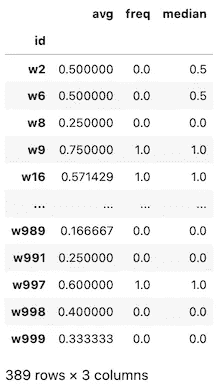
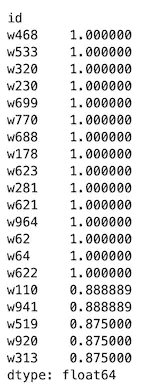

# 我如何构建自己的约会应用程序算法

> 原文：<https://towardsdatascience.com/how-i-built-my-own-dating-app-algorithm-2f6def15feb1?source=collection_archive---------3----------------------->

## 为成千上万的用户编写一个简单的匹配算法


照片由 [Unsplash](https://unsplash.com?utm_source=medium&utm_medium=referral) 上的 [Prateek Katyal](https://unsplash.com/@prateekkatyal?utm_source=medium&utm_medium=referral) 拍摄

答现在市场上几乎所有的约会应用都有某种形式的约会算法。然而，这些算法通常不公开供公众审查。此外，他们背后的公司可能不希望他们的秘密配方暴露给竞争对手。但是，我们仍然可以尝试找出一个潜在的日期算法是如何制作的。

过去，我曾无数次深入研究过这个问题。我甚至使用机器学习聚类算法构建了一个简单的约会应用程序:

[](/dating-algorithms-using-machine-learning-and-ai-814b68ecd75e) [## 如何用机器学习和 AI 做一个交友 App

### 利用无监督学习作为约会算法

towardsdatascience.com](/dating-algorithms-using-machine-learning-and-ai-814b68ecd75e) 

使用无监督的机器学习是一个很好的练习，产生的约会算法也不算太差！这是一次很棒的经历，但我认为还需要一些改进。

在本文中，我不会严格使用机器学习，而是选择一种更简单的方法，使用数据科学工具和一些*推荐系统*技术。这种算法的逻辑很简单——它将基于群体智慧的理念。这意味着该算法将找到和你一样的用户，聚集那些志同道合的用户的互动，然后最终根据志同道合的用户的意见和互动推荐你可能喜欢的个人资料。

我将向你展示我是如何主要使用 Python 和 Pandas 创建这个约会算法的。但在我开始之前，我必须列出这个约会算法的几个先决条件和假设:

*   这种定年算法是在一个已经建立的平台下工作的。意味着用户和用户交互已经存在。
*   这个建立的平台向用户提供了一个快速简单的问卷。类似于在约会档案上填写问题。
*   该平台的工作原理类似于其他流行的约会应用程序，通过左右滑动来表示个人资料之间的喜欢。
*   直男直女将是这个平台目前唯一的用户。其他偏好可能会在以后添加。

就是这样！我们现在可以继续进行编码方面的工作，如果你想创建自己的约会算法，可以随意编码。

> [在这里注册一个中级会员，可以无限制地访问和支持像我这样的内容！在你的支持下，我赚了一小部分会费。谢谢！](https://marco-santos.medium.com/membership)

# 捏造用户和用户行为

由于我们的约会算法只适用于已经建立的数据集，我们需要用随机值来制造数据。我们可以制作更复杂的数据集来模拟真实世界的约会档案，但现在还没有必要。

[](/build-a-your-own-custom-dataset-using-python-9296540a0178) [## 使用 Python 构建您自己的自定义数据集

### 我是如何从零开始构建数千行数据点的

towardsdatascience.com](/build-a-your-own-custom-dataset-using-python-9296540a0178) 

## 创建数据框架

首先，让我们导入以下库:

```
import pandas as pd
import random
import numpy as np
```

对于该算法，将有 3 个数据表或数据帧。一张桌子给男人，一张桌子给女人，还有一张桌子展示他们是如何互动的。男性和女性的表格将包含 5 列，代表“个人资料调查表”中的问题和答案以及他们的用户 id。问题和答案将被表示为一个简单的“Q1 到 Q5”，而答案被表示为“A 到 E”。

创建一组简单数据集的代码

评级或互动表将显示 3 个不同的值。这些值代表 M 和 W 用户之间的交互结果:

*   1 表示导致成功匹配的两个用户之间的相应右击。
*   0 表示来自任一用户的左击导致不匹配。
*   “看不见”表示两个用户还没有看到彼此。



从左至右:男士桌、女士桌和比赛/互动桌

# 制作年代算法

现在我们有了可以玩的数据，我们可以继续有趣的部分——构建约会算法。该日期算法将按以下顺序工作:

1.  找一个还没看过很多 W 简介的 M 用户。
2.  根据所选择的 M 个用户的约会简档答案，找到其他相似的 M 个用户。
3.  从最相似到最不相似排列相似的 M 个用户。
4.  包括最相似的 M 个用户。在我们的例子中，它将是前 10 个最相似的。
5.  获取我们选择的 M 用户尚未见过的所有 W 用户的前 10 个交互。
6.  合计前 10 名的交互值，以找到累积值。
7.  使用这些累积值来预测看不见的 W 用户和我们选择的 M 用户之间的潜在交互。

之后还有一些额外的步骤，比如对每个 W 用户的累积值进行排序，但现在这并不太重要。上述序列将是我们匹配算法的蓝图。同样，这个序列也可以应用于 W 用户。

## 找到一个拥有许多“看不见的”价值的 M 用户

现在我们有了蓝图，让我们开始编码吧。为了找到评级表中具有最多“看不见”值的 M 用户，运行以下代码:

```
m_user = ratings.T.apply(pd.Series.value_counts).T.sort_values(
    by="unseen", 
    ascending=False
).iloc[0]
```

接下来，我们将找到并保存这个 M 用户尚未看到的所有 W 用户的列表:

```
m_nrate = ratings.T[ratings.T[m_user.name]=="unseen"].index
```

## 查找前 10 个相似的 M 用户

现在我们可以使用上面创建的变量找到所有相似的 M 个用户。但是首先，我们必须做一些简单的数据预处理。我们需要对男士表格中的答案进行分类，这样我们就可以使用它们相应的数值来计算相关性:

```
n_men = men.apply(lambda x: x.cat.codes)
```

产生变换的数据帧:



将答案转换为相应的数值

有了这个表，我们就可以计算与熊猫的相关分数。



```
m_sim = n_men.T.corrwith(
    n_men.T[m_user.name]
).sort_values(
    ascending=False
)[1:11]
```

运行这段代码将导致左边的表格显示与我们选择的 M 用户最相似的用户。最相似的用户具有 1.0 的相关性分数，最不相似的用户将具有 0 的分数。默认情况下，熊猫使用“ [*、皮尔森*](https://www.statisticshowto.com/probability-and-statistics/correlation-coefficient-formula/#Pearson) ”方法来计算相关性。

## 前 10 个匹配值

知道了前 10 个相似的用户，让我们找出我们选择的 M 用户还没有见过的 W 用户的交互值:

```
msim_rate = ratings.loc[list(m_sim.index)][m_nrate]
```



指数:前 10 名相似用户。列:我们选择的 M 用户尚未看到的 W 用户。

因此，即使有前 10 名相似用户，仍然有一些“看不见的”价值。这可能是一个未来的问题，可以通过添加比前 10 名更多的类似用户来解决。然而，为了这个项目的目的，我们将继续我们所拥有的。

## 汇总前 10 名的值

我们现在可以合计这些值，找出每个 W 用户的总价值。为此，我们有多种方法可以计算累积值。让我们保持简单，只找到平均值、频率和中间值结果:

```
# Man predictions
m_predict = pd.DataFrame()# Replacing the unseen values with NaNs for calculation purposes
msim_rate.replace(
    "unseen", 
    np.nan, 
    inplace=True
)# Average
m_predict['avg'] = msim_rate.mean()# Frequency
m_predict['freq'] = msim_rate.mode().T[0]# Median
m_predict['median'] = msim_rate.median()
```



在左边，您应该可以看到前 10 个交互值的累积值的 DF。

从这里，我们可以选择哪种计算最能代表前 10 名相似用户的总体情绪—平均值、频率或中值？

平均值似乎是最好的，因为它的数值范围很大。我们可以用这个对 W 个用户进行排序，找出前 10 名中最受欢迎的用户。它还可以作为我们选择的 M 用户的匹配/兼容性分数。例如:

> 假设你是被选中的用户。如果该值为 0.80，则有 80%的可能性您会喜欢此档案，因为与您最相似的 10 个用户中有 8 个喜欢此档案。

决定使用平均值后，我们现在已经完成了约会算法！在这种情况下，我们只将该算法应用于现有用户。但是，我们如何将它应用于平台上的新用户呢？

# 处理新用户

现在我们已经为我们的约会算法设计好了代码，让我们把它应用到一个新用户身上！这个新用户将与现有用户使用相同的调查问卷。所以我们基本上只是将它们添加到现有的数据集中。

我已经构建了一个函数，它使用了我们最近创建的约会算法的代码和序列:

假设我们的新用户将通过回答几个问题被介绍给平台，我们将对他们使用随机答案。之后，我们将运行上述函数，然后我们的新用户将能够看到他们最有可能匹配的用户:

```
ans = ['A', 'B', 'C', 'D', 'E']# Randomly picking answers
new_man_answers = random.choices(ans, k=5)# Running the function
recs = matchMan(
    men, 
    women, 
    ratings, 
    new_man_answers, 
    num_sim=10
)# Finding the top 20 most potentially compatible
recs[:20]
```



运行上面的函数并使用与以前相同的表，将向新用户呈现这些推荐的 W 个用户，这些用户按平均分排序。我们可以看到分数在列表中进一步下降，这意味着算法正在工作。

现在可以向这些 W 用户显示分数，以通知新的 M 用户他们潜在的匹配兼容性。或者，他们可以不显示分数，新用户将只看到这些配置文件作为他们的最佳推荐匹配。这些 W 用户如何呈现的决定，最终还是要由婚恋交友平台的负责人来决定。

# 结束语

我们已经成功构建了一个简单的约会算法，而没有使用任何机器学习模型。然而，我们可以采取一些步骤来潜在地改进这种年代测定算法。例如，我们需要通过比较现有用户的预测分数和实际分数来验证我们的结果。在此基础上，我们可以对算法进行改进，比如将更多的相似用户包括在内，而不仅仅是前 10 名，或者甚至对交互值进行加权。

我已经在 Github 上完成了我的代码中的一些基本验证过程— *参见下面的*。然而，这里所做的任何验证都是没有意义的，因为我们现有的数据集都是随机的。

另一个需要注意的潜在问题是规模。当平台上的用户数量(甚至入职问题)增加到算法开始变慢的时候会发生什么？我们该如何补偿呢？这些是我们在改进这个算法时需要考虑的事情。

总而言之，构建这个算法是对编码和利用一些推荐系统技术的一次很好的锻炼。如果您希望继续改进这个现有的算法，请随时查看我在 Github 上的代码。我希望你喜欢这篇文章，如果你愿意，可以看看我的其他文章！

# 资源

[](https://github.com/marcosan93/Medium-Misc-Tutorials/blob/main/Dating-Algo.ipynb) [## Medium-Misc-Tutorials/Dating-algo . ipynb at main Marcos an 93/Medium-Misc-Tutorials

### 一组随机的中等教程。为 Marcos an 93/Medium-Misc-Tutorials 开发做出贡献，创建一个…

github.com](https://github.com/marcosan93/Medium-Misc-Tutorials/blob/main/Dating-Algo.ipynb) [](/dating-algorithms-using-machine-learning-and-ai-814b68ecd75e) [## 如何用机器学习和 AI 做一个交友 App

### 利用无监督学习作为约会算法

towardsdatascience.com](/dating-algorithms-using-machine-learning-and-ai-814b68ecd75e) [](/build-a-your-own-custom-dataset-using-python-9296540a0178) [## 使用 Python 构建您自己的自定义数据集

### 我是如何从零开始构建数千行数据点的

towardsdatascience.comm](/build-a-your-own-custom-dataset-using-python-9296540a0178)