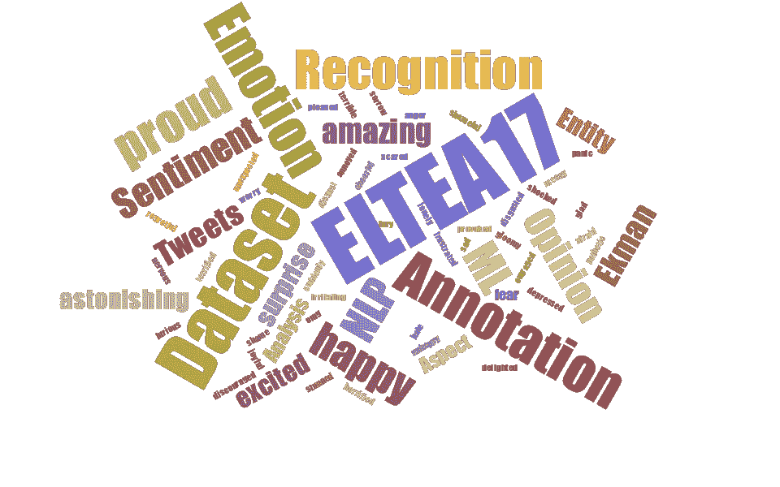
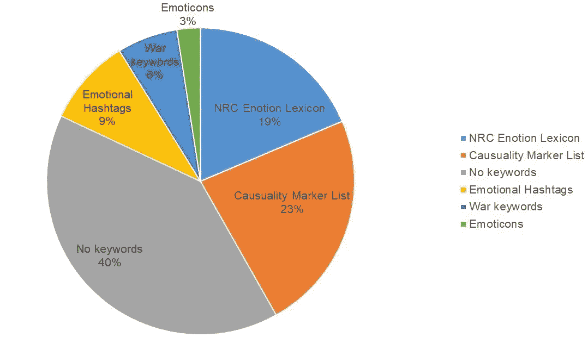
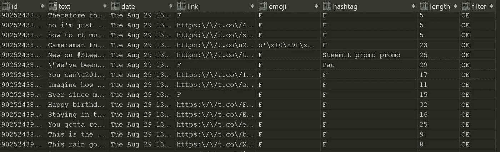
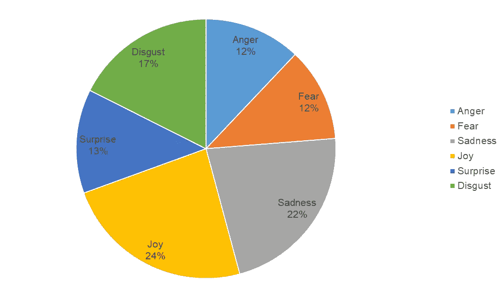
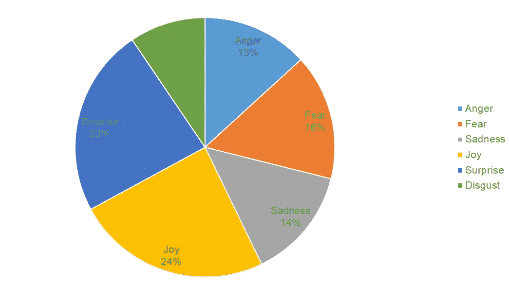
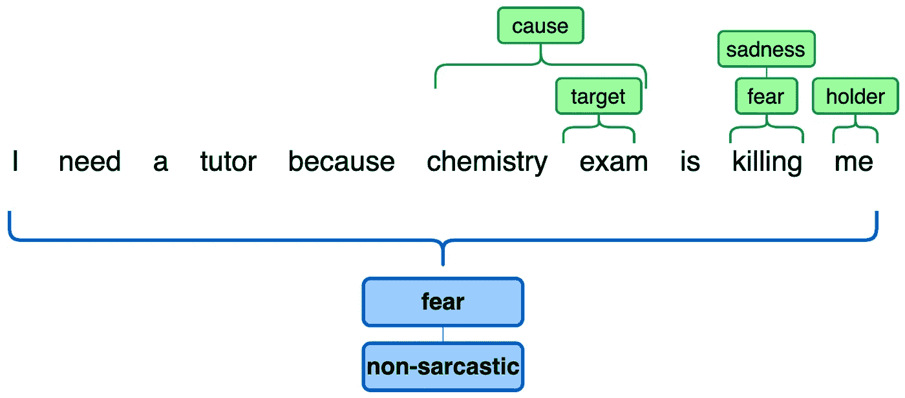
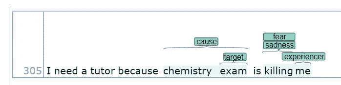

# 我如何构建 ELTEA17 数据集

> 原文：<https://towardsdatascience.com/how-i-built-the-eltea17-dataset-a8dc9f27ed57?source=collection_archive---------25----------------------->

## 用于情感分类和讽刺检测的实体级 Tweets 情感分析数据集



ELTEA17 ( *图片来源于 jasondavies.com/wordcloud/*[)](https://www.jasondavies.com/wordcloud/)

实体级推文情感分析数据集(ELTEA17)是一个对推文进行细粒度情感分析的数据集，我在这里公开了。它是我 2017 年关于[原因、持有人、目标](https://www.researchgate.net/profile/Roozbeh-Bandpey-2/publication/341344305_Structured_Emotion_Prediction_of_Tweets_With_Co-extraction_of_Cause_Holder_and_Target_of_Emotions/links/5ebbc08ea6fdcc90d6728396/Structured-Emotion-Prediction-of-Tweets-With-Co-extraction-of-Cause-Holder-and-Target-of-Emotions.pdf)共提取的推文结构化情感预测研究的子产品。

ELTEA17 由 **2034** 条匿名推文组成，用 Ekman 的六个[类中的一个](https://1ammce38pkj41n8xkp1iocwe-wpengine.netdna-ssl.com/wp-content/uploads/2013/07/Universals-And-Cultural-Differences-In-Facial-Expressions-Of.pdf)类进行注释，以及它们的二进制讽刺注释。在令牌级标注中，该数据集用一个或多个 Ekman 类标记每个情感关键词，并标记总体情感的持有者、原因和目标。如果您发现这对您的研究或用例有用，请前往 GitHub 上的 [ELTEA17 资源库](https://github.com/RoozbehBandpey/ELTEA17)

# 用例

来自 Twitter 等微博服务的大量用户生成数据是一个很好的来源，反映了公众对从政治和世界事件到消费品的现象和情况的看法和反应。由于统计和机器学习方法已经成为构建各种自然语言处理(NLP)应用的首选方法，情感分析正在成为 NLP 研究中的一个热门话题，该研究主要关注用户在社交媒体上的情感反应。

各种各样的信息处理应用处理自然语言文本。这些应用除了处理它们的表面形式之外，还需要提取和处理文本实体。通过访问预定义的文本实体，诸如情感分析、意见挖掘和情感分析等应用程序受益匪浅。例如，基于方面的情感分析旨在提取重要的实体，如意见目标、意见表达、目标类别和意见极性。就像基于方面的情感分析一样，提取文本实体，如情感的持有人、原因和目标，可以提供对情感承载推文的显著覆盖。

# 情感分类学

情感分析的首要问题是确定情感的分类。研究人员为此提出了一个主要情绪列表。对于 ELTEA17，我采用了埃克曼的情绪分类，它确定了六种主要情绪，即:*快乐*、*悲伤*、*愤怒*、*恐惧*、*惊讶、*和*厌恶*。为了进行细粒度的情感分类，识别*持有者*、*原因*和*目标*以及情感关键词可以为分类器提供有意义的特征。这种信息非常有趣，因为它可以提供关于推文情绪极性的实用知识。例如，这三者之间的相互作用和推文的整体情绪极性可以给我们回答的能力；“谁表达了情感？”，“是什么情绪？”“情感的目的是什么？”以及“为什么会产生这样的情绪？”

# 数据集构建

ELTEA17 数据集具有句子级和标记级注释。在句子级注释中，每个句子都用六个埃克曼类中的一个进行注释。在标记级注释中，注释指示用于其角色含义情感*持有者*、*原因、*和*目标*的每个词汇，以及情感关键词。

在高层次上，ELTEA17 经历了以下步骤:

1.  考虑情感关键词、情感标签、表情符号、文本长度等，从 Twitter 自动获取随机帖子。
2.  排除干扰，如网页链接、地理标签、重复的帖子等。
3.  定义情感角色和情感关键词标注的标注策略
4.  当存在多种情绪或代表情绪不明确时，定义一个策略
5.  使用情感角色和情感关键词手动注释推文(令牌级注释)
6.  手动将推文标注为六种埃克曼情感类别(句子级标注)

## 数据收集

数据收集的目标是捕获对目标数据集可靠的数据。也就是说，数据集必须包含带有特定关键字的推文，这些关键字传达情感以及因果关系的语言学线索。因果关系的语言学线索并不一定输出带有情感原因的推文。相反，它们帮助我们收集具有一般因果关系的推文。由于情感原因检测是一般原因检测的特殊情况，这将是过滤掉不需要的数据用于注释的有用过程。

## 推特数据

出于这项研究的目的，我使用 Twitter 的基本 API 和 [tweepy](https://www.tweepy.org/) 构建了一个数据收集器作业。该脚本采用一组关键字来过滤掉不想要的推文。以下是每个过滤器的详细说明:

*   **语言**:整个摄取过程用英语设定
*   **表情符号**:预定义的最常用表情符号列表，如:)、:D 等。，带着各自的情绪。这个列表摘自马克·兰伯特的一部未出版的作品。
*   **情感标签**:基于[这项研究](https://www.researchgate.net/publication/258762213_Harnessing_Twitter_'Big_Data'_for_Automatic_Emotion_Identification)“93%带有用户提供的情感标签的推文都是与情感相关的”我采用了他们提出的[情感标签列表的最小版本](https://github.com/RoozbehBandpey/ELTEA17/blob/main/filters/hashtags.txt)，每个标签都对应于它的 Ekman 类。
*   **情感关键词**:我用了 [NRC 情感词表](https://arxiv.org/pdf/1308.6297.pdf)。这个列表包含了 3462 个字典，每一个都被划分到了 [Plutchik](#7597) 类中。
*   **致使语言线索**:为了有更多的数据明确提到了情绪的哪一个原因，我构建了一个致使语言线索列表，比如*因为*、*由于*等等。
*   **战争相关关键词**:经过对数据的样本分析，我注意到大部分收集到的数据都偏向于快乐，因为比如生日快乐的信息。于是我决定用一个传达战争和政治冲突的关键词列表来收集，比如*进攻*、*入侵*、*出兵*等。

为了更好地分配主题，数据收集过程持续了近一个月，每次在一天的不同时间进行。对于数据收集器的每一次运行，都使用了上述所有关键字，而没有使用任何关键字。在此图中，您可以看到基于过滤器使用的收集数据的分布。



根据文件大小分发收集的数据，过度使用关键字(*作者图片*)

该脚本将每个 tweet 数据作为 python 字典返回，其中包含诸如“创建于”、“id”、“文本”等关键字。，因为这些数据包含了大量不必要的数据集信息，在下一步中，我从这些内容中剔除了不需要的信息。提取标签、表情符号、提及、链接和表情符号后，每条记录如下所示:

```
{
 "id":9025500993849∗∗∗∗∗,
 "text":"Josh’s Family Must Be so Proud of him ... ,
 "datetime":"Tue Aug 29 15:14:46 +0000 2017",
 "links":[],
 "emojis":[],
 "mentions":["@∗∗∗∗∗"],
 "emoticons":[],
 "hashtags":[],
 "filter":"CE",
 "num_words":n,
}
```

## 过滤

收集的推文总数超过 100 万条。最终，每条记录都存储在 SQLite 数据库中，以便更快地访问，应用查询进行进一步的记录选择和清理。为了处理重复的 tweet，我将 tweet 数据库的文本字段设置为唯一标识符，它会自动拒绝存储重复的 tweet。tweet 表的整体记录差不多有 50 万条。以下快照显示了数据库模式。让我们检查一些应用于进一步过滤的查询:



来自 SQLite 数据库的 Tweets 表(作者的*图片)*

```
# selects random tweets where they have hashtag and the filter which has been used for ingestion was emotion hashtags (EHT)
SELECT * FROM tbl_tweets WHERE (hashtag != ’F’ AND filter = ’EHT’ ) ORDER BY RANDOM()# selects random tweets where the filter which has been used for ingestion was causative keywords
SELECT * FROM tbl_tweets WHERE (filter = ’CE’ ) ORDER BY RANDOM()# selects random tweets where they have emoji
SELECT * FROM tbl_tweets WHERE emoji != ’F’ ORDER BY RANDOM()# selects LIMIT number of tweets where the length field is less or equal to 20, and the filter which has been used for ingestion was 'war' keywords
SELECT * FROM tbl_tweets WHERE (filter = ’war’ AND length <= 20) ORDER BY length DESC LIMIT# selects tweets where they have hashtag and the filter which has been used for streaming was NRC emotion lexicon, and no link exists in tweets, and the length of tweets is between 5 and 35 tokens
SELECT * FROM tbl_tweets WHERE (hashtag != ’F’ AND filter = ’NRC’ AND link = ’F’ AND (length BETWEEN 5 AND 35))
```

限制推文长度的动机是，出于机器学习的目的，较长的推文包含更多的上下文信息。有链接的推文越少越好，因为那些大多是广告，包含的观点内容越少。

综合所有查询的结果，得到 **3348 条** tweet 实例，这些实例包含足够多的情感关键词和每条 tweet 的原因提及。

# 注释

## 句子级

这个数据集的主要目的之一是用于文本分类器。句子级标注考虑了两组标签。埃克曼情感类以及讽刺二元注释。这个注释不需要特定的平台，只需使用一个文本编辑器就可以完成。每条推文的注释考虑了以下标准:

*   只有表达某种类型的 Ekman 类的 tweets 才会被注释。
*   当多种情绪存在时，占主导地位的情绪被选中。
*   如果情绪太难或太模糊而无法决定，这条推文就会被丢弃。

这个过程成功地注释了 **2034** tweet 实例。在这里，您可以看到注释数据在句子级别的分布，分布在六个类别中:



Ekman 类上句子级的注释数据分布(*作者图片*)

## 令牌级

在这一节中，首先我描述了情感表达中的语言现象。然后我解释注释方案的细节。该数据集的另一个目的是从推文中识别*持有者*、*原因*、*目标*和情感关键词，以便可以轻松地将其输入序列标记算法，如 HMM、CRF 或 LSTM。

## 情感关键词

在书面文本中，可能会有用来表达情感的关键词。在情感角色的背景下，在标注中找到合适的情感类关键词是识别其角色的前提。注释侧重于显性情绪，在这种情绪中，他们通常通过关键词来表达，如“听到他的死讯后，我很震惊”。由于不同的可能原因，如意义模糊，关键词的存在不一定传达情感信息。例如，“祝愿”在“他希望有好天气”中是一个幸福的词。它也可以是不同上下文中的歌曲名称。因此，注释应该通过考虑 tweets 的上下文来完成。

情感关键词注释的粒度级别是词汇单元。它可以是单个单词或短语。对于每个条目，关键字都用它们各自的 Ekman 类进行了注释。因为在一个条目中可以呈现一种以上的情感；注释者可以选择多个合适的类(最多 3 个类)。比如“愤慨”显然属于*愤怒*范畴。另一方面，“恐怖主义”根据上下文，可以被贴上*悲伤*、*愤怒*或*恐惧*的标签。词汇单位可以分为以下几类:

*   六种情绪之一:注释者指出他们认为更合适的情绪(如果有的话)。
*   同时多个类:注释者用多个类的组合来表示情感，他们认为这样更接近词汇单元的情感(注意不允许 3 个以上 Ekman 类的组合)。
*   六个情感类都不是:注释者从三个建议类*期望*、*信任、*和*其他中选择一个。*

## 情感原因

根据大多数[理论](https://aclanthology.org/C10-1021/)，一种情绪通常是由外部事件引发的。因果关系是一种被定义为“原因和结果之间的关系”的语义关系，为了识别情绪状态的原因，注释者应该能够回答这样的问题:“为什么持有人会感觉到那种情绪？”

在文本中，情感原因被认为是一个引起相应情感出现的命题。一般认为一个命题有一个动词，它可以选择把出现在它前面的名词作为主语，把出现在它后面的名词作为宾语。然而，一个原因有时被表示为一个名词。由于情感原因检测是一般原因检测的特例，标注者可以采用一些典型的语言模式，如:*因为*、*因此*、*结果*、*因此*、*由于*等。，以及其他一些潜在表明情感原因的语言线索，如使役动词像 *get* 、 *have* 、 *make* 、 *let* 。情感原因的注释需要两个基本约束:

*   显式约束限定了与情绪表达直接相关的单个突出的情绪原因(使用致使语言线索可以很容易地检测到)。
*   隐性约束限定了所有直接和间接的情感原因(原因可以从含义中推断出来)。

在标注情感原因时，如果某个特定原因存在，标注者应该考虑与该原因对应的每个情感关键词。一个情感关键词有时可以与多个原因相关联，在这种情况下，所有原因都被标记。注意，情感关键词的存在并不一定保证情感原因的存在。没有明确表示原因的推文，主要是因为以下原因:

*   推文太短，因此没有足够的上下文信息，例如:“我很生气，很臃肿”。
*   这条推文足够长，但原因可能超出了上下文。
*   原因不明，可能是由于高度抽象。

## 情感持有者

一条推文的来源是作者。情绪状态的来源是表达情绪的人。当一条推文带有情绪时，推文的作者可能是持有人，因为作者可能在帖子中表达了他/她的情绪，但作者也可能写了其他人的情绪，导致一句话有多个来源。

情感持有人识别是语义角色标注研究的一个子领域，使用通用语言模式进行识别是合理的。我将情感持有者定义为一个带有标签 *holder* 的短语，用于语料库的构建，无论是隐性的还是显性的情感表达。不是把情感持有者限定为一个人，而是可以是任何表达情感的实体。情感持有者通常是名词短语，有时是介词短语。例如，在下面的句子中，粗体显示的跨度表示情感持有者。

杰夫感到非常高兴。
**珍妮**感到幸福关于**杰夫的**幸福。

在第二个示例中，还应该标识“Jeff”。因此，在一个句子中有两个情感持有者。

## 情感目标

情感目标是情感所涉及的实体。更具体地说，它们是情感所针对的实体及其属性。在 tweets 中，情感目标是相当多样的，因为有大量不同的主题:命名实体和作为情感对象的名词短语。在主观文本中，情感目标往往伴随着情感关键词。例如，在“我讨厌下雨的天气”中，下雨的天气是情感的目标。有人可能会说，下雨的天气可以解释为情绪状态的一个原因。有时，情感表达在像 tweets 这样的非正式文本中可以有重叠的情感原因和情感目标。这就是为什么该数据集甚至将原因提取与目标识别相结合，以提高性能[3]。情绪目标很重要，因为如果不知道它们，推文中表达的情绪就没有多大用处。

情感关键词和目标之间存在语言关系，这是因为情感关键词是用来修饰目标的。在主观表达中，情感持有者、情感关键词和情感目标与主体相关，修饰直接客体。

一旦持有人有了特定的情绪状态，这种情绪状态可以用引发它的特定原因和对情绪目标进行分类的主题来描述。也可以有这样的情况，其中响应发生或者原因为什么引起持有者的特定响应，但是在注释中没有考虑它。换句话说，标注过程中不考虑情感关键词、情感原因、情感目标之外的任何信息。下面是带注释的数据在标记级的最终分布:



在 Ekman 类上标记级的注释数据分布(*作者图片*)

# 训练数据集格式

对于序列标记问题,“行业标准”编码是生物编码。它将标签中的文本细分为实体外部(O-X)、实体开头(B-X)或实体延续(I-X)。在 ELTEA17 中，BIO 表示法将文本分成重叠的单词组，即所谓的文本块。因此，对于每组标记，需要不同的生物表示。具体来说，每六个情感类别加三个情感角色一个生物编码，这导致九层生物编码。下表显示了不同层中 BIO 编码的注释表示。注意，杀死的令牌*已经被标注了*恐惧*和*悲伤*。*

不同层次的例句生物注释



ELTEA17 注释的图形表示(*作者图片*

# 数据统计

让我们来看看 ELTEA17 的一些初步统计数据。下表显示了语料库的总体概要。为了进行评估，我使用了 5 倍交叉验证，通过应用随机搜索算法设置了**倍**的值。

语料库摘要

接下来，让我们看看不同实体的一些统计数据，下表显示了情绪*导致*、*持有人*和*目标*被提及的推文比例。对于原因的提及，最高的数字属于*惊讶*一类，有趣的是表达他们惊讶感觉的作者，关于一个情境或现象，他们更愿意带来他们情感的原因。对于提及*目标*而言，最低的数字属于*恐惧*类别，这意味着在恐惧已被表达的背景下，持有者不太愿意提及恐惧所针对的实体。最后，提到*持有者*，最小的数字属于*愤怒*类别。

包含情感原因、目标和持有人的推文比例

下面的表格显示了每一类推文的最大、最小和平均长度。

# 注释工具

有许多工具可以提供带有实体和关系的手动注释环境。文本工程通用架构(General Architecture for Text Engineering or GATE)是一套完善的开源工具套件，用于 NLP 任务，最初由谢菲尔德大学开发。它为语义标注和本体数据建模提供了一个协作的标注环境。Brat rapid 是一个协作文本注释的在线环境。它是专门为结构化注释而设计的。WebAnno 是一个基于网络的注释工具，用于各种各样的语言注释，包括不同层次的词法、句法和语义注释。在此工具中，可以定义自定义注记图层。此外，它支持多个用户进行协作注释项目。

我最终选择了 WebAnno 作为注释工具，唯一的原因是它使得在不同的层中构建注释变得容易。下图是 WebAnno 的工作环境。



WebAnno 工具的工作环境(*图片作者*)

这个工具可以以多种[文件格式](https://webanno.github.io/webanno/releases/3.2.2/docs/user-guide.html)导出注释，在所有 TSV 3 中最容易转换成 BIO 编码。导出的文件包括标题和正文部分。标题部分包含有关文件中使用的不同类型的注记图层和要素的信息。下面你可以看到 WebAnno TSV 3 文件的标题标记以及一个示例注释。

```
#FORMAT=WebAnno TSV 3.1
#T SP=webanno.custom.Emotion|Emotion|Role#Text=I need a tutor because chemistry exam is killing me
305–1 33289–33290 I _ _
305–2 33291–33295 need _ _
305–3 33296–33297 a _ _
305–4 33298–33303 tutor _ _
305–5 33304–33311 because _ _
305–6 33212–33321 chemistry *[3364]|cause[3364]
305–7 33322–33326 exam *[3364]|*[3365] cause[3364]|target[3365] 
305–8 33327–33329 is _ _
305–9 33330–33337 killing sadness[3366]|fear[3367] *[3366]|*[3367] 
305–10 33338–33340 me * holder
```

对于跨度类型，图层用“#”标记，后跟“T SP=”，要素用“_”分隔。句子出现在文本标记“#Text=”之后。标记注释以句子标记号开始，后面是开始-结束偏移量和标记本身，用制表符分隔。这里对于第一个记号“I”， **305** 表示句子编号， **1** 表示记号编号， **33289** 是记号的开始偏移， **33290** 是记号的结束偏移。对于一个跨度的每个特征，注释值将与记号/子记号注释出现在同一行中，由制表符分隔。如果没有给定跨度层的注释，则在列中放置“_”字符。如果要素没有注记或跨度图层根本没有要素，则“*”字符表示注记。对于令牌“我”，星号意味着该令牌不与任何情绪类型相关联，因为第一层专用于情绪类型，并且该令牌的角色与*持有者*相关联。令牌上的多跨度注记将有一个用括号括起来的编号参考，如[N],其中 N 表示图层上的第*个*注记。

# 后续步骤

*   [敬请关注](https://www.linkedin.com/in/roozbehbandpey/)了解我是如何结合 CRF 和 CNN 进行情感分类的
*   请随意探索 [ELTEA17](https://github.com/RoozbehBandpey/ELTEA17)

# 进一步参考

[1]罗伯特·普卢奇克:《情绪:理论、研究和经验》。情绪理论，第一卷。美国纽约州纽约市学术出版社。, 1980.

[2]任，石，[一个通用的基于本体的多语言多功能多媒体智能系统](https://ieeexplore.ieee.org/document/884344) (2000)会议论文集。2000 年 ieee 系统、人和控制论国际会议。

[3]陈、应、李一梅、、和朱(T0)(2010)《第 23 届计算语言学国际会议论文集》第 179-187 页

[4]李维员，华旭[基于文本的情感分类与情感原因抽取](https://www.researchgate.net/publication/259138036_Text-based_emotion_classification_using_emotion_cause_extraction) (2014)专家系统与应用 41(4):1742–1749

[5][https://weban no . github . io/weban no/releases/3 . 2 . 2/docs/user-guide . html](https://webanno.github.io/webanno/releases/3.2.2/docs/user-guide.html)