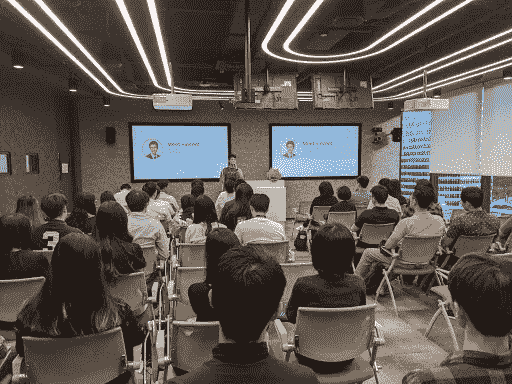

# 我是如何在谷歌破解 DS-Tech 面试的

> 原文：<https://towardsdatascience.com/how-i-cracked-ds-tech-interview-at-google-2aca19d21ea5?source=collection_archive---------6----------------------->

## 给我的数据和技术专业学生的课程

## 通过 ML 工程师 SQL/编码面试的简易指南

在 Google Tech Sprint 与大学生分享我的面试经历(来源于作者)

> 我如何开始准备谷歌技术面试？
> 
> 我需要做些什么来使自己区别于其他候选人？

在过去的几年里，我收到了一些关于谷歌数据/技术/编码面试的问题。这些问题可能来自广泛的受众，从研究生到寻找更好机会的专业人士。

技术面试很难。由于合格申请人的数量，科技公司的招聘应该非常严格。所以我真诚地希望我可以分享我的经验，以减少你的痛点。

> **免责声明:**对于这篇文章，我将关注编码/技术面试(技术筛选/现场面试)。
> 
> 请记住，我不是专家。FAANG 和其他公司的很多编码面试我都没通过。但是我试着向前失败，和你分享这个经验，这样你就不需要像我一样失败那么多次。
> 
> 由于谷歌的博客政策，我不会分享任何细节，但我希望这篇文章能帮助你做好准备。
> 
> 这里有一个博客，概括了我在谷歌的面试经历。

</ace-your-data-analytics-interviews-ef114606c5d7>  

> 就这样，让我们开始吧

# 什么是技术面试？

技术面试测试你通过代码解决问题的能力。

这需要大约 45 分钟的面试时间，面试官会问你 1-2 个编码/SQL 问题，意在:

*   **简单易懂:**问题将简单到适合半个小时的时间框架。
*   **含糊不清:**面试官可能只会给你问题背景的一个子集，让你进一步探究。你需要提出问题，以便很好地理解问题，制定解决方案。
*   **挑战**:这个问题可能有多个解，你需要优化。这是为了让大型科技公司测试你解决问题的能力，以过滤掉误报，避免接受糟糕的候选人。

# 技术面试是如何进行的？

[根据我的经验](/ace-your-data-analytics-interviews-ef114606c5d7)，这是关于如何进行技术面试的重要信息:

*   **一般准则:**在大多数情况下，你需要给出实际的代码。在写出你的解决方案之前，你应该先澄清你的面试官。练习开发不同数据结构问题的实际代码(例如:树、图、字符串、列表、哈希映射等)。
*   **工具**:大多是 google docs 来描述问题，写测试，设计伪代码。在我之前的采访中，我们使用白板来回答 SQL 和编码问题。在疫情期间，我听说 [coderpad.io](https://app.coderpad.io/sandbox) 在 Google 之外也很常用。
*   **解决方案的复杂性(时间和空间):**了解多个解决方案之间的差异。我记得我在面试中的第一个解决方案是使用一种运行时间很长的暴力方法，比如:O(n)然后我主要在哈希映射的帮助下将代码优化为 O(n)。

# 你的行动计划

在任何技术面试之前，你都应该遵循这些建议

1.  沟通:将面试视为双向沟通
2.  **准备:**非常了解你的工具
3.  **微笑:**祈祷，保持冷静，执行

# 沟通

> 将面试视为双向交流将大大增加你被录用的机会。

在我看来，沟通是通过每一次技术面试最重要的因素。

## 让我给你举个例子。

*   **候选人 A** :创造了最佳解决方案，但未能传达折衷方案
*   **候选人 B** :创造了次优解决方案，但与面试官交流了算法的潜在问题和解决方案

你更喜欢哪个候选人？从招聘人员的角度来看，这可能是候选人 b。这是因为沟通是在团队环境中做好工作的重要信号。表达你的想法和考虑比创造完美的解决方案更重要。

此外，这还能让招聘人员理解你采用解决方案的逻辑，并在你陷入困境时给你提示和鼓励。我听说过一个朋友，他没能给出最佳解决方案，但还是被录用了，因为他清晰地表达了自己的思维过程，并通过面试官的暗示和提示推动了讨论。

## 科技面试有多难？

> 想象一下，在令人紧张的 45 分钟面试中，你在交流想法的同时，被评估创造最佳解决方案。*冷汗*

这无疑很难。但是你可以通过练习你的沟通技巧来减少痛苦。

一个简单的方法是申请众多的公司，然后按升序排列，把你最重要的放在最后。这意味着，你在用一些面试作为练习，为你梦想中的公司做准备。在最好的情况下，你有这些成功的申请作为薪资谈判的筹码。

如果你没有时间去参加无数的面试。那么我建议在 Leetcode 上报名[模拟面试，或者请你的朋友帮忙。](https://leetcode.com/assessment/)

为了让你对如何不断沟通有一个清晰的看法，我强烈推荐你观看谷歌关于编码面试的视频。

# 准备

> 非常了解你的工具

## **准备时间表**

当我准备 Google 的编码面试的时候，[我在 Visa](/5-biggest-tips-to-juggle-work-and-study-as-data-scientists-7cad143f10a) 工作的时候在兼职读硕士，所以关于编码和数据结构的知识还是新鲜的。但即便如此，我还是在一周内花了额外的 3-4 个小时来集中注意力。我利用假期复习了 LeetCode 上的数据结构/算法和练习题。

我发现的一个标准指导方针是至少在 1 个月内准备好面试。大多数大型科技公司都意识到了这些压力，并会给你时间准备。

您需要明智地做好准备，在短时间内更新您的数据结构知识并练习解决问题。

## **总的来说这是我的练习习惯:**

1.  **【数量】每天解决至少 5 个 Leetcode 问题**:这将使你每月解决+150 个问题
2.  **【数量】每周至少进行 2 次模拟面试**:这样可以让你在一个月内进行 8 次模拟面试，帮助你在面试时不那么紧张。
3.  **【素质】20 分钟内解决每道题:**你会感到解决问题的时间紧迫压力。确保你意识到时间限制并解决它。
4.  **【质量】在 Leetcode 上寻找最优解:**有些问题可能有多个复杂程度不同的解。例如有 4 种不同的算法求解回文题。目的是了解哪一个是最佳的，为什么。
5.  **【素质】练习你的弱点:**多学习一些你不熟悉的数据结构(比如:树/图)，延伸你的目标，为意想不到的问题做准备。

## **分配时间学习基础和高级算法**

大多数技术面试持续 30-45 分钟，这意味着你解释红黑树或 AVL 树等高级概念的可能性非常低。

这意味着你应该分配更多的时间来温习基本概念，直到你清楚地理解它们。你可以集中练习容易到中等难度的问题，然后可能是一些难的问题。

## **这里有一些你可以使用的准备资源:**

*   [**Coursera 算法特殊化**](https://click.linksynergy.com/deeplink?id=lVarvwc5BD0&mid=40328&murl=https%3A%2F%2Fwww.coursera.org%2Fspecializations%2Fdata-structures-algorithms) **:** 这是一个非常好的总结，可以帮助您刷新常用算法和数据结构概念的技能。我建议你在开始练习之前先审核一下这些课程。
*   [**破解编码面试**](https://amzn.to/3fKwwBh) :这是一个在谈论编码面试时真正流行的参考。有一个很好的理由，这本书是每次你想更新你的知识和技能时的一本好书。它很简洁，但仍然足够清晰地描述典型的编码面试问题和理论。
*   [**Github SWE 面试准备**](https://github.com/orrsella/soft-eng-interview-prep) :这是一个很好的知识库，可以让你重温从基础到高级的算法。作者在解释棘手的问题和列举编码访谈中的重要概念( [**博客**](https://orrsella.com/2016/05/14/preparing-for-a-facebook-google-software-engineer-interview/) )方面做得非常出色。

# 微笑

> 祈祷，冷静，表演

我意识到我在谷歌面试中成功的可取之处是我总是微笑。

微笑创造奇迹。微笑让埃鲁德·基普乔格成为排名第一的马拉松运动员。微笑有助于镇定神经，建立一种控制感，让你看到全局。微笑能让你与面试官展开对话，建立必要的联系，为你的解决方案辩护。

当你微笑时，你允许面试官帮助你。这使得面试更具合作性，也让你与那些固执于解决基于错误前提的问题的候选人区别开来。

> 如果微笑能让你更接近赢得你梦想的工作，那么为什么不利用它呢？

# 你应该知道的重要技术概念

# 复杂性

> 这一点超级重要。请熟悉复杂性。

不同的解决方案在时间和空间上会有不同的权衡和复杂性结构。**最重要的术语是大 O 符号；通过计算步骤数来测量**运行时间的符号，步骤数转化为算法运行的时间和空间。

例如，你可以用几种方法处理回文:

1.  强力循环每个字符两次，然后比较-时间 O(n)，空间 O(1)
2.  字符串前后的两个迭代器—时间 O(n)，空间 O(1)
3.  递归调用堆栈—时间 O(n)，空间 O(n)

## **这些术语可能对你有用:**

*   **增长率由**`1`<`log(n)`<`n`<`n*log(n)`<`n^2`<`n^3`<`2^n`<`n!`表示
*   **常数 1:** 表示固定的算法运行时间，不考虑观测值。
*   **对数对数(n)** :表示重复减半或加倍运行时间(例如:二分搜索法)
*   **Linear n** :遍历数组或链表中的每一项。
*   **准线性** n*log(n):在线性时间内运行(如:快速排序、合并排序)
*   二次 n:迭代并匹配每一对元素(例如:插入/选择排序)
*   **立方 n** :迭代并匹配所有三个一组的项目
*   **指数 2^n** :枚举项目的所有子集
*   **阶乘 n！**:生成项目的排列或排序

# 数据结构

数据结构是编程的一切。在谷歌，我们内部开玩笑说，软件和数据的主要工作只是移动和操纵数据。

在谷歌，每天有 20pb 的数据被移动，你需要非常清楚地理解数据结构，即使你只有使用熊猫数据框架的经验。

您对这些基本数据结构的理解能力将有助于您做出推出可扩展和可靠产品的每个决策。

**重要概念:**数组、链表、集合、栈、队列、树、图、堆、散列表、字典

*   **一般理解**:在内存块中存储值的结构。
*   **数组:**固定大小的记录来存储值。这是节省空间的
*   **链表:**从下一个元素链接到上一个元素。
*   **堆栈**:后进先出(LIFO)与压入和弹出操作。当订单不重要时，这是一个非常有效的操作。
*   队列:先进先出(FIFO ),最大限度地减少最大等待时间。这可以通过动态数组或链表来实现。
*   **集合:**包含唯一元素的列表
*   **二叉树:T** 每个节点都有一个关键字的树。左边的子树有较小的键集，而右边的子树较大，以便进行有效的查询。
*   **图:**一组点(顶点)和线(边)，存储数值和数值之间的关系。图通常存储在邻接矩阵(n*n)或邻接表(稀疏)中
*   **字典:**支持按键快速内容查询。这种方法的一个实现叫做 HashMaps
*   **平衡 BST:** 保持高度较小的自平衡二叉查找树。

# 算法

算法对于创建逻辑流来操作存储在数据结构中的数据非常重要。算法和数据结构需要同时学习。没有对数据结构的正确理解，就很难理解为什么我们要在特定的条件下使用特定的算法。

**重要概念**:分而治之、动态编程/记忆、递归、树遍历(广度优先搜索— BFS /深度优先搜索— DFS)

*   **动态编程:**用较小的实例计算解决方案，以构造解决方案(例如:递归)
*   **贪婪编程:**计算每一步的局部最优解。这意味着我们可能关注局部最优而不是全局最优(例如:人工神经网络中的梯度下降)
*   **分而治之:**把问题分成更小的子问题。然后在解决每个子问题时，我们可以反映整个问题的解决方案(例如:合并排序)
*   **排序:**强力总是产生 O(n ) —插入排序、冒泡排序，而最优排序应该产生准线性 O(n log n) —快速排序、合并排序[(更多信息)](https://github.com/orrsella/soft-eng-interview-prep/blob/master/topics/algorithms.md)
*   **广度优先搜索:**从初始深度开始遍历树，到递增的更高深度。这在寻找最小生成树(MST)问题的解决方案时很有用。
*   **深度优先搜索:**首先覆盖所有深度，从初始的左到右子树开始遍历树。
*   **Dijkstra:** 求图中最短路径的算法。A*是建立在 Dijkstra 算法之上的启发式算法。

# 样题

由于我不能透露我的谷歌面试问题，我很乐意分享我认为与我的面试问题相当的 leetcode 问题。这将有助于您理解复杂程度，并相应地进行练习。

1.  [3Sum](https://leetcode.com/problems/3sum/) :给定一个带有条件的列表，寻找三元组集合
2.  [单调数组](https://leetcode.com/problems/monotonic-array/):如果给定数组是单调的(递增或递减)，则生成结果。
3.  [最长的回文子串](https://leetcode.com/problems/longest-palindromic-substring/):从一个字符串中，返回回文子串(向前或向后读都一样)
4.  [生成括号](https://leetcode.com/problems/generate-parentheses/):给定括号对，生成所有格式良好的括号组合。

**个人小贴士来自** [**阿尔伯特·宾盖**](https://medium.com/u/fcf6ad08f12d?source=post_page-----2aca19d21ea5--------------------------------) :在某些情况下，有应聘者在 GlassDoor 上分享了自己的面试经历。您可以使用这些评论来找出技术面试流程和困难的基准。

> 在此，我祝贺你完成本指南。祝你编码面试准备顺利。

# 结论

**为了增加你进行最佳技术面试的机会，你应该:**

1.  沟通:将面试视为双向沟通
2.  准备:非常了解你的工具
3.  微笑:祈祷，保持冷静，执行

在谷歌或其他大型科技公司招聘很复杂，因为他们想避免误报。这是因为雇佣不良职业道德的候选人会破坏团队士气和绩效。因此，由于不完善的技术面试，他们很有可能会让有能力的候选人失望。如果你是他们中的一员，那么请继续努力，他们中的一个会来到你身边。

因此，请利用你所拥有的机会好好准备。尽你所能，让上帝来处理剩下的事情。

非常感谢 [Albert Bingei](https://medium.com/u/fcf6ad08f12d?source=post_page-----2aca19d21ea5--------------------------------) 审阅并为本文做出贡献。

索利·德奥·格洛丽亚

# 我职业经历中其他有用的博客

</how-to-build-your-ultimate-data-science-portfolios-ea0414d79a72>  </the-hidden-gems-of-writing-analytics-6db78fad5a51>  </5-biggest-tips-to-juggle-work-and-study-as-data-scientists-7cad143f10a>  

# 关于作者

文森特用 ML @ Google 对抗网络滥用。文森特使用高级数据分析、机器学习和软件工程来保护 Chrome 和 Gmail 用户。

除了在谷歌的工作，Vincent 还是佐治亚理工学院计算机科学硕士校友、三项全能运动员和数据科学媒体的特约作家，该媒体在全球拥有 100 多万观众。

最后，请通过 [**LinkedIn**](http://www.linkedin.com/in/vincenttatan/?source=post_page---------------------------) **，**[**Medium**](https://medium.com/@vincentkernn?source=post_page---------------------------)**或** [**Youtube 频道**](https://www.youtube.com/user/vincelance1/videos?source=post_page---------------------------) 联系文森特