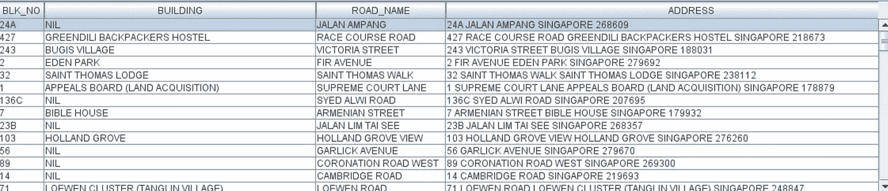

# 我是如何用 Java 爬取一个国家的邮政编码列表的

> 原文：<https://towardsdatascience.com/how-i-crawled-the-entire-list-of-postal-codes-in-a-country-with-java-fde6259a8353?source=collection_archive---------29----------------------->

## 从 OneMap.sg 中检索新加坡的 141，848 个邮政编码—代码实现

在我居住的地方，没有太多的地理空间专业知识。当然，研究起来很有趣，也很吸引人，但是由于这个领域非常小众，很难在这个领域找到志同道合的人，更不用说找到另一个愿意不断更新️she 地图数据的人了。其中一个仓库恰好是新加坡现有邮政编码的完整列表，我计划每年发送几次。

被分配到一个有很多限制的环境中工作，让我变得越来越敏捷，越来越适应环境。这表现为寻找替代方案，通过漏洞绕过等等。手头有一份邮政编码列表恰好是我在工作中使用的少数几个技巧之一。对于地理编码相关的任务，例如**识别某个建筑物所在的地理边界**，

> [……]与在分配任务后仅使用地图服务 API**标记每个感兴趣的地点相比，**使用带有相关地带/地区/区域标记的邮政编码列表可以节省我几天的工作时间。

对于有兴趣了解如何以最少的麻烦对位置列表进行地理编码的读者，请阅读我关于 [TurfJS](https://turfjs.org/) 的文章:

[](/using-turf-js-to-geocode-coordinates-with-custom-boundaries-bb843b7150d0) [## 使用 Turf.js 通过自定义边界对坐标进行地理编码

### 这个位置属于❝Which 地区/区域/区域吗？❞

towardsdatascience.com](/using-turf-js-to-geocode-coordinates-with-custom-boundaries-bb843b7150d0) 

# Java 代码实现——用令牌调用 API

## 第 1 点—以编程方式更新 API 令牌

对于熟悉 Google Maps 服务 API 的读者来说，您应该知道专门为您的 API 帐户生成了一个令牌，以限制您调用 API 服务器的次数。类似地，我使用一个名为 [OneMap.sg](https://www.onemap.gov.sg/main/v2/) 的地图服务提供者，它需要一个令牌。然而，问题是 OneMap 选择在某个月之后使令牌失效，因此，每当我的调度程序被编程设置为开始进行 API 调用时，我需要首先确保进行单独的 API POST 请求，以便检索未过期的令牌。以下是我在 Java 中使用的效用函数:

```
private static void setAccessToken() throws UnsupportedEncodingException, IOException {
        String endpoint = "https://developers.onemap.sg/privateapi/auth/post/getToken";
        String email = "<EMAIL REGISTERED>";
        String password = "<PASSWORD OF ACCOUNT>";
CloseableHttpClient httpclient = HttpClients.createDefault();
        HttpPost httpPost = new HttpPost(endpoint);
List<NameValuePair> params = new ArrayList<NameValuePair>();
        params.add(new BasicNameValuePair("email", email));
        params.add(new BasicNameValuePair("password", password));
        httpPost.setEntity(new UrlEncodedFormEntity(params));
CloseableHttpResponse httpresponse = httpclient.execute(httpPost);
        int statusCode = httpresponse.getStatusLine().getStatusCode();
        System.out.println("Success Status: " + statusCode);
if (statusCode >= 200 && statusCode <= 299) {
            Scanner sc = new Scanner(httpresponse.getEntity().getContent());
            StringBuilder sb = new StringBuilder();
            while (sc.hasNext()) {
                sb.append(sc.next());
            }
            String jsonStrResult = sb.toString();
            JSONObject responseObj = new JSONObject(jsonStrResult);
            access_token = responseObj.getString("access_token");
        }
        httpclient.close();
    }
```

## 第 2 点——使用递归处理分页 API

由于一个邮政编码可以引用许多地址，这取决于感兴趣的地区/国家，API 可以被分页—例如，如果有 **50 个结果**，但是每个页面只返回 **10 个响应**，那么有必要连续调用 API 来检索**最后 4 页**中的完整结果列表。

根据 API 的分页格式，您可能需要相应地调整代码。

> 然而，实现处理 API 分页的逻辑的一个简单方法是`check if **no. of returned addresses <** **maximum no. of addresses per page**` **。**

因此，在实用函数中包含将每个页面的结果连接成一个 JSON 数组也更简洁:

```
private static JSONArray concatArray(JSONArray arr1, JSONArray arr2) 
throws JSONException {
    JSONArray result = new JSONArray();
    for (int i = 0; i < arr1.length(); i++) {
        JSONObject obj = (JSONObject) arr1.get(i);
        result.put(obj);
    }
    for (int i = 0; i < arr2.length(); i++) {
        JSONObject obj = (JSONObject) arr2.get(i);
        result.put(obj);
    }
    return result;
}
```

下面是完整源代码实现的链接: [GitHub](https://gist.githubusercontent.com/incubated-geek-cc/cb9add24621824c1a0f65196768144ee/raw/5c59da01d595ac46dffca8f61e19e918aa8e6bf7/StreamAPIResponseWithToken.java)

## 使用的 JAR 依赖项有:

*   commons-log-1.2 . jar
*   httpclient-4.5.2.jar
*   httpcore-4.4.12.jar
*   json-20140107.jar
*   sqlite-jdbc-3.27.2.1.jar(可选。仅适用于 SQLite DB 用户。)

让它运行几天，根据国家/大洲邮政编码的格式，值的范围需要相应地调整 **(** 我使用的例子是新加坡，它使用**一个 6 位数的格式**，所以范围是**10000–999999)**

另一方面，代码中的字段名(如**【BLK 编号】、【建筑】、【道路名称】、【地址】、【邮政】、【纬度】、【经度】、【X】、【Y】、【搜索值】**)应与地图服务提供商返回的每个地址的字段名相匹配。



作者截图|我的 SQLite DB 中存储的 SG 地址列表。请注意，OneMap.sg 的数据由[开放数据许可证](https://www.onemap.gov.sg/legal/opendatalicence.html)管理。

**对读者的评论:**虽然你的工作角色不一定是以地理空间为中心的，但拥有一份你所在国家的邮政编码列表不会有什么坏处*(除了需要一些存储空间)*事实上，在你最意想不到的时候，它会被证明是有用的！

**持怀疑态度？然后看看你能在日常生活中完成以下哪些任务:**

*   寻找附近的医院进行医疗护理
*   确定离工作场所/居住区最近的公交车站/火车站在哪里
*   估计到达目的地的最短路线(考虑到你必须完成的任务和你需要中途停留的地方)

> 与从头开始搜索和盲目地搜索地址相比，从一系列地点中筛选出你要找的地点总是容易得多。

## 因此，尝试代码并享受其中的乐趣吧！

## 非常感谢你坚持到这篇文章的结尾！❤希望有人会觉得这很有用，并欢迎使用 Medium 跟随我。会非常感激😃

[](https://geek-cc.medium.com/membership) [## 通过我的推荐链接加入灵媒——李思欣·崔

### 获得李思欣·崔和其他作家在媒体上的所有帖子！😃您的会员费直接…

geek-cc.medium.com](https://geek-cc.medium.com/membership)