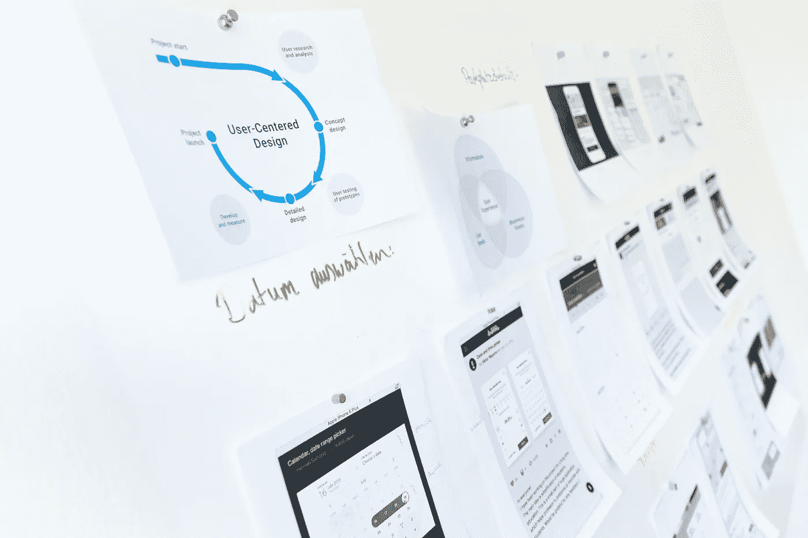
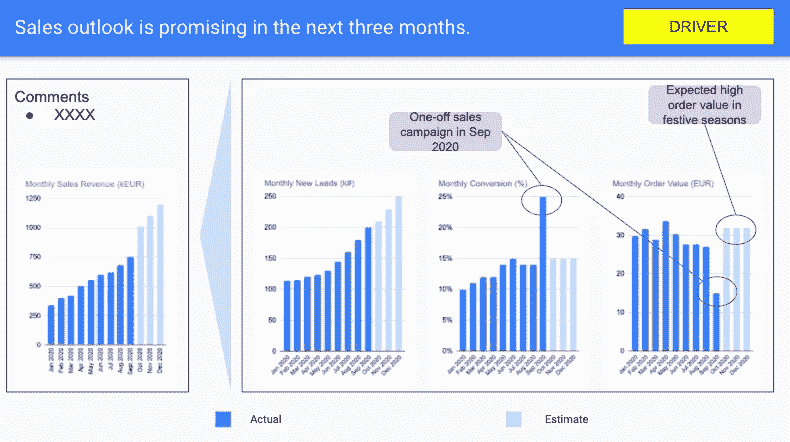
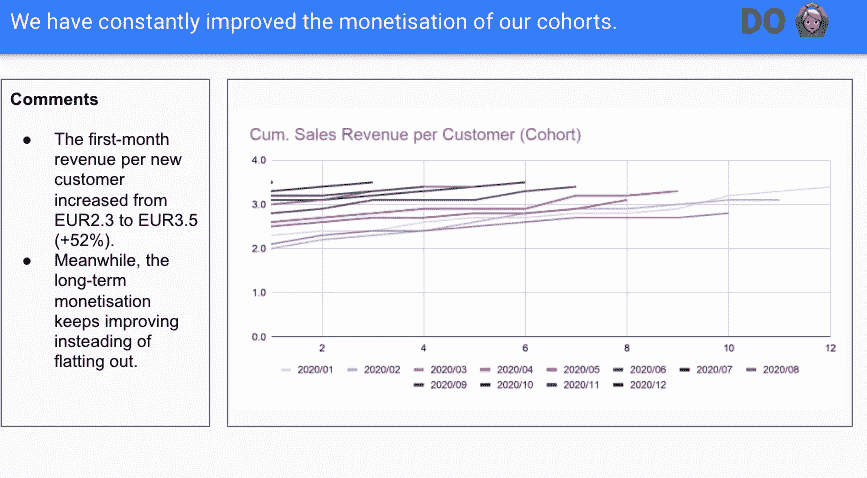
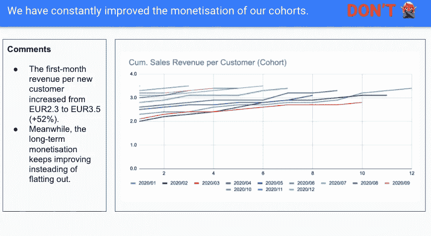

# 我如何创建分析师风格指南

> 原文：<https://towardsdatascience.com/how-i-create-an-analyst-style-guide-for-a-good-data-story-presentation-6ec9f2504ac8?source=collection_archive---------18----------------------->

## [办公时间](https://towardsdatascience.com/tagged/office-hours)

## 对于有效的数据故事呈现

在我的第一篇博文[我如何用数据讲故事](https://wenling-yao.medium.com/how-i-do-data-storytelling-c2970856bdc4)中，我提到过**一个好的故事讲述的一个关键部分是创造一个视觉上负担得起的演示**，它应该是你口头交流的一个很好的补充，而不是分散你的观众的注意力。

在这篇文章中，我想进一步阐述我在上一篇文章中提到的技巧，并分享一些我认为在数据分析师的现实生活中非常有用的良好实践和示例。

来源:[https://unsplash.com/photos/Ar-iTL4QKl4](https://unsplash.com/photos/Ar-iTL4QKl4)

这篇文章将涵盖**分析报告，这些报告通常以文章或幻灯片的形式制作，并使用图表和文本来分享对探索性复杂主题的见解**，如“为什么我们看到本月的销售收入下降了？”或者“我们能做些什么来提高用户漏斗转化率？”。通常它们是与混合的受众群体共享和/或呈现的，这些受众群体可以包括产品经理、UX/UI 设计师、运营经理、营销人员、高级管理人员等。

在这篇文章中，我们不会讨论如何创建交互式仪表盘。:)

以下是这篇文章的几个原则，也就是说，后面将要讨论的所有技巧都服务于这些原则中的一个或多个。

*   我们的时间有限。我们演示中的内容应该以这样一种方式进行优先排序，即最重要的信息总是排在第一位，以便我们的观众首先提取。
*   我们认为消费包含数据的复杂信息对每个人来说都不是一件容易的事情。因此，我们应该以一种方式设计我们的演示文稿，使我们的观众从其中提取信息的努力最小化。
*   人类的大脑喜欢模式和一致性。**清晰一致的结构可以训练我们的观众习惯我们的故事情节**，让他们更容易摄取和消化呈现的内容。

仅此而已！下面你可以找到四个技巧，我发现它们在制作一个易于理解的演示文稿以与多元化的受众群体分享数据见解时非常有用。在这篇文章的最后，我还分享了一个链接到我自己的模板。

我希望它们也对你有用——非常感谢你的任何反馈、想法或问题！

# 永远把结论放在第一位，让细节跟随其后。

首先是结论——这是我从《金字塔原理》一书中最大的收获。这种方法背后的想法是帮助你的观众在第一眼看到关键的想法，通常是“什么”,让他们自己决定是否或何时想知道“什么”背后的更多细节。

例如，如果我被要求调查我们这个月销售收入下降的原因，我会把**摘要幻灯片作为我报告的第一页**。在这张总结幻灯片上，通常有三个部分，每个部分包含 1-2 个句子。

为什么是三个？这也是我从金字塔原理中学到的一招。三是在一个团队中能最有效地传达你的信息的想法的神奇数量。如果你感兴趣的话，我发现这篇文章对详细解释这条规则很有帮助:[https://medium . com/lessons-from-McKinsey/the-rule-of-3-c1cd 82 DBC 96](https://medium.com/lessons-from-mckinsey/the-rule-of-3-c1cd82dbc96e)

作者图片

这张幻灯片可以帮助那些早上查看收件箱、打开附件、每封邮件只有 5 分钟时间的观众。第一张幻灯片让观众有机会抓住关键信息，并让他们决定是现在就深入细节还是留待以后。他或她不必在打电话之前浏览整个演示文稿。

这个技巧的另一个应用是使用有意义的句子作为幻灯片标题。这意味着，不要将幻灯片的标题定为“销售前景”，而是写下“未来 12 个月的销售前景看好”。

为什么我们要写一个更长的标题呢？同样，假设你是销售总监，你只有 5 分钟的时间浏览 10 页的报告。当你浏览幻灯片时，标题是第一个吸引你眼球的东西。如果你看到标题“未来 12 个月销售前景看好”——唷！这是个好消息，你现在不必担心销售前景。也许你对销售收入预测的一些具体细节感到好奇，但这不是你现在的优先事项，你可以在以后有更多时间时详细阅读该报告。然而，如果你第一眼看到的标题是“销售前景”，你就不确定这是好是坏。你不得不查阅图表和文本来找出答案，不幸的是，这增加了你获取你现在需要的准确、简单信息的努力。

同时，与“销售前景”相比，标题“未来 12 个月的销售前景看好”包含一个思维判断，可以更好地吸引观众对幻灯片内容的兴趣。

# 使用布局为您的受众创建学习模式。

不管我们承认与否，我们的大脑喜欢模式。当我们看到一系列[1，3，5，7，9，？]，我们的大脑会自动用数字 11 代替问号。同样的道理也适用于你的演讲！当你的观众打开或看到你的幻灯片时，他们的大脑开始学习你的模式，并在他们从你的幻灯片中吸收信息时应用这些知识。

例如，我有一个叫做**驱动器布局**的布局。使用这种布局，我通常会在左侧绘制目标 KPI 的趋势，并在同一个框中显示文本描述。我使用右侧较大的空间来绘制驱动因素 KPI 的趋势，这些趋势可以解释目标 KPI 的发展。在下一张幻灯片中，目标 KPI 是销售收入，驱动 KPI 是销售线索(#)、转换率(%)和订单价值(欧元)。另外，我也用一些弹出的评论框来评论不规范的地方。

当我想要解释基于驱动 KPI 的目标 KPI 的发展时，我在整个演示中使用这种布局。当我的观众下次看到这种布局时，他们已经知道我的故事情节会是什么样子，这让他们更容易理解我的故事。

作者图片

另一个我经常使用的布局是**对比布局**。当我想强调两个或多个 KPI 在相同细分下的差异时，我发现这非常有用。使用这种布局，我通常根据我想要比较的指标的数量来平均划分空间。我还运用对比色方案，让我的观众知道他们应该注意不同部分之间的差距或差异。

作者图片

同时，我也发现配色方案的选择在创造图案时起着关键作用。**当你想要突出差异、差距或偏差时，使用对比色；当你想要表达序列或时间趋势时，选择顺序调色板。**例如，通过下面的图表，我想展示不同人群的货币化程度有所提高。我创建了一个连续调色板，其中越年轻的群体曲线越暗，这样我的观众就可以很容易地跟随颜色的变化，并注意到最暗的曲线(以及更近的客户群体)总是位于图中更高的位置，换句话说，最近的客户群体比老的群体平均产生更多的收入。

作者图片

另一方面，随机调色板无法帮助观众在曲线的黑暗和群组的新近性之间建立联系，因此增加了观众阅读图表的挑战。

作者图片

# 让一致性主宰你幻灯片的每一个角落。

一旦你为你的观众设计好了幻灯片的结构和模式，下一步就是尽量减少任何可能分散观众注意力的调整。

尽可能对幻灯片的相同尺寸使用相同的配色方案。例如，如果你在多个图表中使用性别作为比较的关键维度，蓝色代表男性，黄色代表女性，那么在你的演示文稿中尽可能坚持这种配对。这样，下一次当你的观众在你的观想中看到“蓝/黄”对时，他们会直观地知道这是性别间的比较，而不必阅读这个小图例。

作者图片

作者图片

**在你的书面和口头交流中使用一致的词汇——特别是，坚持使用你特定领域的词汇。**如果您组织中的“Lead”一词指的是访问您网站但没有注册账户的任何人，那么在您的演示文稿的其余部分中继续使用这个定义。如果你在描述注册了账户但没有下单的人时突然开始使用“Lead”这个词，你的听众可能会感到困惑，并要求你做出澄清。

**为相同的时间粒度使用相同的日期/时间标签。**例如，如果你在图表或文本中使用“2020 年 7 月”作为月份标签，那么当你讨论每月趋势时，在你的整个演示文稿中坚持这种日期格式。突然切换到“2020/07”或“2020–07–01”将需要你的观众的大脑将其转换为之前学习的格式，从而为处理信息带来不必要的负担。

# 保持一切简单。

虽然我总是对能够传达非常复杂的趋势和维度的高级和全面的数据可视化印象深刻(就像汉斯·罗斯林的这个众所周知的数据演示:[https://www . ted . com/talks/Hans _ rosling _ the _ best _ stats _ you _ ve _ ever _ seen](https://www.ted.com/talks/hans_rosling_the_best_stats_you_ve_ever_seen))，但我总是尽最大努力让我的报告中的数据可视化尽可能简单。

理论上，使用普通的 BI 工具或 R 和 Python 的可视化包，一个人可以用一个静态图表可视化多达六个维度，我在工作中应用的经验法则是**在一个图表上不应显示超过三个维度**。记住——三是一个神奇的数字:)

**尽可能使用简单简短的日期和数字格式。**例如，如果我需要展示一个从 2，000 到 200，000 的数字系列，我更喜欢在书面和口头交流中使用数据标签“3K”而不是“3，543”。确实，通过这样做，我们无法轻易显示 3，200 和 3，240 之间的差异(因为两者现在都被描述为 3K)，这应该不是一个大问题，除非我们处于对准确性非常敏感的环境中，例如月度会计报告、投资者董事会会议或公关发布。

# 摘要

就是这样！

在这里附上我为这篇文章创建的分析师风格指南，并附有所有示例:[https://docs . Google . com/presentation/d/1 oupyxbjn 9 MFI _ awe 74-fk 6 otl 4 i3 i5 iumfqdibsvlu/edit # slide = id . p](https://docs.google.com/presentation/d/1OuPyxbJN9mFI_awe74-fK6OtL4y3i5iUMKfQdIbsVLU/edit#slide=id.p)

我鼓励你创建自己的分析师风格指南，在你的幻灯片中使用它，并不断改进它！