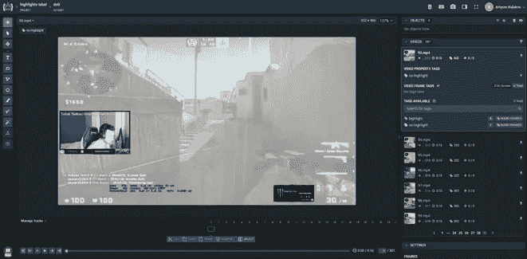

# 我如何为 Twitch 创建一个实时流精彩检测应用程序

> 原文：<https://towardsdatascience.com/how-i-created-an-app-for-live-stream-highlight-detection-for-twitch-532f4027987e?source=collection_archive---------24----------------------->

## 内部源代码

[https://unsplash.com/photos/HUBNTCzE-R8](https://unsplash.com/photos/HUBNTCzE-R8)

# 介绍

在 Twitch 上直播期间，许多流媒体和电子竞技组织都很难从海量的流媒体数据中提取有趣的瞬间。对于大型电子竞技组织来说，让员工在直播过程中找到精彩内容也是非常昂贵的。除了这个问题之外，另一个问题出现了，现场直播通常持续相当长的时间，有时直播者需要休息，在这些时刻观众从流中流出。在此期间显示有趣的精彩片段可能是让观众继续观看视频流的潜在解决方案。
在亮点检测领域，积极的工作正在进行中。最近，已经提出了大量的解决方案，一些大公司和初创公司也试图提供现成的解决方案。不幸的是，大多数服务都没有为这个问题提供开源解决方案。到目前为止，还没有现成的解决方案可以推出和测试，几家处理类似问题的初创公司被迫关闭。也许这一领域发展如此不成功的根本原因是任务的复杂性，甚至一个人也不能够准确地阐述有趣时刻的定义。除其他外，这项工作旨在更准确地制定这一定义，并努力改善现有的研究和开发成果。

# 机器学习模块开发

为了解决在直播流中找到有趣时刻的问题，我决定将问题分成更小的部分，因此，结合使用了几种机器学习算法。首先，我从直播流中提取了 10 秒钟的剪辑，对于每个剪辑，我从聊天+音频+视频数据中提取了以下信息:

*   通过当前时刻的情感和评论数量来评估剪辑；
*   使用陈盼 CNN 进行音频标记，通过音量和检测到的声音信号来评估剪辑；
*   利用密集光流和卷积神经网络，通过帧与帧之间的运动量来评估剪辑；

然后元模型使用这些特征对每个片段进行独立评分。以下是机器学习工作流程的粗略架构:

机器学习模块的工作流程

现在，让我们分别深入研究机器学习模块的每个组件。

## 1.Twitch 聊天功能

为了从 Twitch 聊天中提取数据，我们选择使用以下聊天功能:

1.  10 秒钟片段的消息总数
2.  在 10 秒钟的剪辑中，积极情绪的消息总数
3.  在 10 秒钟的剪辑中，带有负面情绪的消息总数

出于这个目的，我使用了出色的[变形金刚库](https://huggingface.co/transformers/quicktour.html)，在那里，情感分析可以在几行代码中完成。

## 2.运动特征

随着运动估计变得更加有趣，为了更好地理解光流概念，你可能想看看我的[帖子](https://artkulakov.com/2020/12/29/how-i-created-the-workout-movement-counting-app-using-deep-learning-and-optical-flow-algorithm/)关于使用光流进行运动计数。

也就是说，运动估计模型基于光流算法，该算法突出显示图像的每个像素，使得在一个方向上移动的像素以相同的颜色突出显示。可以配置光流，使其对像素进行分组并突出显示整个区域，由于这一技巧，具有大量运动的帧会呈现以下外观:

用光流算法编码的具有大量运动的帧

移动次数少的帧会呈现以下外观:

用光流算法编码的低运动量帧

正如你所看到的，区分一种类型的图像和另一种类型的图像是非常容易的；为了让这一功能在应用中发挥作用，使用了简单的卷积神经网络(CNN)的架构。网络的任务是将通过光流编码的图像识别为具有大量运动的图像(类别 1)和具有少量运动的图像(类别 0)。这么简单的任务，即使是架构最简单的 CNN 也表现的很好。

## 3.声音特征

几种方法同时被用来从声音中提取数据。首先，对于每个剪辑，提取最大声音值。其次，使用[陈盼 CNN 进行音频标记](https://github.com/qiuqiangkong/audioset_tagging_cnn)，可以在音频中找到特定的声音，然后从中提取必要的数据。以下是模型提取的声音特征列表:

陈盼 CNN 模型提取的声音特征

## 4.元模型！

由于人们很难找到有趣的时刻，以及“有趣的时刻”这一概念的模糊性，因此决定创建一个元模型，它可以总结出哪些特征对于从数据中识别有趣的时刻是重要的。
元模型获取由音频、动作和聊天组件提取的关于 Twitch 广播的所有数据。然后，它根据提供的特征预测该时刻成为有趣时刻的概率。
从直播中提取所有数据后，以下一组特征被输入到元模型的输入中:

元模型使用的所有特性

经典的监督学习方法用于训练元模型。为此，收集并标记了直播样本。为了标记每个广播，我使用了 [supervise.ly](https://supervise.ly/) 平台，这对于数据标记来说非常方便！

supervise.ly 视频标注界面截图

为了标记直播，使用了来自我的应用程序的现成代码库。已卸载所选直播的所有功能。每个广播都被切成连续的 10 秒钟的片段。对于每个广播，获得以下数据表:

元模型使用的数据集示例

在所有的类标签被标记之后，训练元模型的过程就开始了。根据两个标签进行类别预测的问题是一个常见的二分类问题。为了解决这个问题，我使用了 scikit-learn 库中的模型。最佳模型(可解释性、速度和 f1 值)是逻辑回归，F1 值为 **0.44** 。以下是逻辑回归模型(系数)的特征重要性:

逻辑回归模型中的特征重要性

在训练元模型并可视化特征的重要性之后，人们可以看到模型能够从数据中提取的几个有趣的模式:
确定类“有趣时刻”的最重要标准:

*   音量(声音响度)
*   (机关枪的)射击声
*   笑声。

确定班级“无趣时刻”的最重要标准:

*   背景音乐(音乐)
*   演讲(演讲，男性演讲)
*   单发射击(枪响、枪声)

不影响模型结果的特征:

*   脚步声
*   聊天中正面消息的数量
*   一个女人的声音。

一个有趣的事实是，该模型将女性的声音归类为不重要，尽管这不是真的。事实是，男性的声音在训练样本中占主导地位，正因为如此，模型得出女性的声音不重要的结论，这是一个经典的“人工智能中的偏见”问题

# 实施细节

应用架构

该应用程序由两个主要部分组成:
Web 应用程序，用户与主界面
服务器进行交互，在此进行视频流处理和精彩片段检测
在与应用程序前端部分的交互过程中，用户上传一个到直播的链接，他希望在那里找到精彩片段，然后该链接连同用户的元数据一起被发送到服务器。

向应用程序添加新的实时流

在服务器上，直播及其评论被持续加载到本地存储器中，同时在直播中检测有趣的时刻。一旦发现新的有趣时刻，就会将其保存在谷歌云存储中，并将包含该有趣时刻的视频链接发送回 web 应用程序。

应用程序的两个部分(web 应用程序和服务器)都位于谷歌云平台上，当启动时，会收到它们的公共 IP 地址，您可以连接到这些地址。

这是该应用的一个快速展示:

# 结论

我希望这篇文章能帮助你更好地理解我的高光检测管道。我在我的 [GitHub 简介](https://github.com/artkulak/twitch-stream-highlights-detection)上发布了所有代码，所以请随意查看并将其用于您自己的项目！

**你可能喜欢在我的** [**网站**](http://artkulakov.com/) **上查看其他帖子，别忘了订阅:)**