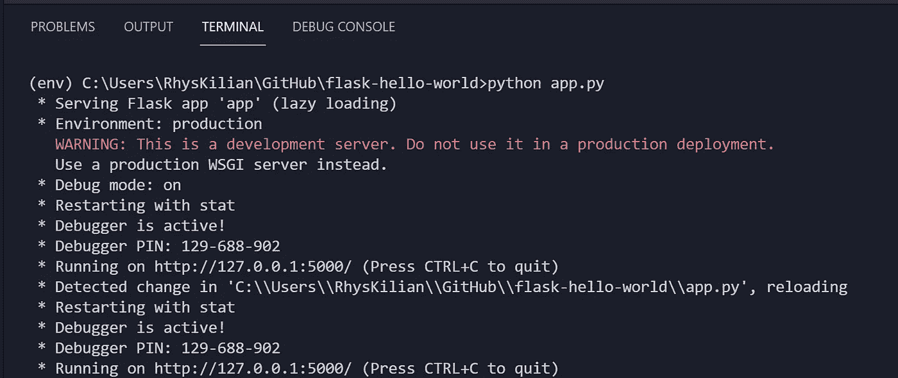
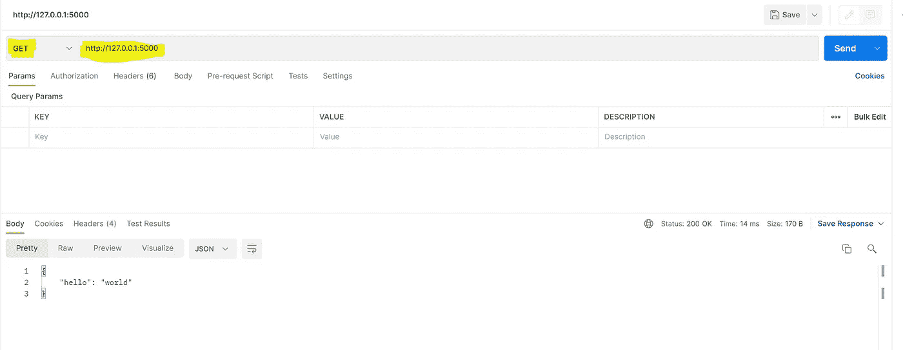
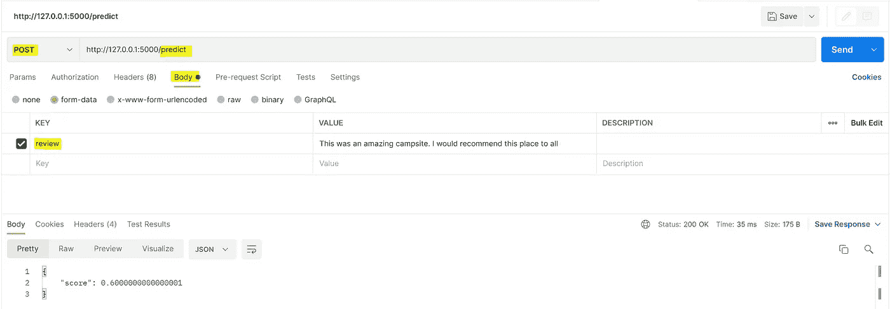
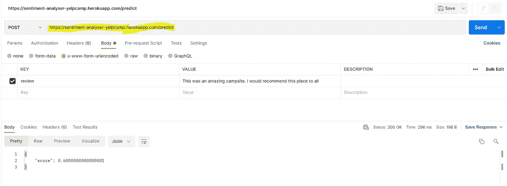

# 我如何使用 spaCy、Flask 和 Heroku 部署情感分析器 API

> 原文：<https://towardsdatascience.com/how-i-deployed-a-sentiment-analyser-api-with-spacy-flask-and-heroku-bd9b8f9de6cf?source=collection_archive---------19----------------------->

## 了解如何使用您构建的模型开发 RESTful APIs


[混合动力](https://unsplash.com/@artbyhybrid?utm_source=medium&utm_medium=referral)在 [Unsplash](https://unsplash.com?utm_source=medium&utm_medium=referral) 上拍照

通过完成本教程，您将学会使用 Flask 将机器学习模型部署到 Heroku。因此，即使您的组织中没有机器学习工程师或软件工程师，您也将拥有部署机器学习 REST APIs 的必要技能。

我将首先使用 spaCy 创建一个情感分析模型来进行演示。然后，我将向您展示如何使用 Flask 将这个模型转换成 REST API。最后，API 将被部署到 Heroku 并集成到现有的 web 应用程序中。

# 用 spaCy 创建一个简单的情感分析器

首先，我们构建了一个基本的情感分析模型，它可以识别用户输入是积极的还是消极的。我们将使用 [spaCyTextBlob](https://spacy.io/universe/project/spacy-textblob) ，它从 [TextBlob](https://textblob.readthedocs.io/en/dev/) 扩展了 [SpaCy](https://spacy.io/) ，具有额外的文本处理能力，包括情感分析。

首先，我们导入 spaCy 和 TextBlob。

```
import spacyfrom spacytextblob.spacytextblob import SpacyTextBlob
```

我们还加载了 spaCy 语言模型，并使用 TextBlob 扩展了我们的文本处理管道。

```
nlp = spacy.load('en_core_web_sm')nlp.add_pipe('spacytextblob')
```

我们的目标是建立一个情感分析模型，该模型接受用户输入的字符串并对情感进行评分。模型应该在字典中输出它的预测，这将简化我们的 API 的开发。

```
# User input text
user_input = 'This is a wonderful campsite. I loved the serenity and the birds chirping in the morning.'# Process user input
doc = nlp(user_input)# Convert the model output to a dictionary
input_polarity = doc._.polarity
sentiment = {
    'score': input_polarity
}
print(sentiment)
```

如果我们运行这个管道，我们应该得到以下输出:

```
{'score': 0.85}
```

我们的模型输出从-1(负面情绪)到 1(正面情绪)的分数。

要自己运行这段代码，请查看我的 [Google Colab 笔记本](https://github.com/rtkilian/data-science-blogging/blob/main/spaCy_sentiment.ipynb)。

# Flask RESTful API 概念回顾

在我们开始开发情绪分析 Restful API 之前，让我们先回顾一些概念。

## 烧瓶是什么？

Flask 是一个 Python 微型 web 框架，为您提供开发和构建 web 应用程序所需的工具。“微”指的是 Flask 不像其他框架那样执行特定的库或结构(例如 [Django](https://www.djangoproject.com/) )。Flask 的轻量级设计使框架灵活易用，受到熟悉 Python 的数据科学家的欢迎。

## 什么是 API？

应用程序编程接口(API)允许产品和服务基于一组规则相互通信。作为一名数据科学家，你不需要理解一个 API 是如何实现的，但是，你可以使用它的接口与它进行交互。例如，下面是简单 API 的列表:

*   [cryptanator](https://api.cryptonator.com/api/ticker/btc-usd):加密货币汇率
*   [开放式气象](https://open-meteo.com/en):天气预报
*   [icanhazdaddjoke](https://icanhazdadjoke.com/):随机老爸笑话

## 什么是 RESTful API？

REST 代表 **RE** 表象 **S** 状态 **T** 转移。当一个 API 在开发时考虑了特定的约束，它就是 RESTful 的。这些约束使得其他人更容易使用您的 API 并与之通信。

在 REST 架构中，客户端(例如您的浏览器)请求在服务器上创建、读取、更新或删除(也称为“CRUD”)数据。然后，服务器将根据您的请求做出响应。

# 一个简单的使用 Flask 的“Hello World”API

我们将从开发一个简单的 API 来演示 Flask 的主要构件开始。

*注意:我建议你使用 Python IDE 或者代码编辑器，比如* [*Visual Studio 代码*](https://code.visualstudio.com/) *，来编写你的脚本。我的应用程序是在 Windows 机器上开发的，因此您的命令可能在 Unix 或 macOS 上有所不同。*

## 虚拟环境和安装库

使用终端，在名为 **flask-hello-world** 的新目录中创建一个名为 **env** 的虚拟环境:

```
$ py -m venv env
```

*如果你在 Unix 或 macOS 上，命令是:*

```
$ python3 -m venv env
```

在我们开始安装 Flask 和我们需要的其他库之前，激活您的虚拟环境:

```
$ .\env\Scripts\activate
```

*如果你在 Unix 或 macOS 上，命令是:*

```
$ source env/bin/activate
```

现在，让我们安装[烧瓶](https://flask.palletsprojects.com/en/2.0.x/installation/)和[烧瓶-RESTful](https://flask-restful.readthedocs.io/en/latest/installation.html) :

```
$ pip install Flask
$ pip install flask-restful
```

最后，让我们为我们的服务器安装 [gunicorn](https://pypi.org/project/gunicorn/) :

```
$ pip install gunicorn
```

## 编写我们的 app.py

一切都设置好了，我们可以进入我们的 **app.py** 文件了。从导入 Flask 和 Flask-RESTful 开始:

```
from flask import Flask
from flask_restful import Resource, Api
```

然后，我们初始化 Flask 应用程序，并将其指定为 API:

```
app = Flask(__name__)
api = Api(app)
```

Flask-RESTful 提供了称为资源的构建块，允许我们访问 POST、GET、PUT 和 DELETE 等 HTTP 方法。这些分别对应于我们的创建、读取、更新和删除(CRUD)操作。让我们定义一个简单的 GET 路线:

```
class HelloWorld(Resource):
    def get(self):
        return {'hello': 'world'}
```

当需要创建我们的情绪分析应用程序时，我们将返回到这段代码，并根据需要进行调整。

接下来，我们将 URL 为“/”的 HelloWorld 资源添加到我们的 API:

```
api.add_resource(HelloWorld, '/')
```

最后，如果当前文件名与主文件名相同，我们希望运行应用程序。我们还在调试模式下运行，部署时将关闭该模式:

```
if __name__ == '__main__':
    app.run(debug=True)
```

如果你一直跟随，你的 **app.py** 应该看起来像这样:

为了启动我们的简单 web 应用程序，我们在终端中运行我们的 **app.py** 文件:

```
$ python app.py
```

如果一切按计划进行，您应该会在终端中看到以下消息:



作者图片

为了测试我们的 API，我们有几个不同的选项。最简单的方法是在新的终端窗口中使用 curl，方法是使用以下命令:

```
$ curl http://127.0.0.1:5000/
```

您应该得到以下输出:

```
{
    "hello": "world"
}
```

或者，您可以使用类似于 [Postman](https://www.postman.com/) 的工具，它是为构建和测试 API 而设计的。例如，下图展示了对我们的服务器的 GET 请求以及我们收到的响应。



作者图片

最后，您可以使用 Python [Requests](https://docs.python-requests.org/en/latest/) 库来发送 HTTP 请求。然而，本教程没有涵盖请求库，我鼓励您阅读文档。

就是这样！至此，您应该已经运行了第一个“hello world”Flask API。作为参考，你可以在这个 [GitHub 库](https://github.com/rtkilian/flask-hello-world)里找到我所有的代码。

# 用 spaCy 为我们的 API 添加情感分析

在我们的 spaCy 情感分析器笔记本和“hello world”Flask API 之间，你应该拥有创建情感分析 API 所需的一切。

首先创建一个新的目录(我的目录名为**情绪分析器 yelpcamp** )，设置你的虚拟环境并安装你需要的库。不要忘记包括 spaCy 和 spaCyTextBlob:

```
$ pip install -U pip setuptools wheel
$ pip install -U spacy
$ python -m spacy download en_core_web_sm
$ pip install spacytextblob
```

然后，我们通过导入和初始化我们的库来开始我们的 **app.py** 文件:

```
from flask import Flask, request
from flask_restful import Resource, Api, reqparseimport spacy
from spacytextblob.spacytextblob import SpacyTextBlobnlp = spacy.load('en_core_web_sm')
nlp.add_pipe('spacytextblob')app = Flask(__name__)
api = Api(app)
```

您可能会注意到，我们正在从 Flask-RESTful 导入 [reqparse](https://flask-restful.readthedocs.io/en/latest/api.html#module-reqparse) 模块。reqparse 模块简化了表单验证，允许我们在将用户输入传递到我们的情感分析模型之前检查它。

我的 API 将被部署到我的网站 [YelpCamp](https://github.com/rtkilian/YelpCamp) ，对露营地评论的情绪进行分类。我将设置 reqparse 来检查表单(或来自 Postman 等工具的请求)是否包含名为“review”的字段:

```
parser = reqparse.RequestParser()
parser.add_argument('review', required=True,
                    help='Review cannot be blank!')
```

现在，让我们定义一个 POST route，它从请求正文中提取“review”字段，通过`nlp`对象将其转换为 spaCy `Doc`对象，并使用 spaCyTextBlob 提取情感分数:

```
class PredictSentiment(Resource):
    def post(self):
        args = parser.parse_args()
        review = args['review']
        doc = nlp(review)
        score = doc._.polarity
        return {'score': score}
```

然后，我们将 URL 为'/predict '的`PredictSentiment`资源添加到我们的 API 中:

```
api.add_resource(PredictSentiment, '/predict')
```

最后，如果当前文件名与主文件名相同，我们希望运行应用程序。然而，这一次我们没有在调试模式下运行我们的 API，因为在下一步我们将把我们的应用程序部署到 Heroku。

```
if __name__ == '__main__':
    app.run()
```

一旦完成，你的 **app.py** 应该看起来像这样:

我们现在可以启动我们的 Flask 应用程序，并使用 Postman 测试我们的 API，看看我们是否收到了预期的响应。这一次，我们将向“http://127.0.0.1:5000/predict”发出发布请求，并在请求正文中包含“review ”:



作者图片

我们的模型以 JSON 响应，表明情绪得分为 0.60(在-1 到 1 的范围内)，这意味着我们的评论情绪非常积极。

现在我们的 API 已经在本地环境中运行了，我们可以将应用程序部署到 Heroku。

作为参考，您可以在我的 [GitHub](https://github.com/rtkilian/sentiment-analyser-yelpcamp) 上访问我的代码。

# 将 API 部署到 Heroku

在您的应用程序目录中，添加一个名为 **Procfile** 的文件，并包含以下内容:

```
web: gunicorn app:app
```

根据 Heroku [文档](https://devcenter.heroku.com/articles/procfile)，Procfile“指定了应用程序在启动时执行的命令”。

我们还需要创建一个包含在我们目录中的 **requirements.txt** 文件:

```
pip freeze > requirements.txt
```

在我们将应用程序部署到 Heroku 之前，我们将初始化一个 Git 存储库:

```
$ git init
```

然而，我们不想在我们的虚拟环境中包含所有的包，所以我们将创建一个**。gitignore** 包含以下内容:

```
env/
__pycache__/
```

然后，我们可以添加应用程序文件并提交我们的更改:

```
$ git add .gitignore app.py requirements.txt Procfile
$ git commit -m "Initialize Git repository"
```

现在，您应该有一个类似于[矿](https://github.com/rtkilian/sentiment-analyser-yelpcamp)的目录。

要将我们的 API 部署到 Heroku，您需要注册一个免费的 Heroku 帐户，并安装 [Heroku CLI](https://devcenter.heroku.com/articles/getting-started-with-python#set-up) 。之后，您可以使用终端登录 Heroku CLI:

```
$ heroku login
```

我们现在要将我们的代码链接到 Heroku 服务器，这可以通过 Git [remote](https://git-scm.com/book/en/v2/Git-Basics-Working-with-Remotes) 来实现。这可以通过从 CLI 运行以下命令来实现，该命令将创建一个 Heroku 应用程序:

```
$ heroku create
```

最后，我们将代码推送到触发构建过程的 Git 远程存储库。运行以下命令后，您将看到关于部署过程的信息，并且(希望)在完成后会看到一条成功消息:

```
$ git push heroku main
```

你成功了！输出将显示您的 API 的 URL(我的是[https://sentiment-analyser-yelpcamp.herokuapp.com/](https://sentiment-analyser-yelpcamp.herokuapp.com/))。或者，您可以通过 Heroku 仪表盘访问该应用程序，网址为:


作者图片

为了测试我们的 API 是否已经正确部署，我们可以使用 Postman。使用相同的检查，我们从部署的 API 得到与在本地机器上相同的响应。



作者图片

# (奖励)将 API 与现有的 web 应用程序集成

大多数情况下，对于您构建的 API，您会有一个特定的用例。您可能希望在一些批量 ETL 处理作业中调用 API，或者在 [Streamlit](https://streamlit.io/) 上演示一个原型。在我的例子中，我的目标是对我的网站 YelpCamp 上露营地评论的情绪进行分类。

YelpCamp 是用 NodeJS 开发的。因此，我使用 [Axios](https://github.com/axios/axios) 库来调用我的 API，传递评论体并返回存储在 [MongoDB](https://www.mongodb.com/) 中的情感评分。下面的代码演示了这个过程，但是，解释超出了本教程的范围:

# 结论

通过学习本教程，您现在应该了解了:

*   利用 spaCy 和 spaCyTextBlob 进行文本情感分类
*   用 Flask 和 Flask-RESTful 开发一个简单的 REST API
*   将您的应用程序部署到 Heroku

您开发的模型不再需要保存在本地的 Jupyter 笔记本中。使用本教程作为指南，并开始与世界分享您的模型。

你有什么问题吗？ [**推我**](https://twitter.com/rtkilian) 或者在 [**LinkedIn**](https://www.linkedin.com/in/rtkilian/) 上加我。

你可以在 [**GitHub**](https://github.com/rtkilian/sentiment-analyser-yelpcamp) 上找到这篇文章中用到的所有代码。