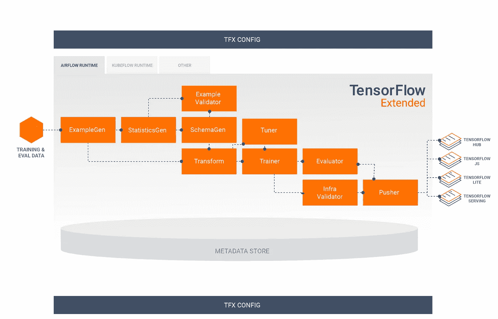
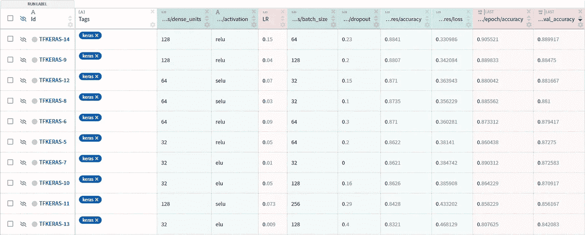
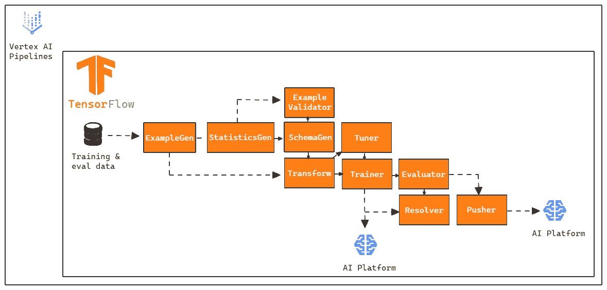
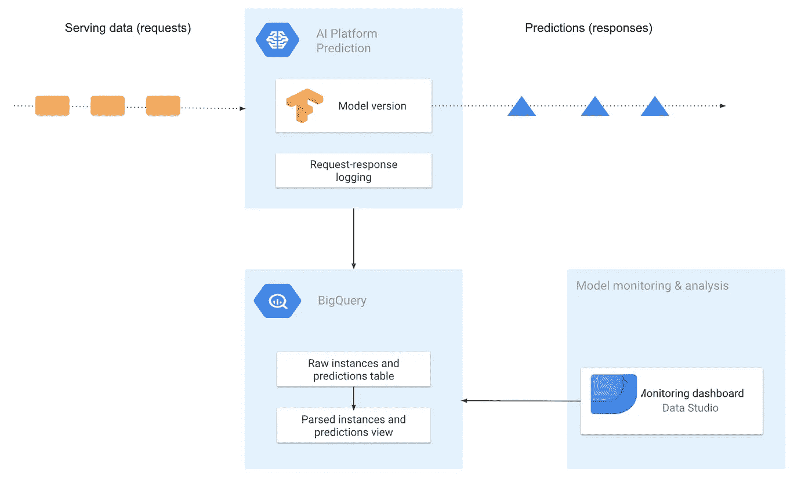
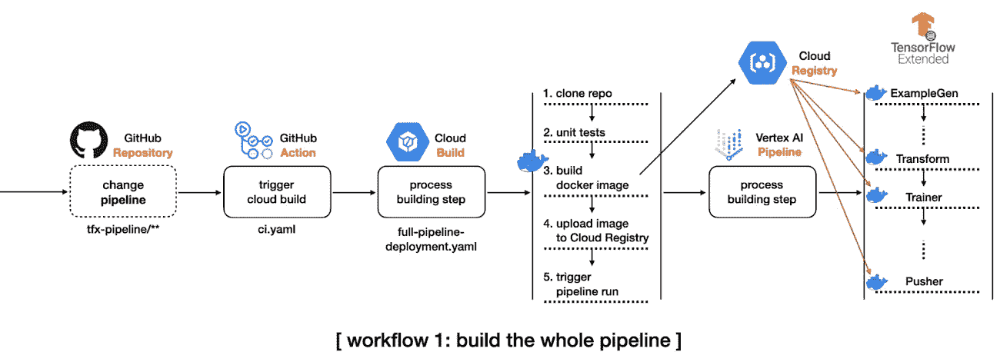
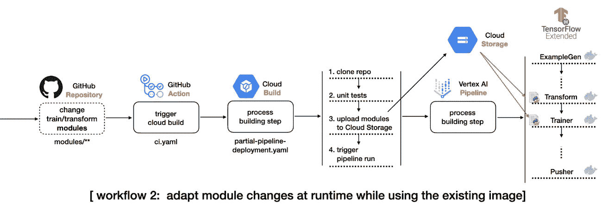

# 我如何部署我的第一个机器学习模型

> 原文：<https://towardsdatascience.com/how-i-deployed-my-first-machine-learning-model-1147c04c449b?source=collection_archive---------15----------------------->

## [实践教程](https://towardsdatascience.com/tagged/hands-on-tutorials)

## 我用来交付我的第一个商业机器学习模型的流程和工具

[戴恩·托普金](https://unsplash.com/@dtopkin1?utm_source=unsplash&utm_medium=referral&utm_content=creditCopyText)在 [Unsplash](https://unsplash.com/s/photos/start?utm_source=unsplash&utm_medium=referral&utm_content=creditCopyText) 上的照片

# **1。简介**

我们在机器学习中听到最多的一个词是术语部署。机器学习模型的部署只不过是一个过程，在这个过程中，我们让其他人可以使用机器学习模型，正是在这个阶段，我们看到模型如何成为产品。

向用户提供模型时，会出现几个问题，例如:

*   模型是如何生产和测试的？
*   如何监控模型？
*   如何更新我的模型？
*   我使用什么框架和工具？

在这篇文章中，我稍微解释了一下部署我的第一个机器学习模型的生产过程，从生产流水线、模型监控、交付给最终用户和持续/交付集成(CI/CD)。目标是直接关注生产过程，解释做出了哪些决定及其原因，以及解释在模型构建过程中使用了哪些工具。在这篇文章中，我们没有任何类型的代码，只是对生产过程的解释。

# **2。TFX(张量流扩展)**

这个模型是用 TFX[建造的](https://www.tensorflow.org/tfx)并且大部分应用内容是通过[面向生产的机器学习工程(MLOps)综合课程项目](https://www.coursera.org/specializations/machine-learning-engineering-for-production-mlops?)学习的，这些课程由吴恩达、罗伯特·克劳和劳伦斯·莫罗尼等杰出的专业人士讲授。

> “TFX 是基于 TensorFlow 的谷歌生产规模的机器学习(ML)平台。它提供了一个配置框架和共享库，以集成定义、启动和监控您的机器学习系统所需的通用组件。”根据 TFX 用户 Guide⁴.的说法

*但是你为什么选择为你的第一个模型使用一个不那么简单的框架呢？*

在生产中处理模型时，MLOps 中有三个非常重要的概念。

*   数据来源

您的数据来自哪里，如何产生，提交了什么方法和流程。

*   数据谱系

它指的是到达管道末端之前的一系列步骤。

*   [计]元数据

是数据描述数据。它们用来解释我们正在看的物品的特征。例如，如果我们正在查看一张照片，元数据可能是照片拍摄的时间、相机设置、照片拍摄者等等。

**这三个部分是生产模型** **的关键，因为它们有助于跟踪模型生命周期中发生的变化**。假设我们有一个团队来收集和清理数据，另一个团队来管理接收，另一个团队来创建/测试模型，还有一个团队来部署它。有许多人在不同的环境中处理不同的文件，如果没有有效地完成，这会使变更跟踪过程变得非常复杂。

假设我们将模型投入生产，但是在几个版本之后我们发现在清理数据时出现了错误。我们如何跟踪数据版本，执行了什么转换，模型的属性是什么？我们如何再现之前提交数据的相同环境？

**这就是为什么使用对这些过程有某种支持的框架是很重要的。**开发 TFX 是为了在生产环境中构建和管理工作流。因此，TFX 的三个主要组成部分是:

*   管道
*   成分
*   图书馆

## **2.1 管道**

为了确保数据遵循逻辑顺序的步骤，有管道。TFX 管道包含一系列组件，它是为可伸缩和高性能的机器学习任务而设计的。在管道内部，您可以转换数据、训练模型、部署、显示推论等等。TFX 支持多个 orchestrators，例如 Apache Airflow、Apache Beam 和 Kubeflow 管道。

## **2.2 组件**

我喜欢把组件想象成乐高积木。您可以单独或一起使用它，每个组件都是为特定的任务而设计的。有些组件依赖于另一个组件的输出，因此您必须按照逻辑顺序使用它们。

为了理解我们的管道是如何组装的，我们首先需要理解它的组件。TFX 有几个教程解释如何使用这些组件。通常，TFX 管道包括以下[组件](https://www.tensorflow.org/tfx/guide?hl=en-us#tfx_standard_components):

*   [ExampleGen](https://www.tensorflow.org/tfx/guide/examplegen?hl=en-us) 在开始时出现，将数据分成训练和评估数据集，将其转换为“tf”。“示例”格式。它接受不同的格式，如 CSV、TFRecord、Avro、Parquet 和 BigQuery。
*   [StatisticsGen](https://www.tensorflow.org/tfx/guide/statsgen?hl=en-us) 负责计算数据集的统计数据，如分布、最大值、最小值、缺失值等。
*   [SchemaGen](https://www.tensorflow.org/tfx/guide/schemagen?hl=en-us) 创建一个数据模式。它显示了每个功能的预期数据类型。
*   [示例验证器](https://www.tensorflow.org/tfx/guide/exampleval?hl=en-us)在训练和评估数据集中寻找异常(与预期值不同的值)和缺失值，例如检测训练服务偏差。
*   [Transform](https://www.tensorflow.org/tfx/guide/transform?hl=en-us) 负责执行我们模型中变量的所有转换/创建。该组件的一个重要之处在于，它生成一个存储数据全局属性的图表，这些属性将用于训练和推理，从而提供可靠性。
*   [培训师](https://www.tensorflow.org/tfx/guide/trainer?hl=en-us)培训模特。在这个组件中，除了定义模型的整个架构之外，我们还指定了模型将在哪里以及如何被训练。
*   [调谐器](https://www.tensorflow.org/tfx/guide/tuner?hl=en-us)调谐模型的超参数。调谐器可以在管道的所有执行中执行，或者如果您只想不时地执行超参数的调整，也可以导入它。
*   [评估员](https://www.tensorflow.org/tfx/guide/evaluator?hl=en-us)深度评估模型的性能。它还可以验证您的模型，允许您对数据的特定子集进行度量，确保模型足够好，可以推向生产。
*   [推送器](https://www.tensorflow.org/tfx/guide/pusher?hl=en-us)将经过验证的模型推送到[部署目标](https://www.tensorflow.org/tfx/guide#deployment_targets)。这是我们指定模型将被服务的地方。

**图一。** TFX 管道。这张图片是从谷歌创作和[分享的作品中复制的，并根据](https://developers.google.com/readme/policies)[知识共享 4.0 归属许可](https://creativecommons.org/licenses/by/4.0/)中描述的条款使用。来源:[https://www.tensorflow.org/tfx/guide](https://www.tensorflow.org/tfx/guide)

## **2.3 库**

库是为组件提供功能的基础。

> 基本上，TFX 管道是由组件组成的，而组件又是由库组成的。

# **3。实验跟踪和管理**

在建立模型的过程中，我认为非常重要的一步是实验跟踪和管理。在构建模型时，您将运行几个实验，包括:

*   具有不同超参数的不同模型
*   不同的培训和测试数据
*   不同的特征
*   对代码的细微更改

这些不同的实验会产生不同的指标。**记录所有这些信息不是一项简单的任务，而是一项非常重要的任务**，主要是跟踪模型的进展，比较不同的实验以对最终结果有信心。

这就是实验跟踪和管理的用武之地。在这个过程中，我们保存所有对我们进行的每个实验都很重要的信息。每个项目都有自己的一组需要保存的重要信息，包括:

*   每个文件使用的代码
*   环境设置
*   数据集版本
*   超参数设置
*   性能指标
*   使用的模型类型

有几种方法可以保存这些信息，**但是** **对于大型项目来说，控制正在做的事情是非常重要的**。为此，有几个工具可用，如 [CometML](https://www.comet.ml/site/) 、[权重和偏差(WandB)](https://www.wandb.com/) 、 [MLFlow](https://mlflow.org/) 。

在我们的项目中，我们选择使用海王星。

> “Neptune 是任何 MLOps 工作流的元数据存储。它是为进行大量实验的研究和生产团队设计的。它让您可以在一个地方监控、可视化和比较数以千计的 ML 模型。”根据 Patrycja⁸的观点

Neptune 支持实验跟踪、模型注册和模型监控，其设计方式允许轻松协作。它还具有 [TensorFlow integration](https://docs.neptune.ai/integrations-and-supported-tools/model-training/tensorflow-keras) ，使得在一个地方监控所有实验变得非常简单。

**图二。**海王星运行(图片由作者提供)。

# **4。顶点 AI + TFX 管线**

当我们部署一个模型时，我们需要考虑如何将它提供给我们的最终用户。在我们的例子中，我们需要通过 API 使模型可用，这样我们就可以发送请求和接收响应。

为了建立我们的管道，我们选择与谷歌云合作。作为一名管弦乐手，我们使用 Kubeflow 管道，因为大多数教程都是通过它完成的。有几个教程教你如何在云中集成 TFX 管道，如[1]、[2]和[3]。

**我们决定使用** [**顶点人工智能**](https://cloud.google.com/vertex-ai) ，谷歌新的人工智能平台平台来建立我们的管道。我们选择 Vertex AI 有两个原因:

*   与人工智能平台管道相比，它更便宜(在我们的情况下)。顶点流水线不需要集群一直处于活动状态，成本按每次运行收取，并且与用于训练/预测模型的计算资源的使用相关联。
*   不像 [GKE](https://cloud.google.com/google/kubernetes) (谷歌 Kubernetes 引擎)，我们不需要管理我们组件的基础设施/服务器/健康状况，因为它是一个自我管理的平台。

根据[文档](https://cloud.google.com/vertex-ai/docs/pipelines/build-pipeline)，Vertex AI 管道可以运行使用 Kubeflow Pipelines SDK v1.8.9 或更高版本或 TensorFlow Extended v0.30.0 或更高版本创建的管道。

**虽然我们的流水线运行在 Vertex AI 上，但我们选择在** [**AI 平台**](https://cloud.google.com/ai-platform/docs/) 上训练和服务我们的模型。Vertex AI 是一个最新的平台，其局限性将随着时间的推移而改善，因此，在撰写本文时，有一些重要的特性还不存在于被服务的模型中，例如在发出 [predict 请求](https://cloud.google.com/vertex-ai/docs/reference/rest/v1/projects.locations.endpoints/predict)时指定一个 [SavedModel](https://www.tensorflow.org/guide/saved_model) TensorFlow 的签名。

每个组件负责 TFX 管道中的一项任务，并且通常一个组件依赖于另一个组件的输出。在我们的例子中，我们选择不使用 InfraValidator 和 BulkInferrer 组件。然而，我们选择在管道中增加一个节点，即[解析器](https://www.tensorflow.org/tfx/api_docs/python/tfx/v1/dsl/Resolver?hl=th)。Resolver 是一个特殊的 TFX 节点，用于处理特殊工件的求解，在我们的例子中，它用于将最新的基础模型指定到评估器组件中。

所以我们的顶点管道是这样构成的:

**图三。** Vertex AI 管道(图片由作者提供)。这张图片是基于谷歌创作和分享的[作品的修改，并根据](https://developers.google.com/readme/policies)[知识共享 4.0 归属许可](https://creativecommons.org/licenses/by/4.0/)中描述的条款使用。来源:[https://www.tensorflow.org/tfx/guide](https://www.tensorflow.org/tfx/guide)

# **5。监控**

一旦管道被执行，我们的模型将可用于预测。然而，这并不意味着我们的工作已经结束，而是刚刚开始。当您在生产中部署一个 ML 模型以服务于业务用例时，**定期地、主动地验证模型性能不会衰退是至关重要的。**由于模型不在静态环境中运行，ML 模型的性能会随着时间的推移而降低。数据分布可能会发生变化，导致数据不对称，从而影响模型的性能。为了维护模型在生产中的性能，有必要注册服务请求并将其与定型数据进行比较，以验证模型的预测能力是否发生了变化。

所以，我们需要监控模型。我们已经选择从我们的模型中[记录服务请求](https://cloud.google.com/architecture/ml-modeling-monitoring-logging-serving-requests-using-ai-platform-prediction)，这个过程以 raw (JSON)格式记录在线预测请求和对 [BigQuery](https://cloud.google.com/bigquery/docs) 表的响应的示例。

**图 4。**监控架构。这张图片是从谷歌创作和[分享的作品中复制的，并根据](https://developers.google.com/readme/policies)[知识共享 4.0 归属许可](https://creativecommons.org/licenses/by/4.0/)中描述的条款使用。来源:[https://cloud . Google . com/architecture/ml-建模-监控-分析-ai-平台-预测-大查询](https://cloud.google.com/architecture/ml-modeling-monitoring-analyzing-ai-platform-prediction-in-big-query)

**有了这些记录，我们就可以分析数据、计算统计数据并可视化数据的偏差。**这一过程对于模型的健康发展至关重要，提供数据会改变其分布，这将导致我们的模型性能下降，表明有必要重新训练/调整模型。由于数据将被注册到 BigQuery 表中，因此生成关于数据分布和模型预测的可视化和报告非常容易，要使用的工具的一个例子是 [Data Studio](https://datastudio.google.com/c/navigation/reporting) 。

# **6。CI/CD**

现在，让我们进入项目的最后一步。假设我们有几十个模型，生产中有数百个文件，并且我们定期需要进行调整，例如调整数据集、创建变量、重新训练模型、调整超参数等。我们如何自动化这个过程，以便检测、测试任何设计变更，并自动部署新模型？

> “在软件工程中，持续集成(CI)和持续交付(CD)是两个非常重要的概念。CI 是指集成变更(新特性、批准的代码提交等。)进入你的系统。CD 是您可靠地、持续地部署这些变更的时候。CI 和 CD 既可以单独执行，也可以耦合执行。”根据 P. Chansung 的说法；Sayak⁶

CI/CD 管道允许我们的软件处理代码变更、测试、交付等等。我们可以自动化实施变更、测试和交付的流程，以便检测、测试项目的任何变更，并自动部署新模型。**这使得我们的系统除了提供速度和可靠性之外，还可以扩展和适应变化**，减少由于重复故障导致的错误。如果你想了解更多关于 CI/CD 的重要性以及为什么你的项目需要它，请查看[这篇文章](https://cloud.google.com/architecture/mlops-continuous-delivery-and-automation-pipelines-in-machine-learning)。

在此项目中，我们创建了以下 CI/CD 管道:

1.  我们在 Github 上创建了一个存储库，包含了将在 Vertex AI 上运行的 TFX 管道的所有代码。
2.  我们已经在 GitHub Actions 上建立了一个工作流，它将在每次推送到主分支时触发，并将检查我们存储库中特定目录的更改。
3.  如果包含与管道配置相关的文件的目录发生变化，流程将启动[云构建过程](https://cloud.google.com/build)，该过程将克隆整个存储库，基于代码变化构建新的 Docker 映像，将新映像上传到 [Google 容器注册表](https://cloud.google.com/container-registry)，并在 Vertex AI 中提交 TFX 管道。

**图 5。**整个管道的 CI/CD。本图片转载自 P. Chansung 创作并分享的作品[；P. Sayak](https://github.com/deep-diver/Model-Training-as-a-CI-CD-System) 并根据 [Apache 2.0 许可证](https://www.apache.org/licenses/LICENSE-2.0)中描述的条款使用。来源:[https://cloud . Google . com/blog/topics/developers-从业者/模型-培训-cicd-system-part-i](https://cloud.google.com/blog/topics/developers-practitioners/model-training-cicd-system-part-i)

4.如果目录中存在包含对模型代码、预处理或训练数据的改变的改变，则流程将启动云构建过程，该过程将克隆整个储存库，仅将改变的模块复制到 [GCS 桶](https://cloud.google.com/storage/docs)中的目录模块，并在 Vertex AI 中提交 TFX 管道，而无需构建新的 Docker 映像。

**图 6。** CI/CD 用于数据预处理和建模模块。本图片转载自 P. Chansung 创作并分享的作品[；P. Sayak](https://github.com/deep-diver/Model-Training-as-a-CI-CD-System) 并根据 [Apache 2.0 许可证](https://www.apache.org/licenses/LICENSE-2.0)中描述的条款使用。来源:[https://cloud . Google . com/blog/topics/developers-从业者/模型-培训-cicd-system-part-i](https://cloud.google.com/blog/topics/developers-practitioners/model-training-cicd-system-part-i)

配置好管道后，**任何对存储库的推送都将激活 GitHub Actions** ，它将检查变更并自动运行管道，自动部署我们的模型。需要强调的是，TFX 管道将正常遵循流程，也就是说，例如，如果候选模型没有得到评估者的批准，那么该模型将不会被部署。

CI/CD 管道还有其他一些可能的改进，例如:

*   培训数据验证
*   不同模块的单元测试，如可接受的数据类型、预期的数据量等。
*   测试模型输出是否不产生空值
*   通过使用测试数据调用服务 API 来测试预测服务，以验证模型是否正常工作
*   预生产环境的自动部署，例如，在审阅者批准变更后，代码合并触发的主分支的部署

# **7。结论**

部署机器学习模型并将其提供给用户并不是一件容易的事情，构建模型只是第一步。部署我们的第一个机器学习模型并保持我们模型的性能，我们需要监控您的预测并提供替代方案，使我们的流程可扩展并适应变化。此外，我们保留有关管道执行的数据是很重要的，这样我们的过程是可重复的，并且纠错过程是有效的。使用支持该过程的工具对于抽象项目的复杂性是必不可少的，使其更具可伸缩性和更易于维护。

# **8。参考文献**

[1] [**云上 TFX AI 平台管道**](https://www.tensorflow.org/tfx/tutorials/tfx/cloud-ai-platform-pipelines)**(2021 年 11 月 05 日)，TensorFlow。**

**[2] O. Rising， [**深度潜入 ML 模型在生产中使用 TensorFlow Extended (TFX)和 kube flow**](https://neptune.ai/blog/deep-dive-into-ml-models-in-production-using-tfx-and-kubeflow)**(2021 年 11 月 12 日)，海王星博客。****

****[3] [**简单 TFX 管道为顶点管道**](https://www.tensorflow.org/tfx/tutorials/tfx/gcp/vertex_pipelines_simple)**(2021 年 12 月 08 日)，TensorFlow。******

******[**【TFX 用户指南】**](https://www.tensorflow.org/tfx/guide)**(2021 年 12 月 14 日)，TensorFlow。********

******[5] [**MLOps:机器学习中的连续交付和自动化管道**](https://cloud.google.com/architecture/mlops-continuous-delivery-and-automation-pipelines-in-machine-learning)**(2020 年 01 月 07 日)，谷歌。********

******[6]陈松；P. Sayak， [**作为 CI/CD 系统的模型训练:第一部分**](https://cloud.google.com/blog/topics/developers-practitioners/model-training-cicd-system-part-i)(2021 年 10 月 6 日)，谷歌。******

****[7] [**ML 模型监控:利用 AI 平台预测**](https://cloud.google.com/architecture/ml-modeling-monitoring-logging-serving-requests-using-ai-platform-prediction)**(2021 年 3 月 12 日)，Google。******

******[8] J. Patrycja，[**ML 实验跟踪管理的 15 个最佳工具**](https://neptune.ai/blog/best-ml-experiment-tracking-tools)**(2021 年 10 月 25 日)，海王博客。********