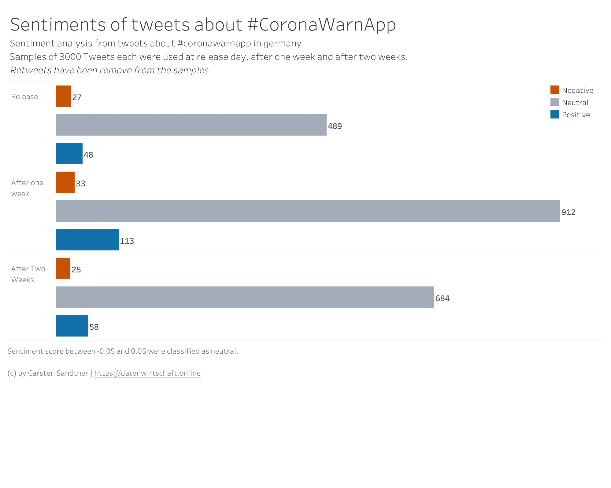
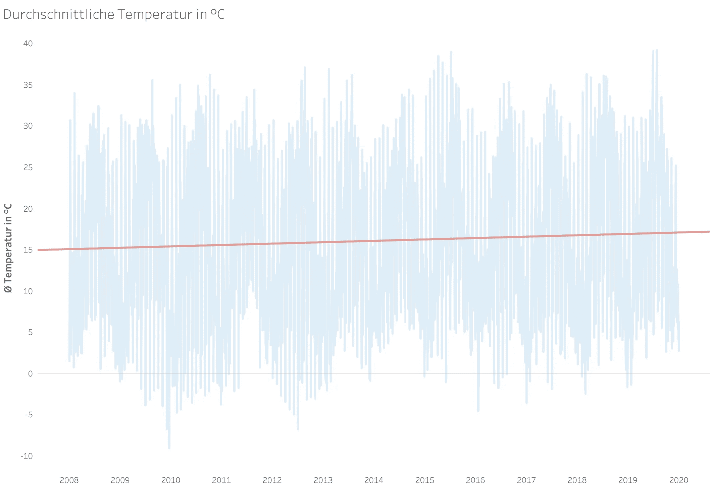
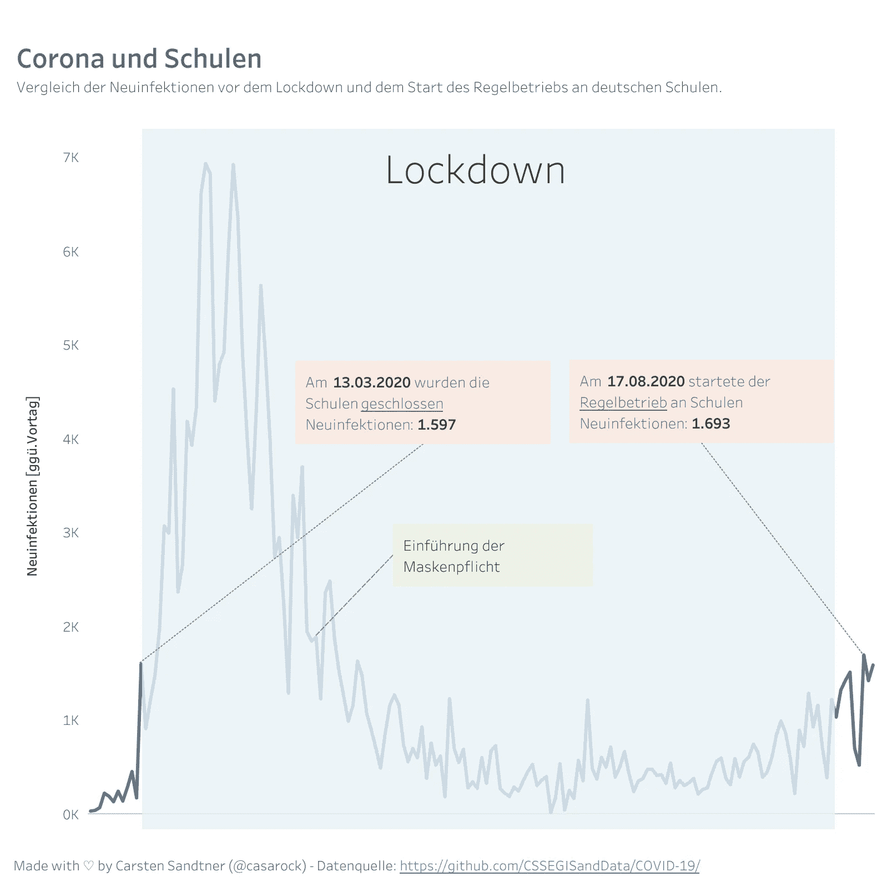

# 我如何使用 corona lockdowns 开发我的数据科学技能

> 原文：<https://towardsdatascience.com/how-i-developed-my-data-science-skills-using-corona-lockdowns-ad9d8d46c3bc?source=collection_archive---------32----------------------->

## 处于禁闭状态，并通过学习新技能来对抗新出现的无聊感？是的，我做到了。这是我在封锁期间创造的。

伊万·阿列克西奇在 [Unsplash](https://unsplash.com?utm_source=medium&utm_medium=referral) 上的照片

2020 年是艰难的一年。我从没想过我会见证一个世界性的疫情。就像我们大多数人一样。进入封闭状态，在家工作，减少工作时间，在家上学。但是如何对抗新出现的无聊感呢？

疫情创建了许多免费的数据，我决定积累我的数据科学知识。我已经实现了一些学习新工具和技术的小项目。

这篇文章是我个人尝试和学习的事情的一个简要概述。这不是关于电晕，而是关于如何在疫情期间学习新事物。

# 我造了一个推特机器人

我的第一个项目是创建一个 Twitter 机器人，定期发布当前数据和图表。我打算学习如何建立一个 Twitter 机器人，从公开的可用资源中收集数据，并可视化一些关于这种疾病的关键事实。

更多的细节在我写的一篇关于我如何进行的文章中给出。

 [## 我如何建立一个电晕统计 Twitter 机器人

### 编辑描述

towardsdatascience.com](/how-i-built-a-corona-stats-twitter-bot-4f0dc90cf96e) 

## 我学到了什么

我学会了三件事:

1.  如何创建一个定期发微博的推特机器人
2.  如何收集数据并清理数据以备后用
3.  如何可视化我的数据洞察力

# Plotly 仪表板

在用 Pandas 和 MatplotLib 创建我的 Twitter 机器人时，我偶然发现了用于交互式可视化的 [Plotly](https://plotly.com/) 。最后，我找到了 Plotly 的[破折号](https://dash.plotly.com/)。Dash 允许使用 Plotly 图形构建基于浏览器的仪表板。你不必摆弄 HTML、Javascript 或 CSS。Dash 使用的方法是声明性的，您完全用 Python 代码描述您的布局。我对 Dash 进行了深入研究，并由此为德国开发者杂志《Entwickler》撰写了一篇文章[。](https://kiosk.entwickler.de/entwickler-magazin/entwickler-magazin-4-2020/wir-visualisieren-die-corona-pandemie/)

## 我学到了什么

我学到了很多关于 Plotly 和 Dash 的东西。在我的文章中，我从两个来源收集了数据，并将它们组合起来创建了一个仪表板。至少我已经为印刷杂志发表了一篇文章！最后，我把我的知识用于我工作的公司的一个项目。

# 推文的情感分析

情感分析(按作者)

自然语言处理。我对这个话题很好奇，我决定对一些关于德国 corona 应用程序的推文进行情感分析。这款应用过去和现在都备受争议，我只是想弄清楚随着时间的推移，人们的情绪会如何变化。我已经收集了发布时、一周后和两周后的推文。最后，[我用 Tableau](https://public.tableau.com/profile/carsten.sandtner#!/vizhome/TweetSentiments/Sentimentanalysis) 形象化了我的发现。

## 我学到了什么

我学会了如何收集大量的推文。此外，我想出了如何清理自然语言，以便能够进行分析:删除停用词，删除链接，删除标签等实体，最后对推文进行词汇化，以便能够开始情感分析。

哦，我进入了 Tableau 形象化。引领我进入下一个学习领域。

# 画面可视化

一段时间的气候数据(按作者)

在为我的情感分析修改了 Tableau 之后，我决定尝试用 Tableau 做更多的分析和可视化。这次我收集了一些我在德国居住的地区的气候数据。最后，我用图片在[的 Twitter 帖子](https://twitter.com/casarock/status/1292835412168380416)上解释了我的发现。

封锁之前、期间和之后的电晕感染(作者)

另一个使用 Tableau 的项目是一个图表[可视化的愚蠢](https://public.tableau.com/profile/carsten.sandtner#!/vizhome/CoronaundSchulen/CoronaundSchulen)在第一次封锁后重新开放德国的学校，在封锁前有更高的感染率。

## 我学到了什么

最后，我进入了 Tableau。这个功能丰富的怪物比我担心的要容易学。公版免费使用，可以学习如何使用一个*企业*可视化工具。我了解到气候变化是可见的——可怕！

# 从 PDF 文件中收集数据

我居住的县以 PDF 文件的形式发布了它的电晕放电数据。易于阅读，但难以分析。此外，他们每周生成一次 PDF。我的计划是收集一些数据，以便能够创建一个时间序列分析。但是如何从 PDF 中提取表格数据呢？我发现有一个为熊猫设计的 PDF 阅读器，名为 tabula/read_pdf。我修补了 jupyterNotebook，可以读取数据。不幸的是，PDF 本身每周都在改变格式。我不得不放弃定期收集数据的计划。

## 我学到了什么

我又一次了解到熊猫有多强大。特别是在使用自定义阅读器时，比如 *read_pdf* 。而且我了解到，**有些项目没有意义。**

# 对熊猫使用复杂的 Excel 表格

谈到熊猫的阅读器，我已经深入研究了熊猫 Excel 阅读器。我的目标是将复杂的 Excel 表格中的数据放到数据框中。我发现熊猫确实有阅读 Excel 表格的超能力。我的文章详细展示了熊猫阅读 Excel 表格的超能力。

 [## 熊猫有阅读 Excel 文件的超能力

### 编辑描述

towardsdatascience.com](/pandas-has-superpowers-in-reading-excel-files-44344bfdaac) 

## 我学到了什么

熊猫很棒。不多不少。

# 免费提供数据和可视化

最后但同样重要的是，我再次找到了一些为我的国家提供数据的来源。我已经开始每天收集数据。利用这些数据，我用 [Datawrapper](https://datawrapeer.de) 创建了一个可视化，这是一个*的基于 web 的数据可视化工具。最好的:它有一个免费层。在 Twitter 上发表我的见解时，人们问我是否愿意分享我收集的数据。对一个好位置的简短搜索把我带到了[Qri](https://qri.io)——一种类似 GitHub 的服务，只提供数据。厉害！我在一篇文章中总结了这一点:*

 [## 通过免费服务提供和绘制数据非常简单

### 编辑描述

towardsdatascience.com](/providing-and-plotting-data-with-free-services-is-easy-c3176f4323f7) 

## 我学到了什么

我再次学会了如何定期收集数据。我还学会了如何使用现有的工具和服务来完成特定的任务。Datawrapper 非常棒，被报纸和在线杂志广泛使用。有了 Qri，每个人都可以以开源的方式共享数据集。你不需要自己实现所有的东西。看看并使用已经存在的工具。

# (我的)结论

2020 年和 2021 年初是狂野的。但是利用这些环境来促进你的个人成长是相对容易的。新冠肺炎产生了大量的免费数据来玩。当然，还有其他可用的数据源。接受它，保持好奇心，给自己设定挑战。充分利用它，训练自己，尝试新的工具，也许可以走出你的舒适区。没有什么比对某事没有好处更糟糕的了！我学到了很多伟大的东西。这也分散了我们对目前复杂局势的注意力。就我个人而言，我学习了许多新工具和技术，进行了大量实践，并提高了一些数据科学技能。