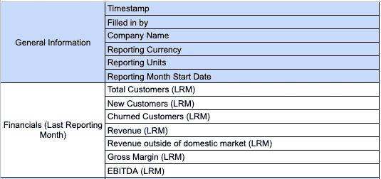
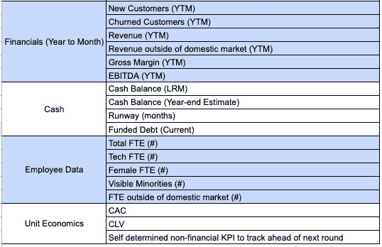
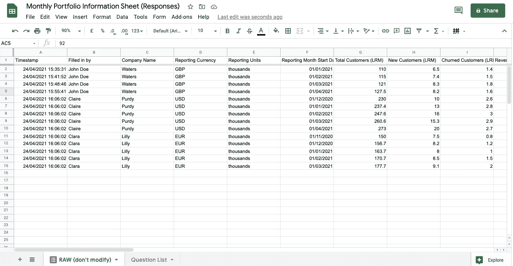
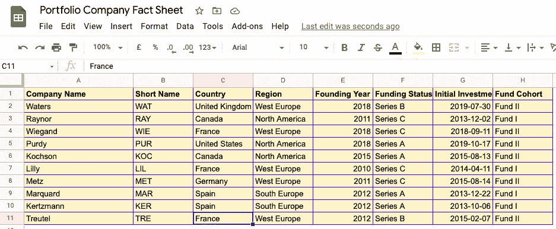
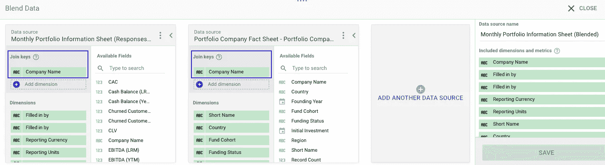
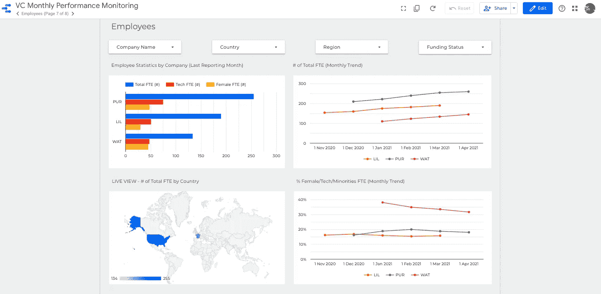
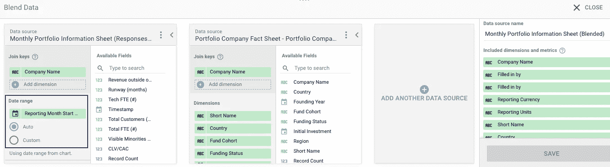
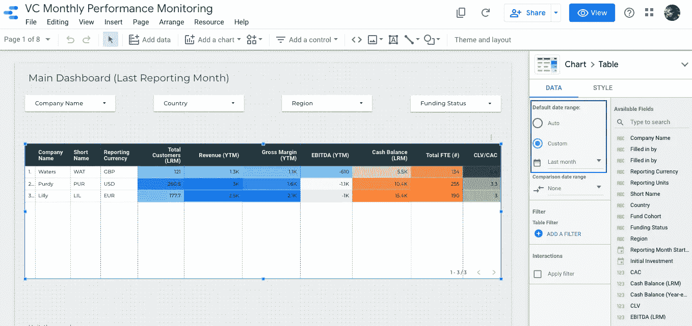

# 我如何帮助一家风投公司自动监控其投资组合的表现

> 原文：<https://towardsdatascience.com/how-i-helped-a-vc-automate-its-portfolio-performance-monitoring-a812189de3e2?source=collection_archive---------29----------------------->

## [行业笔记](https://towardsdatascience.com/tagged/notes-from-industry)

## 通过使用 Google stacks 建立一个轻量级 ELT 项目

由[马库斯·斯皮斯克](https://unsplash.com/@markusspiske?utm_source=unsplash&utm_medium=referral&utm_content=creditCopyText)在 [Unsplash](https://unsplash.com/s/photos/investment?utm_source=unsplash&utm_medium=referral&utm_content=creditCopyText) 上拍摄的照片

除了我的工作之外，我从事的一个有趣的兼职项目是帮助我目前雇主的一位投资者自动监控其投资组合公司的业绩。

数据、自动化、性能监控——在“数据是新的石油”成为新口号、市场上有大量数据集成平台供应商可供选择的世界里，这些工作听起来应该很简单。然而，对于这样一个特殊的用例来说，这些解决方案可能太多了。我们这里并没有真正的大数据，数据延迟也不是我们最关心的问题。

我们面临的真正挑战是**减少我们每年定期从 30 多家投资公司收到的 200 多份 Excel 表格的编译、清理和分析过程中的人工劳动**，同时确保一致性和准确性。我们的最终用户也不是很懂数据，所以我们选择的工具不应该有陡峭的学习曲线。我们也没有任何工程能力来建设和管理复杂的数据管道。因此，我们在这里寻找的是**一个真正轻量级的 ELT 解决方案(提取、加载和转换),具有仪表板功能。幸运的是，我们的投资者已经使用 G-suite 作为他们的办公平台，谷歌也提供了广泛的分析服务供选择。通过一些创意，我们和我的投资者一起设计了一个工作流程，如下所示:**

1.  我们邀请投资组合公司通过填写一份精心设计的标准化谷歌表格来分享他们的月度关键业绩数据——这是“E”部分。
2.  将 Google Form 连接到 Google sheet，这样答案将被自动编译成性能数据集——这是“L”部分。
3.  创建一些辅助数据集来收集我们可以与绩效数据集关联的其他静态事实，以便我们在进一步的分析中有更多有趣的维度(例如，公司总部、融资状态、投资年份等)来进行切分。
4.  将数据集作为数据源添加到 Data Studio，连接这些数据集，创建计算字段和指标，并最终构建自动化的交互式仪表板来推动我们的决策制定，这是“T”部分。

结果呢？此后，投资者采用这种解决方案来监控他们的投资组合表现。你猜怎么着？在他们最近发布的员工招聘信息中，他们提出了一个要求:“最好有:你有一些现代商业智能解决方案的经验(例如，Google Data Studio、Tableau、Power BI)”。😉

这绝对不是一个大数据故事。它不涉及任何现代的数据堆栈，如雪花和红移。它也不是要开发一个先进的机器学习模型来解决一个非常复杂的现实生活问题。然而，这个项目对我来说意义重大，因为它揭示了除了大型、先进的技术项目之外，还有许多可能的方式来从数据中创造价值。**在我看来，这一小步实际上可以为那些不像我一样精通数据的人创造巨大的商业价值，并激励他们在自己的组织中建立强大的数据文化。**

如果你感兴趣，你可以在下面找到一个模板管道，我用一些假的数字设置的。如果你有一个谷歌账户，你可以把这个文件夹和谷歌数据工作室的报告复制到你自己的谷歌硬盘上，然后开始摆弄它。我还分享了一些有用的技巧。

以下是模板的链接。玩得开心！

*   **2021/05/09**更新:我把原来的谷歌表单链接换成了[一个谷歌表单](https://drive.google.com/drive/folders/1QOFuX48mHNMPZqcbzzMRNz75YuzOJO23)的 PDF 打印件，这样你就能马上有个大概的了解。
*   [谷歌工作表](https://drive.google.com/drive/folders/1QOFuX48mHNMPZqcbzzMRNz75YuzOJO23)
*   [谷歌数据工作室报告](https://datastudio.google.com/s/ofCX0i0-wzs)

# 设计一个谷歌表单来收集你的数据。

我喜欢谷歌表单的三点:

*   填写谷歌表单不一定需要谷歌账户。
*   您可以为每个问题设置数据验证规则，这样您就不必花费时间来手动检查拼写错误、数字等。
*   你可以将一个谷歌表单连接到一个谷歌表单，答案会自动流向那个表单。

请记住，谷歌表单中的每个问题都将作为一列进入谷歌表单。因此，确保你以一种聪明的方式设计你的问题！

如果您想要在 Google 表单中添加/更改问题，这可能会有点乏味，这会导致目标 Google 表单中出现重复或不匹配的列。因此，我建议在与您的投资组合公司分享之前，尽可能地测试和改进您的 Google 表单！

最后提醒:**尽量不要在目标 Google 工作表**中做任何修改，例如，根据日期创建一个月列，或者链接到另一个工作表以获得一个新列。这些转换都可以在 Google Data Studio 中以一种更简单、更简洁的方式集中完成。将所有转换保存在一个中心位置的优势是显而易见的:我们不必去多个地方检查和更改维度和度量定义。

这是我们每月性能监控信息表中的问题列表:

月度投资组合绩效监控(第 1 部分)

月度投资组合绩效监控(第二部分)

目标 Google 工作表看起来是这样的:

作者图片

我在我的模板中选择了这些问题，因为我们可以推导出大多数 KPI，这些 KPI 可以用于评估所有行业的初创公司的表现。一些例子是:

*   客户获取:新客户数量(和同比增长)
*   留存率= 100%-#流失客户总数/#新客户总数
*   财务:可变成本(收入-毛利润)，固定成本(毛利润-EBITDA)，利润率(毛利润/收入)
*   单位经济学:CLV/CAC
*   运营效率:每个 FTE 的客户总数，每个 FTE 的成本

# 为最终报告中的更多维度创建一些辅助数据集。

这些辅助数据集应该是静态事实——不会经常变化或增长的东西。

在我的例子中，有一份公司情况说明书，如下所示:

作者图片

通过公共列“公司名称”,我们可以将该事实表与月度业绩数据表相结合，并使用其他维度，如简称、国家、基金群组和融资状态，作为 Data Studio 报告中的过滤和分组列。另外，请记住从两个表中选择您想要使用的所有维度和指标，以便它们显示在最终的混合表中。

作者图片

例如，我们可以将这些过滤器添加到仪表板的每个部分，并将它们应用到一个仪表板上的所有图表。我们还可以了解每个国家和地区的投资组合公司概况。

作者图片

# 在 Data Studio 上创建自动化的交互式仪表板。

有很多有用的教程教你如何从 Google Sheets 在 Data Studio 上创建报告，我会一直向[推荐这个来自 Google](https://analytics.google.com/analytics/academy/course/10) 的在线课程。

在这里，我只分享一个我发现对我的项目非常有帮助的技巧:**记得在你的数据源中设置一个“数据范围”列，并在图表中使用它来过滤日期范围。**通常应该是报告月的开始日期)。这在我们的案例中非常重要，因为在目标 Google 工作表中，我们有一个 KPI 的“上个报告月”列和“YTM 累计”列，我们总是必须基于这些列创建指标(例如，SUM(收入(LRM)，SUM(收入(YTM))来构建图表。我们必须确保筛选上个月的数据，这样我们就不会显示所有月收入的总和，而实际上我们只想显示上个报告月的收入。

作者图片

作者图片

当谈到如何构建直观和易于理解的仪表板时，我应用了我在以前的帖子[我如何创建分析师风格指南](/how-i-create-an-analyst-style-guide-for-a-good-data-story-presentation-6ec9f2504ac8)中分享的许多原则。请随意检查！

如果你正面临类似的挑战，并且正在寻找一个轻量级、无代码的 BI 解决方案，我希望这篇文章能给你一些启发。

欢迎任何想法和问题！