# 我如何用 Python 实现算法:规划图

> 原文：<https://towardsdatascience.com/how-i-implemented-algorithm-in-python-planning-graph-f3ac98351add?source=collection_archive---------9----------------------->

一步一步的算法实现:从伪代码和方程到 Python 代码。本文将实现规划图及其规划器 Python 中的 GraphPlanner，AI 规划的数据结构和搜索算法。

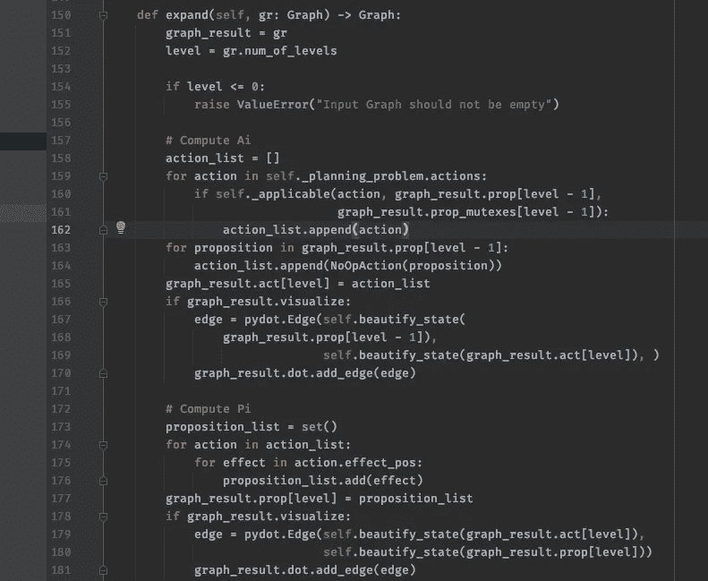

Python 中的规划图实现(图片由作者提供)

# 介绍

规划图的开发是为了解决传统人工智能规划方法中发现的复杂性问题，也称为条状规划器。我们需要实现两个主要部分:

*   计划图:数据结构，以及
*   图形规划器:为我们找到解决方案的搜索算法

如果你不熟悉规划图，想了解更多，请查看我下面的帖子:

</improving-classical-ai-planning-complexity-with-planning-graph-c63d47f87018>  

# 领域和问题表示

在我们开始实现之前，我们需要知道我们将如何表示这个方法的规划领域和规划问题。

规划图及其规划器使用许多条状规划器中使用的相同表示法，因此我们将使用 PDDL ( [规划域定义语言](https://en.wikipedia.org/wiki/Planning_Domain_Definition_Language))来表示它们。这里有一个 PDDL 域文件的例子。

PDDL 的规划领域表述(作者代码)

我们可以把 PDDL 想象成类似 JSON 或 XML 的东西，这意味着我们需要一个解析器来反序列化其中的表示。当我在 Github 上搜索时，出现了几个，但有一个似乎很适合我们的项目，即 **pddlpy** 。

<https://github.com/hfoffani/pddl-lib>  

然而，它在开发中不再活跃，我在其中发现了一个 bug 和一些问题。因此，我决定使用它并编写一个适配器/包装器，这是一个很薄的层，我们添加它来修复 bug 并解决其他问题。

## PDDL 适配器

对于我们的代表，我们需要以下内容:

*   世界初始状态:数据类型为 ***set()***
*   目标状态:数据类型为 ***set()***
*   用实变量实例化的基本运算符(也称为操作)列表:数据类型为 ***列表【运算符】***

我们将只使用来自 **pddlpy** 库中的**一个接口**，即 **DomainProblem()** 类构造函数。

我们需要提供上面列出的三个接口，初始状态、目标状态和地面操作员列表。

我们创建了一个名为规划问题的类:

规划问题类(由作者编写代码)

库提供的状态不是我们想要的正确数据类型，所以我们需要将它们转换成**一组元组**。我们使用 ***set()*** 数据类型，以便于我们以后实现数据结构和算法。因为在经典的 AI 规划中，我们大量使用集合论，我们应该使用 ***set()*** 数据类型来利用内置函数来加快我们的实现。我们将在下一节看到更多内容。

我们还必须创建一个我们称之为行动的地面操作员列表。这是适配器的最终代码。

PDDL 适配器模块(由作者编码)

我们现在可以将这个类用于我们的规划领域和规划问题，并将我们的注意力转向数据结构和算法实现。

# 规划图:数据结构

我们在这里只看伪代码和方程，重点是如何将它们翻译成代码，要理解这个概念，请阅读**简介**部分的帖子链接。

以下是我们构建规划图的方式:

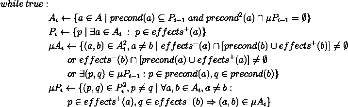

构建规划图的算法(图片由作者提供)

有四个步骤，我们一个一个来。

## 计算动作

这是指这一步:

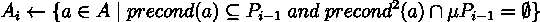

计算动作(图片由作者提供)

它由两部分组成:

*   对于 PDDL 适配器提供的所有操作，我们在当前状态下搜索适用的操作，并且
*   我们确保那些可应用的动作的前提条件不在前提条件互斥体中

计算动作(作者代码)

## 计算前提条件

下一步是计算前提条件，也就是这一步:

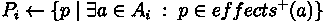

计算前提条件(图片由作者提供)

这一步非常简单:

计算前提条件(作者编写的代码)

我们只是存储计算出的动作的效果。

## 计算操作互斥

该算法的下一步是计算动作互斥量，这是一个相互抵消效果的动作对列表。

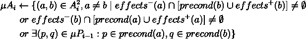

计算动作互斥体(图片由作者提供)

在这个等式中有三个部分，对于行动中所有可能的排列，我们希望在我们的列表中包含以下内容:

*   行动的负面影响会干扰其他行动的正面影响或先决条件
*   第二部分相同，只是另一个方向( **b** 到 **a** )
*   第三部分是他们的前提条件是互斥的

计算动作互斥体(由作者编写代码)

## 计算先决条件互斥

构建规划图算法的最后一步是计算前提互斥。

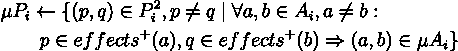

计算先决条件互斥体(图片由作者提供)

这意味着我们要寻找一对互斥的前提条件。它们是互斥的，当且仅当:

*   对于所有产生 **p** 和 **q** 的动作对，它们都在动作互斥列表中，并且
*   没有一个动作同时产生 **p** 和 **q**

计算先决条件互斥体(由作者编写代码)

我们现在已经完成了构建数据结构的代码，即规划图。为了帮助调试，您可以用 **pydot** 来扩充您的代码，以生成图形可视化。下面是它的一个例子。

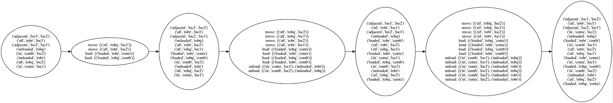

规划图可视化(图片由作者提供)

# 搜索算法:GraphPlanner

我们现在已经准备好了数据结构，我们可以开始实现搜索算法来为我们的规划问题找到解决方案。

该算法是递归的，有三个部分:

*   计划
*   提取
*   搜索

## 提取和搜索

这两步是递归的，算法如下。第一部分是 ***摘录()*** :

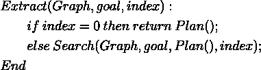

提取算法(图片由作者提供)

下一部分是 ***搜索()*** :

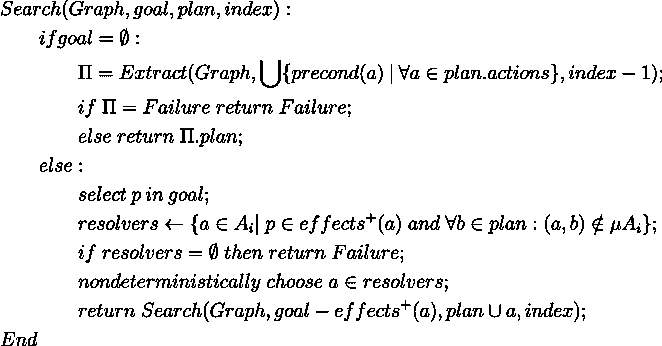

搜索算法(图片由作者提供)

这是这两个函数如何递归工作的示例:

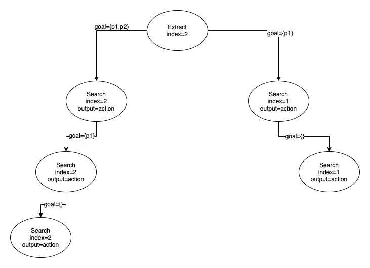

算法流程(作者图片)

它递归调用 **Search()** 直到所有命题都被解决，并调用 **Extract()** 转到规划图中的下一级。

这是我们用 Python 写的:

提取和搜索算法(由作者编写代码)

## 主程序

最后，我们到达最后一步，主要程序和我们算法的入口点:

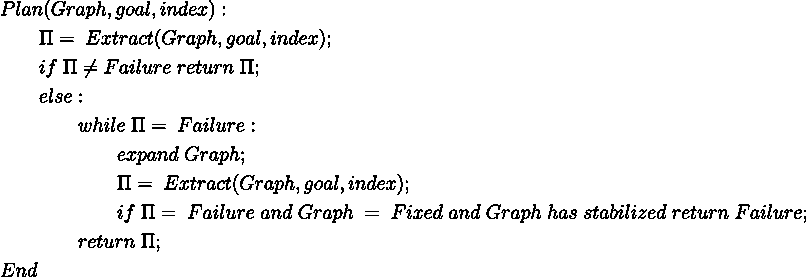

主算法(图片由作者提供)

在某些情况下，我们需要计划更多的步骤来创建解决方案计划，我们需要扩展我们的计划图表并重试搜索。

我们还需要添加一个额外的步骤，以确保算法在没有可能的解决方案时终止。这是我们的最后一段代码:

主算法(作者代码)

# 包扎

我意识到要描述实现这个算法的思维过程并不容易。但是我希望你至少对如何实现算法有所了解，从方程和伪代码到 Python 代码。

完整的代码可以在下面的 Github 上找到:

<https://github.com/debbynirwan/planning_graph> 