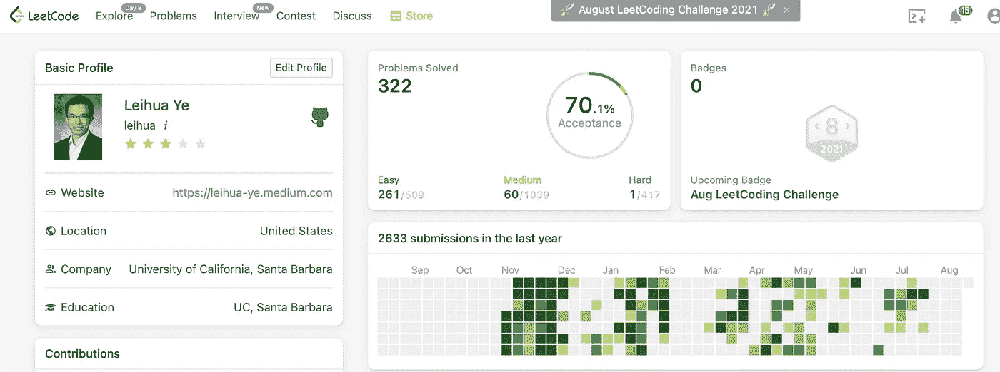
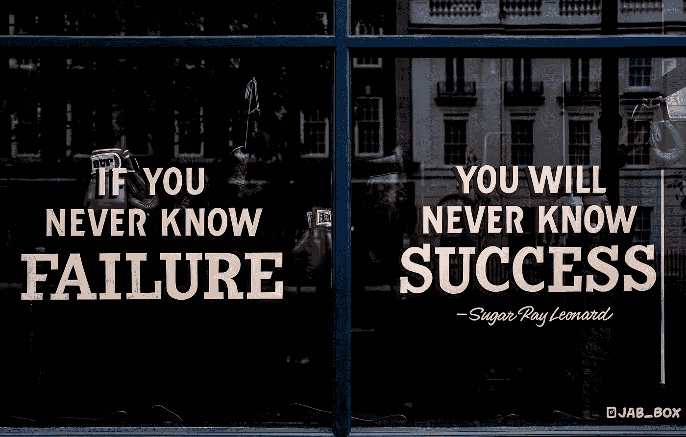

# 我如何在沃尔玛找到一份数据科学的工作

> 原文：<https://towardsdatascience.com/how-i-land-a-data-science-job-at-walmart-b2d9bd1539be?source=collection_archive---------5----------------------->

## 破解数据科学访谈

## 这是一个完美的适合和支付真的很好！

布拉德·巴莫尔在 [Unsplash](https://unsplash.com/s/photos/rock-climbing?utm_source=unsplash&utm_medium=referral&utm_content=creditCopyText) 上的照片

# 介绍

我的求职季在一个绝对糟糕的时间开始:

*   一个致命的疫情出乎所有人的意料；
*   全球经济进入恐慌模式；
*   公司冻结了新员工。

作为一名应届毕业生，我不得不在努力保持健康(大部分时间与外界隔绝)和完成博士课程的同时，在找工作的旅途中游刃有余。这是一次如此孤独的旅程，我敢打赌，你们很多人都会有同感。

> 一次又一次的面试，一次又一次的拒绝。
> 
> 自我怀疑和犹豫开始出现，我的信心开始动摇。
> 
> 日以继夜，我过去 5 年多的努力什么时候会有回报？

我于 2020 年 9 月正式开始找工作，并于 2021 年 7 月在[沃尔玛全球科技](https://medium.com/walmartglobaltech)获得了一份工作。这是一个数据科学家/统计学家的联合职位，我可以在实验平台 [Expo](https://medium.com/walmartglobaltech/on-developing-expo-6aa3330ad652) 利用我在机器学习和因果推理(实验)方面的背景。

非常适合！

此外，总的薪酬方案非常有竞争力，我根本不需要谈判。在付出了这么多努力之后，老实说，这是一种甜蜜的泪水、热情和彻底疲惫的混合感觉。

在今天的帖子中，我想记录下我的求职之旅，并分享这个过程中的好、坏、丑。我按照面试漏斗中的步骤来组织这篇文章:如何获得面试机会，确定技术回合，以及破解现场面试。

# 背景

首先，我是加州大学圣巴巴拉分校政治学的应届博士候选人，拥有统计学硕士学位。此外，我在实验、因果推断和数据分析方面有 5 年以上的研究经验。

自然，研究和行业经验之间有差距，但这并不意味着博士候选人是书呆子，不能去企业工作。事实证明，这是业内高级学位持有者的一个普遍假设。我通过展示可转移的技能、将他们的业务问题转化为可研究的问题、理解并做出实际的权衡等方式，在面试环节尽早解决这个问题。

关于做出实际权衡的快速说明:企业领导人必须平衡速度和数据质量。如果我们能够以一种快速的方式提供一个合理有效的解决方案，这在行业中已经足够好了！这是许多博士候选人挠头想知道的时候:

> 为什么我们不试着找到完美的解决方案呢？

简单的回答是，企业等不了那么久。如果他们必须在 6 个月内等待一个完美的解决方案，他们可能会破产。

> 展示你对必要权衡的理解可以提高你在面试中对成熟和专业的认知。

鉴于我的教育背景和研究经验，我不敢想象如此可怕的面试过程。

事实证明，我大错特错了。

博士找工作一直很有挑战性，因为我们要求更好的薪酬待遇，但就业市场却很小。疫情让情况变得糟糕 10 倍。在 Covid 开始后的最初几个月，公司陷入恐慌，停止招聘新人。

菲尔·科夫曼在 [Unsplash](https://unsplash.com/s/photos/rock-climbing?utm_source=unsplash&utm_medium=referral&utm_content=creditCopyText) 上的照片

# 步骤 0:准备面试

我在业内的数据朋友在找工作之前安排了几轮模拟面试，这帮助我迅速意识到差距，并发现我需要发展的技能。两项技能名列前茅:Python 和 SQL。虽然，在我看来，学术界使用 R 的频率要高得多，也不用担心大数据。

为了准备面试，我花了很多时间掌握数据结构和算法、时间和空间复杂性，以及编程的所有细节。我在我的电脑上创建了 50 多个 Jupyter 笔记本，在 Medium 上创建了 20 多个编程帖子。在不到一年的时间里，我在 LeetCode 上已经有了 2600+的提交，解决了 322 个编程问题。

2021 年 8 月自己的截图

与此同时，我联系了很多人，并经常安排信息采访。具体来说，我记下了我想知道的最重要的问题，例如他们作为数据科学家的日常工作，他们试图解决的典型问题，每个项目的持续时间等。

我个人最喜欢的问题是关于他们工作中最具挑战性的部分。这个问题让我站在他们的角度，培养他们对自己责任的第一人称视角。安排信息面试是培养同理心和沟通技巧的捷径。

## 最佳实践

*   **积极主动，向人们伸出援手。**

这是关键的第一步。你真的需要在踏入赛场之前感受一下水温。如果你没有达到职位描述中列出的最低要求，最好停止面试，发展所需的技能。这并不意味着你必须在开始面试循环之前做好充分准备；退一步说，这意味着你应该对工具/技能有所了解。

*   成为社交媒体的大师，了解它们的不同工作方式。

在[媒体](/four-reasons-why-you-should-start-a-data-science-blog-6e34865ed818?sk=86a72592236f3619a259ddf9a4e35592)和 [LinkedIn](https://www.linkedin.com/posts/leihuaye_womanday-data-abtesting-activity-6774769825265909760-fxbR) 上的技术写作对我帮助很大。如果没有这些平台，我的求职之旅会困难得多。 [LinkedIn](https://www.linkedin.com/in/leihuaye/) 是一个基于人脉的职业网络，我的人脉构成了该领域的商业领袖和数据科学家。他们最迫切的需求是有什么解决方案可以解决他们的业务问题。因此，我对我的帖子进行了修改，以满足这些需求，并提供一站式解决方案。查看 LinkedIn[上的这篇文章，获取一个简单的例子:](https://www.linkedin.com/posts/leihuaye_womanday-data-abtesting-activity-6774769825265909760-fxbR)

 [## 雷华叶在 LinkedIn 上:#womanday #data #abtesting | 18 条评论

### A/B 测试的 1/4 方差减少:CUPED]在过去的几个月里，我一直在与研究科学家和数据…

www.linkedin.com](https://www.linkedin.com/posts/leihuaye_womanday-data-abtesting-activity-6774769825265909760-fxbR) 

相比之下，我在 Medium 上的追随者是热切的数据学习者，他们希望了解如何实现该方法。因此，我详细阐述了技术细节，并特别关注代码实现。

一个快速更新，我已经开始了一个新的 [YouTube 频道](https://www.youtube.com/channel/UCBBu2nqs6iZPyNSgMjXUGPg)致力于统计学、研究设计、职业发展、数据科学、实验和因果推理。这个[视频](https://www.youtube.com/watch?v=6KXc7PwTgio)解释了我在渠道背后的想法，以及它如何能让你受益。此外，我在技术部门工作的几十个朋友已经同意来这个频道，分享他们的生活经历和职业发展技巧。

凯尔·科特雷尔在 [Unsplash](https://unsplash.com/s/photos/rock-climbing?utm_source=unsplash&utm_medium=referral&utm_content=creditCopyText) 上的照片

# 第一步:如何获得面试机会

第一步总是最难的。我的大部分职业网络都在学术界，走出我的舒适区并不是一件容易的事情。不管怎样，我开始申请，运气不好，接受了几次面试。然后，拒绝。我当时觉得挺正常的，没想太多。我提交了更多的申请，一次又一次被拒绝。有一次，我运气不好，不再接受任何采访。

出事了！

> 为什么我得不到任何面试机会？

我当时目光短浅，没有评估自己应用策略的有效性。我愣了一会儿，毫无头绪。

幸运的是，我很快意识到专业社区的重要性，并通过直接与行业领导者联系，将我的在线内容“货币化”。如第 0 步所述，我在[媒体](/four-reasons-why-you-should-start-a-data-science-blog-6e34865ed818?sk=86a72592236f3619a259ddf9a4e35592)和 [LinkedIn](https://www.linkedin.com/posts/leihuaye_womanday-data-abtesting-activity-6774769825265909760-fxbR) 上运用不同的写作策略来适应受众。每一个帖子和分享都会带来新的联系。

很快，一家顶级科技公司的招聘人员伸出手来，想要打电话更好地了解我。这是一系列后续请求的开始。

事实证明，内容写作是建立联系和获得面试机会的最有效方式。我会向新朋友介绍我的背景和专业领域，并询问他们是否在招聘。

## 最佳实践

*   **挑个利基。**

我们都想成为“全栈”数据科学家，但现实是，如果你专注于自己最强的领域，你会更好。数据科学主要有三条职业轨迹: ***算法******分析******推理*** 。作为一名社会科学家和统计学家，我最强的优势在于推理轨道，具体来说就是因果推理。因此，我的整个面试策略建立在这样一个假设之上:如果我在推理领域找不到数据科学的职位，我就不可能在其他两个领域找到工作。

*   **与领域保持同步。**

公司希望招聘内部人员，即了解其商业模式的技术人员。如果你是一名有能力的数据科学家，下一步就是展示你理解他们的痛点，并准备好在第一天就为团队做出贡献。阅读公司的技术博客是保持更新的最好方式。

*查看这份中等清单，了解顶尖公司的数据科学团队目前正在做什么:* [***A/B 测试正在进行***](https://leihua-ye.medium.com/list/ab-tests-in-action-8abc1c612bb4) *。*

## 常见陷阱

*   **蛮力和原始应用。**

这是新毕业生的通病。这是浪费时间，是行不通的。即使在与理想的候选人签订了合同之后，公司还是会继续刊登招聘广告。

*   **努力成为通才，心中没有重点。**

几年工作经验后大概可以申请不同赛道的职位。然而，我的建议是在开始时利用你最强的力量，在转向其他人之前进入大门。

不要做那个想让太平洋升温的人。

照片由 [Petalz_R](https://unsplash.com/@petalz_r?utm_source=unsplash&utm_medium=referral&utm_content=creditCopyText) 在 [Unsplash](https://unsplash.com/s/photos/rock-climbing?utm_source=unsplash&utm_medium=referral&utm_content=creditCopyText) 上拍摄

# 第二步:如何通过技术轮面试

恭喜你。你已经走出了自己的舒适区，获得了面试机会。嗯，我们应该记住:这只是一次面试，不是一份工作邀请！

我应该说:还没有。

在得到工作机会之前，还有两到三轮面试。

技术回合主要关注脚本编程、商业案例或行为问题。根据我过去的经验，公司在技术回合中会问所有这些类型的问题，所以要做好准备。他们会在最后的现场面试中再次问你这些问题，但会有意识地问。

经过大量的训练，我毫无问题地通过了几乎所有的技术面试，并被邀请进入最后一轮。这并不容易。最疯狂的几周，我几乎每天都做技术面试。

如果几轮面试都没通过，不要对自己太苛刻。最好的策略是从失败中学习，磨练你需要的技能。一开始，我不能用 Python 写一个简单的 for 循环。现在，我在教别人如何编码。

## 最佳实践

*   **编码，编码，编码！**

数据科学家的一个基本职责是有效地编码。了解如何用 SQL 和 Python 编码。练习 LeetCode 问题，发展你的软件工程技能。

我的编程秘诀叫做深思熟虑的练习:专注于一个领域(例如 Python 中的[字典)，彻底理解底层逻辑。我遵循了这种类型的实践计划，从一个 Python 新手变成了一个(自称的)编程大师。](/master-data-type-dictionary-in-python-from-zero-to-hero-part-2-6513aad883de?sk=23264e4e8bb82db4229918f28a34a0c8)

***一些例子请参考这个编程列表:*** [***破解数据科学访谈***](https://leihua-ye.medium.com/list/crack-data-science-interviews-f52bdf533429) ***。***

*   **把编程当成语言。**

归根结底，Python 或 SQL 是一种与计算机对话的编程语言。语法与人类语言非常相似。我的诀窍是把它当成一门语言，理解底层逻辑。当然，学习数据结构和算法很有帮助。

*在这篇文章中，我分享了数据科学家如何开发编码技能*:

 [## 数据科学家如何提高他们的编码技能

### 可以帮助你轻松编程的 6 个技巧

towardsdatascience.com](/how-data-scientists-can-improve-their-coding-skills-b4f2924198ae) 

*   **沟通，沟通，沟通。**

公司正在寻找能够清晰表达自己观点并与团队有效沟通的人。所以，我们应该把面试视为双向对话，而不是单向独白。

以下是我对一个编码问题的逐步分解:

1.  再次阅读问题提示，并确保您理解它的底层逻辑。
2.  然后，如果你有什么不清楚的地方，要求澄清，必要时收集进一步的信息。我经常把问题反馈给面试官，确保我的思路是正确的。
3.  先给出一个整体的答案，再用 Python/SQL 进行编码。*比如你可以说这个问题要求求斐波那契数，我首选的算法是递归，它有两个部分:基条件和递归条件。这也叫做在你的思维过程中走一遍。*
4.  编码完成后，我会测试它，看看算法是如何工作的。通常，在我们第一次运行任何算法时，它会抛出一些错误，主要是因为缺少边缘情况。解决问题并再次运行。
5.  到目前为止，我有一个可以运行的暂定解决方案，但这并不意味着工作已经完成。还没有。尝试讨论时间和空间复杂性以及不同算法之间的权衡。如果可能，提供任何可以提高模型性能的更好的算法或解决方案。学习大 O 符号。

***一些例子请参考这个编程列表:*** [***破解数据科学访谈***](https://leihua-ye.medium.com/list/crack-data-science-interviews-f52bdf533429) ***。***

*   **要自信！**

每个人都会偶尔被卡住。积极主动地寻求暗示。实际上，面试官希望你被卡住，他们已经准备好给出暗示了。试着自信一点。

## 常见陷阱

*   **玻璃门不是你的朋友。**

科技公司有很多面试问题，但人们喜欢在谷歌上搜索最近的面试问题。首先，这是一种不被认可的做法，因为求职者需要签署一份 NDA。其次，公司很可能不会一遍又一遍地问同样的问题。这是浪费时间。第三，它让你在心理上消沉。你可能会想，“会包括在我的面试中吗？”除了焦虑和失眠，它没有创造任何价值。

*   **沟通不够。**

一些人在没有沟通的情况下就开始编码，一旦他们陷入困境或错过了边缘案例，他们就开始恐慌。但是，你知道，解决技术问题不仅仅是关于技术部分；也是关于良好的沟通。

照片由[在](https://unsplash.com/@theblowup?utm_source=unsplash&utm_medium=referral&utm_content=creditCopyText) [Unsplash](https://unsplash.com/s/photos/success?utm_source=unsplash&utm_medium=referral&utm_content=creditCopyText) 上放大的

# 第三步:如何破解现场面试

干得好。你和梦想中的工作只有最后一英里了。与前几轮相比，现场比赛需要一整天的时间，是一场智力和体力的考验。它包括 4 到 5 次单独的面试，面试中有两个主要目标:

> 1.进一步测试候选人的技术技能:Python、SQL 和机器学习(以技术为基础)。
> 
> 2.了解你将如何融入团队(更多基于行为)。

至于编码问题，我建议遵循上面列出的相同步骤。为了破解行为回合，我遵循了一种**S**ituation**T**ask**A**action**R**result(**STAR**)的方法:

*   简单描述一下情况。有什么问题？为什么重要？
*   **T** 提问:描述你的角色以及为了解决问题而委派给你的任务。
*   T4:为了解决这个问题，你们采取了哪些具体措施？为什么选择这一步，而不是其他？描述给定情况下的权衡。
*   结果:你取得了什么成就？你彻底解决问题了吗？如果可以再来一次，你会有哪些不同的做法(提升空间)？

在整个面试过程中，我坚持使用明星法。这很有帮助。

## 最佳实践

*   **明星**是你的朋友。

反思你过去的经验，并思考如何应用 STAR 框架。

*   准备好谈论你的简历。

如果你在简历上写了什么，面试官很可能会问你。所以，回忆一下细节。我得到了这个教训。作为一名研究人员，我在简历中加入了几个项目，但已经有一段时间没看了。所以，当面试官想了解更多的时候，一些技术细节就变得模糊了。

*   **在任何面试结束时提问。**

这是你更多了解团队、他们的痛点和未来方向的机会。我总是问他们最具挑战性的部分和解决方案的相关问题。

## 常见陷阱

*   **不应用 STAR。**

对于行为问题，新毕业生可能会漫谈他们过去的经历，无法给出明确的答案。同样，这是一个很大的危险信号。

此外，他们漫谈和重复自己，一个大的拒绝。

相反，在开始之前，要求一些时间来整理你的想法，记下几行笔记。

*Medium 最近进化出了自己的* [*作家伙伴计划*](https://blog.medium.com/evolving-the-partner-program-2613708f9f3c) *，支持像我这样的普通作家。如果你还不是订户，通过下面的链接注册，我会收到一部分会员费。*

 [## 阅读叶雷华博士研究员(以及其他成千上万的媒体作家)的每一个故事

### 作为一个媒体会员，你的会员费的一部分会给你阅读的作家，你可以完全接触到每一个故事…

leihua-ye.medium.com](https://leihua-ye.medium.com/membership) 

# 外卖食品

*   不要让拒绝让你沮丧。我知道你花了这么多精力准备面试，但还是被拒绝了，这是什么感觉。我经历过，理解那种感觉。从过去的经历中学习，成长。
*   ***有成长的心态*** 。数据科学是一个如此广阔的领域，什么都知道是不现实的。如果职位描述包括 Python 和 SQL，我们可以学习编程；我们可以通过阅读和研究来培养商业意识。我们可以在学完数据结构和算法之后，和软工程师讨论时间和空间的复杂性。为了 100%透明，我一开始对编程知之甚少，没有商业意识，也没听说过 DSA。刻意的训练和自我教育把我带到了这里。
*   ***稍事休息但绝不放弃*** *。我知道这是毫无头绪的漫长一天，你只想放弃。但是相信我:你可能只需要几行代码和练习就能得到你梦想中的工作。不要让任何人告诉你“不可能是你。”可以是你！*

# 喜欢读这本书吗？

> 请在 [LinkedIn](https://www.linkedin.com/in/leihuaye/) 和 [Youtube](https://www.youtube.com/channel/UCBBu2nqs6iZPyNSgMjXUGPg) 上找到我。
> 
> 还有，看看我其他关于人工智能和机器学习的帖子。