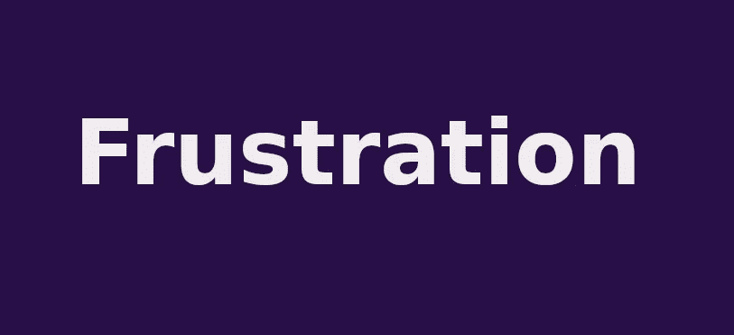
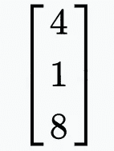
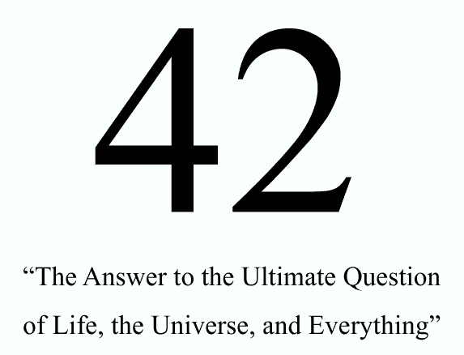
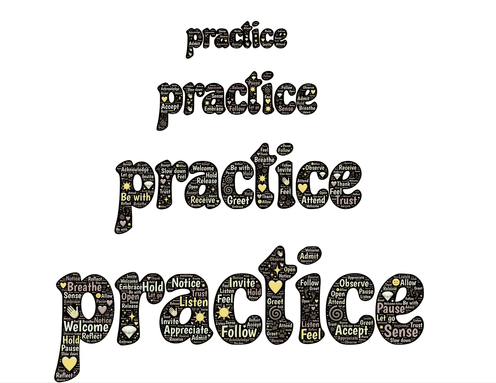

# 我是如何学习数据科学的线性代数、概率和统计的

> 原文：<https://towardsdatascience.com/how-i-learned-linear-algebra-probability-and-statistics-for-data-science-b9d1c34dfa56?source=collection_archive---------3----------------------->

## 我是如何没能学好数据科学的数学，以及我是如何理解线性代数、概率、贝叶斯定理、概率密度函数和基本统计的

蒙帕纳斯火车站事故，来源:[维基媒体](https://commons.wikimedia.org/wiki/File:Train_wreck_at_Montparnasse_1895_FAIL.jpg)

# 背景

这正是一年后我的数据科学之旅的样子。

是的，新年快乐:-)

说到为数据科学学习数学，一切都以失败开始和结束。我相信我并不孤单，许多从数据科学起步的人都有同样的经历。如果要用一个词来形容我为数据科学学习数学的努力，那就是:

作者图片

没有学到你需要的东西，尤其是当没有明确的数据科学道路时，会导致挫败感。至少我明确了我的目标:

1.  学习我需要的数学知识，仅此而已
2.  我的背景是什么，我有什么经验，或者缺乏什么，都无关紧要。如果我只是渴望学习数据科学的数学，那么我应该能够做到
3.  更多地关注行为特征，特别是**态度**和**坚持**，而不是掌握某个特定的数学题目。

数学是一门可怕的学科。我们人类有情感和欲望，而数学是基于逻辑和方法的。有了人工智能，也许有可能给机器注入一些情感，但数学没有它们的位置。我们的头，我们的感情在学习数学的时候受伤了。至少这是我对数学的一贯看法。一件古老而可怕的事情。

当我们不懂数学，没有天才般的智商时，我们该怎么办呢？我们做这些事情:

1.  买一本书
2.  开始 MOOC
3.  努力工作
4.  如果你失败了，你会更加努力
5.  如果你再次失败，你会更加努力
6.  你一次又一次地失败。你越来越努力地工作，耗尽了你的意志力，有一天你开始相信自己不是“数学型”的人

我做到了。

更加努力的工作导致了更多的失望，更多的挫折，最终导致**愤怒****自卑**。当谈到数据科学的数学时，我为我需要学习的每个主题重复了这个故事，线性代数，统计，概率，线性回归和梯度下降。这就是“我学习数学的故事”。直到现在。

# 对于一个完全的初学者来说

如果你是一个完全的初学者，那么根据我的经验，我建议你按以下顺序进行:

*   学习 Python 编程
*   学习惯用的 pythonic 方法(例如，列表理解、生成器等。)
*   学习熊猫
*   使用熊猫清理和争论一些数据集
*   学习 Matplotlib
*   绘制一些数据集
*   结合你对熊猫和 Matplotlib 的了解。争论数据集并绘制它们
*   对于机器学习，做 2-3 个小项目，如 Iris flower、Boston housing、wine classification 和 Titanic dataset 等。

你看，开始学习数据科学不需要数学。

这将花费你 3-4 个月的时间(有些人可以在一个月内完成，但我和树懒是朋友)

一只树懒(Bicho-pre guia 3)由[丹妮拉·马拉希洛](https://commons.wikimedia.org/w/index.php?title=User:Daniella_Maraschiello&action=edit&redlink=1)拍摄，来源:[维基媒体](https://en.wikipedia.org/wiki/File:Bicho-pregui%C3%A7a_3.jpg)

# 数据科学不需要很多数学知识

我猜一个人的经历应该不足以让你相信我们不需要太多数据科学的数学。

因此，我找到了一篇由夏普视觉实验室的[乔希·埃布纳](https://twitter.com/Josh_Ebner)撰写的不错的博文。他解释了初级和高级数据科学家之间的区别，数据科学基础技能所需的数学知识，数据科学理论和实践之间的区别，等等。你应该读一下:

<https://www.sharpsightlabs.com/blog/math-for-data-science/>  

蒂姆·霍普的一点建议怎么样？在成为数据科学家之前，他是一名数学专业的学生，也是一名数学博士。他当然知道数据科学需要多少数学知识。简答:不多，不到 10%:

<https://tdhopper.com/blog/how-i-became-a-data-scientist/>  

这是他在 YouTube 上的演讲。

不，你不需要太多的数学，你需要一些，只是某些特定的主题。你可以每周在这里做一个要点:

*   学习基础代数(仅特定主题)
*   学习概率(仅限特定主题)
*   学习统计学(仅限特定主题)
*   学习线性代数(仅限某些专题)
*   学习线性回归

[Rebecca Vickery](https://medium.com/u/8b7aca3e5b1c?source=post_page-----b9d1c34dfa56--------------------------------) 列出了数据科学领域需要学习的数学主题:

<https://medium.com/vickdata/maths-and-statistics-a-complete-roadmap-for-learning-data-science-part-3-e1ec585195cf>  

这就是这篇文章的**什么**。接下来，我们将谈论**为什么**和**如何**。

# 线性代数

我学会了如何用熊猫清理数据集。我学会了如何使用 matplotlib 创建可视化。然后我做了 Iris 和波士顿住房项目，然后我没有选择机器学习，而是直接开始了[面向程序员的实用深度学习](https://www.fast.ai/)，这是一本非常棒的书。我决定一遍又一遍地阅读这本书，并将永远追随[。我喜欢实用的学习方法，不浪费时间，也不指望你能记住研究生院的教学大纲。](https://www.fast.ai/)[杰瑞米·霍华德](https://medium.com/u/34ab754f8c5e?source=post_page-----b9d1c34dfa56--------------------------------)以这种实用的方式授课。在成功 [10 天后，我带着这本书](/10-days-with-deep-learning-for-coders-759b34b9336b)建立了熊探测模型，并将其部署在 binder 上，当我遇到这个问题时，我遇到了一个障碍:

> (train _ x[0]*权重。t)。sum() +偏差

那是什么**。T** ？

这是我的第一反应。我在 Fast AI 论坛上发布了同样的内容，并得到了[一个很好的回复](https://forums.fast.ai/t/mnist-loss-function-and-prediciton/81798)。向量是垂直堆叠的，但它需要处于水平位置。这应该解决了我的问题，但是当我搜索向量的时候，事情变得更复杂了。通常，当我们需要一个矢量时，我们只需这样做:

> 将 numpy 作为 np 导入
> 
> np.array([1，2，3])

我得到了一个矢量，很简单。对吗？

没有。

我查了一个向量在数学中是怎么呈现的，很奇怪。那天，我几乎所有关于“数学中的向量”的搜索都显示了一个向量，看起来像这样:

来自[维基百科](https://en.wikipedia.org/wiki/Matrix_(mathematics))的矩阵

你可以在这里亲眼看到。现在，这击中了我的头。我想，如果这是向量在数学中默认的样子，那么我们为什么不在计算机科学中默认地做同样的事情。为了获得数学的默认外观，我为什么要这样做:

> np.array([1，2，3])。整形(3，1)

下一个问题:*为什么这个创建一个矢量，那个创建* ***。***t*长得一样？*究竟什么是转置？为什么大多数向量在 math 中是垂直堆叠的，而在编程库中却不是？

我也不知道如何做矩阵乘法。因此，我决定先学习什么是转置、矩阵乘法等，然后再继续学习，而不是在接下来的章节中费力地阅读这本书。数据科学所需的所有线性代数都可以从这些好地方学到:

1.  线性代数从[瑞奇伽](https://www.ritchieng.com/linear-algebra-machine-learning/)
2.  线性代数从[潜入深度学习](https://d2l.ai/chapter_preliminaries/linear-algebra.html)
3.  来自[帕布鲁·卡塞雷斯](https://pabloinsente.github.io/intro-linear-algebra)的线性代数。(最全。我做了 70%,因为我想学习某些主题。它有很多理论，我认为它包含了你需要知道的足够多的东西，即使是深度学习)
4.  来自[深度学习书籍](https://www.deeplearningbook.org/contents/linear_algebra.html)的线性代数

第四个是我卡住的地方。对我来说太高级了。所以，我留着以后用。

# 机器学习失败

数据科学作为一个领域还不成熟，因此还没有直接通向数据科学的道路。这与计算机编程、软件工程和 web 开发等领域形成了对比。这三个领域都相当成熟，如果你在任何一个领域需要帮助来建立自己的事业，那么这里有足够的帮助。你需要做的就是去寻找它。数据科学还没有那么发达。一个人必须通过阅读文章、博客和观看视频来不断更新自己。我也一样。也正因为如此，我才知道，在你理解机器学习之前就做深度学习，可能会导致一场“等待发生的灾难”。你需要理解 b/w 线性回归和逻辑回归的区别，以及为什么对于一个特定的问题你会选择其中的一个。如果你不知道，就不要去构建深度学习模型。对我来说很有意义。

于是，我开始了机器学习。

来源:[维基媒体](https://commons.wikimedia.org/wiki/File:815-tfdne-ai-generated.png)

我开始学习线性回归，然后被统计数据重创。我无法把题目的不同部分联系起来。就像 SQL 一样，我已经学习了五遍什么是“模式”和什么是 A/B 测试，然后又忘记了同样的五遍。我参加了宾夕法尼亚州立大学在线的统计，当我试图从其他地方学习更多的统计数据时，我又被一个叫做…

# 我对概率的感觉

概率是现实生活中用得非常多的东西(就像统计学一样)。而概率思维是不容易得来的。2020 年，我三次尝试学习贝叶斯定理，但三次都放弃了。我花了日日夜夜和周末试图理解贝叶斯定理，但它就像一个我永远无法解开的谜。这一次我更饿了，因为一切都取决于它:

*   我从程序员实用深度学习开始，在**卡住了。T**
*   学习线性代数
*   开始机器学习，陷入线性回归
*   统计学是答案，这让我陷入了概率
*   概率令人沮丧(想想贝叶斯定理)
*   回到我开始的地方。看不懂数学。冰冻的

> 5 名建筑工人在 10 天内建造了一堵 10×10 英尺的墙。假设 3 名工人花了 7 天时间把它漆成黄色，那么柏林的西红柿价格与斯德哥尔摩的价格完全相同的概率是多少？

[杨淼](https://unsplash.com/@yangmiao?utm_source=unsplash&utm_medium=referral&utm_content=creditCopyText)在 [Unsplash](https://unsplash.com/?utm_source=unsplash&utm_medium=referral&utm_content=creditCopyText) 上拍照

是的，每当我失败时，我就是这样看待贝叶斯定理的。当挫折没有被赋予一个授权的意义时，它会让你变得愚蠢。哈里森·简斯马的博客文章拯救了我。我强烈推荐你阅读他的博客文章。他准确地描绘了一个智力一般的人试图自学数据科学的心理状态:

</how-to-learn-data-science-staying-motivated-8665ed649687>  

# 新方法

所以你看，我背着所有的包袱。我需要更多的渴望和动力来打破所有这些“学不会数学”和“我总是陷入贝叶斯定理”等等的枷锁。我看到的唯一方法就是挑战我的能力极限。在人工智能时代，个人生活和职业生活之间的界限已经模糊。无论我们在其中一个做什么，都会对另一个产生你无法想象的影响。我需要新的思维，新的学习方法。我需要给学习赋予新的意义。**我希望数据科学学习的每一个方面都是一次愉快的经历，一次我可以在未来珍藏为美好回忆的经历。**我问自己:

> 在我的个人生活中，最后几个月我是如何自娱自乐的？我在哪里找到了快乐？

我喜欢看[《纸牌屋》](https://en.wikipedia.org/wiki/House_of_Cards_(American_TV_series))、[《套装》](https://en.wikipedia.org/wiki/Suits_(American_TV_series))、[《龟壳里的幽灵》](https://en.wikipedia.org/wiki/Ghost_in_the_Shell)、[《亿万富翁》](https://en.wikipedia.org/wiki/Billions_(TV_series))、[《星球大战》](https://en.wikipedia.org/wiki/Star_Wars)。我疯狂地看了许多季/卷。我决定用整整一周的时间，从周一到周日，疯狂地看，疯狂地读，疯狂地练习概率。但在此之前，我想看看能不能同时一起学统计和概率。这就是我如何得到…

# Udacity 体验

我开始了 Udacity 的《统计学导论》免费 MOOC 课程，因为它拥有人们需要的所有统计学和概率。它看起来短小精悍，符合数据科学家的数学方法。这很好，但在第 16 章(33%)之后，我放弃了。问题是，尽管这种 MOOC 切中要害，但它假定了一种自然的数学直觉。尽管 Udacity 说这是一个初级 MOOC，但我发现一个人需要非常聪明，并且有非常好的数学直觉才能通过它。就像我一开始说的，我不是天才，我只是你在街上找到的另一个人。因此，对于 MOOC 的每个部分，我都不得不花两倍或四倍的时间从 MOOC 之外的多种资源中搜索和学习。这是促使我产生“狂看”想法的经历之一。无论如何，你可以试试 MOOC，它的理论更少，而且在每个视频的结尾都有一些很好的问题需要解决。如果可以的话，我强烈建议你去做

# 适应我的新方法

我想到了一个新计划:

*我不会看数学课本*。*我也不会做任何 MOOC】。原因是:这两者都来自于为研究生学习(3+年)设计的学术标准。学术界的人已经是他们学科的专家了，他们已经教授这些学科很多年了，因此关于这些学科的 MOOCs 书籍至少需要一两个学期。如果一个人对这些科目一无所知，也没有一两个学期来学习，那该怎么办？*

在第四次工业革命中，我们所有人都试图进入数据科学领域。我们时间紧迫，我们没有 3 年时间。我们需要尽快起床开始生产东西(我上一份工作已经过去一年了)。这就是为什么我们必须想出新的学习方法来满足 21 世纪的商业需求。卡梅隆·沃伦在他的博客文章《不要做数据科学》中对此做了更好的解释:

</dont-do-data-science-solve-business-problems-6b70c4ee0083>  

老实说，我非常尊重学术界。一些最伟大的发现来自学术机构。事实上，我仍然渴望成为学术界的一名研究人员，主要是因为它不是由商业利益操纵的。我想读硕士，然后读机器学习的博士(甚至可能是两个博士)。我认为人类的发展依赖于学术界，正如它依赖于企业带来技术来解决问题一样。也就是说，每件事都有时间和地点，现在我需要的是快速但基本的学习。

# 不要追随你的激情

我不追随我的激情。我花了很多年试图找到我的激情。经历了一次又一次的失败后，我明白了一个人不能纯粹基于自己的激情来选择职业。这是一个艰难而痛苦的教训，它与通常的激励帖子和常识背道而驰。那你接下来要做的。阅读卡梅隆·沃伦所说的:

<https://medium.com/@camwarrenm/how-to-figure-out-what-your-passionate-about-a23d59c0163d>  

# 我是如何学习的

1.  如果我对一个地方的东西不了解，我就辞职去第二个地方。我不会花几个小时在同一篇文章、博客或视频上努力工作，而是专注于手头的主题，这让我变得灵活。我使用一个又一个资源，直到我有了概念/想法。
2.  我练题。我们不能通过阅读和理解来学习数学。我们需要把它应用到问题上。mathisfun.com 的[有一个问题列表和答案。这是我用来练习贝叶斯定理的](https://www.mathsisfun.com/)

42[Mbartelsm](https://commons.wikimedia.org/wiki/Special:Contributions/Mbartelsm)的回答，来源:[维基媒体](https://commons.wikimedia.org/wiki/File:42_Answer.jpg)

我想我找到了我的 [42](https://simple.wikipedia.org/wiki/42_(answer)) 。这个方法对我很有效。它可能对你有效，也可能对你无效，但除非你尝试一周，否则你不会知道。我读过数百篇关于如何学习数据科学的数学的博客文章，其中许多不起作用，但也有一些起作用。最终，我找到了自己的路。我没有通过思考找到我的学习之路。我尝试了很多次，失败了很多次。所以，你必须不断尝试，直到你成功。给一个新方法几天或更长的时间，而不是几周或几个月。一周没问题。

# 可能性

我从贝叶斯定理开始，但最终我沉迷于观看、阅读和实践许多统计学和概率的概念。以下是我用来学习条件概率和贝叶斯定理的资源:

1.  艾迪·吴的离散随机变量。[总共 3 个视频](https://youtu.be/a9vcTvaBqfs)(这包括预期值)
2.  来自[艾迪·吴](https://youtu.be/JVbbRCVBVRI)的排列组合
3.  来自[马里奥数学辅导](https://youtu.be/TBnPkKxXPu8)的排列组合
4.  来自[数学的贝叶斯定理很有趣](https://www.mathsisfun.com/data/bayes-theorem.html)
5.  条件概率、贝叶斯定理和其他来自 [Investopedia](https://www.investopedia.com/terms/c/conditional_probability.asp)
6.  来自 [zedstatistics](https://www.youtube.com/channel/UC6AVa0vSrCpuskzGDDKz_EQ) 的概率分布(用梯度来解释)
7.  来自[的概率密度函数(PDF)由 Michael](https://youtu.be/jDycsIub4ZE) 解释(用代数和图形解释)
8.  迈克尔解释的[中的累积分布函数(CDF)](https://youtu.be/FhZdVPX1rf0)
9.  来自[杰森·吉普森](https://youtu.be/UnzbuqgU2LE)的[mathtutordvd.com](https://www.mathtutordvd.com/)的离散概率分布(关于什么是离散概率分布的最佳视频)
10.  一篇关于 PDF vs PMF 的出色的 [StackExchange 帖子](https://math.stackexchange.com/questions/495313/probability-mass-function-and-probability-density-function)
11.  Math insight 链接[关于 PDF 的想法](https://mathinsight.org/probability_density_function_idea)来自我上面提到的 StackExchange 帖子
12.  麻省理工开放式课程[PDF 讲座](https://youtu.be/mHfn_7ym6to)(在 StackExchange 帖子中提到)

现在我可以用费曼技术解释所有关于 PDF 的内容了:-)。

我不是唯一一个理解这个学习原则的人。肯·吉在他的 YouTube 视频中提出了一个类似的计划:

YouTube 上的肯·吉

如果您正在开始您的数据科学之旅，这是一个非常好的视频。可能会让你少受几个月的折磨。继续，看它，然后回到这里

# 统计和线性回归

最后，当我在圣诞节假期写这篇博客的时候，我也疯狂地看了 StatQuest 的[的](https://medium.com/u/6648478c1752?source=post_page-----b9d1c34dfa56--------------------------------)[统计基础](https://www.youtube.com/playlist?list=PLblh5JKOoLUK0FLuzwntyYI10UQFUhsY9)的文章。

他的[线性回归和线性模型播放列表](https://www.youtube.com/playlist?list=PLblh5JKOoLUIzaEkCLIUxQFjPIlapw8nU)就是我现在正在看的。这个家伙很擅长解释东西，他不浪费任何时间，他让事情切中要害，并确保在前进之前进行审查，所有这些几乎没有任何代码。他力求清晰和基本，这是学习任何东西的全部意义。到目前为止，Josh 对对数和线性回归的介绍是我见过的最好的。你会喜欢他的鼓、小鼓和三鼓:-)

提醒你一下，[统计学习介绍](https://statlearning.com/book.html)提到线性回归是前提条件。所以我想在我拿起这本书之前读完它是个好主意。那本书几乎被称为机器学习算法的圣经。

# 战胜对数学的恐惧

这是一件大事。有很多学习者害怕数学。即使我们不需要知道很多数学知识，但是对数学的恐惧仍然不让我们理解和掌握我们需要学习的任何主题。他们认为自己没有数学头脑。**成为像乔治·康托(Georg Cantor)这样的天才和创建数学实体以及能够理解并使用数学作为解决问题的工具/模型是两件非常不同的事情，前者是来自宇宙(或上帝)的礼物，而后者是一套技能。我明白我们都不是天才，也不是优秀的哈佛或牛津毕业生。这个限制我们也无能为力。毫无疑问，我们可以在“态度”和“能力”方面做些什么，以获得数学技能。我们可以反复灌输数学思维作为我们性格的一部分。看看这些视频，改变你对数学以及你能学什么或不能学什么的看法:**

**列表 A:**

数学魔法师[的任意 10 个你喜欢的视频](https://www.youtube.com/user/themathsorcerer)(我看过 30+)。从这些开始:

1.  [自学数学的三个技巧](https://youtu.be/_-GQ_T_0dgU)
2.  6 个鲜为人知的理由为什么自学是数学成功的关键
3.  [为什么有些人学数学这么快](https://www.youtube.com/watch?v=qVm98V3Tjyw)
4.  [如何克服数学失败](https://youtu.be/2fCysjMGhZg)

**列表 B:**

1.  [学数学需要什么？去生活吗？米洛斯拉夫·洛夫里奇](https://youtu.be/VHK5x3ev-oI)
2.  一旦掌握了最好的学习技巧，任何人都可以成为数学人
3.  [你如何擅长数学](https://youtu.be/3icoSeGqQtY)，以及其他关于学习的令人惊讶的事实
4.  我们教育系统的有趣故事

只有当你有兴趣了解印度的教育系统是如何运作的时候，才看最后一个。这就是我所研究的，所以我有一点偏见把它包括在这里。顺便说一下，这是一个有趣的视频。

**列表 C:**

拿起一个你一直想学的数学题目，去[数学很有趣](https://www.mathsisfun.com/)阅读它，完成所有的练习。相信我，通过这样做，你会立刻消除一半的恐惧。这些解释如此简单、容易和基本，以至于不管你的年龄或背景如何，你都能看穿数学。

# 如何不忘记你所学的东西

当你通过阅读、观察和解决问题来学习上述所有内容时。在一周左右的时间里，你会很快忘记其中的 80-90%。使学习永久化的唯一方法是:

1.  每天在工作中使用它
2.  按照固定的时间表复习

而#1 可能不太可能，因为您正忙于构建数据科学项目。我可以对第二点说同样的话。是的，你可以像我在学生时代制定的固定时间表一样复习:

*   在周末之前复习本周所学的内容
*   每周修改+前几周
*   在月底复习你学过的东西
*   每月修订+前几个月

这在学校行得通，但现在在专业工作环境中却行不通。现在唯一对我有效的方法是方法 1。自学成为数据科学家的魔咒是，学的东西都用不上。于是我只好想出方法三利用 [**的费曼手法**](https://www.youtube.com/results?search_query=feynman+technqiue) **。**

*   一旦你学会了一个话题。接下来使用费曼技巧
*   将主题的标题放在列表中
*   在周末，检查你的清单，用费曼技巧解释清单上的所有话题

图片由来自[皮克斯拜](https://pixabay.com/?utm_source=link-attribution&utm_medium=referral&utm_campaign=image&utm_content=615644)的[约翰·海恩](https://pixabay.com/users/johnhain-352999/?utm_source=link-attribution&utm_medium=referral&utm_campaign=image&utm_content=615644)拍摄

我认为你不需要每月修改。

# 这种方法的好处

这种**狂欢-* +费曼技巧**的方法有几个好处:

*   你不需要等很久。你节省了很多时间，因为你不需要阅读整本数学书或进行 MOOC，这两者都需要几个月的时间。
*   你只学习你需要的东西。数据科学不是数学。不要忘记行业、商业价值、投资组合准备、GitHub 存在、商业利益相关者以及使用数据讲故事。你不能用“全面学习数学”来代替那些。
*   你的重点仍然是真正的工作
*   你学会了如何解释。这是一项非常有用的技能，可以让你在工作场所表达自己的观点，同时尊重你周围的每个人。这在面试中也是有益的。
*   既然你已经掌握了某些数学主题背后的基本概念，你就可以在空闲时间探索和学习细节，如果你没有时间紧迫的话。就业后，如果微积分激发了你的好奇心，或者你的领域需要这方面的专业知识，你甚至可以制定一个 3 年或 5 年的计划来掌握微积分。

这些好处看起来微不足道，但却是决定你是否会成功的主要因素。

图片来自[蒙塔纳苏弗拉格蒂](https://commons.wikimedia.org/w/index.php?title=User:Montanasuffragettes&action=edit&redlink=1)，来源:[维基媒体](https://commons.wikimedia.org/wiki/File:2018_Women%27s_March_in_Missoula,_Montana_130.jpg)

# 收场白

祝你学习顺利，希望你继续坚持。数据科学很难，但肯定是你力所能及的。这可能需要时间，但所有有价值的职业都需要时间。

2020 年将作为疫情年、封锁和面具年、动摇全球各国基石的一年载入史册。它没有放过任何人，无论是雇员还是雇主，无论是政府还是公众，无论是黑人还是白人，无论是热爱上帝的人还是无神论者。这是我有生以来第一次在国际层面上看到如此的恐惧和浩劫。这让我想起了一句中国古话“天下一家”。我们突然被抛进了一个的黑暗时代。就好像一些反乌托邦的科幻小说正在变成现实。

虽然这是一幅暗淡的画面，但历史上第一次，这样一个黑暗的事件将全世界的科学家团结在一个统一战线之下:将人类从这一危险中拯救出来。全球无数科学家孜孜不倦地研发疫苗。最后，已经生产了不止一种而是两种疫苗，2021 年还会有更多。如果我们有能力承受并走出这个疫情，那么对数学的恐惧只是人类大脑能力所能处理的一件小事。让我们带着*“我将打破学习数据科学的任何障碍”*的信念迈进 2021 年。你需要拥有这个。这个世界上没有什么事情是不可能的，学习数据科学的数学，磨练你的软技能，以及制作一个令人印象深刻的数据科学投资组合都不在其中。 [**愿原力与你同在**](https://en.wikipedia.org/wiki/The_Force)