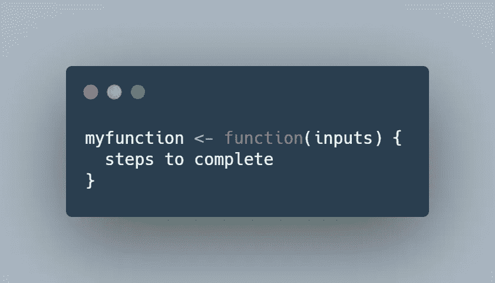
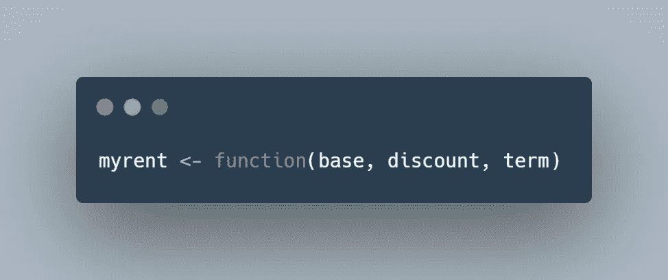
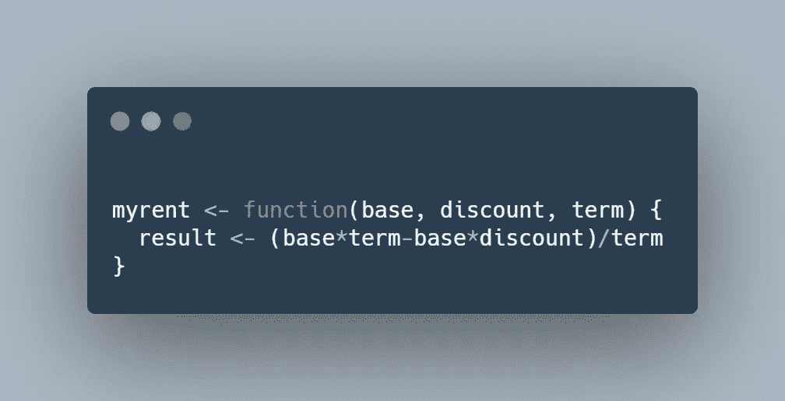
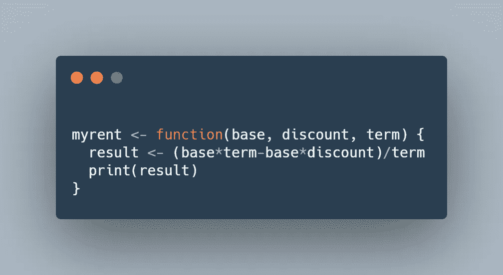
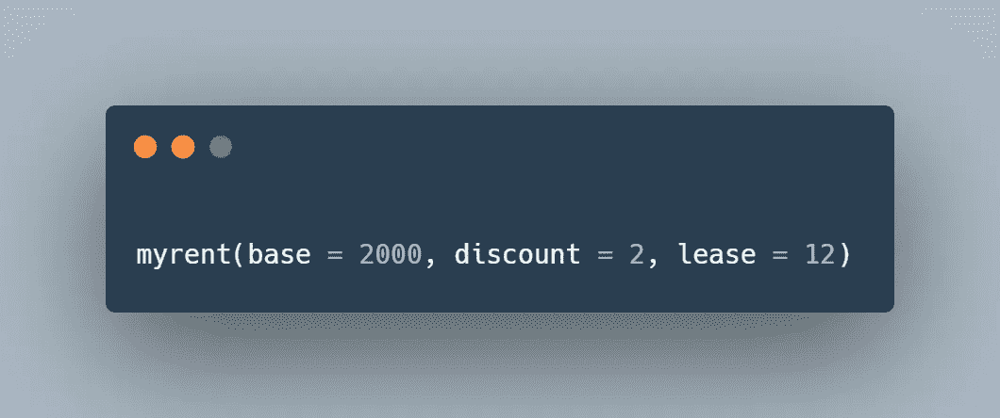

# 我如何创建我的第一个 R 函数

> 原文：<https://towardsdatascience.com/how-i-made-my-first-r-function-776f57e2ec7b?source=collection_archive---------27----------------------->

## 以及如何也能做到:一个真实世界的例子。

学习 R 是一件非常痛苦的事情——学习曲线很陡，可能会让人不知所措。让我回到这个令人谦卑的旅程的是这样一种能力:只需要为某件事做一次，然后根据需要重复做多次。我热爱效率，所以我坚持不懈。今天我遇到了一个乏味的烦恼，通过创建一个函数，我可以在几分钟内解决它。

# **形势**

我正在寻找一个新的公寓，并试图比较价格。幸运的是(谢谢，COVID)，一些单位正在提供一两个月的免费(！)的租金。这是一个极好的消息，但是很难比较价格。

# **我在做什么**

当我看到有打折租金的房源时，我会打开我的计算器应用程序，然后:

1.  免费月数(折扣)*月租金(基本租金)
2.  最短租赁期限(通常为 12 个月)*月租金(基本租金)
3.  从#2 中减去我从#1 中得到的，然后除以最短租期要求

由[凯利·西克玛](https://unsplash.com/@kellysikkema?utm_source=medium&utm_medium=referral)在 [Unsplash](https://unsplash.com?utm_source=medium&utm_medium=referral) 上拍摄

如果我这样做一次，甚至两次，也不会那么糟糕。但是当我第三次尝试时，我开始感到沮丧。我知道我每次想要执行的确切步骤，但是我不得不手动执行每一个步骤——讨厌！

救援功能！

# r 函数基础

第一次用 R 写函数时，我真的很害怕，但这有助于一点一点地分解它。请记住，函数会很快变得复杂，但我们会尽可能保持简单。

在最基本的情况下，R 中的函数具有这样的结构:

创造于[碳](https://carbon.now.sh/)。

不太吓人吧？功能实际上只是:

1.  您的函数(myfunction)的**名称**
2.  **输入**或执行您的功能所需的数据(输入)
3.  您希望完成的**步骤**

函数的一个例子是 mean()。当你想计算平均值时，R 知道把所有的数字相加，然后除以有多少个数字。我们可以直接使用均值函数，而不必自己将数字相加，然后进行除法运算。因为我也有每次都想重复的固定步骤，所以函数是一个很好的解决方案。

# 我的 R 函数

让我们回到我的租赁示例，确定输入和要完成的步骤。

我需要计算我的有效租金的输入是基本租金、折扣(提供的免费月数)和期限(通常为 12 个月)。

我希望完成的步骤是:将基本金额乘以期限长度减去基本金额乘以折扣。然后我想用它除以期限，看看在应用折扣后，每个月我将有效支付多少。

我将调用这个函数 myrent，并告诉它我们需要三个输入:基本租金(base)、免费月数(discount)和租赁期限(term)。

我们还没有告诉 R 这些输入(基数、折扣和期限)是什么意思。我们也可以使用 x，y，z，我们现在所做的就是告诉它，我们将需要这三条信息，然后我们将对它们做些什么。

现在是步骤。我们将友好地告诉我们的朋友(我笑了)我们想要完成的步骤，并把它们放在{}内。

事情进展顺利！最后一步，我们需要让 R 告诉我们，在完成我们指定的步骤后，它计算了什么。所以我们要让 R 打印(base*term-base*discount)/term 的答案“result”。

瞧，我们已经准备好使用我们的功能了！！！比方说，我看到了一套月租 2000 美元的公寓(是的，我也很难过，DC 房产真是个混蛋)，他们提供 12 个月的免费租赁。

既然我们已经创建了函数，我们要做的就是使用“myrent”调用它，并输入每个输入(基本、折扣和期限)。

就这样，我们信任的伙伴给了我们`[1] 1833.333.`

这意味着，如果固定租金是每月 2000 美元，并且有两个免费月的折扣，我将在 12 个月内每月支付 1833.33 美元。我现在可以很容易地将它与每月 1920 美元的公寓进行比较，该公寓提供一个月的免费折扣。神奇！

继续用你的头撞墙，这样会好很多！

作者: [***詹娜·伊格尔森***](https://medium.com/@jeagleson)*我的背景是工业组织心理学，我在人物分析中找到了自己的家。数据使我的作品变得生动。我主要使用 Power BI，但我也喜欢涉足其他工具。我很想听到更多关于你的旅程！在此评论或在推特上评论联系我。*