# 如何使用 AWS Secrets Manager 在 Python 中管理凭证

> 原文：<https://towardsdatascience.com/how-i-manage-credentials-in-python-using-aws-secrets-manager-1bd1bf5da598?source=collection_archive---------3----------------------->

## 在 Python 中访问凭证的平台无关方式

照片由 [Kat Jayne](https://www.pexels.com/@katlovessteve?utm_content=attributionCopyText&utm_medium=referral&utm_source=pexels) 从 [Pexels](https://www.pexels.com/photo/black-and-white-black-and-white-depressed-depression-568025/?utm_content=attributionCopyText&utm_medium=referral&utm_source=pexels) | [品牌内容披露](https://www.annageller.com/disclosure)

E 尽管 AWS 通过 IAM 角色实现了细粒度的访问控制，但有时在我们的脚本中，我们需要使用与 AWS 无关的外部资源的凭证，如 **API 密钥、数据库凭证**或任何种类的**密码**。有无数种方法可以处理这种敏感数据。在本文中，我将向您展示一种使用 AWS 和 Python 来管理它的极其简单而有效的方法。

**目录:**

[管理凭证的不同方式](#45ac)
[描述用例](#757f)
[实现— PoC 展示此方法](#a44e)
∘ [创建 API 密钥](#d6fb)
∘[AWS secrets manager](#d827)
∘[使用 awswrangler](#352c)
∘ [使用检索到的凭证获取股票市场数据](#c0dd)
∘ [AWS AWS 机密管理器的好处](#0b08)
[与 AWS 机密管理器的潜在风险](#8eba)
[结论](#d9cf)

# 管理凭据的不同方式

根据您的执行平台 *m (Kubernetes、本地服务器、分布式云集群*)或版本控制托管平台( *Github、Bitbucket、Gitlab、Gitea、SVN……*)，您可以使用不同的方法来管理机密访问数据。以下是我到目前为止听到的处理凭据的最常见方法的列表:

*   环境变量，
*   作为 CI/CD 部署的一部分接收凭证，
*   利用开发工具中的特定插件。[无服务器凭证插件](https://github.com/serverless/serverless-secrets-plugin)，摄取 Pycharm 中[运行/调试配置](https://www.jetbrains.com/help/pycharm/creating-and-editing-run-debug-configurations.html#createExplicitly)中的环境变量，
*   在工作流程编排解决方案中存储凭据。[气流连接](https://airflow.apache.org/docs/apache-airflow/stable/howto/connection.html)或[提督秘笈](https://docs.prefect.io/orchestration/concepts/secrets.html)，
*   将凭证存储为 Kubernetes 或 Docker secrets 对象
*   利用工具，如 [HashiCorp Vault](https://www.vaultproject.io/) 。

以上所有解决方案都是完全可行的，但是在本文中，我想通过利用 **AWS Secrets Manager** 来演示一个**替代解决方案**。该方法将是安全的(*使用 AWS KMS* 加密)，并且无论您是在本地、在 AWS Lambda 中还是在独立服务器上运行 Python 脚本，只要您的执行平台被授权访问 AWS Secrets Manager，该方法都将以相同的方式工作。

# 我们的使用案例

我们将执行以下步骤:

*   **在 [Alpha Vantage](https://www.alphavantage.co/) 平台上创建一个 API key** ，这样我们就可以从这个 API 中获取股市数据。
*   将 API 密钥存储在 AWS Secrets Manager 中，
*   仅使用两行 Python 代码，在我们的脚本中检索这个 API 键
*   使用该键获取最新的苹果**股票市场数据**
*   构建 AWS Lambda 函数，并在那里测试相同的功能。

# 实施—展示此方法的概念验证

## 创建 API 密钥

如果你想跟进，去[https://www.alphavantage.co/](https://www.alphavantage.co/)拿你的 API 密匙。

Alpha Vantage —作者图片

## AWS 机密管理器

首先，确保您为 **AWS CLI** 配置了能够与 AWS Secrets Manager 交互的 **IAM 用户**。然后，您可以在您的终端中使用以下简单命令**存储秘密**:

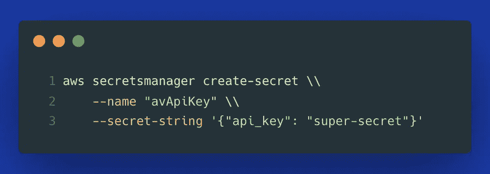

要查看它是否有效，您可以使用以下命令列出您帐户中的所有秘密:

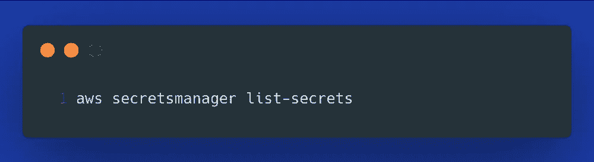

如果你的证书以后发生变化( *ex。如果您更改了密码*，更新凭证就像下面的命令一样简单:

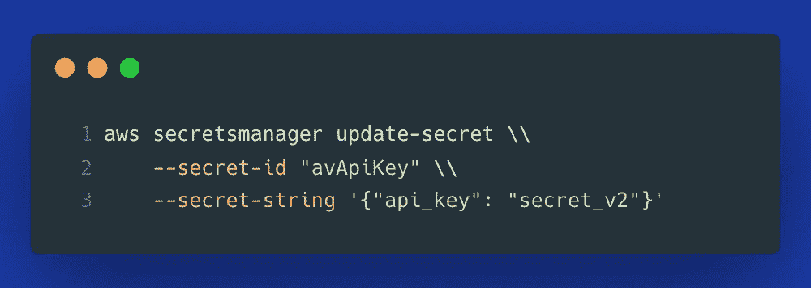

## 使用`awswrangler`检索凭证

AWS Secrets Manager 允许将凭证存储在一个 **JSON** **字符串**中。这意味着一个单独的秘密可以保存您的整个**数据库连接字符串**，即您的用户名、密码、主机名、端口、数据库名称等。

**awswrangler** 包提供了一种方法，**将这些数据反序列化**到一个 Python 字典中。当与`**kwargs`结合使用时，您可以将字典中的所有凭证直接解包到执行身份验证的 Python 函数中。

我的 **requirements.txt** 如下(*使用 Python 3.8* ):

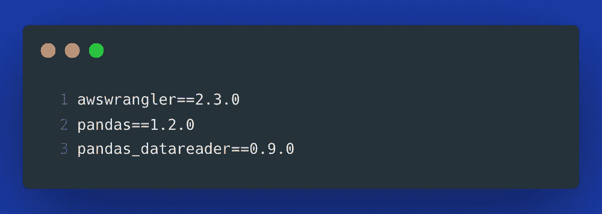

然后，要检索使用 AWS CLI 存储的秘密，您只需要这两行:

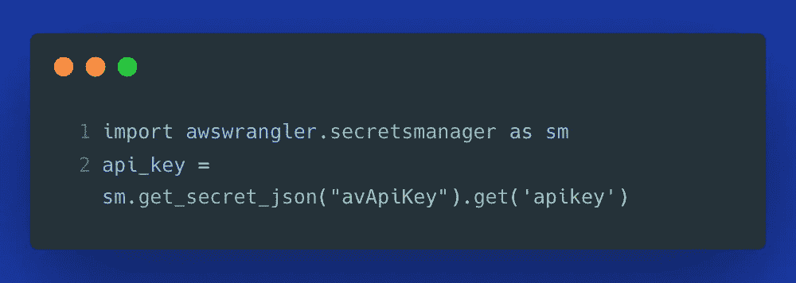

## 使用检索到的凭证来获取股票市场数据

有一个方便的 Python 包叫做 **pandas_datareader** ，它允许轻松地从各种来源检索数据并将其存储为 Pandas dataframe。在下面的例子中，我们正在检索过去两天的苹果股票市场数据(*当天*)。请注意，我们正在从 AWS Secrets Manager 传递 **API 密钥**,以便与 Alpha Vantage 数据源进行认证。

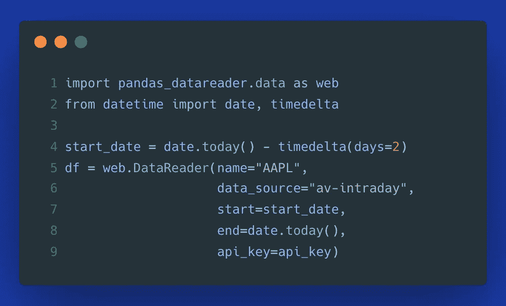

这是我得到的一个数据框架:

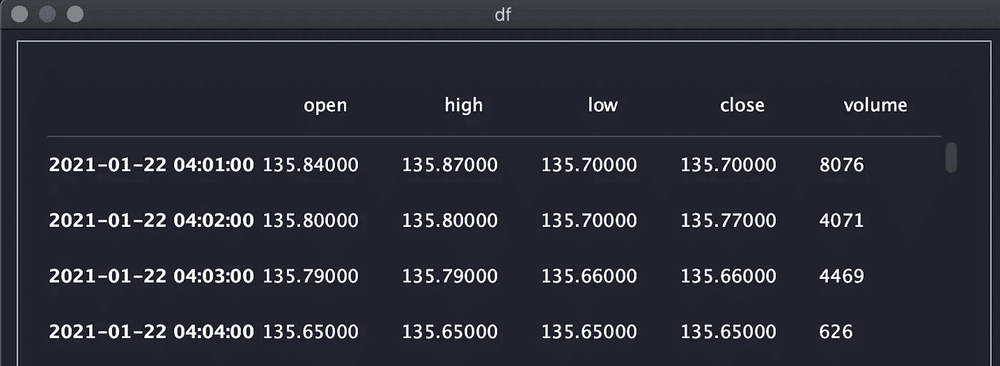

苹果股票市场数据——图片由作者提供

## 使用凭据的 AWS Lambda 函数

既然我们能够在本地机器上访问凭证，下一步就是在 AWS Lambda 中做同样的事情，以证明这个方法是平台不可知的，并且可以在任何可以运行 Python 的环境中工作。

> **边注:**我正在使用一种新的替代方式，用一个 **Docker 容器映像**来打包 AWS Lambda 函数。如果你想了解更多，可以看看我之前的文章中更详细的讨论。

我使用以下 docker 文件作为我的 AWS Lambda 函数的基础:

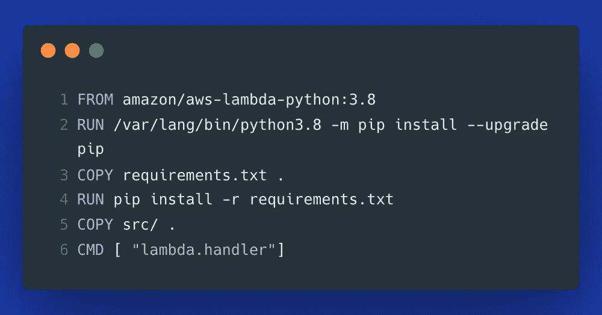

**src** 目录中的脚本 **lambda.py** 如下所示:

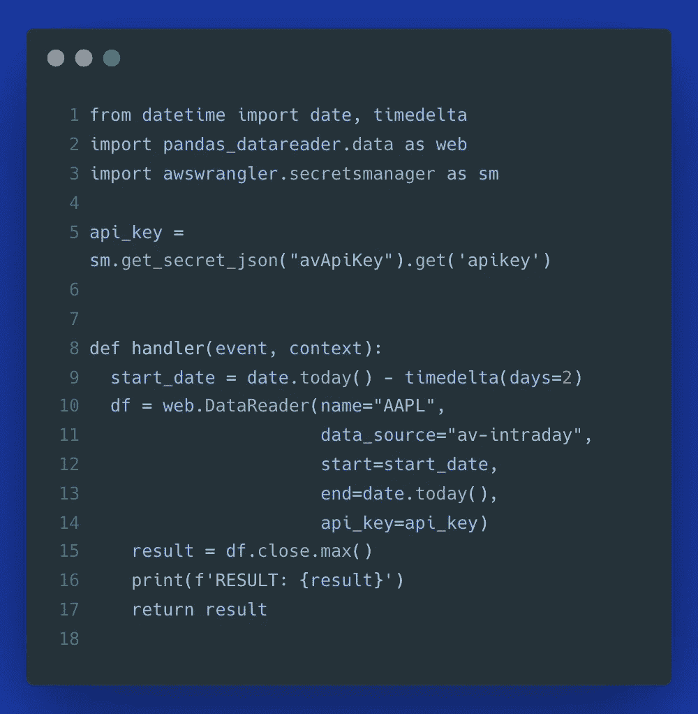

为了构建代码并将其打包到 Docker 容器中，我们使用以下命令:

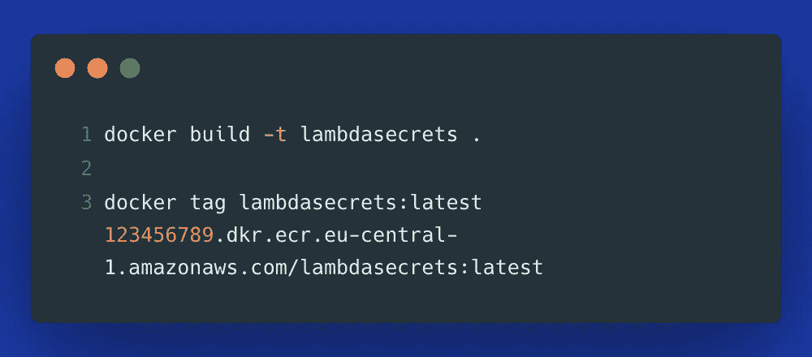

最后，我们构建一个 ECR 存储库，并将映像推送到 ECR:

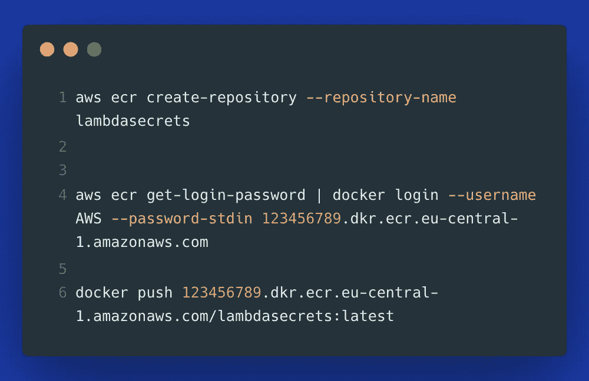

> **注意:**用您的 AWS 帐户 ID 替换 123456789。此外，相应地调整您的 AWS 区域——我使用的是 **eu-central-1** 。

我们现在准备在 AWS 管理控制台中构建和测试我们的 AWS Lambda 函数。

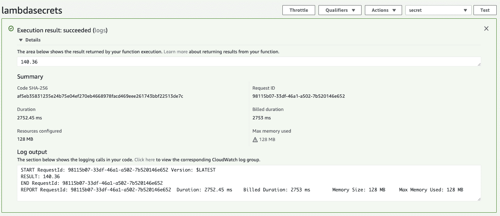

使用 AWS Secrets Manager 为 API 密钥检索部署 AWS Lambda 图片由作者提供

# 了解我们的 Lambda 函数

如果您正在运行多个 Lambda 函数工作负载，那么考虑使用一个可观察性平台是有益的，它将帮助您保持所有无服务器组件的概览。在下面的例子中，我使用 [Dashbird](https://dashbird.io/) 来获得关于上面执行的 Lambda 函数的附加信息，例如:

*   每个特定函数调用的执行持续时间，
*   寒冷开始了，
*   内存利用率，
*   调用次数和错误百分比，
*   …还有更多。

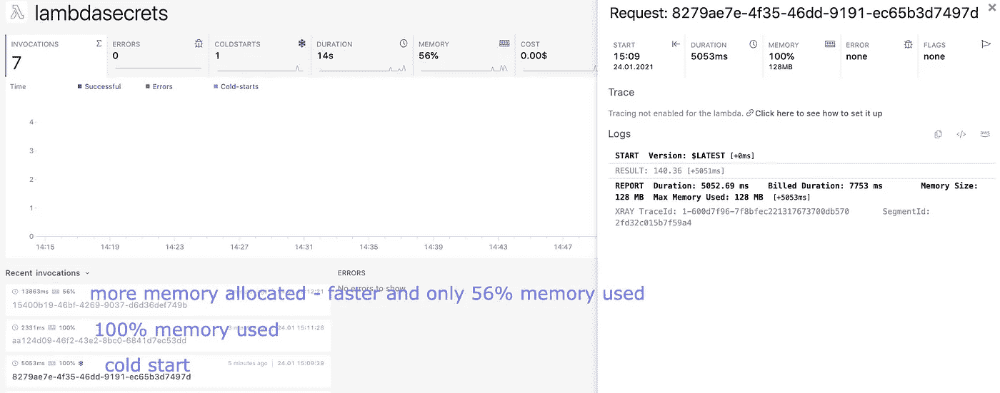

使用 [Dashbird](https://dashbird.io/) 调试并了解 AWS Lambda 函数调用——图片由作者提供

你可以在上面的图像中看到，第一个函数执行有一个**冷启动**。第二个用了 **100%的内存**。这些见解帮助我通过增加分配的内存来优化资源。在随后的调用中，我的函数**运行得更快了**，并且没有用尽总内存容量。

# AWS Secrets Manager 的优势

希望您可以看到使用这个 AWS 服务存储和检索您的敏感数据是多么容易。以下是这种方法给你带来的好处:

*   **安全性** —使用 AWS KMS 对凭证进行加密
*   **一个集中存放所有凭证的地方** —如果您决定将所有凭证存放在这里，您将获得一个存放所有凭证的地方。获得授权后，您还可以在 AWS 管理控制台中查看和更新机密。
*   **可访问性&独立于平台的凭证存储** —我们可以从本地机器、无服务器功能或容器、甚至本地服务器访问机密，前提是这些计算平台或进程被授权访问 AWS Secrets Manager 资源。
*   **跨编程语言的可移植性** — AWS 为各种语言提供 SDK，这样你就可以使用 Java、Node.js、JavaScript、Go、C++、。NET 等等。
*   **AWS CloudTrail 集成** —当启用 CloudTrail 跟踪时，您可以跟踪谁在何时访问了特定凭证，这为您提供了关于资源使用情况的审计跟踪。
*   **访问控制的粒度** —我们可以轻松地将特定凭证的权限授予特定用户，从而更容易了解谁可以访问什么。

# AWS Secrets Manager 的潜在缺点

我有一个政策，总是不加粉饰地提供任何技术的利弊。这些是我到目前为止看到的在企业范围内使用此服务管理凭据的风险或缺点:

*   如果您将**所有凭证存储在一个位置**，并且您没有根据最小特权原则授予访问权限，即某个超级用户可以访问所有凭证，那么当该超级用户的凭证被泄露时，您就有暴露所有机密的风险。这是**唯一正确的，如果你不恰当地使用服务**，但是为了完整起见，我还是想把它包括进来。
*   **费用**——由于你每月为每个秘密付费，你必须意识到，如果你使用该服务存储大量凭证，价格可能会增加。
*   **信任** —仍然很难让一些 it 经理相信云服务在正确配置的情况下会比本地资源更安全。话虽如此，许多 IT 经理仍然不信任任何云供应商，不会向他们吐露秘密。
*   您的执行平台必须能够**访问秘密管理器**本身。这意味着您要么需要配置一个 IAM 角色，要么需要以其他方式存储这个秘密。这并不是一个真正的缺点或风险，而是简单地说，您需要意识到对 Secrets Manager 的访问也需要以某种方式进行额外的管理。

# 结论

在本文中，我们研究了用 Python 脚本管理凭证的 AWS Secrets Manager。我们可以看到使用 **AWS CLI** 来放置、更新或列出秘密是多么容易。然后，我们看了看如何使用 Python，通过包 **awswrangler** 只用两行代码就能访问这些凭证。此外，我们将脚本部署到 **AWS Lambda** 来证明这个方法是平台无关的。作为一个额外的部分，我们研究了如何使用 [Dashbird](https://dashbird.io/) 为我们的 Lambda 函数增加可观测性。最后，我们讨论了 AWS Secrets Manager 作为一种企业级凭证管理方式的优缺点。