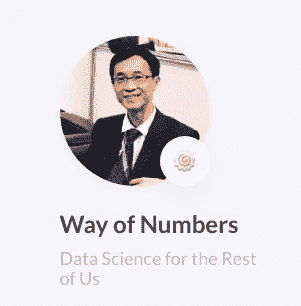

# 我如何将我的数据科学博客从 Pelican 迁移到 Hugo

> 原文：<https://towardsdatascience.com/how-i-migrate-my-data-science-blog-from-pelican-to-hugo-732e4feb3c43?source=collection_archive---------23----------------------->

## 你也可以！


卡尔·海尔达尔在 [Unsplash](https://unsplash.com?utm_source=medium&utm_medium=referral) 上拍摄的照片

# 动机

## 鹈鹕的问题

我使用 Pelican 作为我的[数据科学博客](https://wayofnumbers.com)的框架已经有一段时间了。它对我很有效，尽管总有一些小故障让我感觉不稳定。它从来没有让我感到完整和满足。以下是一些重要的例子:

**小社区和小众定位**

鹈鹕的群体比雨果小得多。它有 10.4k 颗星星，而 GitHub 上有 51.4k 颗星星。在静态站点生成器社区上，Pelican 是一个利基。已经知道 Python 的人可能想试试(像我！)，但是具有更好理解和编程技能的其他人可能更喜欢其他选项。如果你遇到一些奇怪的问题，一个更小的社区会有更少的主题，更少的插件，更少的支持。这正是我的经历。

**缺乏令人满意的主题**

很难找到我目前的主题既美观又实用。首先，没有多少选择。

**难以解决的小故障**

我花了相当大的力气才让一切都运转起来。谷歌分析，Disqus，Jupyter 笔记本支持，目录，阅读时间等。在这个过程中，我几乎没有得到任何帮助，因为根本没有多少人使用它。所以我必须深入研究源代码来解决一个小问题。这并不是说这个过程不值得花时间(对我这个程序员来说，这个过程很有挑战性，也很有教育意义)，而是为什么我必须在可以照料花朵的时候挖出石头？

**速度，速度，速度**

当谈到编程语言的速度时，Python 坐在“最慢”的一端，而 Go(几乎)在顶端。我能告诉你的是:它确实显示了现场发电速度。Pelican 需要几秒钟来渲染我所有的文章(20+)，而 Go 只需要几毫秒。Go 的另一个好处是，它可以实时更新网站，而 Pelican 会稍微落后一些。当你做了一个小的改动，需要重新生成整个站点才能看到更新的版本时，这一点就更明显了。我们的时间太宝贵了，不能浪费，即使是几秒钟也会积累很多。

## 为什么是雨果


照片来自[https://gohugo.io/](https://gohugo.io/)

**并发和速度**

H [ugo](https://gohugo.io/) 自诩为“**世界上最快的网站建设框架**”，我完全明白这是为什么。Golang 由 Google 开发，用于解决他们的代码效率问题，并以其强大的并发能力而闻名。这对雨果来说很适用。Hugo 站点的标准构建时间是 100 毫秒，而另一个静态站点生成器是 10 秒。如果你关心速度，那么你一定会喜欢雨果。

**良好的社区支持**

Hugo 在 GitHub 上的开源项目目前显示的是 54.4k 的星星。这是一个相当大的数字。许多人使用 Hugo 作为个人/商业博客的首选框架。这意味着当有疑问时，更容易搜索类似的问题。此外，Hugo 官方[论坛](https://discourse.gohugo.io/)的回应时间相对较短，因为你的问题框架非常精确。Hugo 也有很好的文档，如果你实现了一个新特性，你可以很容易地找到你想要的。

**曝光完毕**

Golang 作为一种服务器端语言，在过去几年里越来越受到后端开发人员的青睐。这是一门值得花时间学习的语言。与 Hugo 合作不可避免地会让你接触到围棋，当你建立自己的网站并开始学习围棋时，你可能会学到一些东西。

**主题，很多主题**

不用再看官方的雨果主题网站。这些是免费的。也有一些网站提供付费的高级主题，你可以决定是否值得。无论是免费的还是付费的，Hugo 主题社区都非常活跃，有很多选项可供选择。

**平滑学习曲线**

一些静态站点生成器，比如 Gatsby，你需要对 React 有很深的理解才能使用它。对雨果来说，你真的不必先学习围棋，尽管知道一些围棋会让你更顺利地加快速度。

# 我的第一个 Hugo 网站


照片来自[https://themes.gohugo.io/hugo-theme-stack/](https://themes.gohugo.io/hugo-theme-stack/)

E 理论制造的充足。让我们开始讨论细节。我将按时间顺序组织这一部分，以展示通常是如何完成的流程，我遇到的一些问题，以及我如何解决它们。

## 从快速入门开始

最简单也是最好的(至少对我来说)开始迁移的方法是按照官方的[快速启动](https://gohugo.io/getting-started/quick-start/)从零开始建立一个新站点。它相对容易遵循，甚至没有很多步骤。如果你知道一点命令行和 Git 会有帮助，但不是必需的。Hugo 自带强大直观的 CLI 界面，即使不太懂命令行，也能毫不费力地完成教程。例如，建立站点仅仅是:

快速启动将为您选择一个主题([anake](https://themes.gohugo.io/gohugo-theme-ananke/))您可以稍后轻松地将其更改为您自己的选择。最终的网站看起来会像这个[这个](https://themes.gohugo.io/theme/gohugo-theme-ananke/)。

## 选择一个主题

选择主题大多是主观的。选择你想要的任何东西。一些看起来对你有吸引力并满足你所有实用需求的东西将是一个好的开始。只是不要花太多时间来确定你的“完美伴侣”，有这么多选择，你可能会在确定一个你真正感到舒服的之前转换多次。我的是[栈](https://themes.gohugo.io/hugo-theme-stack/)。对于你的第一个站点，一定要看一下主题文档，因为你肯定需要多次阅读来根据你的喜好进行调整。

# 配置和调整

有趣的部分来了，**修修补补**！对一些人来说，调整一个主题让它为你工作是令人畏惧的，但是对我来说，这是令人畏惧和令人兴奋的。感觉就是解谜。你从主题文档、Hugo 文档、YouTube 视频和 stack overflow 中获得线索，然后把所有的片段放在一起。完成后，你会自我感觉良好！

## 克隆、子模块和配置

首先，git 将主题克隆到本地驱动器:

这有助于将主题添加为子模块。这样使用 Git 更容易管理。如果你想把你的站点放在 Netlify 上，你将需要它用于将来的部署。一旦主题文件夹安全地放在你的本地驱动器上，你只需要对配置文件做一些小的调整就可以了。有两种方法可以做到这一点。一个简单的方法是改变你当前的`config.toml`文件:

但是如果你阅读了主题文档，建议的是简单地从主题示例站点复制`config.yaml`文件，因为还有其他部分的配置你需要得到正确的，从主题默认配置文件开始更容易。一旦完成，你的简单网站将开始看起来像这样:


来自 https://themes.gohugo.io/hugo-theme-stack/[的照片](https://themes.gohugo.io/hugo-theme-stack/)

## 电影《阿凡达》

现在，为了让主题为你所用，你需要解决一些小细节。首先引起我注意的是醒目的占位符“150x150”头像:


图片来自[https://themes.gohugo.io/hugo-theme-stack/](https://themes.gohugo.io/hugo-theme-stack/)

必须先处理掉它！查看[文档](https://docs.stack.jimmycai.com/configuration#avatar)，头像需要放在网站根目录下`assets`文件夹下的某个地方(我放在`img`子文件夹下)。然后换`config.yaml`告诉 Hugo 去哪里找:

网站自动重新加载，头像更新到我不太好看的照片:



作者照片

## Favicon

当你拥有它时，你永远不会注意到它。但是如果它不在那里，它的缺失会永远抓住你。让我们直说吧。我的网站还没有图标，所以我需要创建一个。一个快速的方法是使用 [favicon.io](https://favicon.io/) 。它可以让你用一张图片、几个字符或者你喜欢的表情符号来生成你的 favicon。为了简单起见，我决定用我的名字。如果不满意，你可以随时修改。用户界面如下所示:


图片来自 favicon.io

下载完 favicon 资源文件后，下一步是确定将它们放在哪里。查看主题文档，没有提到它应该放在哪个文件夹下。如果官方文档不足，查找信息的最佳方法是什么？当然是 GitHub！通常，人们会抱怨开源项目的 GitHub 缺乏信息，并提交问题。让我们看看是否能在那里找到任何线索。经过一番搜索，主题的 GitHub 页面可以找到[这里](https://github.com/CaiJimmy/hugo-theme-stack)在回购内搜索“favicon”，啊哈，我们有 12 个与之相关的问题:


照片来自[https://github.com/CaiJimmy/hugo-theme-stack](https://github.com/CaiJimmy/hugo-theme-stack)

圈出的问题(虽然是中文的)是我们需要的，它指引我们到`/static`文件夹来放置图标。我把它放在`/static/img/`下面。然后更新`config.yaml`:

重新装弹，有效！


作者照片

## 前页

[前事](https://gohugo.io/content-management/front-matter/)是你帖子的元数据。它包含您可以使用的各种预定义变量，或者如果您愿意，您可以自定义自己的变量。这一切都非常灵活。其中，`title`、`date`、`description`、`categories`、`tags`、`image`最为重要。`categories`和`tags`也决定了如何组织你的内容。

## 内容组织和特征图像

主题允许两种方式来组织你的内容:类别和标签。要做到这一点，只要把它们包含在你的前面就行了，就像这样:

```
image: 9-things-i-learned-from-blogging-on-medium-for-the-first-month.jpeg
title: “9 Things I Learned from Blogging on Medium for the First Month “
description: “Why Medium is a good platform to exchange ideas”
slug: 9-things-i-learned-from-blogging-on-medium-for-the-first-month
date: 2019–10–04T20:56:10.704Z
categories: Machine Learning
tags: 
- “Machine Learning”
- “Blogging”
- “Medium”
```

该主题将收集你所有文章中定义的所有类别/标签，并将它们放在相关的“类别”和“标签”页面中。您还可以为每个类别或标签提供一个特征图像。只需在`/content/`下创建`categories`和`tags`文件夹，在每个文件夹中，为每个类别或标签创建一个子文件夹，在子文件夹下放入`_index.md`文件和一张图片(比如说`ML.jpg`)。在`_index.md`文件中，放一个前置事件变量`image`并指向图像`ML.jpg`。像下面这样:


作者照片

配置完成后，它应该如下所示:


照片来自[https://themes.gohugo.io/hugo-theme-stack/](https://themes.gohugo.io/hugo-theme-stack/)

## 短代码—图像标题

通常情况下， **Markdown** 文件中的图像应该是这样的:

```
![Image]{URL}
```

但不幸的是，这对于图像标题来说效果不佳。经过几次尝试和错误之后，我发现 Hugo shortcode `figure`工作得很好:

看起来是这样的:


作者照片

既然重要的部分都已经完成了，是时候写一个脚本将我的基于 Pelican 的 Markdown 文件转移到基于 Hugo 的文件了。

# 编写从鹈鹕到雨果的迁移脚本

阿文已经想出了制作这个主题的所有细节，现在是时候把我为鹈鹕量身定做的帖子转移到更适合雨果的地方了。这可以通过一些 Python 脚本轻松完成。我使用了来自 GitHub repo 的代码作为基础，并根据我的需要进行了修改。代码非常简单明了。它读取旧 Markdown 文件的每一行，使用 regex 搜索短语，并需要相应地更新和修改每一行，主要是前端内容、图像和视频链接。

***值得注意的几点:***

1.  该脚本将删除输出文件夹(Hugo 内容文件夹)中的所有内容，并从源文件夹中重新生成它们。
2.  **前事**:大量使用正则表达式替换元数据。例如从“标题”到“标题”，“副标题”到“描述”，日期格式等。
3.  **图片**:提取 Medium CDM URL，下载图片，放在 post 子文件夹下，这样特征图片就可以工作了。为了更好的字幕，其他图像被放入了一个 Hugo shortcode。
4.  **YouTube** :提取视频 ID，放入`{{youtube}}` Hugo shortcode。它非常有效。

## 将我的新媒体帖子转移到 Hugo markdown

我有一些中型职位尚未转移到我的鹈鹕博客，所以需要另一个脚本。不用自己写。我使用了来自 GitHub repo 的 Python 脚本。你需要使用 Medium 的导出服务将你所有的帖子放入一个 zip 文件，然后使用脚本将它们转换成 Hugo markdown。由于帖子不多，我做了一些手动调整，为每篇文章创建子文件夹，这样特写图像就可以工作了。


来自 https://github.com/chamilad/medium-to-hugo[的照片](https://github.com/chamilad/medium-to-hugo)

# 在 Netlify 上切换回购

最后，我们得到了我们需要的一切，现在是时候把网络生活从鹈鹕变成雨果了。激动人心！首先，我为 Hugo 网站创建了一个回购，[这里](https://github.com/wayofnumbers/wayofnumbers_hugo)。然后，登录我的网络生活账户，进入我的网站，点击`SIte Settings`:


图片来自 netlify.com

选择`Build & Deploy`选项卡，然后点击`Edit Settings`，像这样:


图片来自 netlify.com

选择`Link to a different repository->`，会出现一个向导屏幕，在这里你可以选择你的 Hugo 库。这样做，并做一些基本的构建设置。其中，注意构建命令只是简单的`hugo`。值得注意的一点是雨果版本。Netlify 上的默认 Hugo 版本不够高，无法正确构建我的站点，我遇到了许多奇怪的错误。我找到了在我的站点根目录下添加一个`netlify.toml`的解决方案，并在其中分配 Hugo 版本。你可以在找到参考指南[。完成所有设置后，新的构建将生成新的站点。](https://docs.netlify.com/configure-builds/common-configurations/hugo/)

# 总体感觉

哦，这是一篇很长的帖子。我很感激能走到这一步的人。我希望这篇长文对你的雨果之旅有所帮助。最后，我想分享一下我对整个过程的总体感受:

1.  这并不难，但需要烫平一些皱纹。(也是好玩的部分？)
2.  主题采用需要最长的时间。文档会有所帮助，但通常并不完整。GitHub 问题帮助很大。
3.  有很多非常善良的人写了脚本来自动化迁移。使用它们，但是不要犹豫根据你的需要修改它们。一点点编程大有帮助，尤其是当你有很多文章的时候。

> ***加成***
> 
> [*YouTube 系列*](https://youtube.com/playlist?list=PLLAZ4kZ9dFpOnyRlyS-liKL5ReHDcj4G3) *我用来学习 Hugo 基础知识的，都是一口大小的。*

觉得这篇文章有用？在 Medium 上关注我([wayofnumbers.com](https://medium.com/u/72c98619a048?source=post_page-----dbe7106145f5----------------------))或者你可以在 Twitter [@lymenlee](https://twitter.com/lymenlee) 或者我的博客网站上找到我。你也可以看看我下面最受欢迎的文章！

[](/this-is-cs50-a-pleasant-way-to-kick-off-your-data-science-education-d6075a6e761a) [## “这是 CS50”:开始数据科学教育的愉快方式

### 为什么 CS50 特别适合巩固你的软件工程基础

towardsdatascience.com](/this-is-cs50-a-pleasant-way-to-kick-off-your-data-science-education-d6075a6e761a) [](/two-sides-of-the-same-coin-fast-ai-vs-deeplearning-ai-b67e9ec32133) [## 一枚硬币的两面:杰瑞米·霍华德的 fast.ai vs 吴恩达的 deeplearning.ai

### 如何不通过同时参加 fast.ai 和 deeplearning.ai 课程来“过度适应”你的人工智能学习

towardsdatascience.com](/two-sides-of-the-same-coin-fast-ai-vs-deeplearning-ai-b67e9ec32133) [](/what-you-need-to-know-about-netflixs-jupyter-killer-polynote-dbe7106145f5) [## 你需要了解网飞的“朱庇特黑仔”:冰穴📖

### 是时候让 Jupyter 笔记本有个有价值的竞争对手了

towardsdatascience.comgg](/what-you-need-to-know-about-netflixs-jupyter-killer-polynote-dbe7106145f5)