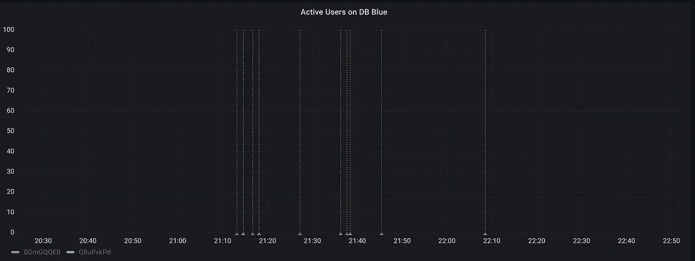

# 我如何监控与 Prometheus 和 Grafana 的 SSH 会话

> 原文：<https://towardsdatascience.com/how-i-monitor-active-ssh-sessions-with-prometheus-and-grafana-f4811da0a8cc?source=collection_archive---------16----------------------->

## 这是时间的问题，而不是事情是否会发生。最好做好准备。

照片由[西格蒙德](https://unsplash.com/@sigmund?utm_source=medium&utm_medium=referral)在 [Unsplash](https://unsplash.com?utm_source=medium&utm_medium=referral) 拍摄

如果尽管采取了所有安全措施，如高级配置、非对称加密和端口敲门，但攻击者还是获得了对我的一台云服务器的访问权限，该怎么办？

我如何以及何时才能发现？难道我不想尽早知道我的一个服务器被入侵了吗？

我不断地问自己这些问题，并决定用 Prometheus 和 Grafana 创建一个监控活跃用户会话的解决方案。我的目标是在我的一台服务器上创建了一个新的用户会话(例如 SSH)时，立即收到通知。当然，这不会阻止攻击者访问系统，但至少会暴露他们的活动。

你可以在下图中看到最终的结果。这是我的 Grafana 实例的截图。每当我登录到我的系统时，该图显示一条红线，因为触发了一个警报，在我注销后显示一条绿线。每一个状态变化都会触发一个电子邮件通知。

显示数据库服务器上活动用户会话的 Grafana 面板

这是我开源软件家族的最新成员的故事。为 UNIX 系统上的活跃用户提供的 Prometheus exporter。

*如果你已经熟悉普罗米修斯和格拉法纳或者想直接跳转到导出器的实现细节，* [*点击这里*](#d722) *。*

# 问题是

我们公司大约在四年前(2017 年)开始采用弹性计算。我很幸运地成为了我们的第一批用户——当时——破坏了在日常业务中使用云基础设施的计划。直到我建立了自己的私有云服务器，我才最终意识到，是的，公共云服务器往往是公开的——对互联网上的任何人都是公开的。

这在工作中没什么大不了的，因为**消费服务不同于**提供服务。我不必担心我们工作中的虚拟机的安全性，因为有另一个团队负责它。亚马逊网络服务(AWS)显然在很久以前就了解了这一点，并发布了它所谓的[共享责任模型](https://aws.amazon.com/compliance/shared-responsibility-model/)。这个模型是关于 AWS 和它的客户在一个亚马逊乐于提供其服务器和服务的世界中的责任。虽然 **AWS 负责对服务器的物理访问，但客户必须负责对存储在其虚拟机上的数据的虚拟访问**。

现在，由于显而易见的原因，我们无法物理访问 AWS 的服务器并插入以太网电缆，因此我们使用 SSH 等工具和协议通过公共互联网访问我们的云服务器。尽管有办法在 AWS 或 Azure 等云提供商上创建私有和混合网络，但这些功能可能只是愿意花费时间和金钱来构建此类网络的企业客户的一种选择。

作为一名热爱软件开发的软件架构师，我决定在去年夏天的这个时候开始开发我的第一个软件即服务(SaaS)产品。由于对维护物理硬件不感兴趣，我也决定购买一些云服务器。

因此，我阅读了几篇关于配置 OpenSSH 和 fail2ban 的文章，以丢弃来自尝试使用 OpenSSH 登录但失败的 IP 的所有流量。然而，我仍然对我的服务器的暴露有不好的感觉。因此，我计划长期接收某种形式的电子邮件通知，只要用户通过 SSH 登录。但是监控系统还没有到位。

对于每个有全职工作的人来说，兼职的时间是有限的，你可能也经历过这种情况。所以直到今年 3 月，我才最终能够用 [Prometheus](https://prometheus.io/) 和 [Grafana](https://grafana.com/oss/grafana/) 搭建起监控基础设施。

# 解决方案

**Prometheus 和 Grafana 是用于监控和警报的开源工具的经典组合，抽象出存储和可视化指标的复杂性。**两个系统一起可以从服务(Prometheus)收集和接收指标，并可视化指标、聚合和派生(Grafana)的当前和历史状态。此外，这两个系统实际上都可以定义某些阈值和条件，这些阈值和条件将通过电子邮件、Slack、Discord 等方式触发通知。**他们需要提供的功能是数据**。

数据提供者可以是配备有 Prometheus [库](https://prometheus.io/docs/instrumenting/clientlibs/)的应用程序，也可以是 Prometheus 生态系统中的[导出器](https://prometheus.io/docs/instrumenting/writing_exporters/)。导出器是一个独立的应用程序，它从另一个工具甚至主机上收集指标，并通过 HTTP 端点公开这些指标。

因为我想从操作系统中收集指标，所以编写一个导出器是可行的方法。缺失的部分是一个 UNIX 命令，它返回当前登录用户的一些信息。快速的谷歌搜索会产生各种各样的命令，如 [w](https://man7.org/linux/man-pages/man1/w.1.html) 、 [who](https://man7.org/linux/man-pages/man1/who.1.html) 和 [users](https://man7.org/linux/man-pages/man1/users.1.html) 。

在这些命令中，我发现`w` 命令最有吸引力，因为它不仅返回当前登录用户的名称，还返回每个用户的名称

*   IP 地址，
*   登录的时间，
*   当前进程的名称。

对于我想要实现的目标和最后一个缺失的拼图，这是一些非常有用的信息。因此，为了在用户登录我的服务器时收到来自监控系统的通知，我需要

*   调用 w 命令并解析输出，然后
*   使用简单的服务器应用程序通过 HTTP 导出指标。

# 实施

正如普罗米修斯本身就是用围棋打造的一样，很多出口商也是用围棋打造的。然而，我更熟悉 NodeJs，所以我选择用 NodeJs 实现这个导出器。

解析`w`命令的输出就像遍历输出的每一行，并将每一列的值与标题行的对应列进行匹配一样简单。您可以在下面看到的函数期望以字符串的形式接收命令的输出，并返回一个数组，该数组包含每个登录用户的零个或多个对象。

为了提取每个用户的活动会话数，我进一步将数组简化为一个对象。一个对象，包含每个活动用户名的键，值为与该用户关联的所有会话。

为了向 Prometheus 服务器公开收集的指标，我选择使用[open telemetry Prometheus-exporter](https://www.npmjs.com/package/@opentelemetry/exporter-prometheus)包。这个包已经包含了一个`PrometheusExporter`服务器实现、一个 HTTP 端点和一个`MeterProvider`来创建度量并更新它们的值。

然后我必须把所有的部件粘在一起

*   出口服务器，
*   配置和命令行选项，
*   并将收集和解析的`w`命令输出到位。

您可以在这里查看最终结果:

<https://github.com/stfsy/prometheus-what-active-users-exporter/blob/master/lib/index.js>  

# 收尾工作

在我对云机器的第一次测试中，我意识到我没有足够关注一个重要的方面。**时间**。

我在上面提到过，Prometheus 通常从已知的服务器、服务和导出器收集指标。它通过为每个作业调用配置的指标端点来实现这一点。因此，一个[作业](https://prometheus.io/docs/prometheus/latest/configuration/configuration/#scrape_config)配置必须至少包含

*   目标机器的主机名，
*   目标应用程序的端口，
*   和指标端点的路径。

此外，用户可以配置刮擦间隔，该间隔定义 Prometheus 从已配置的端点获取指标的频率。默认情况下，该间隔为一分钟。

我还在导出器中使用了一个可配置的时间间隔。这个时间间隔定义了导出器调用`w`命令并解析其输出的频率。此外，还有每个活动用户会话的持续时间。

为了捕获尽可能多的用户会话，**导出器和 Prometheus 本身的抓取间隔需要尽可能小。**理想情况下，也可以流式传输`w`命令的输出，以便在新结果可用时立即获取，而不是轮询它。

我决定做以下事情:

*   降低导出程序的默认抓取时间间隔，以捕捉持续时间超过五秒的用户会话。
*   将每个收集的用户会话缓存 60 秒(忽略用户注销的时间)，以便 Prometheus 有足够的时间从导出器获取指标。

仅此而已。我已经在生产中使用该导出器几周了，它工作得很好。活动的 SSH 会话——目前为止只有我发起的会话——确实会产生电子邮件通知。

你可以在这里查看导出器[的源代码。如果你对使用导出器感兴趣，请查看库的](https://github.com/stfsy/prometheus-what-active-users-exporter)[自述文件](https://github.com/stfsy/prometheus-what-active-users-exporter)以获得安装说明。导出器的每个版本都包含 Linux 和 Alpine Linux 的可执行文件以及各自的 SHA256 校验和。

即使我用 NodeJS 实现了导出器，您也不必担心安装和更新运行时。相反，您可以从[的最新版本](https://github.com/stfsy/prometheus-what-active-users-exporter/releases/latest)下载二进制文件并立即使用，因为我将导出器编译成了适用于 Linux 和 Alpine Linux 的单一可执行文件。

# 判决

几天的工作，但值得花时间来获得更多关于我的云服务器上的活动的透明度。我将导出器添加到我所有的云服务器中，并在我的 Grafana 仪表板中为它们创建了一个面板和一个警报。当我把它编译成一个可执行文件时，在 UNIX 系统上安装它只需要几行代码。

我在我的 GitHub 帐户上发布了源代码和二进制文件，请随意查看。

<https://github.com/stfsy/prometheus-what-active-users-exporter/>  

感谢阅读。如果您有任何反馈或进一步的想法，您可以通过 Twitter [@stfs](https://twitter.com/stfsy?lang=en) y 联系我