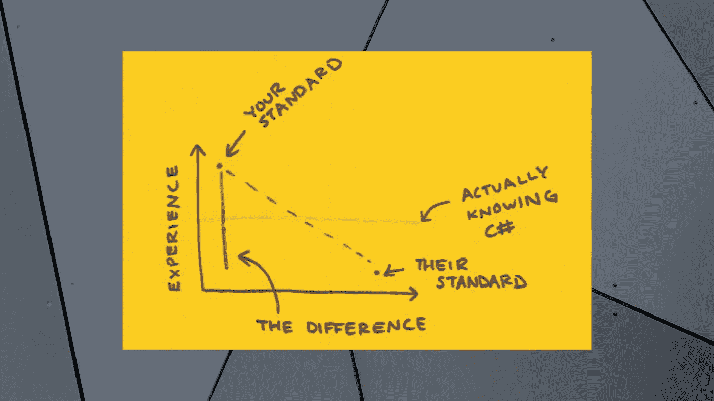
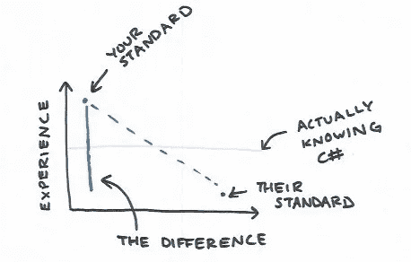

# 我，一个卑微的工程师，如何处理冒名顶替综合症

> 原文：<https://towardsdatascience.com/how-i-one-humble-engineer-deal-with-imposter-syndrome-6075ee2b10a8?source=collection_archive---------21----------------------->

作者图片

## [办公时间](https://towardsdatascience.com/tagged/office-hours)

让我在这篇文章的开始说，冒名顶替综合症已经被大量详细地讨论过了，我可能没有什么新的东西可以添加到讨论中，所以让我在这里停下来，感谢您的阅读，很抱歉浪费了您的时间。

阿克汉姆。虽然已经有很多克服冒名顶替综合症的建议，但我发现它通常属于以下两类:

1.  你！冒名顶替者？！不会吧！别再这么想了！
2.  假装直到你成功。如果你保持自信，总有一天你会的。

第一个角度显然是无用的，第二个，我认为，既不可能也不可取。

热门话题:你无法成功假装自信。不是说可以就没用了。研究表明，在让人们认为你知道自己在做什么的时候，自信比实际能力更有说服力。过分自信会让你在生活中走得更远。但是同样的研究表明，仅仅假装自信是不够的。你必须真的相信它——你必须“诚实地过度自信”在为《大西洋》[杂志](https://www.theatlantic.com/magazine/archive/2014/05/the-confidence-gap/359815/)撰写的一篇精彩文章中，凯蒂·凯和克莱尔·希普曼写下了他们对信心研究员卡梅隆·安德森的采访:

> *真正的过度自信不仅仅是虚张声势。安德森认为，极度自信的人不会疏远他人的原因是他们没有假装。他们真诚地相信自己是好的，这种自信就是他们所遇到的。他告诉我们，虚假的自信是行不通的。[……]大多数人在一英里外就能看出虚假的自信。*

"大多数人在一英里之外就能看出虚假的自信。"这是在实验室里得到证实的结果，也是我在自己的生活中无数次验证的结果。

如果你以写软件为生，那么你可能会花很多时间与那些狂热地争论最佳键盘快捷键的人打交道，你会认为他们是在为自己的博士论文辩护。最重要的是，如果你是一名女性，你可能还会花很多时间让人们相信你真的知道如何编码。结合这两点和编程实际上很难的事实，难怪我们很多人都觉得自己是骗子。我第一次知道这种感觉的名字是在 2013 年，当时我是一名大学二年级学生，我拿到了脸书·首席运营官·雪莉·桑德伯格的新书《向前一步》。多亏了那本书，我(和许多其他人)开始问自己，“问题是我是个冒名顶替者，还是我有冒名顶替综合症？”

对我来说，很难举出一个女性软件工程师不经常对此感到惊讶的(当然许多男性也是这样——但我发现这种情况更少)。但这就是事情变得复杂的地方，因为当你知道自己可能患有冒名顶替综合症时，你会觉得有必要消除它。你得出的结论是，你内心的不安是错误的——你内心的不安全感是一种错觉——你不应该再让你的直觉来指导你的行动。取而代之的是，你启用手动覆盖，以你认为一个自信的人会做的方式行动。您可以通过列出您的凭据来开始对话；你找一切机会给你的母校起名；你在社交媒体上发布你的所有荣誉。(我对所有这些事情都感到内疚。)这感觉像是在吹牛，但很难说，因为这不正是患有冒名顶替综合症的人会想的吗？

但我认为这种自我推销听起来很空洞。与此同时，在我们丢证书的过程中，我们经常无法在那些确实会影响人们对我们看法的情况下表现出自信。例如，我倾向于给出一个观点，然后马上用“但是我不知道我在说什么”和“但是你绝对应该谷歌一下。”这种顶嘴绝对会让我看起来不太称职。

换句话说，当我们强迫自己忽略“错觉”,即骗子综合症时，我们最终会表现得不像人类——对其他人来说也不真实。同时，我们未能解决问题的根源。

那么解决办法是什么呢？对我来说，答案是专注于获得“真正的自信”——我的大脑和我的直觉都认为我应该拥有的那种自信。我做到这一点既不是通过每天对自己重复肯定“你在 Python 开发方面很棒”，也不是通过回到学校攻读博士学位。但以下是对我有效的方法。

# 校准你自己

关于舞蹈家弗雷德·阿斯泰尔，鲍勃·瑟夫斯有一句名言:

> 当然他很棒，但是不要忘记[金格尔·罗杰斯](https://en.wikipedia.org/wiki/Ginger_Rogers)做他做的每一件事，向后，穿着高跟鞋。

这很可能是真的，不管你有多合格，如果你没有合适的条件——如果你不够高，不够男性，不够自信，不够有魅力——你必须加倍努力才能让人们意识到这一点。如果他们意识到的话。

但是我们大多数人不会一夜之间从笨手笨脚变成金格尔·罗杰斯。我们什么都不知道就开始了我们的职业生涯，最初几年像新手一样挣扎，最终学到足够的东西称自己为专家。然而，我们很少知道在任何时候我们属于那个光谱(此外，专业知识是相对的，不是吗？).

这让我想到，我们所有人肯定都在暗自思考:“有些认为自己是骗子的人实际上是骗子！我怎么能确定我不是他们中的一员？”

所以我的第一条建议是，如果可以的话，试着以某种客观的方式回答这个问题:与我的同龄人相比，我有多能干？这种问题不会出现在任何关注健康的自助书籍中，但对我来说，它非常有帮助(并不是因为我是某个了不起的 10 倍程序员)。

疯狂分析的软件开发领域有工具可以做到这一点。我认识的一个工程经理有一个仪表板，分析所有团队成员的代码提交，并计算他们的相对生产率(我很高兴他不是我的经理)。我并不是建议你用这个奥威尔式的标准来衡量你的自我价值，但是如果你至少有一些客观衡量你地位的方法，你可以更好地识别你的不安全感是来自想象的还是真实的表现差异。这一点非常重要，尤其是在科技领域，因为不客观的衡量标准比比皆是。

要成为一名成功的程序员，你不需要有计算机科学的大学学位，但走传统的大学路线确实给了我一个不可替代的视角:亲眼看到我看待自己的方式与我的同学——他们最终会成为我的同事——看待和谈论自己的方式之间的差异。

大二转到计算机科学，我已经“落后”了。我的很多同学从子宫里就开始编码了。这个领域很广阔，我不知道人们大部分时间都在谈论什么:Arch Linux？λ函数？emacs？神经网络？让我害怕的不仅仅是行话。也是因为我的同学有如此强烈的意见！为什么我放弃 Macbook Pro 而选择一台操作系统不能休眠或播放音频的电脑如此重要？为什么我必须在 70 年代建造的没有图形用户界面的文本编辑器中编写代码？我不知道，但我确信这是合法程序员所做的。

“你没有意识到的是，”我的朋友雷蒙德说，他是一个比我大两岁的早熟的程序员，“他们把所有的时间都花在争论他们一无所知的事情上。”我花了三年的 CS 教育才意识到，我的许多同学确实是在随便地胡说八道，而且真的没有任何好的理由用 emacs 写代码。(#vim4life)

和你一起通宵学习的同学比和你的同事更容易成为好朋友。正因为如此，我一次又一次地看到这种模式:一个朋友详细而权威地谈论量子计算，但进一步询问后发现他们的全部背景知识归结为四条推特。他们对于为了争论一个话题而必须了解多少的标准比我低得多。这给我的印象是比实际情况“落后”得多。

轶事的复数形式不是数据，但数据确实支持这种跨越性别界限的“信心差距”。在实验室中，女性认为她们在考试中的表现比男性差，即使她们的分数相同。在一项研究中，女性只有在认为自己符合 100%的工作条件时才会申请晋升；男性在 60 岁时申请。这种现象是心理学中最容易重复的结果之一。

我永远记得大三申请实习的时候，我当时的男朋友找到我，沮丧地告诉我他申请 Android 开发人员的职位被拒绝了。

“但是弗兰克*，”我说，“你对 Android 开发一无所知。”

对此他回答道:

"没有这份工作，我怎么学习？"

当我的女同事被问及是否能完成一项任务时，我看到了另一种常见的变体。在一次会议上，一位项目经理问(我们团队中唯一的另一位)女工程师，她是否能开发出一个功能。

“也许吧？我不知道…我从来没有做过这样的工作。我得问问我的经理。”

我一生中从来没有听到一个男同事说过这样的话。这并不是说我的男同事声称他们可以做任何事情。只是他们通常把责任推到其他地方——复杂的软件或不称职的同事——而不是他们自己。但更多的时候，他们只是说是，认为无论他们不知道什么，他们都可以在工作中学习。

不幸的是，我不能给你一个确切的公式来学习如何积累，但我会说我做过的最有用的“校准练习”是成为一名面试官。在 OkCupid 的第一份工作中，我经常查看求职者的简历，他们列出了“大规模训练和部署神经网络”或“从零开始构建编译器”等成就，但当手指敲击键盘时，他们无法编写一个`for`循环来拯救自己的生命。

换句话说，如果你让你对别人的看法被那些能说会道的人左右，你很容易觉得自己比实际情况落后了很多。这样，找到一个更具体的衡量标准——无论是代码行的提交、绩效评估，还是与你的经理的坦诚对话——都会很有用。也许没有一个衡量标准是完美的，但它们合在一起可以描绘出一幅更清晰的画面。

当然，在这个校准练习的最后，你可能会学到一些你不喜欢的东西。也许这意味着你需要花时间积累经验或努力学习来提升你的技能。没什么丢人的。这是一个可行的见解。如果你发现你真的不擅长某件事，尽管你很努力，那也没关系。我从来没有对自己不擅长的工作感到开心过。但是我在这些角色上呆的时间比我应该呆的时间长，因为我花了太多的时间去思考我只是得了冒名顶替综合症。对我来说，正确的做法一直是转向更适合我优势的东西。或者，当然，你可以简单地说去他妈的竞争——你喜欢你所做的工作，这才是最重要的。

# 言之凿凿

将你的能力与你的同行进行对比是很重要的，这不仅是为了让你知道你有多“好”，也是为了让你了解你的同行(有时是你的竞争对手)是如何表现自己的。不，你不会想在简历上撒谎说你是 C#专家，而你所写的只是“你好，世界”但与此同时，如果就业市场上的每个人都把自己列为只有一年经验的有经验的 C#开发人员，难道你不应该把这作为自己的标杆吗？事实上，如果你不这样做——如果你把自己放在一个更高的标准上——你可能会无意中误导人们认为你没有实际能力，因为你使用了不同的尺度。

作者图片

过度推销自己的能力是不明智的，而且让人感觉“恶心”但是当你真正理解像你这样有能力的人是如何表现自己的时候，你会发现你说话自然会更自信，因为你觉得这是你应得的。

关于说话的话题，这里有另一个建议:不要不必要的贬低自己。如上所述，我永远不会建议某人试着让自己听起来比实际上更有知识。但这并不意味着你应该刻意去抹杀自己的可信度。

我经常感到内疚，因为我太害怕被“发现”,所以当我说这样的话时，

“我有 8 年的 Python 经验，”

我还加上一句:

“但我对 Flask 或 Django 或如何创作 pip 包一无所知，也不知道 Python 3 和 Python 2 的区别，而且我从未使用过`collections`包，有时当我笑得太厉害时，我会有点尿裤子。”

我的未婚夫曾经向他的父亲寻求建议，约一个“配不上他”的女孩出去他的父亲回答道:

“让她自己去想吧。”

对我和我交谈过的许多女性来说，我们非常害怕说出一些最终被证明是错误的话，以至于我们愿意一开始就牺牲自己的可信度来避免这种可能性。这是不必要的。如果你说错了，有人会查出来纠正你，也可能不会。了不起。只是不要在 Twitter 上尝试这个。

# 你很聪明，即使你不知道 Kubernetes

也许这是最重要的提示。

在这篇文章的大部分时间里，我建议了一些让你感觉不那么像骗子的方法——改变你对自己的看法，以及你向他人展示自己的方式。但是当然，人们对你的看法有很多是你无法控制的，尤其是涉及到偏见的时候。作为一名从事技术工作的女性，我总是努力让人们相信我有能力，而他们的反应总是让我感觉不那么好。此外，抛开性别歧视不谈，科技行业充斥着很多混蛋，还有更多人不是混蛋，但偶尔说话像他们一样。我不知道如何改变这一点。

但我确实认为，当你在和一个混蛋说话时，认识到这一点是有价值的，这样你就不会把这当成自己的一个缺点。你不可能理所当然地走到 TCP/IP 的发明者温顿·瑟夫面前，期望就网络协议进行一场你无法完全理解的辩论。但是不管你对一个主题了解多少，你总是值得像一个聪明人一样被谈论。当我想知道一个同事是否在用高人一等的口气和我说话时，我会问自己，“如果我是理查德·费曼，这个人会这样和我说话吗？”因为理查德·费曼不知道库伯内特，但你永远不会像他是一个倒霉的傻瓜一样向他解释一些事情。

当然，当你发现自己被人以高人一等的姿态说话时，你就没什么可做的了。但是有时候识别出你不能改变的事情会给你更多的时间去关注你能改变的事情。

但是我知道什么？

—

非常感谢[萨拉·罗宾逊](https://twitter.com/SRobTweets)和[阿努·斯里瓦斯塔瓦](https://twitter.com/asrivas_dev)，我的两位聪明又体贴的同事对这篇文章的反馈。

【https://daleonai.com】原载于 2021 年 3 月 9 日<https://daleonai.com/my-take-imposter-syndrome-tech>**。关注*[*dale quark @*](https://twitter.com/dalequark)*了解更多。**