# 我如何在第一次 Kaggle 比赛中名列前 25%

> 原文：<https://towardsdatascience.com/how-i-ranked-in-the-top-25-on-my-first-kaggle-competition-9ea53499d58d?source=collection_archive---------26----------------------->


Boris Stefanik 在 [Unsplash](https://unsplash.com?utm_source=medium&utm_medium=referral) 上拍摄的照片

# 写这篇文章的动机

这篇文章中分享的学习是从我的第一次 Kaggle 比赛[表格游乐场系列中排名](https://www.kaggle.com/c/tabular-playground-series-jan-2021/discussion/213090)[前 25%(在 1728 名参与者中排名# 447)](https://www.kaggle.com/c/tabular-playground-series-jan-2021/leaderboard)中收集的——2021 年 1 月。我的表现远远超出了我最初的预期。这是一个惊喜，因为 a)我 6 年前就停止了以写代码为生，b)从我开始学习数据科学的旅程到现在仅仅 5 个月。

这篇文章是我反思成功经验的结果。我想和其他早期的 Kaggle 人分享这些经验，这样你就可以提高你在 ka ggle 比赛中的表现。

**关于你**

我相信你会从中获益匪浅

1.  您正在开始您的数据科学之旅，并且已经花了一些时间学习在线课程，例如[这](https://www.coursera.org/learn/machine-learning)和[这](https://course.fast.ai/)
2.  你已经报名参加了一些 Kaggle 比赛，并正在寻找提高你的排名的具体技巧

另一方面，如果你正在寻找 Kaggle 竞赛入门的基础知识，我在这里找到了有用的资源。

# 提高高尔夫比赛成绩的四点建议

1.  了解数据集
2.  从一个简单的模型开始
3.  到处学习。开放
4.  运用科学方法

本文的其余部分包含了对这四个建议的详细解释，以及我在 2021 年 1 月的 Kaggle 竞赛[表格游戏系列中的截图和代码片段。参加竞赛、下载数据集并在阅读过程中尝试代码片段会很有启发性。](https://www.kaggle.com/c/tabular-playground-series-jan-2021/discussion/213090)

# 建议 1:了解数据集

在 Kaggle 竞赛中取得成功的第一步是对数据集有一个很好的理解。需要注意的是，学习数据集的来龙去脉是一个持续的过程，当您尝试不同的模型时，您的知识会随着时间的推移而增加。然而，即使在训练第一个模型之前，执行某种形式的初步数据分析以了解您正在处理的数据仍然是至关重要的。

无需编写任何代码，理解数据集的最快方法是导航到 Data 选项卡。在这里，您可以看到哪些变量是连续的或分类的，查看每个变量的分布并研究数据描述(平均值、标准差、最小值、最大值等)。

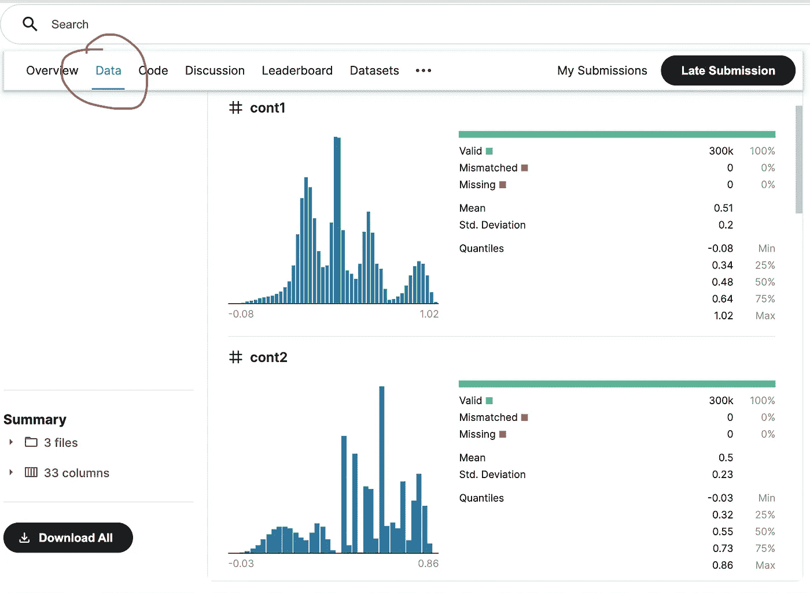

Kaggle 竞赛空间中的数据选项卡。图片是来自 kaggle.com 的截图

> 无需编写任何代码，理解数据集的最快方法是导航到 Data 选项卡。

从这个数据集中可以看出以下三点

1.  该数据集中的所有要素都是连续的
2.  所有特征似乎都经过了[最小-最大归一化](/understand-data-normalization-in-machine-learning-8ff3062101f0)，即最小值接近 0，最大值接近 1。由于特征已经被缩放，这将节省我们一些时间
3.  特征 cont5 的分布非常向左倾斜。这可能有助于检查我们的性能在应用了一个[能量转换(比如 Box-Cox](https://machinelearningmastery.com/how-to-transform-data-to-fit-the-normal-distribution/) 方法)之后是否有所提高

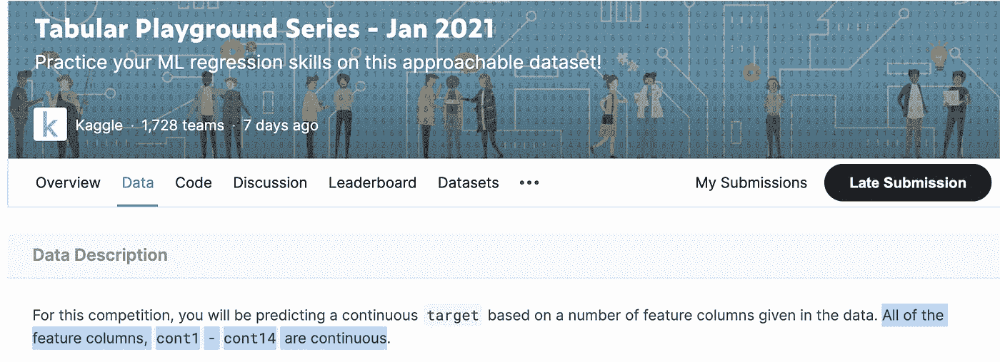

该数据集中的所有要素都是连续的。图片是来自 kaggle.com 的截图

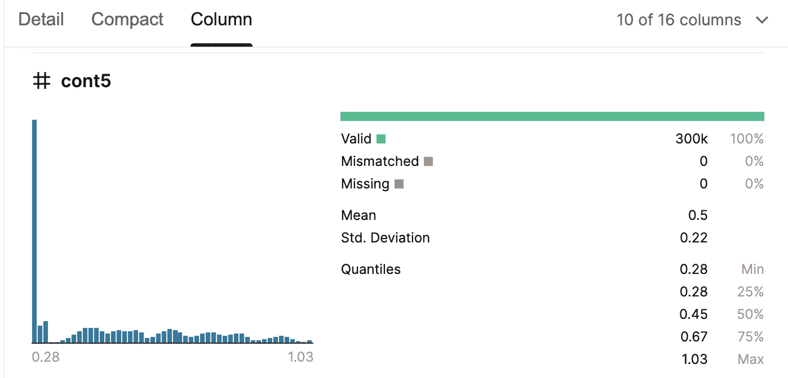

特征 cont5 的分布向左倾斜。图片是来自 kaggle.com 的截图

理解数据集的更全面的方法是执行探索性数据分析(EDA)。有很多令人难以置信的资源，如[这个](/exploratory-data-analysis-in-python-c9a77dfa39ce)、[这个](https://www.analyticsvidhya.com/blog/2020/08/exploratory-data-analysiseda-from-scratch-in-python/)和[这个](https://www.activestate.com/blog/exploratory-data-analysis-using-python/)深入研究这个主题。然而，利用 Kaggle 竞赛中的数据部分来获得对数据集的初步理解的方法，对于像我们这样的初学者来说，即使不是更好，也是同样好的第一步。这是因为数据部分已经包含了非常丰富的数据信息。

# 建议 2:从简单的模型开始

现在我们对数据集有了初步的了解，让我们来训练一个简单的模型。从简单模型开始有以下好处

1.  更简单的模型更容易理解和解释
2.  更简单的模型可以作为很好的基线模型。[点击此处阅读更多关于基准模型的信息](/why-should-you-the-ai-product-manager-care-about-baseline-models-16af0d07b2b3)。当在后期阶段训练更复杂的模型时，我们可以确定相对于基线模型，增加的复杂性层是否会提高准确性
3.  更简单的模型可以让我们省去[超参数](https://en.wikipedia.org/wiki/Hyperparameter_(machine_learning)#:~:text=In%20machine%20learning%2C%20a%20hyperparameter,weights)%20are%20derived%20via%20training.&text=Given%20these%20hyperparameters%2C%20the%20training,the%20parameters%20from%20the%20data.)调整的麻烦，而无需完全理解数据集的细微差别以及模型如何与之交互。更复杂的模型往往包含几个超参数选择。直接进入这些复杂模型的一个大挑战是，它很难(如果不是不可能的话)确定观察到的结果是由糟糕的模型选择还是次优超参数选择引起的

> 更简单的模型更容易理解，并作为良好的基线模型来更好地为自己定位。

以下部分包含两个简单的初步模型的详细信息——决策树和随机森林，在[表格游乐场系列——2021 年 1 月](https://www.kaggle.com/c/tabular-playground-series-jan-2021/discussion/213090)数据集上训练。

## **简单模型#1:决策树**

下面的部分训练了一个[决策树](/a-guide-to-decision-trees-for-machine-learning-and-data-science-fe2607241956)，其停止标准为:最大叶子节点数= 4。它计算误差并可视化树。

```
from sklearn.tree import DecisionTreeRegressor#Creating a Decision tree -- with stopping criteria (max leaves = 4)m = DecisionTreeRegressor(max_leaf_nodes=4)
m.fit(X_train, y_train);#Creating a function to check the root mean squared error of the model (m_rmse)def r_mse(pred,y): 
    return round(math.sqrt(((pred-y)**2).mean()), 4)def m_rmse(m, xs, y): 
    return r_mse(m.predict(xs), y)
```

让我们打印均方根误差

```
print ("training error", m_rmse(m, X_train, y_train))
print ("test error", m_rmse(m, X_test, y_test))
```

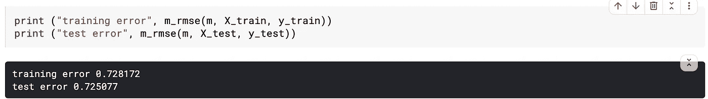

作者图片

训练集上的 RMSE 误差是 0.728172。测试集上的误差是 0.725077。我们可以将此视为基线模型的性能。

让我们将决策树(我们的基线模型)可视化，以了解哪些列/特性是重要的


最大叶节点数= 4 的决策树。作者图片

从上面的树形图可以清楚地看出，cont3、cont2 和 cont7 是最重要的 3 个特性。

## **简单模型#2:随机森林**

现在我们已经训练了一个基线模型，并且在测试集上建立了一个基线性能 0.725077，让我们进入一个稍微复杂一点的模型。在本节中，我们将训练一个[随机森林](/understanding-random-forest-58381e0602d2)模型。随机森林算法是一个集合或一组更小和不太精确的决策树。随机森林模型使用一种称为[打包](https://towardsdatascience.com/tagged/bagging)的技术来组合这些不太准确的决策树(也称为弱学习器)。[fast . ai MOOC 的第 7 课](https://course.fast.ai/videos/?lesson=7)对随机森林算法背后的概念和实现进行了出色而实用的深入探讨。

**在数据集上实现随机森林模型的预期行为:**由于随机森林是更复杂的模型，我们应该期望看到更低的错误，即相对于决策树模型而言，性能有所提高

```
from sklearn.ensemble import RandomForestRegressordef rf(xs, y, n_estimators=40, max_samples=50000,
       max_features='sqrt', min_samples_leaf=5, **kwargs):
    return RandomForestRegressor(n_jobs=-1, n_estimators=n_estimators,
        max_samples=max_samples, max_features=max_features,
        min_samples_leaf=min_samples_leaf, oob_score=True).fit(xs, y)mrf = rf(X_train, y_train)
```

现在让我们打印随机森林模型的均方根误差

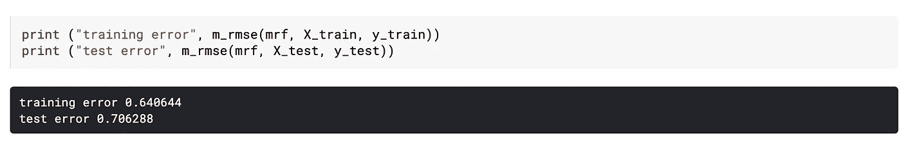

作者图片

**观察到的行为:**我们注意到该模型的测试误差为 0.706288，低于决策树算法的测试误差(0.725077)。因此，我们观察到的行为与预期行为一致。

让我们想象一下随机森林模型认为重要的特性。

```
#visualising the importance of the features def rf_feat_importance(m, df):
    return pd.DataFrame({'cols':df.columns, 'imp':m.feature_importances_}
                       ).sort_values('imp', ascending=False)def plot_fi(fi):
    return fi.plot('cols', 'imp', 'barh', figsize=(12,7), legend=False)plot_fi(fi[:14]);
```

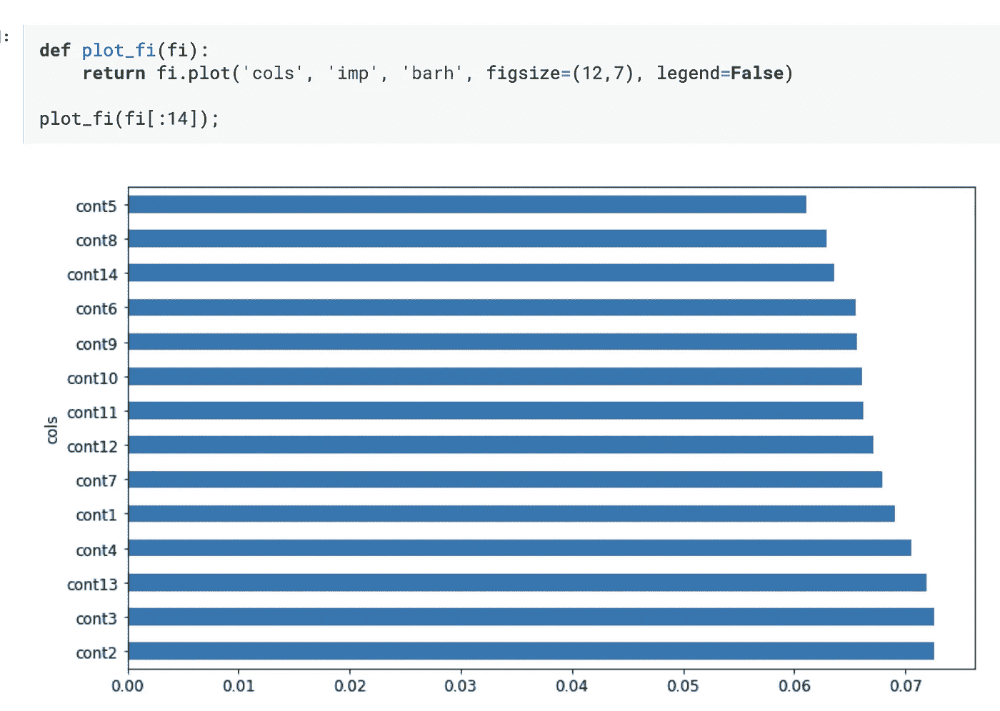

按重要性排序的特征-随机森林算法。作者图片

有趣的是，随机森林和决策树算法一致认为 cont3 和 cont2 是最重要的两个特征。

# 建议三:处处学习，开放

在投入时间了解数据集并训练简单模型后，我们现在准备评估更复杂的模型在我们的数据集上的表现。

参加 Kaggle 竞赛最有收获的一个方面是有机会向其他参与者学习。代码和讨论部分(下面的截屏)提供了可能的解决方案的代码遍历和关于应该遵循什么方法的高级建议。它们是产生新想法的不可思议的资源，这些新想法是关于选择哪些模型以及哪些超参数选择是可用的。

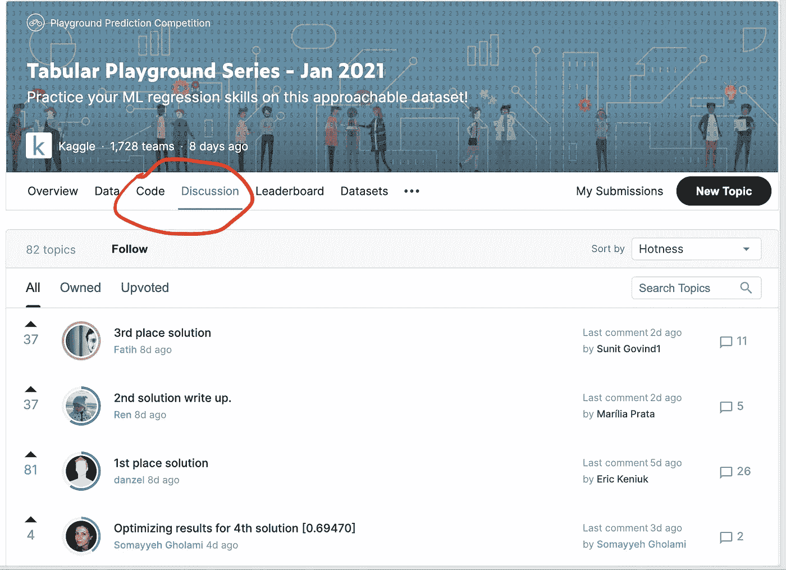

Kaggle 竞赛空间中的代码和讨论部分。图片是来自 kaggle.com 的截图

讨论区的许多帖子都是由经验丰富的 Kagglers 和经验丰富的数据科学家撰写的。因此，阅读这些帖子并尝试解决方案将会给你的时间带来很好的投资回报。我发现非常有帮助的两个帖子是[加布里埃尔·普雷达](https://www.kaggle.com/gpreda)T4 的[提高你排行榜位置的技巧](https://www.kaggle.com/c/tabular-playground-series-jan-2021/discussion/213090)和[高拉夫·拉杰什·萨哈尼](https://www.kaggle.com/gauravsahani)的[用 LightGBM](https://www.kaggle.com/gauravsahani/detailed-eda-with-lightgbm-score-0-698) 详述 eda。后者是一个 Python 笔记本，可以在代码部分找到。它启发我在数据集上尝试 LightGBM 模型。

> Kaggle 竞赛空间中的代码和讨论部分是产生新想法的极好资源，有助于决定接下来要尝试哪些模型

在尝试任何新模式之前，对其工作原理有一个初步的了解是有益的。一个对我很有用的方法是从官方文档开始阅读，直到它不再有意义。在这一点上，我会暂停阅读官方文档，尽可能多地阅读对概念和实现提供良好解释的文章。然后我会回到官方文档来完善我的理解。

现在，我们将在数据集上实现一个 LightGBM 模型。

**预期行为:**由于 LightGBM 模型比我们的基线决策树更复杂，我们应该可以看到通过 RMSE 误差测量的改进性能

```
import lightgbm as lgbLGB = lgb.LGBMRegressor(random_state=33, n_estimators=5000, min_data_per_group=5, boosting_type='gbdt',
 num_leaves=246, max_dept=-1, learning_rate=0.005, subsample_for_bin=200000,
 lambda_l1= 1.07e-05, lambda_l2= 2.05e-06, n_jobs=-1, cat_smooth=1.0, 
 importance_type='split', metric='rmse', min_child_samples=20, min_gain_to_split=0.0, feature_fraction=0.5, 
 bagging_freq=6, min_sum_hessian_in_leaf=0.001, min_data_in_leaf=100, bagging_fraction=0.80)m_LGB = LGB.fit(X_train, y_train)
```

让我们打印 LightGBM 模型的均方根误差

```
print ("training error", m_rmse(m_LGB, X_train, y_train))
print ("test error", m_rmse(m_LGB, X_test, y_test))
```

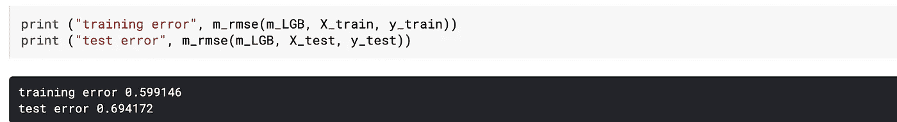

作者图片

**观察到的行为:**我们注意到 LightGBM 模型的测试误差为 0.694172，低于决策树算法的测试误差(0.725077)。因此，我们观察到的行为与预期行为一致。

让我们想象一下 LightGBM 模型认为重要的特性。

```
#view the importance of the featureslgb.plot_importance(m_LGB, ax=None, height=0.2, xlim=None, ylim=None, 
                      title='Feature importance', xlabel='Feature importance', ylabel='Features', 
                      importance_type='split', max_num_features=None, 
                      ignore_zero=True, figsize=None, dpi=None, grid=True, precision=7)
```

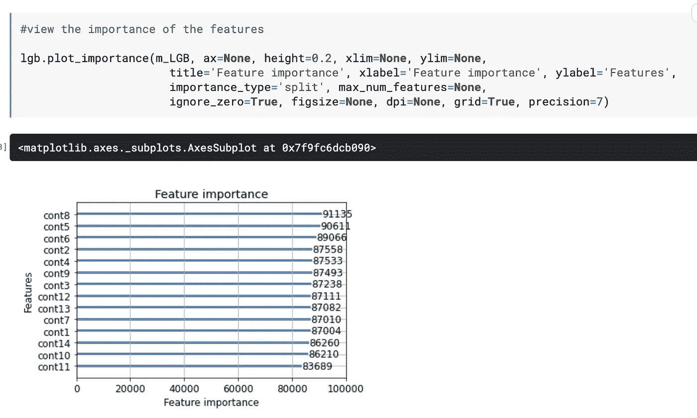

作者图片

有趣的是，cont3 和 cont2 并不属于 LightGBM 模型的最重要特性。

> 这一部分的关键是，通过开放和从不同来源(如 Kaggle 论坛、官方文档和博客帖子)学习，你可以提高你在竞赛排行榜上的排名

# 建议 4:运用科学的方法

数据科学领域在不断发展。实现预期结果的方法可能有无数种。在这种情况下，当可能性无限时，很容易迷失在细节中，看不到主要目标，在我们的情况下，主要目标是提高我们在竞赛排行榜上的排名，同时增加我们的知识。解决这类歧义的一个有用方法是将[科学方法](https://en.wikipedia.org/wiki/Scientific_method#:~:text=The%20scientific%20method%20is%20an,how%20one%20interprets%20the%20observation.)应用到我们的工作中。我们从一个假设开始，对我们的模型进行测试以证明/否定它，得出结论并记录结果。需要注意的重要一点是一次测试一个假设。这将有助于我们更清楚地评估变革的影响。

下一节将进一步阐述这一点。我们将把科学方法应用于一个基于我们对 cont5 列的观察的假设。

## 假设:对特征 cont5 应用变换会提高我们模型的性能吗？

在这篇文章的前面，我们观察到 cont5 特性的分布非常偏向左边。一种可能性是数据的底层分布可能是正常的，但是为了帮助公开它，可能需要转换。

这是 box-cox 方法可能派上用场的一个领域。这是一种数据变换方法，可以执行一系列幂变换，如取观察值的对数或平方根，以使分布更正态。[这是进一步阅读](https://machinelearningmastery.com/how-to-transform-data-to-fit-the-normal-distribution/)关于转换数据以符合正态分布的极好资源。

现在，我们将使用 box-cox 方法转换列 cont5，并将其用作 LightGBM 模型的一个特性。

**预期行为:**由于 Cont5 是 LightGBM 模型中第二重要的列，对其进行转换以使其分布更加正常可能会提高性能。

```
from scipy.stats import boxcoxtrain_df['cont5'] = boxcox(train_df['cont5'], 0)target = train_df.pop('target')X_train, X_test, y_train, y_test = train_test_split(train_df, target, train_size=0.80)#remove the id columns
X_train.pop('id')
X_test.pop('id')import lightgbm as lgbLGB = lgb.LGBMRegressor(random_state=33, n_estimators=5000, min_data_per_group=5, boosting_type='gbdt',
 num_leaves=246, max_dept=-1, learning_rate=0.005, subsample_for_bin=200000,
 lambda_l1= 1.07e-05, lambda_l2= 2.05e-06, n_jobs=-1, cat_smooth=1.0, 
 importance_type='split', metric='rmse', min_child_samples=20, min_gain_to_split=0.0, feature_fraction=0.5, 
 bagging_freq=6, min_sum_hessian_in_leaf=0.001, min_data_in_leaf=100, bagging_fraction=0.80)m_LGB_box_cox = LGB.fit(X_train, y_train)
```

让我们打印模型的均方根误差

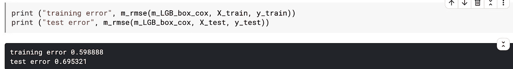

作者图片

变换特征后的误差 cont5 为 0.695321。这略高于未变换的 LightGBM 模型的误差 cont5 (0.694172)。因此，我们可以得出结论，在列 cont5 上使用 box-cox 方法不会提高我们模型的性能。虽然这种方法没有提高我们模型的性能，但我们确实学到了一些有价值的新东西。

> 从这一部分学到的关键是，遵循科学方法将有助于我们保持纪律性，从而增加我们成功的几率。这种方法的关键原则是一次测试一个变化，以便我们可以清楚地评估我们的假设对性能的影响，从而评估我们在排行榜上的位置。

下面是我在比赛过程中跟踪进度的截图。我维护了一个电子表格，其中记录了所有的更改以及模型在训练和测试数据集上的性能。此外，我跟踪了提交后收到的分数。这有助于我保持在正确的轨道上，并清楚地评估什么有效，什么无效。

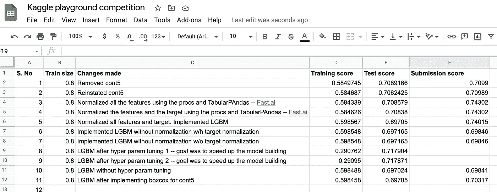

作者图片

我希望这篇文章对你有用。快乐的旅行！

# 代码和确认

你可以在这里查看[的完整代码](https://www.kaggle.com/anandkumarravi/first-kaggle-competition-anand)。

感谢[萨米尔·马德哈万](https://www.linkedin.com/in/samir-madhavan-7b172115/)、[萨普塔里什·达塔](https://www.linkedin.com/in/saptarshi-datta-23235414/)和[达薇亚·约瑟夫](https://www.linkedin.com/in/divyajoseph2017/)的宝贵反馈。

# 与我联系

领英:[https://www.linkedin.com/in/anandkumarravi/](https://www.linkedin.com/in/anandkumarravi/)

GitHub:[https://github.com/Anandravi87](https://github.com/Anandravi87)

推特:[https://twitter.com/Anand_1187](https://twitter.com/Anand_1187)