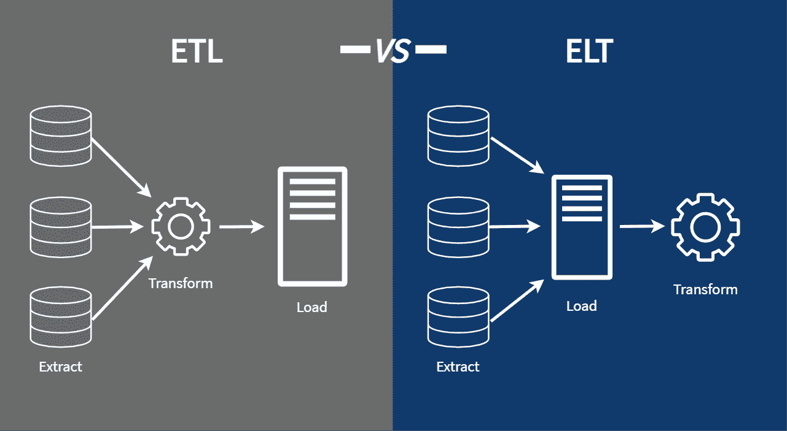
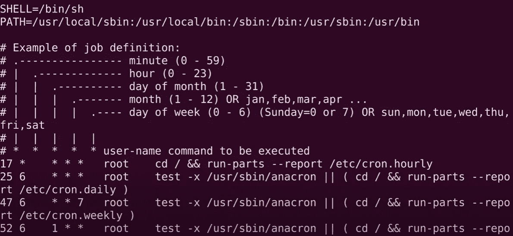
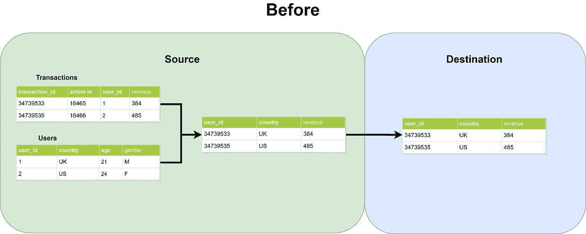
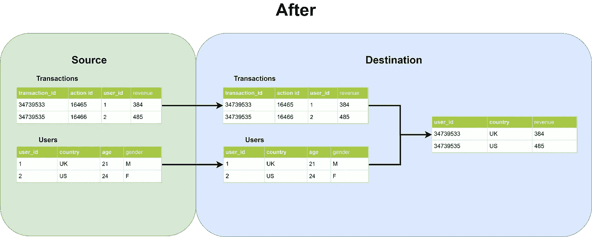
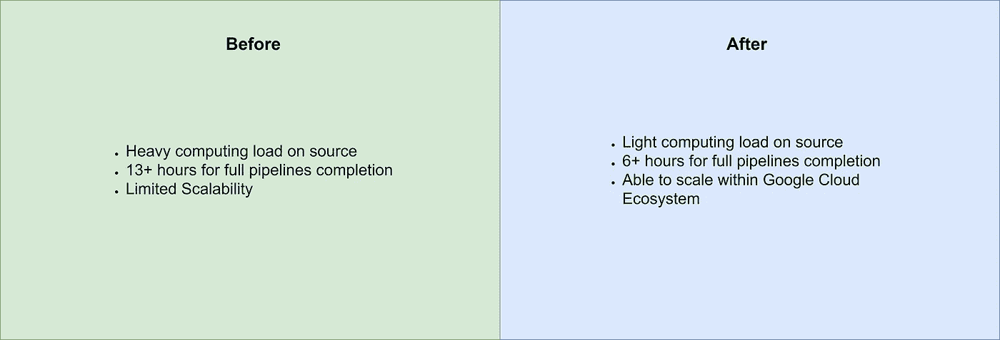

# 我如何将 100 多个 ETL 重新设计到 ELT 数据管道中

> 原文：<https://towardsdatascience.com/how-i-redesigned-over-100-etl-into-elt-data-pipelines-c58d3a3cb3c?source=collection_archive---------1----------------------->

## 提升您的数据管道！



作者图片

> 大家:数据工程师是做什么的？我:我们建造管道。
> 大家:你是说像水管工？

类似的东西，但不是水通过管道流动，**数据通过我们的管道流动。**

数据科学家构建模型，数据分析师向利益相关者传达数据。那么，我们需要数据工程师做什么？

他们不知道，没有数据工程师，模型甚至不会存在。不会有任何数据需要交流。数据工程师建立仓库和管道，让数据在组织中流动。我们把这些点联系起来。

</should-you-become-a-data-engineer-in-2021-4db57b6cce35>  

数据工程师是 2019 年增长最快的工作，**同比增长 50%**，高于数据科学家的工作增长，达**同比 32%**。

因此，我在这里介绍数据工程师的一些日常任务。数据管道只是其中之一。

# ETL/ELT 管道

> ETL —提取、转换、加载
> ELT —提取、加载、转换

这些是什么意思，它们之间有什么不同？

在数据管道世界里，有一个**源**和一个**目的地**。在最简单的形式中，源是数据工程师获取数据的地方，目的地是他们希望数据加载到的地方。

通常情况下，在这两者之间的某个地方需要对数据进行一些处理。这可能是由多种原因造成的，包括但不限于

*   数据存储类型的差异
*   数据的目的
*   数据治理/质量

数据工程师将数据处理称为转换。这是他们施展魔法将各种数据转换成他们想要的形式的地方。

在 **ETL 数据管道**中，数据工程师在将数据加载到目的地之前执行转换。如果表之间存在关系转换，那么这些转换发生在数据源内部。在我的例子中，来源是一个 Postgres 数据库。因此，我们在源中执行关系连接以获得所需的数据，然后将其加载到目标中。

在 **ELT 数据管道**中，数据工程师将数据加载到目的地 raw 中。
然后，它们在目的地内部执行任何关系转换。

在本文中，我们将讨论我是如何将我组织中的 100 多条 ETL 管道转换成 ELT 管道的，我们还将讨论我这样做的原因。

# 我是如何做到的

最初，管道是使用 Linux cron 作业运行的。Cron 作业就像传统的任务调度程序，它们使用 Linux 终端进行初始化。它们是最基本的编排节目的方式，没有任何功能，比如—

*   设置依赖关系
*   设置动态变量
*   建立联系



作者图片

这是第一件要做的事情，因为它引起了太多的问题。我们需要扩大规模。要做到这一点，我们必须建立一个适当的工作流程管理系统。

我们选择了**阿帕奇气流**。我都写在这里了。

</data-engineering-basics-of-apache-airflow-build-your-first-pipeline-eefecb7f1bb9>  

气流最初是由 **Airbnb** 的家伙们创建的，开源的。它也被像 **Twitter** 这样受欢迎的公司用作他们的管道管理系统。你可以阅读上面所有关于气流的好处。

解决这个问题后，我们必须改变提取数据的方式。团队建议**将我们的 ETL 管道重新设计成 ELT 管道。**更多关于我们为什么后来这么做的信息。



作者图片

这是重新设计前的管道示例。我们处理的来源是一个 Postgres 数据库。因此，为了以预期的形式获得数据，我们必须在源数据库中执行连接。

```
Select 
a.user_id,
b.country,
a.revenue
from transactions a 
left join users b on
a.user_id = b.user_id
```

这是在源数据库中运行的查询。当然，我已经将示例简化为最简单的形式，实际查询超过 400 行 SQL。

查询结果保存在一个 CSV 文件中，然后上传到目的地，在我们的例子中是一个 **Google Bigquery 数据库**。这是它在阿帕奇气流中的样子—

这是 ETL 管道的一个简单例子。它按预期工作，但是团队已经意识到将其重新设计成 ELT 管道的**好处**。稍后会详细介绍。



作者图片

这是重新设计后的管道示例。观察桌子是如何被带到目的地**的。在成功提取了所有的表之后，我们在目的地执行关系转换。**

```
--transactions
Select 
*
from transactions --
Select
*
from users
```

这是在源数据库中运行的查询。大多数提取都使用没有任何连接的“Select *”语句**。对于追加作业，我们包括 **where 条件**以正确分离数据。**

类似地，查询结果保存在 CSV 文件中，然后上传到 Google Bigquery 数据库。然后，我们通过**在 Apache Airflow 中设置依赖关系，为转换作业创建了一个单独的 dag。**这是为了确保在运行转换作业之前，所有提取作业都已完成。

我们使用**气流传感器设置相关性。**你可以在这里读到它们。

</data-engineering-how-to-set-dependencies-between-data-pipelines-in-apache-airflow-using-sensors-fc34cfa55fba>  

# 我为什么这么做


马库斯·温克勒在 [Unsplash](https://unsplash.com?utm_source=medium&utm_medium=referral) 上的照片

现在你已经理解了我是如何做到的，我们继续讨论**为什么** —
为什么我们要将所有的 ETL 重新写入 ELT 管道？

# 费用

运行我们的旧管道耗费了我们团队的资源，特别是时间、精力和金钱。

为了理解事情的成本方面，你必须理解我们的源数据库(Postgres)是在 2008 年建立的一台古老的机器。它是在内部托管的。它还运行旧版本的 Postgres，这使得事情变得更加复杂。

直到最近几年，组织才意识到**需要**用于数据科学家和分析师的集中式数据仓库。这是他们开始在 cron jobs 上建立旧管道的时候。随着作业数量的增加，它耗尽了机器上的资源。

以前的数据分析师编写的 SQL 连接也随处可见。在一些管道中，单个查询中有超过 **20 个连接**，我们接近 100 多个管道。我们的任务在午夜开始运行，通常在下午 1-2 点结束，这相当于大约 **12 个多小时，**这是绝对不能接受的。

对于那些不知道的人来说，SQL 连接是需要运行的最耗费资源的命令之一。随着连接数量的增加，查询的运行时间会成倍增加。



作者图片

自从我们迁移到 Google Cloud，这个团队就明白 Google Bigquery 在计算 SQL 查询方面的速度非常快。你可以在这里 阅读所有关于它的 [**。**](https://cloud.google.com/blog/products/bigquery/anatomy-of-a-bigquery-query)

<https://cloud.google.com/blog/products/bigquery/anatomy-of-a-bigquery-query>  

因此，关键是在源代码中只运行简单的“Select *”语句，并在 Google Cloud 上执行所有的连接。

这使得我们的数据管道的效率和速度提高了一倍多。

# 可量测性


昆腾·德格拉夫在 [Unsplash](https://unsplash.com?utm_source=medium&utm_medium=referral) 上的照片

随着企业规模的扩大，他们的工具和技术也在扩大。
通过迁移到谷歌云，我们可以轻松扩展我们的机器和管道，而不用太担心。

Google Cloud 利用**云监控**，这是一个收集 Google Cloud 技术(如 Google Cloud Composer、Dataflow、Bigquery 等)的指标、事件和元数据的工具。您可以监控各种数据点，包括但不限于—

*   虚拟机的成本
*   谷歌大查询中每个查询的成本
*   Google Bigquery 中运行的每个查询的大小
*   数据管道的持续时间

这让我们的监控变得轻而易举。因此，通过在 Google Bigquery 上执行所有转换，我们能够在扩展时准确地监控查询大小、持续时间和成本。

即使我们**增加**我们的机器大小、数据仓库、数据管道等，我们也完全**了解随之而来的成本和收益**，并在需要时完全控制其开启和关闭。

这已经并将会使我们免除许多令人头痛的事情。

# 结论


费尔南多·巴西在 [Unsplash](https://unsplash.com?utm_source=medium&utm_medium=referral) 上拍摄的照片

如果你一直读到这里，你一定对数据情有独钟。
应该的！

我们已经做了 ETL 和 ELT。谁知道在未来我们会建造什么样的管道？

在这篇文章中，我们谈到了—

*   什么是 ELT/ETL 数据管道？
*   我如何重新设计 ETL 来实现 ELT 管道
*   我为什么这么做

像往常一样，我引用一句话作为结束。

> 数据是新的科学。大数据掌握着答案—彼得·盖尔辛格

# 订阅我的时事通讯，保持联系。

你也可以通过 [**我的链接**](https://nickefy.medium.com/membership) 注册一个中等会员来支持我。你将能够从我和其他不可思议的作家那里读到无限量的故事！

我正在撰写更多关于数据行业的故事、文章和指南。你绝对可以期待更多这样的帖子。在此期间，你可以随时查看我的其他 [**文章**](https://nickefy.medium.com/) 来暂时填补你对数据的饥渴。

***感谢*** *的阅读！如果你想和我联系，请随时通过 nickmydata@gmail.com 联系我或者我的* [*LinkedIn 个人资料*](https://www.linkedin.com/in/nickefy/) *。你也可以在我的*[*Github*](https://github.com/nickefy)*中查看之前写的代码。*