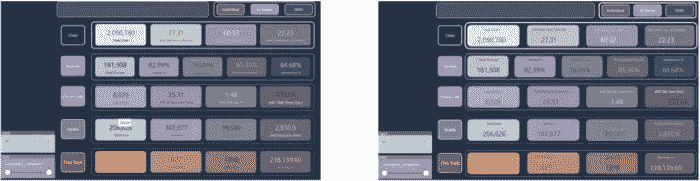
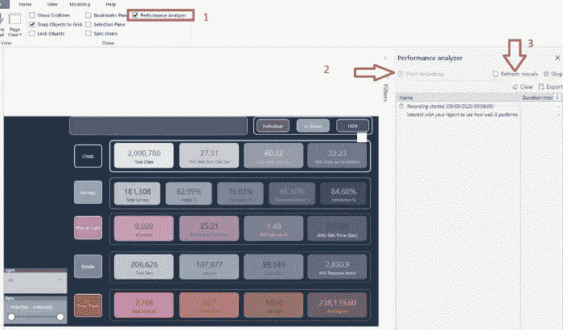
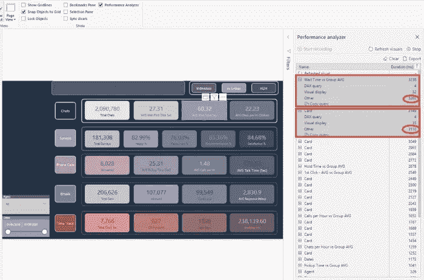
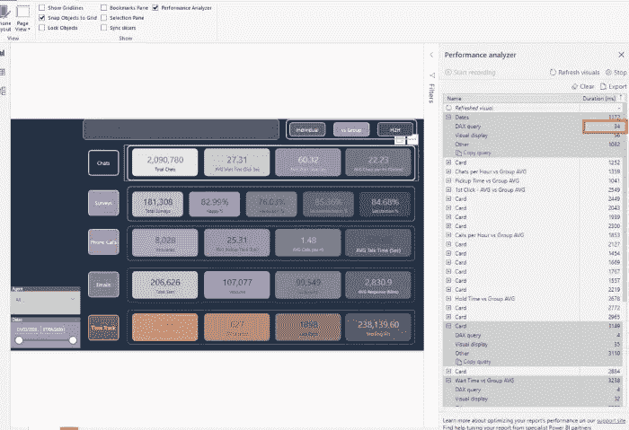
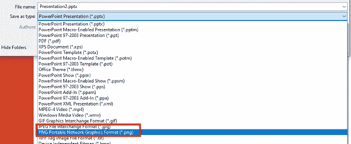
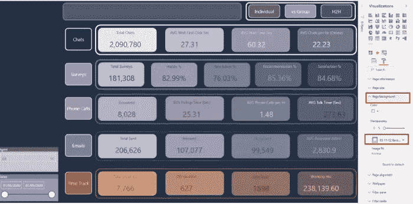
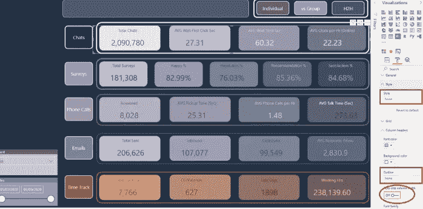
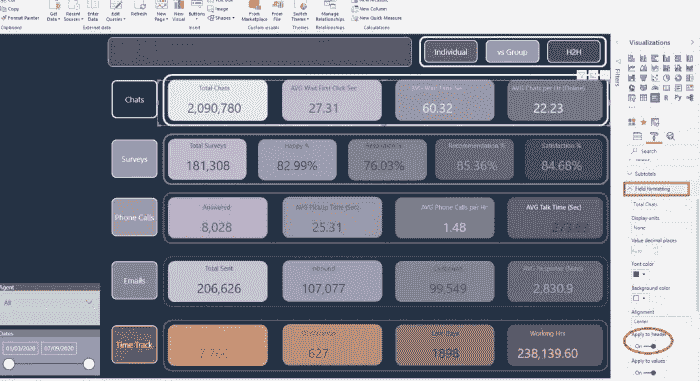
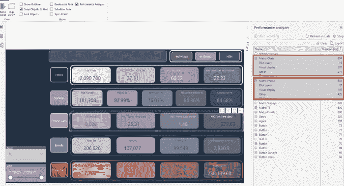

# 我如何加快我的功率 BI 报告 5 倍

> 原文：<https://towardsdatascience.com/how-i-speed-up-my-power-bi-report-5x-b9de603e8df?source=collection_archive---------11----------------------->

## 你的 Power BI 报告很慢？检查如何通过应用一些简单的技巧来显著加快速度，同时保留原始的报告外观

你能看出下面两份报告的不同之处吗？

作者图片

是啊，我也不能！

但是，这两份报告有很大的不同！如果我告诉你右边的报告比左边的快 5 倍呢？你会相信我吗？没有吗？然后继续读下去，我会告诉你这怎么可能…

# 这一切是如何开始的…

我正在读 Chris Hamill 的一篇很棒的博文，他解释了如何在保持相同视觉效果的同时替换报告中的一些视觉效果。因此，我立即尝试将类似的技术应用到我之前创建的一个报告中。

您在上图左侧看到的报告页面显示了一些与客户支持中心绩效相关的数字。有一大堆与聊天、调查、电话、电子邮件等相关的指标。

然而，这个报告页面需要大量的时间来渲染和加载。罪魁祸首是大量的卡牌视觉效果(总共 21 张)。由于 Power BI 背后的公式引擎是单线程工作的，正如在[这篇文章](/how-to-reduce-your-power-bi-model-size-by-90-76d7c4377f2d)中详细解释的那样，对于每一个卡片视觉，一个新的查询正在生成，并且直到前一个查询完成后才能执行！

性能分析器捕获的时间最好地反映了这一点。Performance Analyzer 是 Power BI 中一个非常强大的内置特性，它让您能够很好地了解幕后发生的事情。您还可以使用外部工具来获取报告指标，比如 DAX Studio。

让我们打开性能分析器，看看在原始报告版本中到底发生了什么:

作者图片

这个报告页面花了 3 秒多的时间来渲染！对于不太大的数据量来说，这是不可接受的。让我们按总时间降序排列各个计时，看看是什么使我们的报告变慢:

作者图片

您可以看到，我们的两个显卡分别以 3238 和 3149 毫秒保持领先。然而，一旦我们展开来看这些数字的细节，我们可以注意到视觉的“其他”部分几乎占了总时间的 99%！

***那个“其他”甚至是什么意思？！***

“Other”显示了特定的 visual 在执行该 visual 的 DAX 查询之前必须在执行队列中等待多长时间！因为我的报告包含 30 多个视觉效果，其中 21 个是卡片视觉效果，所以其中一些必须等待其他人完成才能执行任何操作。

因此，DAX 查询在这里不是问题，正如您所看到的，这两个视图执行 DAX 查询只花了 4 毫秒。即使我按 DAX 查询对时间排序，我也能看到最长的 DAX 查询只用了 34 毫秒:

作者图片

# 优化报告

关注 Power BI 社区中所有伟大专家的博客并尽可能多地向他们学习是多么重要，这一点我怎么强调都不为过。

克里斯·哈米尔的博客给了我灵感，让我试图优化我的原始报告。出发点是试图减少我的报告页面上的视觉效果。因为我确认 DAX 查询不是问题，所以我的想法是减少“其他”计时。

***用形状创建背景***

我做的第一件事是从报告中删除我所有的形状(矩形等)。).你如何实现这一点？您可以简单地在 PowerPoint 中创建您的背景布局，并将其保存为图像！

作者图片

这是我在 PowerPoint 中创建的布局，用来“模仿”原始页面的外观。将其存储为图像:

作者图片

并将此图片作为您报告的背景图片！就这么简单！

作者图片

# 魔法来了…

现在最有趣的部分来了…我们如何替换现有的卡片视觉效果，同时保持原始版本的“外观和感觉”?

这就是克里斯的戏法登上舞台的地方。我只是把我的计算放在矩阵视觉中，用一个单独的矩阵视觉代替单独的卡片视觉。并且，经过一些调整和格式化，得到了(几乎)相同的报告外观！

您应该做的第一件事是将样式设置为“无”，删除列标题和行标题的轮廓，并关闭自动调整列宽:

作者图片

“格式”窗格下的“字段格式”属性中需要关键格式，您应该在其中设置适当的颜色、字体、字体大小等。按照原始报告的模式。

作者图片

您也不应该忘记拉伸单个矩阵字段，以取代它们在“卡片”形状中的位置。

# 系好安全带！

现在，让我们检查一下最重要的事情——不要忘记，我们开始整个过程是为了提高我们报告的性能。

因此，我将再次打开 Performance Analyzer，现在打开我修改后的报告，并检查指标:

作者图片

哦，我的天啊！我的报告中两个最慢的视觉效果现在需要大约 0.6 秒才能显示出来！ ***相比原版的 3 秒，快了 5 倍！！！***

现在，你可以注意到“其他”计时从大约。3000 ms 到 300 以下！最后，我们的报告中的视觉效果的数量通过将它们移动到用 PowerPoint 创建的背景图像中而显著减少。

但是，这里的关键接管是:我们实际上没有改变报告的原始外观——我们只是显著地改进了底层流程！因此，对于我们的用户来说，一切都是一样的，只是他们现在会更快地看到数字！您知道当您的用户更快地获得结果时意味着什么——“用户会喜欢您”:)

# 结论

这里有两个主要的收购:

*   如果您的报告运行缓慢，有多种方法可以检查原因:使用 Performance Analyzer 或 DAX Studio 来确定是否可以应用一些额外的步骤来改进报告
*   关注 Power BI 专家的博客和视频。那里有太多的东西要学，你总能找到自己作品的灵感

最后一点:如果你需要对垂直放置的卡片视觉效果进行类似的改进， [Chris Hamill 的博客](https://alluringbi.com/2020/08/06/consolidating-report-elements-for-improved-performance/)也解释了如何实现这一点。

感谢阅读！

[成为会员，阅读媒体上的每一个故事！](https://datamozart.medium.com/membership)