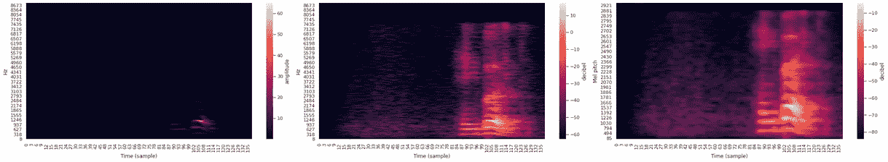
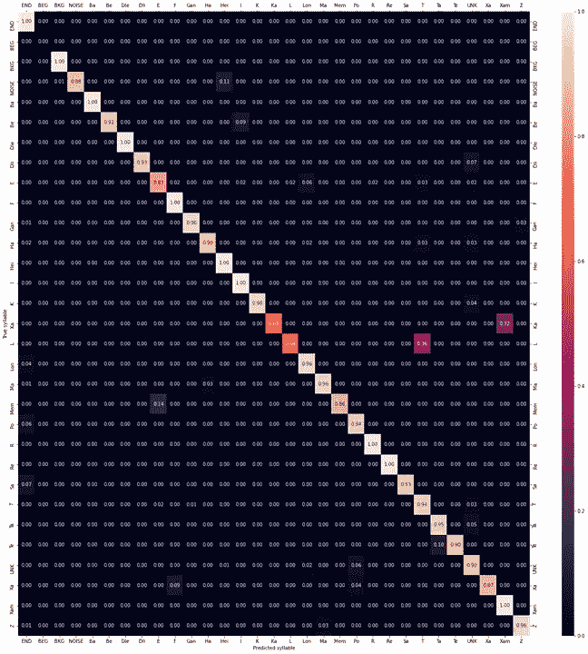

# 我如何教我的空调一些希伯来语

> 原文：<https://towardsdatascience.com/how-i-taught-my-air-conditioner-some-hebrew-81192e11065?source=collection_archive---------14----------------------->

## [思想和理论](https://towardsdatascience.com/tagged/thoughts-and-theory)

## 故事时间-不是你通常的“如何做”的文章

谁能想到空调能学会语言？(图片:pixabay.com)

这是我在教另一个神经网络如何绘画时的一个附带项目。我刚刚收到一个闪亮的新智能家居传感器作为礼物，承诺它应该在我下班或从健身房回来时打开我家的空调。

这是一个很棒的玩具，有一个非常时尚的应用程序可以从我的手机上控制它。但是我发现主要的缺点是我总是忘记在开车回家之前按下“开”按钮。作为一个懒惰的人，我从来不会在高速公路边停下来按那个按钮。所以我就在想:“如果我只是教那个空调识别我的语音呢”？

Sensibo IoT 传感器可以让你从手机上切换与空调有关的任何事情。(图片:截图，在合理使用下)

通过查阅这些 Sensibo 家伙的公开文档，我能够大致了解他们的传感器是如何工作的。当用户点击应用程序中的按钮时，手机会向远处的 Sensibo 服务器发送一个所谓的 HTTP 请求。当你想看最新的 Instagram 或在 YouTube 上发表新评论时，你的浏览器也会为你发送同样的信息。然后，服务器通过第二个 HTTP 请求命令传感器向空调发送匹配的命令，这是通过使用与遥控器中相同的红外线发射器来完成的。以上所有这些意味着我只需要编写自己的“按钮点击”应用程序，而不是等待我的手指点击，它会听我的声音来切换空调。

我开始设计一个能让我做到这一点的系统。过去一年练习机器学习让我明白，我要训练一个自己的模型。但我也需要手机上的那个模型。我不打算付钱给任何人把它存储在云中，并收取高昂的费用来访问它，所以投票很快就投给了本地部署的模型。问题是，我的手机是一个 5 年的老古董，即使在我买它的时候，它的硬件也被认为是薄弱的一面。所有那些在巨型 GPU 上运行的具有数十亿参数的新的花哨模型在这里都不会工作。我需要简单的东西。所以我开始阅读所有我能找到的文献。

事实证明，很大比例的语音识别模型会听用户说话，并尝试将语音分类为完整的单词。但是任何一种语言的单词量总是一个很大的数字。为什么不用更小的语音单位呢？我在想音素。音位是构成人类语言的最基本单位之一。每一个独特的声音都被认为是一个音素，不管你有多少种拼写方法。例如，英语估计有 171，000 个单词，但只有 42 个音素。

为了从这一点上跟随我，你需要知道一些数学知识。最后一段的意思是，如果一个模型想要对一个英语单词进行分类，输出层(分类层)需要至少 171，000 个不同的输出。想想权重矩阵的大小和输出向量的维数。如果用同样的模型来分类音素，这个数字会减少到 42。记住，简单的矩阵乘法的时间复杂度是 O(n3)，想想音素分类器比单词分类器快多少。

接下来:似乎很多处理语音的模型更喜欢从频谱图中学习，而不是从原始音频中学习。最近有一些成功的模型在没有光谱图的情况下也能工作(例如，查看脸书的 wav2vec 2.0)，但这些仍然是模型大小和推理时间的顶级优势。如果用户在空调做任何事情之前等了太久，他只会停好车，然后点击正常按钮。

本质上，频谱图是原始音频信号上的变换函数的结果，该变换函数创建矩阵，其中每个列向量表示原始信号的特定帧内的离散频率仓的幅度。如果上面这段话对你来说是中文(直到最近对我来说是)，你不必太担心。当我们说话时，我们的声带振动空气产生声音。手机麦克风将这些振动转换为电振幅读数(振幅=我们刚才说话的声音有多大)，并将其存储在一个数组中。创建一个光谱图将阵列转换成图像。为什么这对我们有好处？原始音频只给我们振幅，而频谱图也给我们信号的频率。更好的是——由于光谱图是矩阵，它们也可以显示为图像。这意味着我们可以使用图像处理领域的方法来分析我们的声音。整洁！

同一声谱图的三种不同振幅和音高的再现(图片由作者提供)

当涉及到机器学习时，这些方法中最重要的一种叫做卷积层。用于编写模型的现代编程库将它们分解成层。层就像乐高积木模型一样。卷积图层使用同名的数学运算(不完全相同，但很相似)来分析影像数据。它们的力量来自一种叫做“不变性”的数学属性。卷积对于图像特征的位置是不变的。这意味着无论我们试图预测或分析什么样的图像，它在图像中的位置对最终结果的影响都很小。卷积层可以找到一只狗，无论它位于图像中的什么位置。在我们的例子中，它可以找到一个音素，不管它在声谱图中的位置。

这对我们有好处，因为我们会找到所有的音素，但不是最好的，因为我们不知道它们的顺序。卷积对位置的不变性意味着它们不能有效地确定音素顺序，这使得“poultry”(pl-tri)和“triple”(tri-pl)可以有效地互换。为了克服这一点，我们用一种叫做“递归神经网络”的东西对卷积输出进行序列建模。递归神经网络(RNNs)通常要么读取一系列输入，要么产生一系列输出(有时两者都有)。它们的优势来自一个简洁的设计特征，即先前的输入影响下一个输出。这与标准神经网络形成对比，在标准神经网络中，每个输入独立于序列的其余部分。这一特点使他们在过去 35 年的研究中非常突出，显示出非常好的结果。

最近的研究试图将两者结合起来。当应用于这个项目时，它的工作方式如下:我们获取卷积层的输出，它是一个与输入频谱图维数相同的矩阵，并将其拆分为一系列列向量。每个列向量按顺序被馈送到 RNN 层，该层应该使用它们来以正确的顺序输出音素。结合卷积层和递归层的模型被称为卷积递归神经网络(CRNNs)。

还有其他一些构建模块用于构建模型，即注意模块、序列间 RNNs 和门控递归单元(GRUs)，但这些实际上只是描述上述组件的更好实现的术语。如果你真的对它们感兴趣，你可以谷歌一下这些术语，这可能会为你提供大量的资源。这也是分享完整模型的地方，对于那些技术导向的人来说，可以通过以下链接获得一个 [Google Collaboratory 笔记本](https://colab.research.google.com/drive/1FDePY_Vtc1A5FfQxNsrvzJwvg-Np35Z8):

对于那些没有打开 Colab 笔记本链接的人来说，这是模型的层图。(图片由作者提供)

既然我们已经设计了模型，我们需要训练它。问题是，希伯来语没有太多公开的语音数据。这就是音素再次派上用场的地方:即使在一个小的语音数据集中，我们将一种给定语言的每个单词记录一次，整个音素集将重复一百次。事实上，我们也许可以用一个足够小的数据集来工作，我们可以自己创建。

三天来，我在房子里走来走去，录下自己重复同样的语音命令，让周围的人都抓狂。对于我的研究来说，这已经足够了，尽管对于任何严肃的项目，你肯定希望一些朋友添加他们自己的录音(这有助于模型推广到未知的声音)。这产生了大约 45 分钟的音频，我按照发音(同一个文件中的相同单词)进行了分组，并相应地进行了标记。然后，我编写了一些代码，从文件中提取语音命令，将它们转换为频谱图，并将其分组为训练集和测试集。当添加一些背景噪声的频谱图(以教导模型将语音与静音分开)时，这产生了大约 3450 个用于训练的频谱图。如果你以前训练过一个模型，你会知道这不是很多数据。

然后是训练。我尝试了许多我认为很酷的增强，但最终只是降低了模型的准确率。最后，我只是在未扩充的数据集上训练了 1200 个时期，只花了不到半个小时。这意味着我可以快速尝试新的配置、数据集和超参数，并检查哪些最适合我。一旦我选择了我最喜欢的，我就计算科学家用来检查他们的模型是否健康的所有指标数据，一旦指标给我开了绿灯，我就开始编写移动应用程序。

检查指标是否正常对于模型的健康很重要。在这张图片中:一个称为混淆矩阵的度量，显示了模型在测试集中犯最多错误的地方。理想的混淆矩阵是全黑的，除了主对角线是全白的。(图片由作者提供)

如果你记得从这篇文章开始，我的手机是一个机器人。这意味着应用程序需要用 Java(或 Kotlin)编写。问题是，几乎整个数据科学生态系统都是围绕 Python 构建的。模型是用 python 写的，预处理管道是用 Python 写的，科学编程方法和线性代数例程是用 C 写的，带有 Python 包装器，所有的东西都是用 Python 写的——而这些在 Java 中都没有。

我不得不花数周时间从头开始写所有的东西。大多数程序员只会在 GitHub 或 Maven central 中搜寻别人编写的包和库。但是从我的经验来看，它们从来没有像你自己的代码那样运行得那么快，那么无缝。

我写的应用程序实际上只是一个语音激活的按钮应用程序。它通过手机的麦克风收听，检测语音，将其转换为声谱图，并通过模型转发。如果输出是可理解的，一个适当的 HTTP 请求将被发送到 Sensibo 服务器，然后激活我的物联网传感器，就像他们自己的应用程序一样。

在对本文描述的整个过程进行了大量的微调和一些技巧之后，我成功地将语音转换为音素的时间减少到了 1810 毫秒以下。在较新的手机(不是我的古董设备)上，预测时间要好得多(通常不到 1 秒)，这对任何实际需要来说都绰绰有余。

所有的语音处理都是在本地进行的，这与普通的语音识别助手不同，后者会将你的声音发送到服务器并等待回答。而且真的管用！助手们从来不擅长识别我的声音，现在我终于有了一个专门为我调整的应用程序，用我的母语。最后，检查 APK 的细节(这是每个 Android 应用程序的文件扩展名)，结果整个东西只有 35 MB 重，其中模型只有 1217 KB。多酷啊。

最终 APK 的文件组成。(图片由作者提供)

我的项目绝对只是一个展示，而不是一个商业化的产品。我认为在这个领域做一些进一步的研究会很好，因为我仍然有一些公开的问题想要回答。模型的伸缩性如何？你能教它多少不同的命令？一旦我们增加更多的扬声器，对准确度会有什么影响？还可以应用哪些巧妙的技巧来减少模型的内存和磁盘空间需求？有没有任何数据扩充可以用于这种模型，而不会显著损害实时准确率？在准确度损失太大而无法进行正确的语音识别之前，我们可以将训练集和测试集的大小减少多少？

许多问题要回答，还有许多工作要做。但是在过去的几个月里，和我的朋友开玩笑真的很有趣，我正忙着教我的空调说希伯来语:)

来自 Android 应用程序的截图(图片由作者提供)

欢迎在下面的评论中问我任何问题。如果你对所有无聊的细节感兴趣，实际上有一篇我写的[研究论文](https://arxiv.org/abs/2103.13997)和[附带代码](https://github.com/yonatankarimish/YonaVox)，你可以在那里查看。当然，如果你读到这里，感谢你阅读我的故事！