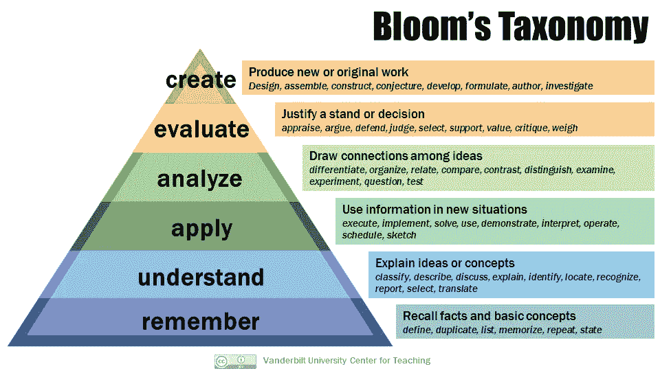

# 我是如何过渡到数据科学的&在一次数据科学职位面试中获得了纽约时报、Capital One、Linkedin、Twitter、脸书、埃森哲、政治和其他人的关注。

> 原文：<https://towardsdatascience.com/how-i-transitioned-into-data-science-got-the-attention-of-the-ny-times-capital-one-linkedin-912d58aafec3?source=collection_archive---------4----------------------->

## [办公时间](https://towardsdatascience.com/tagged/office-hours)

在 [Unsplash](https://unsplash.com?utm_source=medium&utm_medium=referral) 上由[Christina @ wocintechchat.com](https://unsplash.com/@wocintechchat?utm_source=medium&utm_medium=referral)拍摄的照片

在我上面提到的公司中，我和每家公司的招聘人员都进行了交谈，其中一半的公司我进行了编码练习，这意味着我和招聘经理进行了面试，还有一些公司进入了最后一轮面试。在获得数据科学硕士学位后，在所有这些面试之后，我得到了两份工作邀请，并获得了大幅加薪。自从我作为 Python 初学者在 [*上写了我的第一篇中型博客文章以来，已经过去了 3.5 年，我从哪里开始*](https://medium.com/@monipip3/as-a-python-beginner-where-do-i-begin-ba077a827c99) *？尽管我知道我的学习永远不会停止，有时我觉得我还有很多要走，但回头看看我在过去的 3.5 年里走了多远还是很好的。我决定写一写过去几年的事情，以举例说明我是如何从营销职业过渡到数据科学的。*

当你阅读这篇文章时，请记住这是我的旅程，不是每个人看起来都一样，但希望这将帮助任何试图向数据科学过渡的人。你不必做我做的每一件事，但我希望这有助于描绘一幅画面，或激励你做一些能帮助你脱颖而出的事情。我将坚持两个主题，而不是步骤:**可信度和曝光度**。他们也可以按顺序进行，因为我发现，一旦你建立了一些信誉，你就更有信心建立关系网，并从那里开始创造(甚至被要求这样做)一些曝光。

**可信度**

人们会雇用你，要么是因为你已经完成了类似的任务，要么是因为你有能力和理解力快速学习完成规定的任务。在我的职业生涯中，有几次我被聘用到一个我从未做过的领域工作，但由于我的分析思维和快速学习能力，我得到了信任。但是，有一些经验会让你脱颖而出。我说的不是在一些荒谬的职位描述中看到的一些入门级职位所需的 5-10 年经验。如果你能展示出你有能力完成这些任务，即使你需要一些指导或脱离以前的例子，这对公司来说是非常有吸引力的。然而，有些公司需要的不仅仅是这些。在数据科学中，我们应该在建立一些可信度之后才肩负起解释、编码和咨询的责任，如果不是的话就叫 [*与统计数字*](https://www.amazon.com/How-Lie-Statistics-Darrell-Huff/dp/0393310728) (这是一本书)。数据科学角色旨在帮助解决复杂的问题，这些问题有时(如果不是一直)会对公司及其客户产生一些财务影响，而我们这些数据科学家有责任确保我们向公司和数据本身提出正确的问题。

我做了以下几件事来建立一些可信度:

*   编码训练营:我在 2018 年的大会上做了一个数据科学训练营，我所在的创业公司同意支付一半的费用。我认为这激发了他们开始他们的职业发展预算，因为在他们为自己的职业发展提供 1000 美元后不久。如果你的公司能为此买单，那就太好了！我知道不是每个人都有能力自己支付，特别是在开始的时候，学生贷款是我们国家的一种疾病……这就引出了我的第二点，如果你有能力的话:
*   一些课程作业，甚至可能是文凭。我今年完成了数据科学硕士学位，这对建立信誉和建立关系网有很大帮助。如果你负担不起重返学校的费用，我会在社区大学上一些课，或者在 Coursera 或 Udemy 上一些课程，这些课程更便宜，更偏远，而且可以自定进度。钱可能是一个障碍，但你必须利用你所拥有的，图书馆的书是免费的。在学校，他们会教你你编写的模型背后的理论和数学，而我发现这些在新兵训练营里是没有的。显然，新兵训练营可以更短，更便宜，你必须投入更多的时间去读研。最后，如果你知道模型背后的数学，你可以很容易地解释为什么使用数学来展示支持向量机可以处理数据中的异常值，而逻辑回归却不能。这就是我回到学校的原因，我想了解黑匣子在做什么，并能够评估输出，而不是猜测为什么 KNN 在较小的数据和大量 K 邻居的情况下表现如此糟糕，因为维数灾难。或者为什么线性回归是一个非常有偏差的模型，我应该在大多数情况下用它来进行推断而不是预测。
*   认证。我是 AWS 机器学习认证的。在公司，我现在他们给人们一点小奖励，并支付参加认证考试的费用。
*   一份书面记录。或者在这种情况下是数字文件记录。我三年前开始写作，我不像我的数据科学朋友 [Nicole 那样经常发表文章，并且在媒体上有超过 1K 的追随者](https://nicolejaneway.medium.com/)。然而，在上面提到的其中一家公司的一次面试中，招聘经理说他读了我关于评估 NLG 推文的[马尔可夫模型与 GPT-2 模型的博文，他们很高兴能采访我。这不是一个采访，但也展示了如何写在媒体上让许多人找到你的工作，甚至通过谷歌搜索。当我使用 Google Sheets API](/david-and-goliath-markov-model-vs-gpt-2-model-18bbb7cde0c9) 时，一位 Google 产品经理在阅读了我的一篇[早期博客文章后，想和我谈谈。现在，在写了几篇文章后，与其他文章相比并不多，但我有几篇文章定期从谷歌获得 SEO 流量，并有超过 5000 的浏览量。](https://medium.com/@monipip3/take-your-job-to-the-next-level-with-python-google-sheets-d18a39b815ab)
*   创造。我记得在阿里·斯皮特尔的博客中的一篇博文上看到了布鲁姆的分类学链接。她是我尊敬的人，也是我学习的最佳参考。就像在布鲁姆的分类法中，她应用了许多更高的支柱来达到知识。她不断地创造，这是学习的最高形式。当我在纠结一个新概念的时候，我会努力记住这个框架。在研究生院，我会做笔记，为金字塔底部的考试制作抽认卡，但是我的项目和交付成果帮助我进入了金字塔的中间。有时我会创造一些东西来展示我对手头问题的理解程度。无论是一篇研究论文，一个编码笔记本，甚至是建立一个模型并评估它，都帮助我获得了关于我的领域的知识。我强烈推荐在你的 Github 上展示你创造甚至评估的东西。我有几个项目和代码，但我在 2021 年剩下的时间里的主要目标是有几个带有适当文档和可再现性的编码项目。

范德比尔特大学教学中心的照片[https://CFT . Vanderbilt . edu/guides-sub-pages/blooms-taxonomy/](https://cft.vanderbilt.edu/guides-sub-pages/blooms-taxonomy/)

*   Linkedin 个人资料上的关键词。显然，你不应该在 Linkedin 上谎报你的技能，但你必须聪明地选择词汇。在阅读了一些工作描述后，你可能会有一个想法，如果你试图区分自己是数据科学家还是数据工程师，你会使用像建模评估还是数据管道这样的东西。作为一名数据科学家，你可能被期望做一些数据工程，但是如果你想要专注于数据科学的角色，你希望使用比 ETL 更多的数据科学关键词。参见我在 [*上的帖子，你应该在数据科学面试中问他们的问题*](/questions-you-should-ask-them-in-a-data-science-interview-1288c754ca51) 才能知道区别。随着数据科学行业开始发展，一些角色，如机器学习工程师与数据科学家重叠。特别是如果一个公司使用 Auto ML，他们可能只需要一个懂一点统计学和数学的软件工程师来做数据科学。

一旦我开始从我投入的工作中，从阅读文章、书籍和上学中，对自己的可信度有了一点信心；我准备开始做一些曝光。

*   口语/教学。*古训，谓那些不能的人；“，*教显然是错误的。为了教会你必须知道你在做什么。没有人指望你成为任何方面的专家，但是如果你能教别人你所学的东西，不仅能巩固知识，还能帮助缓解骗子综合症。我记得当我学习所有不同的 Python 或 R 包时，如使用 Pandas 或 DPLYR 进行数据挖掘和转换，或使用 Matplotlib/Seaborn/gg plot/Plotly 进行可视化(有如此多的数据 viz 库和现在的交互式仪表板，如 Bokeh、Dash 和 Shiny)，web 抓取(Beautiful Soup 或 Rvest)，这一切都感觉势不可挡。为了加强我的学习，我会立即报名参加一个编写 Python 代码的女性聚会，并自愿去教书。这包括创建一个 PowerPoint 和代码，让其他人亲自跟随和调试。我还必须用语言引导人们。这对我的[冒名顶替综合症](https://medium.com/@monipip3/coding-with-imposter-syndrome-d044f46dfaf9)真的很有帮助，这是我写的第一批帖子之一。几年后，我仍在苦苦挣扎，我知道很多有才华的人，比如高端公司的数据科学经理，比如我面试过的那些公司，有时也很痛苦。
*   推荐。我的一份兼职数据科学工作来自一份给招聘经理的推荐信。推荐人是我志愿教授编码社区的一个人。这让我想到了你为获得曝光率而做的下一件事，每个人都喜欢的词；网络。在你们一起工作或保持联系后，人际关系网可以让你获得推荐。在我工作过的这家初创公司，高管团队在招聘过程中是透明的，尽管推荐人约占招聘来源的 10%，但他们至少占他们提供的人员的 1/3。在 Capital One，他们每天收到数百份申请，直到一位老同事向我推荐，一位招聘人员才伸出手来开始面试(我很高兴地告诉大家，我进入了最后一轮，那是一场历时 5 小时的艰苦面试；最后，它没有工作，但我认为这是最好的。
*   出版物。这有点难以实现，所以这不是一个要求，但它不仅有助于建立信誉，而且有利于曝光，因为有时你在会议上介绍你的工作，如果你的工作很好，许多人会传阅你的工作。我目前正试图发表一些我在研究生院期间作为研究助理所做的工作。
*   成为一个机构的董事会成员或研究员。我两者都是；我的研究生院要求我成为一名数据科学研究员，最近我被邀请加入一个我非常珍视的组织的董事会，该组织鼓励女孩在年轻时编写代码，名为[布尔女孩。](https://booleangirl.org/)

我希望这有助于任何考虑过渡到数据科学的人，甚至有助于过渡到不同职业的框架。有哪些相似之处或你做的不同之处？