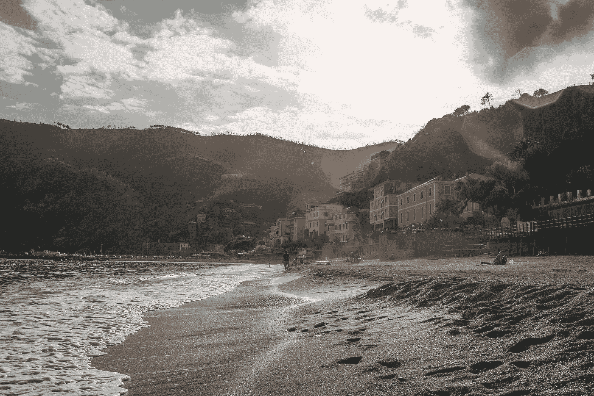
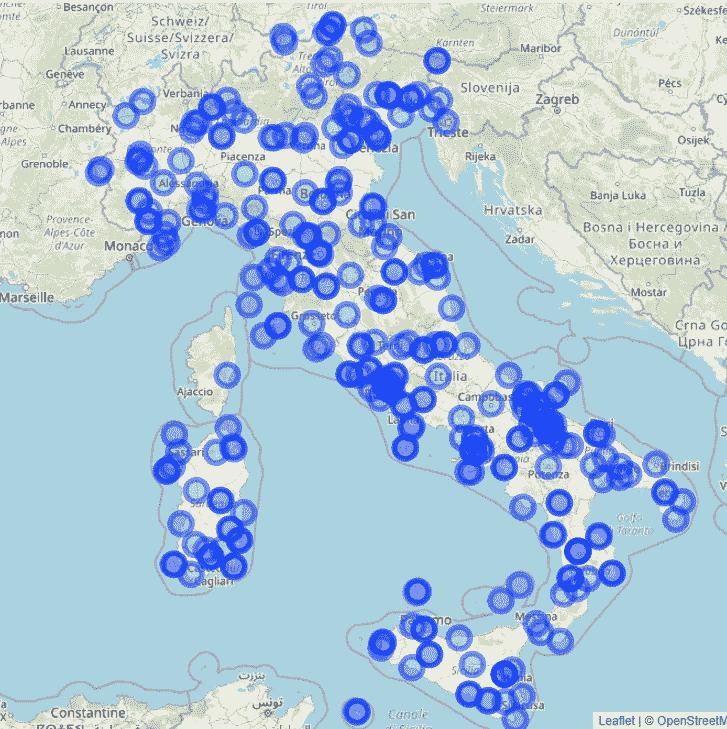
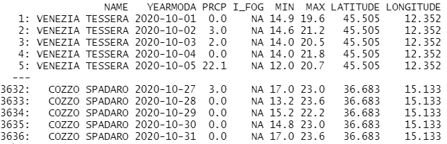
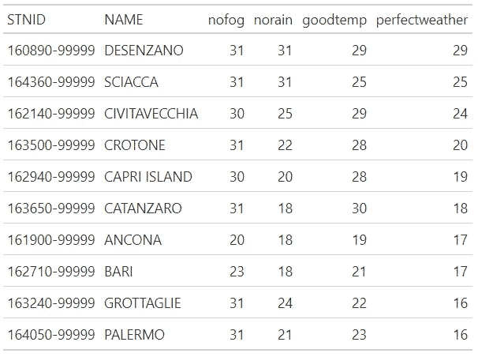
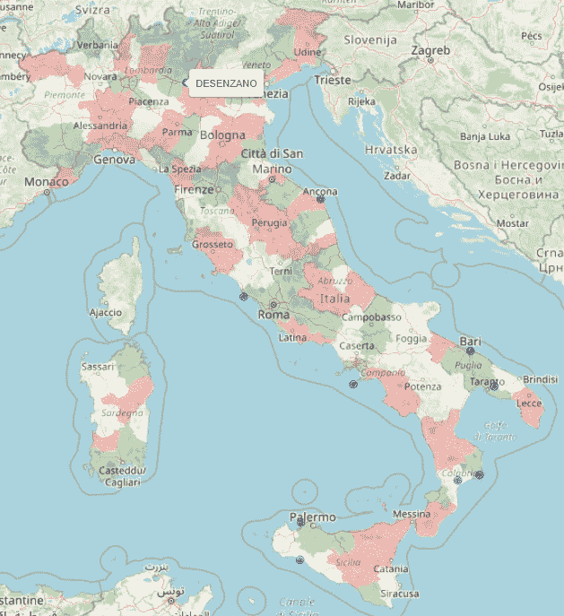
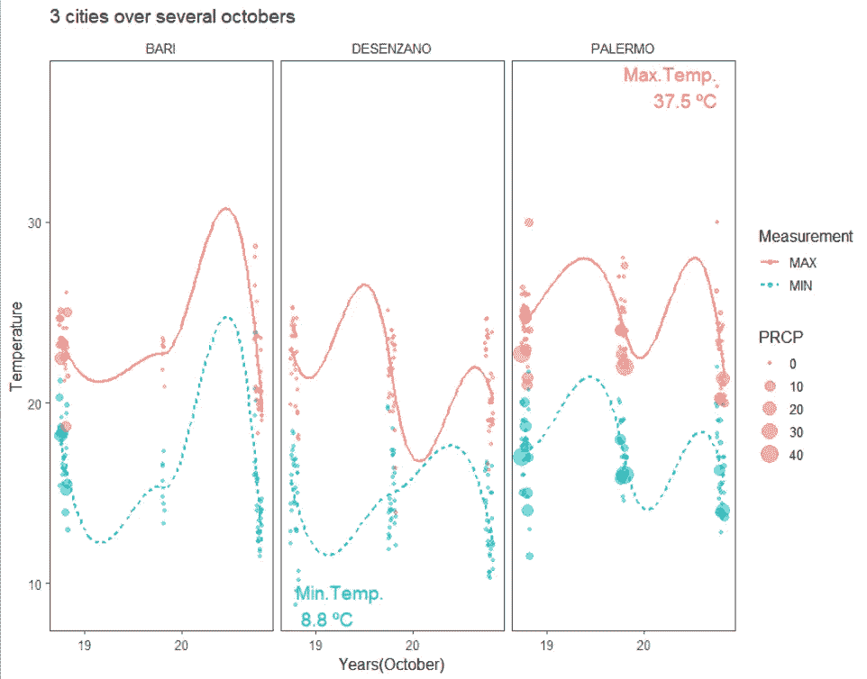
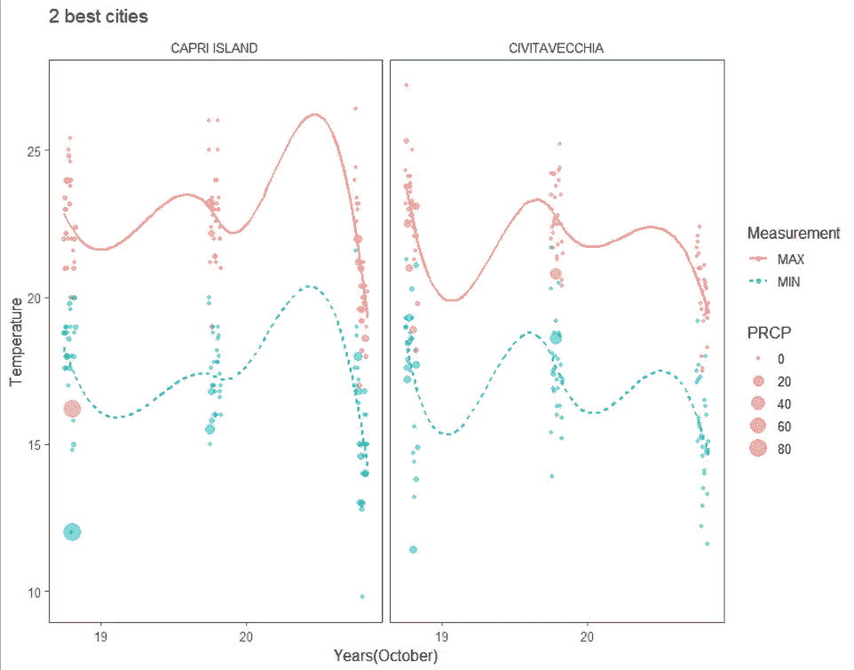

# 释放数据的力量，找到完美的度假目的地

> 原文：<https://towardsdatascience.com/how-i-used-data-for-choosing-my-next-holiday-destination-21b3519fe995?source=collection_archive---------31----------------------->

## 使用数据分析的力量来决定你下一步要去哪里旅行！

由 [Unsplash](https://unsplash.com?utm_source=medium&utm_medium=referral) 上的 [Karsten Winegeart](https://unsplash.com/@karsten116?utm_source=medium&utm_medium=referral) 拍摄

有了 COVID 疫苗和更好的卫生措施，事情在大多数方面都开始“恢复正常”，各国都在大力投资旅游部门的激励措施，特别是在欧洲部分地区，疫情的控制力略强一些。

虽然个人安全和健康是最重要的，但很快就能回去旅行和参观新的地方将是令人惊讶的。所以，如果你像我一样喜欢旅行和数据分析，留下来，我会告诉你**我如何使用天气数据来决定我的下一个旅行目的地**，剧透一下，这应该是一个温暖而美丽的地方。让我们开始吧！

# 我是如何做到的

我尝试应用我在所有数据分析过程中使用的大致相同的方法，特别是对于面向地理的数据，并且可以自由地做我想做的事情，因为没有一个假设要测试，也没有一个类要预测。当然，这不是一个严格的项目，团队或公司依赖于它的结果，但仍然，设定清晰的目标并使用领域的知识来获得有用的结果是很好的。

至于我们将使用的数据，如你所知，**天气可以定义你享受休闲旅行的程度**虽然完美天气的定义可能因你问的人而异，但温和的气温和无雨无雾构成了享受那些渴望已久的假期的完美环境。我将使用 R 和 GSODR 包，它从世界各地的气象站检索天气每日数据。

这个项目有 5 个主要阶段:

1.  缩小区域范围，获取数据
2.  缩小日期范围，过滤数据
3.  定义标准
4.  可视化和比较地点
5.  显示结果并选择一个或多个地点

做完这些，剩下的唯一一步就是打包行李走人了！😎

1.  该地区

我当时就知道我想去意大利，所以把范围缩小到一个国家既简单又有用。作为十九世纪去巴西的意大利人的后裔。对许多令人惊奇的地方做一点研究，可能会发现我有足够的理由。因此，意大利，我们走吧！

但不要这么快，让我们先检查我们的可用数据。我们的数据中有 308 个气象站，遍布意大利。这是一件很棒的事情，有更多的数据来找到完美的地点。

意大利的全天候气象站[图片由作者提供]

并不是所有的站点都有当前的数据，我们只想要最近的信息来确定最佳的观赏地点——你知道，气候变化是一个问题，所以旧的数据可能会与最近几年的数据非常不同。

Obs:有很多方法可以找到离某个城市或景点最近的气象站，比如说，可以同时比较巴塞罗那、罗马、巴黎和米兰的天气。做起来很简单。

2.日期

你可能有一周的假期，你可能在一家廉价航空公司找到了很多机票，或者你在日期范围上有一些灵活性。下一个合乎逻辑的步骤是过滤您获得的历史数据，这些数据完全基于您可用的天数或周数，以便更好地了解过去几年的天气情况。

我的日期现在相当灵活，所以我决定检查 10 月的整个**月。该月的一小部分数据如下所示:**

获得的数据中最感兴趣的字段的快照[图片由作者提供]

我们将使用这些字段来确定好天气的感觉:

*   PRCP:那天的降雨量
*   I_FOG: "1 "如果当天有雾
*   最低和最高:最低和最高温度

3.对你来说好天气是什么感觉？

通过风、温度、雾、雨和雪等属性，我们可以使用大量因素来确定天气最适宜的城市。在这里做自己的事，选择自己最喜欢的。我有四个条件:

*   **无雨**
*   **没有雾**
*   **最低气温超过 10 摄氏度**
*   **最高温度可达 30 摄氏度。**

4.比较和分析位置

根据上面的标准，让我们根据 Belokurows 系数，找出拥有最佳天气天数最多的城市(气象站)。😅

天气最好的意大利城市[图片由作者提供]

上表中的数字显示了过去 10 月 3 个月中平均满足每个条件的天数。根据我的标准，这些是过去 3 年里 10 月份天气最好的 10 个城市。在意大利地图上绘制城市，我们得到这样的结果:

根据我的看法，意大利十大天气城市[图片由作者提供]

不足为奇的是，大多数城市都位于沿海，而且更靠南，靠近巴里、巴勒莫和那不勒斯等天堂般的地方。

5.选择最佳城市

根据汇总的数据和前 10 名的排名，我选择了周围基础设施良好的城市，即靠近大城市的城市，这意味着更实惠的住宿地点和交通方式。较小的夏卡、克罗托内、卡坦扎罗、安科纳和格罗塔格里被过滤掉了，然后我会仔细看看另外 5 个。

看看巴勒莫、巴里和迪森萨诺，这里的气温变化很大，尤其是巴勒莫的高温和迪森萨诺的低温。

三个城市十月的天气[图片由作者提供]

虽然所有进入前十的城市都很棒，但很难找到不喜欢左边两个城市(车站)及其周围地区的地方。

天气最好的两个城市[图片由作者提供]

Civitavecchia 是我分析得最透彻的城市中天气最稳定的城市，虽然它主要是作为一个邮轮港口，但它有博物馆、一座 16 世纪的堡垒和令人惊叹的古代遗迹可供参观。它靠近罗马也没有坏处，这使它成为那些通过意大利首都到达意大利的人的一个好去处。

现在，女士们，先生们，我敢说你有任何关于 T2 卡普里岛 T3 的坏话。这是一个因其高档酒店和购物而闻名于世的岛屿，更棒的是，它还有铁蓝色的海水和崎岖的地貌(见下图)。我想对于像我这样预算紧张的人来说，住在这里可能有点贵(更不用说破产的 AF 了)，但它周围的那不勒斯地区肯定会提供更多实惠的选择和许多值得一看的好地方。

[莱蒂齐亚·阿戈斯塔](https://unsplash.com/@adnonda?utm_source=medium&utm_medium=referral)在 [Unsplash](https://unsplash.com?utm_source=medium&utm_medium=referral) 上的照片

希望你喜欢这篇文章。我很快会在 Github 上分享代码和数据，如果你有任何问题，请告诉我。