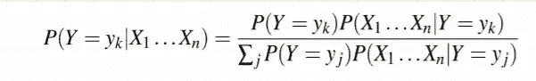
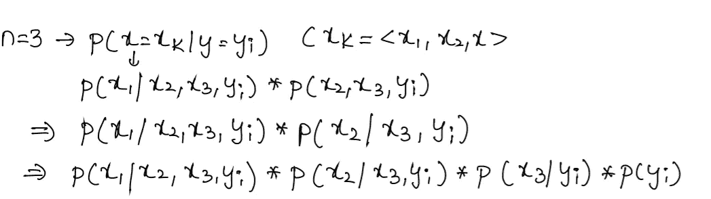
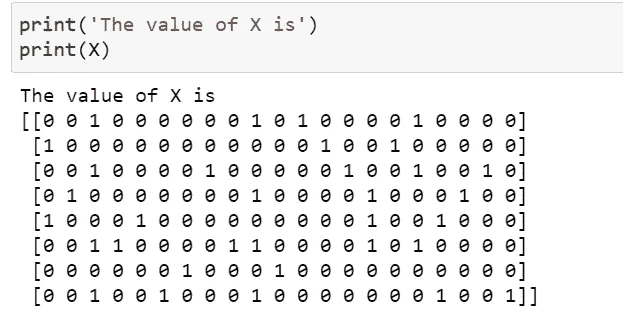
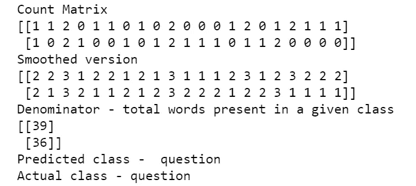
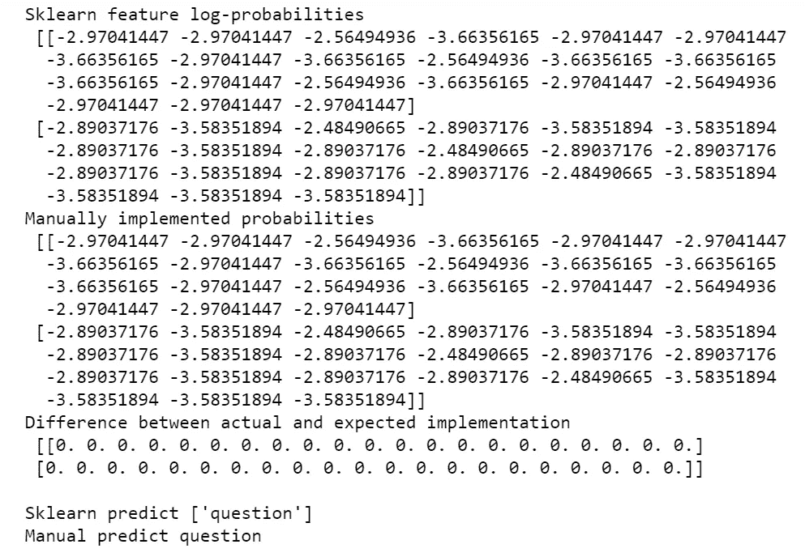
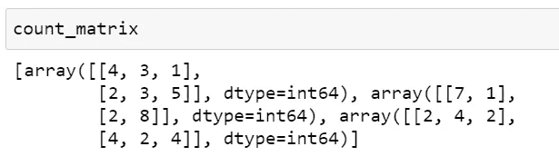

# 到目前为止，我是如何(不正确地)使用朴素贝叶斯的——第 1 部分

> 原文：<https://towardsdatascience.com/how-i-was-using-naive-bayes-incorrectly-till-now-part-1-4ed2a7e2212b?source=collection_archive---------7----------------------->

## 这篇文章旨在帮助你更好地理解朴素贝叶斯。


图片和编辑归我姐姐([https://www.instagram.com/the_snap_artistry/](https://www.instagram.com/the_snap_artistry/))

就像朴素贝叶斯做了一个天真的假设，我们给模型的特征是独立的，我也做了几个关于 NB 如何工作的天真假设。

*   *我假设多项式函数适用于任何给定的数据。(无论我有什么数据，我都用这个)→* 在下面的帖子中详细解释了为什么这是一个不好的做法。
*   *高斯朴素贝叶斯假设特征是高斯的。→* 不假设特征为高斯分布，而是假设似然概率遵循高斯分布。
*   *在多项式和分类中，似然概率的计算是相同的。在多项式中，分母是特定类别中的单词总数，而在分类中，分母是特定类别中数据点的总数。*
*   用 python 从头开始实现朴素贝叶斯非常困难。→ 实现多项式朴素贝叶斯只需要 15 行代码。

## 以下是据我所知的事情，可以让你深入了解朴素贝叶斯:

如果你是朴素贝叶斯的新手或者想要快速复习，请查看我的[笔记](https://drive.google.com/drive/folders/1vldPQ6T88EVsjlRXvGtZUPPwZOffqrEb?usp=sharing)开始。

***1。为什么在朴素贝叶斯中我们假设特征是条件独立的？***

**②*。Sklearn 有 GaussianNB，MultinomialNB，CategoricalNB，BernoulliNB →给定的数据有类别，数值，二元特征你会选择哪个模型？***

***3。如何对文本数据从头实现多项式朴素贝叶斯，并用 Sklearn MultinomialNB 匹配结果？***

**4。如何对分类数据从头实现分类朴素贝叶斯，并用 Sklearn CategoricalNB 匹配结果？**

5.*如何对数值型数据从零开始实现高斯朴素贝叶斯，并用 Sklearn GaussianNB 匹配结果？*

*6。朴素贝叶斯的训练和测试→时间和空间复杂度有哪些？*

*7。朴素贝叶斯是否受到不平衡数据的影响，如果是，如何解决？*

*8。离群值是如何影响朴素贝叶斯的？*

*9。朴素贝叶斯可解释吗，我们能说出哪些特征帮助我们预测了一个特定的类吗？*

10.朴素贝叶斯是线性分类器吗，它能解决非线性的决策边界吗？

*11。如何避免朴素贝叶斯中的过拟合或欠拟合问题？*

在这篇文章中，你会找到前 4 个问题的所有答案(粗体)，因为文章越来越长，我把这些问题移到了第 2 部分，你可以在这里查看链接。

<https://gautigadu091.medium.com/how-i-was-using-naive-bayes-incorrectly-till-now-part-2-d31feff72483>  

我们开始吧，

## **1。为什么在朴素贝叶斯中我们假设特征是条件独立的？**

这是朴素贝叶斯方程，用于计算给定输入 X 的目标值的后验概率(不假设任何条件独立性)



假设您有三个特征，那么为了计算可能性概率，您必须遵循以下步骤。



假设您的训练数据只有三个数据点(0，1，0)，(1，0，0)和(1，0，1)，目标值分别为 0，0 和 1。现在让我们在假设和不假设条件独立的情况下计算似然概率


**如果没有条件独立性，我们得到的似然概率为零——但是为什么呢？**

因为我们没有足够的数据组合来帮助我们计算可能性。

那么，你至少需要多少个数据点呢？

假设我们正在求解二元分类，并且输入也是二元要素。假设我们有 3 个特征，那么输入 X 的所有可能值可以有 2*2*2 = 8 个组合，我们需要这 8 个组合用于每个类 8*2 = 16。

> **对于 d 维数据，我们需要有 2^(d+1)数据点。如果 d = 30，则接近 5000 亿个数据点。这实际上是不可行的。**
> 
> 有了条件独立，这就变成了 2d 组合。仅通过一个简单的假设，时间复杂度显著降低。

***2。Sklearn 有 GaussianNB，MultinomialNB，CategoricalNB，BernoulliNB →给定的数据有类别，数值，二元特征你会选择哪个模型？***

这是我忽略的一点，我通常在给定任何类型的数据时应用多项式 NB，但当我了解每种算法时，我明白每种算法都需要不同类型的数据。

高斯 B →当你有连续的特征。

当你有分类数据时。

多项式 lNB →应用于文本数据。

那么，假设您的数据具有连续特征、分类特征和文本数据，您将使用什么算法？

每个算法的基本假设是，它假设特征是有条件独立的。拟合 categoricalNB 上的分类特征、GaussianNB 上的连续特征和 MultinomialNB 上的文本数据，获得每个模型的似然概率(对于每个数据点，现在我们将有 3 个似然概率),并将它们相乘以获得总体似然概率。

> 注意:你必须将先验概率乘以最终似然概率，才能得到最终后验概率

## **3。如何对文本数据从头实现多项式朴素贝叶斯，并用 Sklearn MultinomialNB 匹配结果？**

*步骤:*

1.  *使用 BOW 将数据转换成矢量。*
2.  *根据类别计算计数。*
3.  *计算所有的似然概率。*
4.  *计算先验概率。*
5.  *计算后验概率。*

让我们取一个样本数据:

1.  *使用计数矢量器将文本转换成弓形:*

这是简单明了的。



*2。基于类别计算计数*

*   首先，对目标值进行一次性编码。我在这里使用 LabelBinarizer。检查以下代码中的示例输出。
*   现在 y 的形状将是(n_classes*n_datapoints)，X 的形状是(n_datapoints*n_features)。

要获得基于类的计数，将 y 的转置与 x 相乘就足够简单了。

对 count_matrix 的工作方式感到困惑，让我们举个例子来说明一下:


希望上面的例子是清楚的，如果不是的话，试着在一张纸上做来理解矩阵乘法。

*3。计算概率:*

例如，为了计算 P('are'/y='question ')，我们使用下面的公式。添加拉普拉斯平滑以避免零概率情况。


计算特征对数概率的步骤:

1.  我们已经有了计数→只需给它们加上α进行拉普拉斯平滑。
2.  现在，对这个按行计算总和，以获得特定类中的单词数。


当α= 1 时:

1.  将 count_matrix 中的所有值加 1。
2.  计算逐行求和。根据分母的公式，我们必须加上 21*alpha (21 个唯一的单词)，我们这样做了吗？

> 是的，在每个值的分子中，我们都添加了 alpha，所以当我们做 sum 时，我们基本上是在做 row sum (count_matrix)+ 21*alpha。

4.计算先验概率:

这是算法中最简单的一步，下面的代码不言自明。

*4。预测功能:*

现在，我们有了概率和一个查询点。我们可以简单地用矩阵乘法计算概率和查询点的加权和。

包装所有的代码，



最终输出

让我们将我们的结果与 sklearn 的实现进行比较



显示我们的结果与 Sklearn 多项式匹配的输出

只用了 15 行代码，我们就实现了“朴素贝叶斯分类器”。

4.**如何对分类数据从头实现分类朴素贝叶斯，并用 Sklearn CategoricalNB 匹配结果？**

1.  *对数据进行预处理。*
2.  *基于类别计算每个特征的计数/存在。*
3.  *计算似然概率。*
4.  *计算先验概率。*
5.  *计算给定查询点的后验概率→预测函数*

在这个练习中，我采用简单的分类数据:


Dataframe 对象的头。

数据预处理:

*   使用顺序编码将分类数据转换为数字形式。这些特征被转换为有序整数。这将为每个要素生成一列整数(0 到 n _ categories-1)。
*   对目标值应用一键编码(就像我们在多项式 NB 中所做的那样)

```
X,y,classes = preprocess()
X.shape, y.shape
```

编码后的输出形状为:X →((18，3)，y → (18，2))

*2。基于类别计算每个特征的计数/存在。*

下面是一个例子，我们将努力实现每一个功能。


我们在这一部分的主要目的是为每个特征生成这个计数矩阵。

*   对于每个要素-从数据中提取该列-X _ feature
*   对于一个类→确定该类在哪里为零，在哪里为一，并将其转换为布尔值。
*   现在屏蔽你的输入特征，做简单的计数。

> Count_matrix 将以这种方式给出输出，对于 2D 数组的每个特征(第一行对应于 No，第二行对应于 Yes)。



*3。计算可能性概率:*

这类似于我们在这里为多项式 b 所做的

*   对于每个特征，如果提供的话，我们将增加 alpha(拉普拉斯平滑)。
*   进行逐行求和，如上图所述。
*   求对数-概率-对数(数/数)→对数(数)-对数(数)。

*4。计算先验概率:*

这与多项式 inb 非常相似，是算法中最简单的一步。

5.计算后验概率:

*   从每个特性中获取相应的 log_probs。
*   将这些概率与先验概率相加，得到最终的后验概率。


根据 category_id 提取单元格

比较 Sklearn 和我们手工实现的结果。


# 答对了。！

对于剩余的问题，请查看下面链接中的第 2 部分:

<https://gautigadu091.medium.com/how-i-was-using-naive-bayes-incorrectly-till-now-part-2-d31feff72483>  

非常感谢你💖阅读这篇文章，我希望你对朴素贝叶斯的工作原理有一个清晰而深刻的理解。

你可以在这个 GitHub [链接](https://github.com/GowthamChowta/30daysofNLP/tree/main/All%20about%20Naive%20Bayes)中找到完整的代码。你也可以在 [LinkedIn](https://www.linkedin.com/in/gauthamchowta/) 上和我联系。

# 参考资料:

1.  [https://scikit-learn . org/stable/modules/naive _ Bayes . html # naive-Bayes](https://scikit-learn.org/stable/modules/naive_bayes.html#naive-bayes)
2.  [应用人工智能课程](https://www.appliedaicourse.com/)