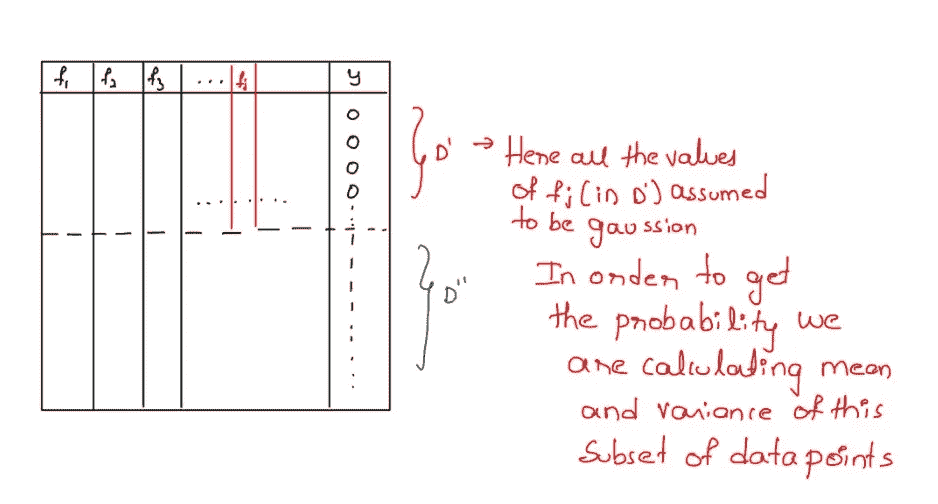
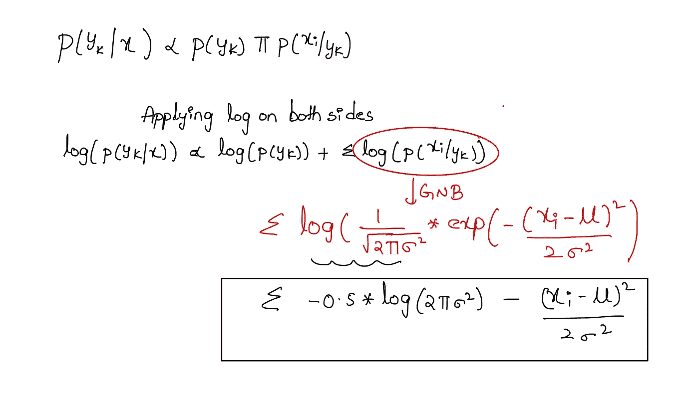
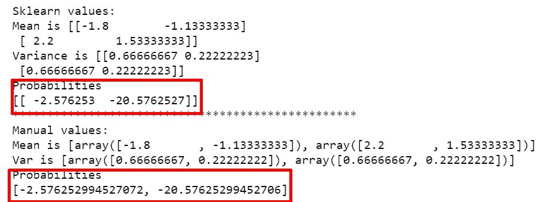
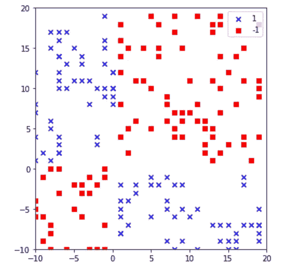
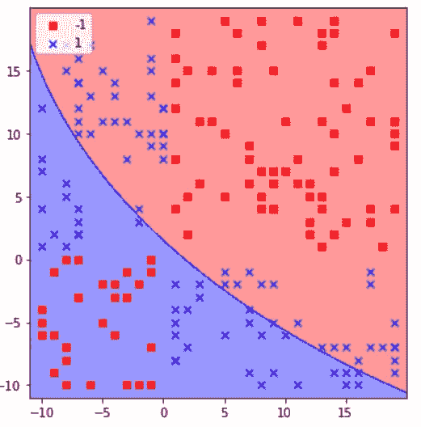
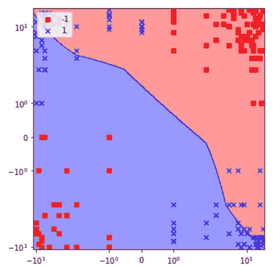

# 到目前为止我是如何(不正确地)使用朴素贝叶斯的——第 2 部分

> 原文：<https://towardsdatascience.com/how-i-was-using-naive-bayes-incorrectly-till-now-part-2-d31feff72483?source=collection_archive---------14----------------------->

## 这篇文章旨在帮助你更好地理解朴素贝叶斯

图片和编辑归我姐姐([https://www.instagram.com/the_snap_artistry/](https://www.instagram.com/the_snap_artistry/))

这是第 1 部分的继续，

 [## 到目前为止，我是如何(不正确地)使用朴素贝叶斯的——第 1 部分

### 这篇文章旨在帮助你更好地理解朴素贝叶斯。

gautigadu091.medium.com](https://gautigadu091.medium.com/how-i-was-using-naive-bayes-incorrectly-till-now-part-1-4ed2a7e2212b) 

在这篇文章中，我将讨论以下内容(粗体)。如果你是朴素贝叶斯的新手或者想要快速复习，请查看我的[笔记](https://drive.google.com/drive/folders/1vldPQ6T88EVsjlRXvGtZUPPwZOffqrEb?usp=sharing)开始。

*1。为什么在朴素贝叶斯中我们假设特征是条件独立的？*

*2。Sklearn 有 GaussianNB，MultinomialNB，CategoricalNB，BernoulliNB →给定的数据有类别，数值，二元特征你会选择哪个模型？*

*3。如何对文本数据从头实现多项式朴素贝叶斯，并用 Sklearn MultinomialNB 匹配结果？*

*4。如何对分类数据从头实现分类朴素贝叶斯，并用 Sklearn CategoricalNB 匹配结果？*

**5。*如何对数值型数据从头实现高斯朴素贝叶斯，并用 Sklearn GaussianNB 匹配结果？***

**⑥*⑥。朴素贝叶斯的训练和测试→时间和空间复杂度有哪些？***

***7。朴素贝叶斯是否受到不平衡数据的影响，如果是，如何解决？***

***8。离群值是如何影响朴素贝叶斯的？***

***9。朴素贝叶斯可解释吗，我们能说出哪些特征帮助我们预测了一个特定的类吗？***

**10*。如何避免朴素贝叶斯中的过拟合或欠拟合问题？***

让我们开始吧，

***5。如何对数值型数据从头实现高斯朴素贝叶斯，并用 Sklearn GaussianNB 匹配结果？***

1.  预处理数据。
2.  基于类别计算每个特征的均值和方差。
3.  计算后验概率。

*数据预处理*

*   我正在对目标变量进行一次性编码，就像我们在 MultinomialNB 和 CategoricalNB 实现中所做的那样。

*基于类计算每个特征的均值和方差。*

*   首先，提取特定类别的数据点，然后计算每个特征的平均值和方差。
*   我也在计算目标变量的数量，我们将很快用它来计算先验概率。

假设您正在对数据进行二元分类，以下是计算类 0 中要素 fj 的均值和方差的过程

基于目标值计算特定特征的数据点的均值和方差。

*计算后验概率*

在高斯朴素贝叶斯中，似然性被假设为来自高斯分布，这意味着似然概率遵循以下等式。

ref:[https://sci kit-learn . org/stable/modules/naive _ Bayes . html # Gaussian-naive-Bayes](https://scikit-learn.org/stable/modules/naive_bayes.html#gaussian-naive-bayes)

当我们在两侧应用对数时，我们得到以下关系:

将我们的结果与 Sklearn 进行比较:

上述代码的输出

答对了。！—结果匹配，您可以找到概率的最大值来获得预测类值。

**5。朴素贝叶斯的训练和测试时间和空间复杂度是多少？**

对于训练—我们需要计算 count_matrix 并存储所有可能的组合。在最坏的情况下，假设在 n 个数据点中，我们有 n 个类别(每个数据点有一个唯一的类别)、d 维以及 c 类。

那么时间复杂度是 O(n*d*c)，空间复杂度也是一样的 O(n*d*c)我们要在内存中存储那些很多的组合。

在测试中，时间复杂度是 O(d*c ),只需获取并乘以每个类的所有 d 维表。

***7。朴素贝叶斯是否受到不平衡数据的影响，如果是，如何解决？***

是的，朴素贝叶斯受到不平衡数据的影响。

尽管似然概率在某种程度上是相似的，但是后验概率受到先验概率的严重影响。在上面的例子中,+ve 类的先验概率是-ve 类的 9 倍，朴素贝叶斯的这种差异造成了+ve 类的偏差。

一个简单的解决方案是忽略先验概率。(或)可以欠采样或过采样。

还有一个叫做 ComplementNB 的高级朴素贝叶斯，它是专门为处理不平衡数据而设计的，它也有一个 [sklearn 实现](http://scikit-learn.org/stable/modules/generated/sklearn.naive_bayes.ComplementNB.html#:~:text=The%20Complement%20Naive%20Bayes%20classifier%20was%20designed%20to%20correct%20the,New%20in%20version%200.20.&text=Additive%20(Laplace%2FLidstone)%20smoothing,(0%20for%20no%20smoothing).)。此外，检查这个[研究论文](https://people.csail.mit.edu/jrennie/papers/icml03-nb.pdf)。

***8。离群值是如何影响朴素贝叶斯的？***

在类别中 NB →如果在测试数据中，如果我们得到了训练数据中没有的新类别。因此，这一类别将没有可能的概率，结果为零。为了避免这种零概率问题，我们做拉普拉斯平滑。

在高斯 B →中，剔除异常值是很重要的，一个异常值会影响均值和方差，因此，所有的似然概率都会受到影响。

在多项式中，最好删除出现频率非常低的单词，因为可能性概率非常小。

> 但是我在很多地方读到，如果你在文本数据中找到一个新单词，那么这个概率是零。
> 
> 但是，当您将文本转换为矢量时，基本上是对训练数据执行 vectorizer.fit _ transform()，对 CV 和测试数据执行 vectorizer.transform()。因此，基本上 CV 和 test 的向量是使用训练的词汇生成的。**那么，这种新词出现在文本数据中的情况是不可能的**。测试数据的向量长度将与训练数据的向量长度完全相同。

**9*。朴素贝叶斯可解释吗，我们能说出哪些特征帮助我们预测了一个特定的类吗？***

根据似然概率，我们可以解释模型，似然概率越高，越有助于我们对其进行分类。

***10。如何避免朴素贝叶斯中的过拟合或欠拟合问题？***

NB 中唯一的超参数是 alpha →较高的 alpha 将给出几乎相同的概率→这是欠拟合，较低的 alpha 值将使模型欠拟合。(查看注释中的示例)

***11。朴素贝叶斯是线性分类器吗，它能解决非线性的决策边界吗？***

根据这篇研究论文，朴素贝叶斯是一个线性分类器，但是在对数尺度上。关于这一点的直觉解释如下:

参赛作品:[https://people.csail.mit.edu/jrennie/papers/icml03-nb.pdf](https://people.csail.mit.edu/jrennie/papers/icml03-nb.pdf)

但是我试着用一个玩具数据集来验证这一点。

我用高斯朴素贝叶斯拟合模型并绘制等高线，得到了一个清晰的非线性决策边界。

下面是相同的输出，但使用对数标度。我甚至尝试使用 base-e，但是没有得到我期望的结果。

对数标度输出

如果你们中的任何人对此有什么要分享的，请在这个帖子下评论。

非常感谢你💖阅读这篇文章，我希望你对朴素贝叶斯的工作原理有一个清晰而深刻的理解。

你可以在这个 GitHub [链接](https://github.com/GowthamChowta/30daysofNLP/tree/main/All%20about%20Naive%20Bayes)中找到完整的代码。你也可以在 [LinkedIn](https://www.linkedin.com/in/gauthamchowta/) 上和我联系。

# 参考资料:

1.  [https://scikit-learn . org/stable/modules/naive _ Bayes . html # naive-Bayes](https://scikit-learn.org/stable/modules/naive_bayes.html#naive-bayes)
2.  [应用人工智能课程](https://www.appliedaicourse.com/)