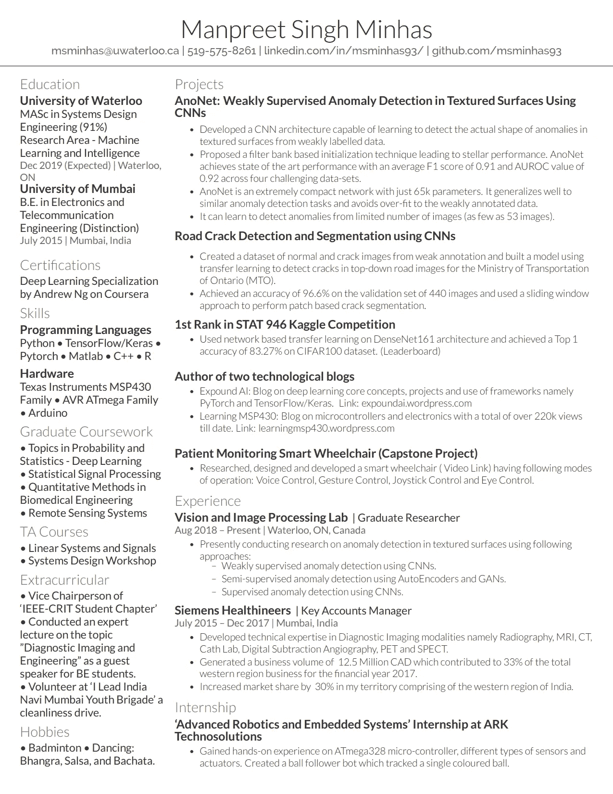

# 我是如何从一名销售工程师成为深度学习/计算机视觉研究工程师的

> 原文：<https://towardsdatascience.com/how-i-went-from-being-a-sales-engineer-to-deep-learning-computer-vision-research-engineer-8882272a1a6?source=collection_archive---------6----------------------->

## 当我的职业生涯转向 DL/ML/CV 时，我希望得到的指导、提示和建议。

[亚历山大·奈特](https://unsplash.com/@agk42?utm_source=medium&utm_medium=referral)在 [Unsplash](https://unsplash.com?utm_source=medium&utm_medium=referral) 上拍照

随着当前深度学习/机器学习的热潮，越来越多的人希望改变自己的领域，进入这个令人兴奋的领域。然而，对于任何不是来自这个领域的人来说，迈出第一步都是令人畏惧的。这就是为什么我想分享我作为深度学习/计算机视觉研究工程师从西门子医疗保健公司的大客户经理到成为辉固全球创新团队一员的历程。我先简单介绍一下我自己的背景，然后是我走到这一步的步骤。如果您想滚动并跳到您感兴趣的部分，下面是目录。

*   介绍
*   我从技术销售角色中学到的前 5 点
*   硕士学位是转行的踏脚石
*   编码/编程熟练程度
*   学习触摸打字[可选但推荐]
*   获取知识的在线大学课程或 MOOCs
*   想获得一些实践经验
*   谷歌 Colab 训练你的模型
*   深度学习(计算机视觉)的库很少
*   求职技巧
    ♀简历
    ♀LinkedIn
    ♀弥补经验差距
    ♀求职门户
    ♀直接在公司网站上申请
*   结论

# 介绍

我在孟买大学获得了电子和电信工程学士学位。我是一个懂技术的人，热爱技术。在那些日子里，我对嵌入式系统充满热情，并与微控制器、传感器和致动器一起工作来构建东西。创建我自己的印刷电路板，焊接元件，编程控制器，与计算机接口等。对我来说超级刺激。我创建了一个关于[微控制器和电子](https://learningmsp430.wordpress.com/)的博客，并且喜欢写关于概念和项目的技术文章。

毕业后很想加入行业做技术专业，做研发。然而，我没有在校园安置之外寻找工作。我得到了 TCS 的一份工作，但作为一家梦想中的公司，我得到了参加西门子校园招聘的机会。我设法通过了面试。虽然我已经表明我想做 R&D，他们没有为这种情况招聘。我得到了一份毕业实习工程师的工作，并接受了。它表示，最终发布将基于业务需求。

这个角色是一个技术销售角色，我完全惊呆了，因为我做梦都没想到会是这样。我仍然收到了 TCS 的邀请，并在考虑转行。然而，我最终还是加入了西门子。我必须说，事实证明这是一个好决定。这段经历让我在职业和个人方面都有所成长。我觉得每个人在职业生涯中都应该重点关注这五点。

# 我从技术销售角色中学到的前 5 点

1.  软技能比你想象的更重要。口头和书面沟通技巧同等重要。你可能是个天才，但除非你能把自己的想法连贯地传达给人们，否则成功将极具挑战性。(这就是现实。)
2.  **无论你是哪个领域的专家。**无论你属于哪一个垂直领域，无论是商业、工程、研究还是任何其他领域，精通和了解你的工作都会让你脱颖而出。对你所做的事情充满激情在这里大放异彩，因为它让你在享受旅程的同时提升自己的技能。
3.  **不要害怕说出你的想法。如果你有想法，就说出来吧。**
4.  准时、尊重、专业和礼貌。
5.  **建立联系，拓展人脉。这是成长为专业人士的精髓。**

尽管在一家很好的跨国公司有一份稳定的工作，我仍然渴望从事技术工作。我对机器学习很着迷，在 Coursera 上学习吴恩达的 ML 课程，同时学习诊断成像技术是如何工作的，这是我工作的一部分！我认为 masters 是运营商变革的逻辑路径。

# 硕士学位是转行的踏脚石

这是一个非常受欢迎的选择，全球各地的人都选择(我也选择)改变职业生涯，并转移到一个新的国家，那里有更多的机会。但是，在执行此操作时要非常小心。如果你刚刚完成本科课程，我建议你在攻读硕士学位之前先获得 1 到 2 年的软件开发经验，因为这会让找工作变得容易一些。和软件开发经验将有助于你了解这个行业是如何运作的。我在滑铁卢大学获得了硕士学位，因为那里的创新、研究和创业精神。你应该记住的几件事如下。

*   不要以为你有一个硕士或硕士学位，公司就会蜂拥而至。
*   至少在 DL/CV/ML 领域，试着做一个基于论文的硕士而不是一个基于正常项目/课程的硕士，因为这将允许你从事一个大项目。你在论文工作期间获得的经验远胜于任何课程项目(几乎在所有情况下)。**大学会支付你学习的费用。如果你要搬到一个新的国家，货币兑换可能会减少你的存款，你可能没有足够的资金，基于论文的硕士学位是你的带薪学习机会。据我所知，所有的 MASc 项目都是在加拿大资助的。这里列出了加拿大的一些实验室/教授(排名不分先后),你可以在决定攻读硕士学位时参考一下。

    [【https://uwaterloo.ca/vision-image-processing-lab/】](https://uwaterloo.ca/vision-image-processing-lab/)
    [https://mila.quebec/en/](https://mila.quebec/en/)
    [https://www.trailab.utias.utoronto.ca/](https://www.trailab.utias.utoronto.ca/)
    [https://uwaterloo . ca/autonomous-vehicle-research-intelligence-lab/](https://uwaterloo.ca/autonomous-vehicle-research-intelligence-lab/)
    [https://kimialab.uwaterloo.ca/kimia/](https://kimialab.uwaterloo.ca/kimia/)
    [https://www.cs.utoronto.ca/~fidler/](https://www.cs.utoronto.ca/~fidler/)
    [https://www.gwtaylor.ca/](https://www.gwtaylor.ca/)**
*   当你在攻读硕士学位时，请确保为你所学的每一门课程做一个项目。并且**确保您正确地记录了它，并将其与代码**一起放在您的 GitHub 个人资料中。**如果您没有 GitHub 帐户，请立即创建。这就是公司寻找的东西。因为在见你之前或者在给你在线测试之前，它是你编程能力的一个很好的指示器。这些带有相应 GitHub 库的项目将会很好地融入你的简历，让你印象深刻。**
*   不要因为想要好成绩就去上简单的课程。参加你觉得与毕业后想做的工作相关的课程。挑战性的课程会让你有机会在有限的时间内成长和学到很多东西，这是我们在攻读硕士学位时获得的。舒适区里长不出什么有用的东西。
*   **在会议或期刊上发表关于你工作的论文。(不要求，但是如果可以的话请做。)**你可以先在 [arXiv](http://arxiv.org/) 上发布。因为如果你的作品很好，人们会开始引用你，你会利用这段时间直到出版。(注意:一些会议/期刊不接受在 arXiv 中发表的论文，因此请确保您事先了解您的目标出版物。)

# 编码/编程熟练程度

如果你想进入软件世界，编程技能是至关重要的。你需要精通解决编码挑战，因为每个公司都会扔给你一个。如果你是学生，你需要在毕业前的一个学期把你的数据结构和算法整理好。开始在竞争性编码网站上解决日常问题(下面列出了几个)。

事情就是这样。你需要能够在 windows 记事本或谷歌文档、白板上解决编码难题，并能够在整个面试过程中大声思考和有效沟通。这个步骤本身就有专门的书籍。因此，我不打算在本文中介绍如何做到这一点，因为这超出了它的范围。

通常，编程语言是你的选择，但是如果你的角色要求你必须精通某种语言，比如 C++，你将被要求用那种语言编程。

这一步需要时间、耐心、奉献、承诺、毅力和动力。请从今天开始，给自己一个良好的开端。

以下是一些你可以用来准备的资源。

1.  [*破解编码采访*](https://www.crackingthecodinginterview.com/) 书
2.  https://www.hackerrank.com/——这是初学者友好型的。
3.  [https://leetcode.com/](https://leetcode.com/)—对 FAANG(脸书、亚马逊、苹果、网飞和谷歌)是强制性的
4.  面向极客的计算机科学门户网站
5.  技术招聘的编码测试和评估|编码信号
6.  [https://www . coursera . org/specializations/data-structures-algorithms](https://www.coursera.org/specializations/data-structures-algorithms)
7.  https://www.codechef.com/
8.  【https://github.com/qiyuangong/leetcode 【LeetCode Python 解决方案】
9.  https://github.com/haoel/leetcode[leet code c++解决方案]
10.  [https://github.com/keon/algorithms](https://github.com/keon/algorithms)【各种算法的 Python 实现】

# 学习触摸打字[可选但推荐]

如果你用笔记本电脑或计算机工作，你将不得不使用键盘。这种技能可以让你专注于内容而不是敲击键盘，从而让你的生活变得更加轻松。如果你在打字时不必寻找按键，你将能够更快地编码。有几个这样的网站，但我将分享几个我自己用过的。

1.  [https://www.typingclub.com/](https://www.typingclub.com/)——学习触摸打字的绝佳选择。
2.  [https://10fastfingers.com/typing-test/english](https://10fastfingers.com/typing-test/english)——获得速度
3.  [http://keybr.com/](http://keybr.com/)——学习触摸打字
4.  [http://typeracer.com/](http://typeracer.com/)——获得速度

# 获取知识的在线大学课程或 MOOCs

网上有数不清的课程，你可能会在选择时感到困惑。然而，记住一个好的项目比在线课程更有价值。但是，为了开始，你需要初始知识。我建议使用以下资源，但还有很多。随意探索互联网。(排名不分先后。)

1.  [https://www.coursera.org/specializations/deep-learning](https://www.coursera.org/specializations/deep-learning)——我向任何想在深度学习领域开始职业生涯的人推荐这个专业。通过吴恩达，他很好地解释了事情。
2.  https://www.coursera.org/learn/machine-learning——如果你想了解机器学习。
3.  [https://www.youtube.com/playlist?list = pl 3 fw 7 Lu 3 i5 j vhm 8 ljyj-zlfqr F3 EO 8 syv](https://www.youtube.com/playlist?list=PL3FW7Lu3i5JvHM8ljYj-zLfQRF3EO8sYv)—如果你想利用深度学习打入计算机视觉。
4.  【https://atcold.github.io/pytorch-Deep-Learning/ —深度学习 NYU 课程(乐村)
5.  【https://www.youtube.com/playlist? list = ploromvodv 4 rohcuxmzknm 7j 3 fvwbby 42 z—如果你想了解 NLP
6.  [https://keras.io/examples/](https://keras.io/examples/)——如果你想从 Keras 开始，直接举例。快速原型化并了解不同的算法。**然而，请注意，由于其抽象程度，它在行业中(tf1 时代)是不被认可的。**一定要对至少 TensorFlow 或 PyTorch 感到舒服。
7.  [https://py torch . org/tutorials/初学者/py torch _ with _ examples . html](https://pytorch.org/tutorials/beginner/pytorch_with_examples.html)—py torch 的牛逼教程，他们官网还有很多。

这个列表可以一直列下去，GitHub 上有很多列表，这只是给你一些初步的指导。**请记住，一旦你完成一门课程，就要自己建立一些项目或处理一些数据集。那是唯一有效的主动学习的方法。**

# 想获得一些实践经验

[https://www.kaggle.com/](https://www.kaggle.com/)是一个将你新获得的深度学习技能应用于实际数据集的绝佳平台。有几种挑战可供你尝试并获得实践经验。您可以在内核上运行代码，这样您就不会受到硬件的限制。

# 谷歌 Colab 训练你的模型

训练深度学习模型需要 GPU，而[https://colab.research.google.com/notebooks/intro.ipynb](https://colab.research.google.com/notebooks/intro.ipynb)是一个获得免费计算资源的非常好的地方。你可以免费使用 GPU 和 TPU 内核。

# 深度学习(计算机视觉)的库很少

如果你想在这个领域工作，这些是你需要精通的典型库。

1.  [https://pytorch.org/](https://pytorch.org/)—深度学习
2.  [https://www.tensorflow.org/](https://www.tensorflow.org/)—深度学习
3.  [https://numpy.org/](https://numpy.org/)—使用矩阵的数值计算
4.  [https://opencv-python-tutro als . readthedocs . io/en/latest/py _ tutorials/py _ tutorials . html](https://opencv-python-tutroals.readthedocs.io/en/latest/py_tutorials/py_tutorials.html)—图像处理与计算机视觉
5.  【https://pandas.pydata.org/】T4—处理表格数据
6.  [https://matplotlib.org/](https://matplotlib.org/)——制作图表
7.  [https://scikit-learn.org/stable/](https://scikit-learn.org/stable/)—机器学习算法

现在让我们假设你已经完成了上面所有的步骤，并准备去市场。下一步是找工作，这可能会让人望而生畏。由于我从销售角色转换到了研究工程师角色，我想我应该与你分享一些技巧。

# 求职技巧

如果你是一名新毕业生，这一步可能会感觉有点奇怪，因为你可能不知道它是如何工作的。概括地说，这将是以下几个方面。

1.  获取知识，做项目，编码实践，通过实习，黑客马拉松，自由职业，为开源项目做贡献来获取经验。
2.  打造你的简历
3.  开始通过 LinkedIn 等在线门户网站搜索工作，并在线申请
4.  一旦你接到电话，有几个步骤:(为了更深入的解释，我鼓励你阅读《破解编码面试》一书。)
    ·介绍/筛选电话——这将由人力资源部门来了解你。在这一步之后，您可能会遇到一个编码挑战。
    ·技术筛选——通常是编码挑战。可以离线、在线、随叫随到。
    ·技术面试——与技术团队的面试。可以是多轮。人力资源面试——与人力资源的最后一次面试。没有什么技术性的，只是交谈。薪资谈判到此结束。
    ·签署要约并加入！:)

让我们来看看我希望大家关注的几点。

# 简历

我怎么强调你简历的重要性都不为过。这是你得到面试电话的原因。请花些时间打造一份高质量的简历。写简历时需要考虑的几件事。(同样，网上有大量的文章告诉你怎么做。我只是给出最初的指导)

1.确保你绝对不要在简历中仅仅在你的经历部分陈述职位描述。

2.在你的经历描述中使用行动词汇、衡量标准和结果。类似于“我在项目 X 中做了这件事，导致 y%相对于度量标准 z 的直接改进，”提及你做了什么。不要写这是我们做的，写你的贡献。

3.**请确保你的简历中没有错别字**(有时我们会忘记基础)**格式正确，字体大小易读。**

4.我不知道业界对简历的长度有什么共识，但我遵循了 1 页的限制，采用了两栏的格式。

5.清楚地解释你的项目。保持简短，足以激发兴趣。一旦你和公司谈好了，就可以做详细的解释。

6.提供一个链接，链接到你的 LinkedIn、GitHub 个人资料以及你拥有的任何其他作品集、博客或网站。

我用过这个 LaTeX 模板:[https://www . over leaf . com/LaTeX/templates/deedy-cv/bjryvfsjdyxz](https://www.overleaf.com/latex/templates/deedy-cv/bjryvfsjdyxz)。随意使用 Word 或任何你觉得舒服的东西。

我分享我的简历以供参考，它给我带来了来自高通、AMD、华为和其他几家公司的电话。(我不是说这是一份模范简历。)

来源:作者

# 商务化人际关系网

**请今天创建一个**[**https://www.linkedin.com/**](https://www.linkedin.com/)**个人资料，如果你还没有的话。这是非常重要的一步。正确填写您的个人资料。搜索如何制作一个令人印象深刻的 LinkedIn 个人资料，并让你的个人资料令人敬畏。并且**开始联系你所在行业的人。**对于乔布斯，我大量使用 LinkedIn。也许我可以成为你的第一个联系人？([我的 LinkedIn 个人资料](https://www.linkedin.com/in/msminhas93/)**

你可以直接在 LinkedIn 上联系人事经理、招聘经理或团队领导。不是每个人都会回复，但是觉得你的简介有趣的人一定会回复。不要低估这一步的力量。如果你发现一个招聘信息，就去找这家公司，找到潜在的招聘经理，然后和他谈谈。这是让你的个人资料受到关注的好方法。这表明你很感兴趣，并且付出了额外的努力。

不要害怕被拒绝，因为成功就在后面。为了找到适合我的工作，我已经参加了将近 15 次面试(也被拒绝了很多次)。所以继续努力吧！你能行的！

# 弥补缺乏经验的差距

你可能会想，如果我没有任何经验，我该如何开始呢？你可以采取以下步骤来获得经验。

1.  实习:带薪(由你去实习[我猜这是在印度]或给你做实习)或不带薪，可以帮助你获得行业经验。下面是一个列表，你可能会找到一个。

    [https://www . Forbes . com/sites/susanadams/2015/01/30/the-10-best-websites-for-finding-an-interstitution/？sh=25e96e8d1b44](https://www.forbes.com/sites/susanadams/2015/01/30/the-10-best-websites-for-finding-an-internship/?sh=25e96e8d1b44)
2.  参加黑客马拉松:这是获得经验、参与项目并有可能赢得奖金的好方法。有可能你会遇到赞助商的人并获得面试机会。
    [https://mlh.io/seasons/na-2020/events](https://mlh.io/seasons/na-2020/events)
3.  为开源项目做贡献:
    [https://github . com/freeCodeCamp/how-to-contribute-to-open-source](https://github.com/freeCodeCamp/how-to-contribute-to-open-source)
4.  自由职业者:
    [https://www.upwork.com/](https://www.upwork.com/)
5.  找写着新人/初学者的角色。如果你有另一个领域的经验，换个工作，你很可能需要重新开始。

# 工作门户

除了 LinkedIn 之外，这里还有几个门户网站可以帮助你找到工作。

1.  [https://angel.co/jobs](https://angel.co/jobs)【创业公司】
2.  [http://indeed.com/](http://indeed.com/)
3.  [https://www.glassdoor.com/index.htm](https://www.glassdoor.com/index.htm)
4.  【https://www.monster.com/】
5.  [https://www.meetup.com/topics/job-search/](https://www.meetup.com/topics/job-search/)

# 直接在公司网站上申请

所有公司都有职业页面。你可以直接在他们的网站上申请你感兴趣的职位。比如[https://www.fugro.com/careers](https://www.fugro.com/careers)、[https://careers.google.com/d/](https://careers.google.com/d/)、[https://www.amazon.jobs/en/](https://www.amazon.jobs/en/)等。

# 结论

我们已经大致了解了你可以向深度学习/机器学习领域进行职业转变的步骤。这里要记住的最重要的一点是，无论你想做什么，都要“相信自己，相信自己有能力在任何情况下取得成功”。继续朝着你的目标努力，每天都朝着目标前进。你会成功的！如果你需要指导，请随时联系 LinkedIn，我很乐意与你聊天。